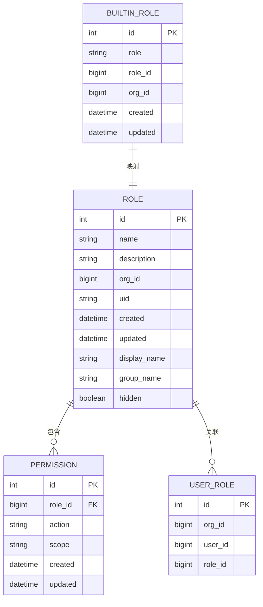
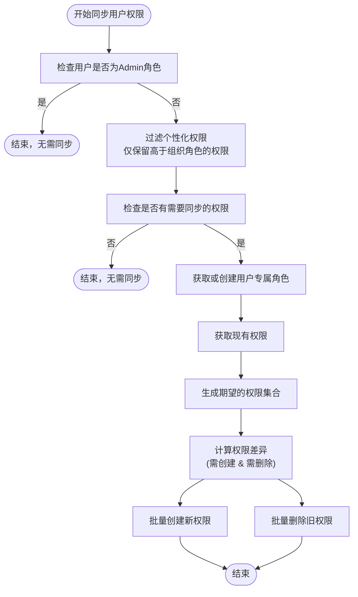
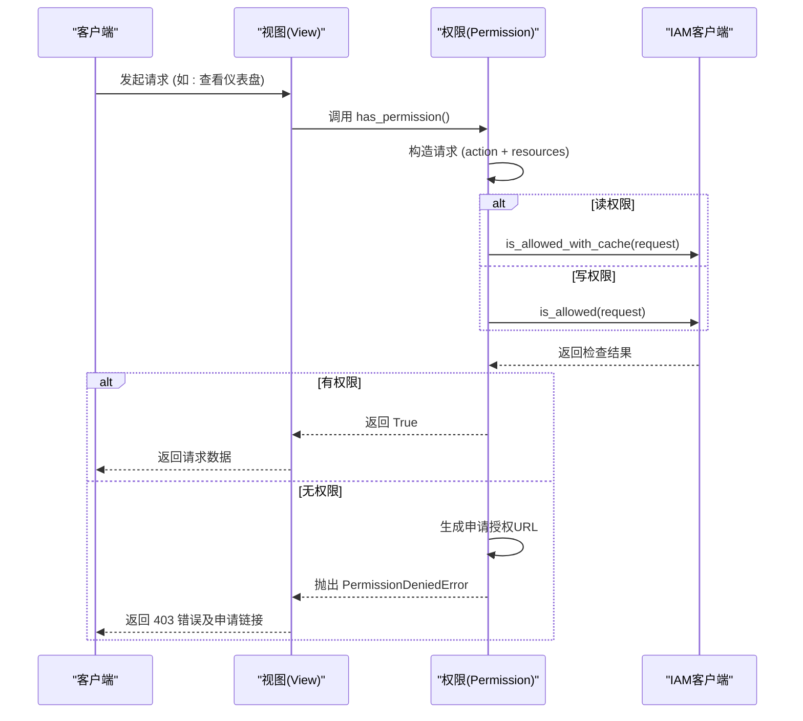

# 基于角色的分配

<cite>
**本文档引用的文件**   
- [models.py](file://bkmonitor/bk_dataview/models.py#L260-L316)
- [api.py](file://bkmonitor/bk_dataview/api.py#L300-L443)
- [permission.py](file://bkmonitor/bkmonitor/iam/permission.py#L310-L509)
- [resources.py](file://bkmonitor/packages/monitor_web/iam/resources.py#L100-L299)
- [settings.py](file://bkmonitor/bk_dataview/settings.py#L0-L80)
</cite>

## 目录
1. [引言](#引言)
2. [核心数据模型](#核心数据模型)
3. [角色与权限映射机制](#角色与权限映射机制)
4. [权限检查与性能优化](#权限检查与性能优化)
5. [API接口与开发者扩展](#api接口与开发者扩展)
6. [完整流程示例](#完整流程示例)

## 引言
本文档详细解析了监控系统中基于角色的访问控制（RBAC）的实现机制。系统通过角色（Role）作为权限分配的核心单元，将用户与具体权限解耦，实现了灵活、可扩展的权限管理体系。文档将深入探讨角色的定义、权限映射、检查流程以及为开发者提供的扩展接口。

## 核心数据模型

系统通过Django ORM定义了关键的数据模型来支撑RBAC功能，主要包含`Role`（角色）、`Permission`（权限）和`BuiltinRole`（内置角色）三个核心模型。



**数据模型说明**:
- **Role (角色)**: 代表一个权限集合。每个角色属于一个组织（org_id），并拥有一个唯一的名称（name）和可选的显示名称（display_name）。角色通过`uid`字段进行唯一标识。
- **Permission (权限)**: 定义了角色的具体权限。通过`role_id`外键关联到`Role`，并通过`action`（动作）和`scope`（作用域）两个字段来精确描述权限。例如，`action`可以是"view_dashboard"，`scope`可以是"dashboards:uid:abc123"。
- **BuiltinRole (内置角色)**: 用于将系统预定义的角色（如Viewer, Editor）映射到具体的`Role`实例。它通过`role`字段存储角色名称，并通过`role_id`指向`Role`表的主键，实现了角色的标准化管理。
- **UserRole (用户角色)**: 建立了用户与角色之间的多对多关系，表明一个用户在某个组织下拥有哪些角色。

**Diagram sources**
- [models.py](file://bkmonitor/bk_dataview/models.py#L260-L316)

**Section sources**
- [models.py](file://bkmonitor/bk_dataview/models.py#L260-L316)

## 角色与权限映射机制

系统的权限映射机制分为静态分配和动态组合两种模式，核心是通过`Permission`表将`Role`与具体的`action`和`scope`关联起来。

### 静态分配
静态分配是最直接的方式，即为一个`Role`直接分配一组`Permission`。当用户被赋予该角色时，便自动获得其包含的所有权限。

### 动态组合
系统支持更复杂的权限组合，主要通过以下两种方式实现：

1.  **组织角色（Org Role）**: 用户在组织（Org）层面被赋予一个基础角色（如Viewer, Editor, Admin）。这个基础角色会映射到一个或多个`BuiltinRole`，从而继承一组预定义的权限。
2.  **用户专属角色（User-Specific Role）**: 系统会为每个用户动态创建一个专属的`Role`（名称格式为`managed:users:{user_id}:permissions`），用于存储该用户的个性化权限（如对特定仪表盘的编辑权限）。这些权限会叠加在用户的组织角色之上。

#### 权限同步流程
当用户的组织角色或个性化权限发生变化时，系统会调用`sync_user_role`函数来同步其专属角色的权限。



**流程说明**:
1.  **检查管理员**: 如果用户是`Admin`角色，则拥有所有权限，无需进行后续同步。
2.  **过滤权限**: 系统会过滤掉那些权限级别不高于用户组织角色的个性化权限，避免权限冲突。
3.  **获取/创建角色**: 系统会查找或创建一个专属于该用户的`Role`实例。
4.  **计算差异**: 系统会查询数据库中已存在的权限，并与期望的权限集合进行对比，计算出需要新增和删除的权限。
5.  **批量操作**: 使用`bulk_create`和`filter().delete()`方法高效地批量更新数据库，确保权限状态与期望一致。

**Diagram sources**
- [api.py](file://bkmonitor/bk_dataview/api.py#L300-L443)

**Section sources**
- [api.py](file://bkmonitor/bk_dataview/api.py#L300-L443)

## 权限检查与性能优化

权限检查是系统安全的核心环节。系统通过`Permission`类的`is_allowed`方法来验证用户是否拥有执行特定操作的权限。

### 权限检查流程


**流程说明**:
1.  **请求发起**: 用户通过客户端发起一个需要权限验证的请求。
2.  **权限验证**: 视图层调用`has_permission`方法。
3.  **请求构造**: `Permission`类根据传入的动作（action）和资源（resources）构造一个权限检查请求。
4.  **权限查询**: 系统调用底层的IAM（身份与访问管理）服务进行权限验证。
5.  **结果处理**: 根据验证结果，允许请求继续或返回403错误，并附带一个申请授权的链接，方便用户申请所需权限。

### 性能优化策略

为了应对高并发场景下的权限检查压力，系统采用了以下性能优化策略：

1.  **缓存机制**:
    系统对**读权限**（read action）的检查结果进行了缓存。在`permission.py`中，`is_allowed`方法会根据动作类型选择不同的查询方法：
    ```python
    try:
        if action.is_read_action():
            # 仅对读权限做缓存
            result = self.iam_client.is_allowed_with_cache(request)
        else:
            result = self.iam_client.is_allowed(request)
    ```
    这种策略显著减少了对IAM服务的直接调用次数，提升了读操作的响应速度。

2.  **数据库索引优化**:
    在`Permission`模型的元数据（Meta）中，明确指定了数据库索引：
    ```python
    indexes = [models.Index(fields=["role_id"])]
    ```
    这个索引确保了当系统根据`role_id`查询用户权限时，能够快速定位到相关记录，避免了全表扫描，极大地提升了查询效率。

**Diagram sources**
- [permission.py](file://bkmonitor/bkmonitor/iam/permission.py#L310-L509)

**Section sources**
- [permission.py](file://bkmonitor/bkmonitor/iam/permission.py#L310-L509)

## API接口与开发者扩展

系统为开发者提供了RESTful API接口，用于自定义角色类型和扩展角色权限。这些接口主要通过`resources.py`文件中的资源类（Resource）来实现。

### 核心API接口

以下是几个关键的API资源类：

-   **CheckAllowedResource**: 用于检查用户对一组资源和动作是否拥有权限。
    ```python
    class CheckAllowedResource(Resource):
        def perform_request(self, validated_request_data):
            action_ids = validated_request_data.get("action_ids", [])
            resources = Permission.batch_make_resource(validated_request_data.get("resources", []))
            client = Permission()
            detail = []
            for action_id in action_ids:
                is_allowed = client.is_allowed(action_id, resources)
                detail.append({"action_id": action_id, "is_allowed": is_allowed})
            return {"is_allowed": all(d["is_allowed"] for d in detail), "detail": detail}
    ```
    **用途**: 开发者可以调用此接口来实现细粒度的权限控制，例如在前端动态显示或隐藏功能按钮。

-   **GetAuthorityApplyInfoResource**: 用于获取申请权限所需的信息和跳转链接。
    ```python
    class GetAuthorityApplyInfoResource(Resource):
        def perform_request(self, validated_request_data):
            action_ids = validated_request_data.get("action_ids", [])
            resources = validated_request_data.get("resources", [])
            client = Permission()
            resources = client.batch_make_resource(resources)
            apply_data, apply_url = client.get_apply_data(action_ids, resources)
            return {"authority_list": apply_data, "apply_url": apply_url}
    ```
    **用途**: 当用户权限不足时，前端可以调用此接口获取一个授权申请链接，引导用户完成权限申请流程。

-   **CreateOrUpdateExternalPermission**: 用于创建或更新外部人员的权限。
    ```python
    class CreateOrUpdateExternalPermission(Resource):
        # ... (请求序列化器定义)
        def perform_request(self, validated_request_data):
            # ... (权限创建逻辑)
            create_permission(authorized_users, params)
            # ... (创建审批单据)
    ```
    **用途**: 此接口允许开发者实现对外部合作人员的临时或长期权限授予，并集成ITSM审批流程。

**Section sources**
- [resources.py](file://bkmonitor/packages/monitor_web/iam/resources.py#L100-L299)

## 完整流程示例

以下代码片段展示了从创建角色、分配权限到进行权限检查的完整流程。

```python
# 1. 创建一个新角色
org_id = 123
user_id = 456
role_name = f"managed:users:{user_id}:permissions"
try:
    user_role = Role.objects.create(
        org_id=org_id,
        name=role_name,
        uid=generate_uid(exclude_model=Role),
    )
    # 将用户与角色关联
    UserRole.objects.create(
        org_id=org_id,
        user_id=user_id,
        role_id=user_role.id,
    )
except IntegrityError:
    # 如果角色已存在，则获取它
    user_role = Role.objects.get(org_id=org_id, name=role_name)

# 2. 为角色分配权限 (例如，授予对特定仪表盘的编辑权限)
dashboard_uid = "abc123"
expected_permission = Permission(
    role_id=user_role.id,
    action="edit_dashboard",
    scope=f"dashboards:uid:{dashboard_uid}",
)
Permission.objects.bulk_create([expected_permission], batch_size=200)

# 3. 检查用户权限
client = Permission(username="test_user")
resource = client.make_resource("dashboard", dashboard_uid)
is_allowed = client.is_allowed("edit_dashboard", [resource])

if is_allowed:
    print("用户拥有编辑权限")
else:
    print("用户无权限")
    # 获取申请链接
    _, apply_url = client.get_apply_data(["edit_dashboard"], [resource])
    print(f"请访问 {apply_url} 申请权限")
```

**代码说明**:
1.  **创建角色**: 首先创建一个名为`managed:users:{user_id}:permissions`的角色，并通过`UserRole`表将用户与该角色关联。
2.  **分配权限**: 创建一个`Permission`对象，指定`role_id`、`action`和`scope`，然后批量写入数据库。
3.  **检查权限**: 使用`Permission`客户端，构造资源并调用`is_allowed`方法进行检查。如果权限不足，可以调用`get_apply_data`获取授权申请链接。

**Section sources**
- [api.py](file://bkmonitor/bk_dataview/api.py#L300-L443)
- [resources.py](file://bkmonitor/packages/monitor_web/iam/resources.py#L100-L299)