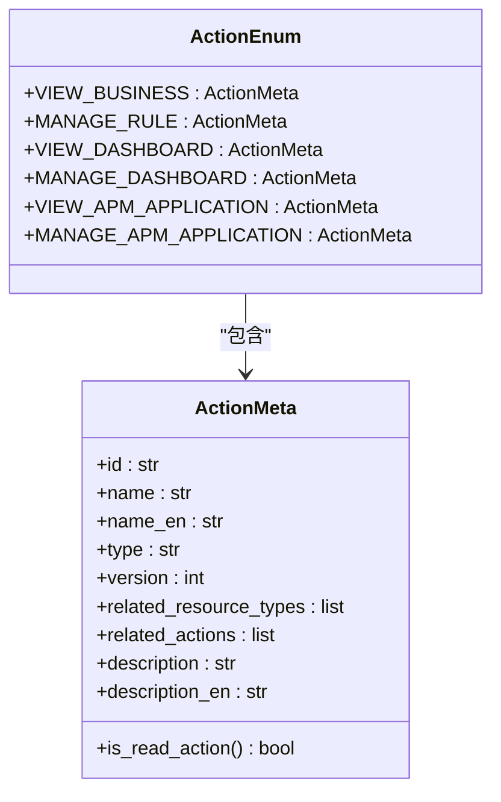
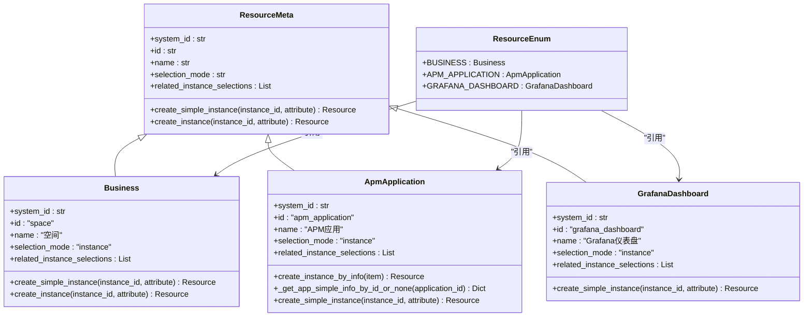
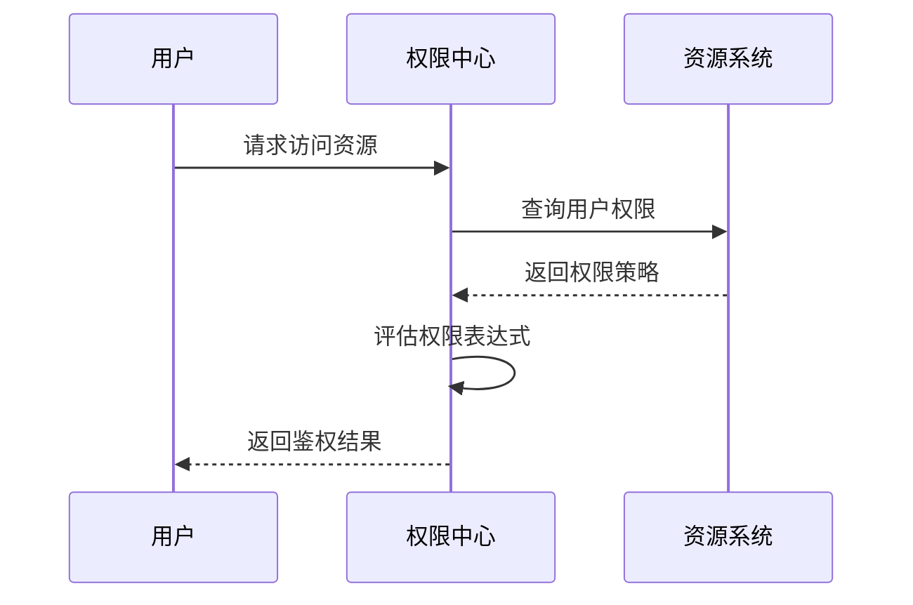
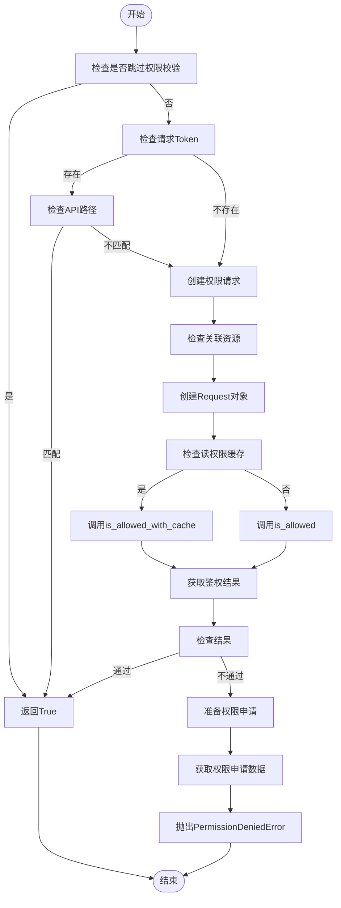

# 权限分配

<cite>
**本文档引用的文件**   
- [permission.py](file://bkmonitor/bkmonitor/iam/permission.py)
- [action.py](file://bkmonitor/bkmonitor/iam/action.py)
- [resource.py](file://bkmonitor/bkmonitor/iam/resource.py)
- [resources.py](file://bkmonitor/packages/monitor_web/iam/resources.py)
</cite>

## 目录
1. [引言](#引言)
2. [权限模型设计](#权限模型设计)
3. [权限分配机制](#权限分配机制)
4. [权限验证流程](#权限验证流程)
5. [API使用方法与代码示例](#api使用方法与代码示例)
6. [权限审计与回收](#权限审计与回收)
7. [性能优化策略](#性能优化策略)
8. [最佳实践](#最佳实践)

## 引言

本文档全面描述了蓝鲸监控平台的权限分配机制实现。系统采用基于IAM（Identity and Access Management）的权限管理框架，实现了细粒度的权限控制。权限系统主要由权限类型、权限级别、权限范围等核心概念构成，支持基于角色和基于个体的两种权限分配模式。文档深入解析了权限继承规则和冲突解决策略，提供了权限分配API的使用方法和实际代码示例，并记录了权限验证流程及性能优化策略。

**Section sources**
- [permission.py](file://bkmonitor/bkmonitor/iam/permission.py#L0-L518)

## 权限模型设计

### 权限类型与级别

系统权限模型基于`ActionMeta`类定义，每个权限操作包含ID、名称、类型、版本、关联资源类型等属性。权限类型主要分为"view"（查看）和"manage"（管理）两种级别。



**Diagram sources**
- [action.py](file://bkmonitor/bkmonitor/iam/action.py#L0-L621)

**Section sources**
- [action.py](file://bkmonitor/bkmonitor/iam/action.py#L0-L621)

### 权限范围与资源类型

权限范围通过资源类型定义，系统支持多种资源类型，每种资源类型都有其特定的实例选择模式和关联实例选择。



**Diagram sources**
- [resource.py](file://bkmonitor/bkmonitor/iam/resource.py#L0-L214)

**Section sources**
- [resource.py](file://bkmonitor/bkmonitor/iam/resource.py#L0-L214)

## 权限分配机制

### 基于角色的权限分配

系统支持基于角色的权限分配模式，通过预定义的角色集合来管理权限。系统定义了多个权限集合，包括最小监控功能权限集、管理权限集等。

```python
# 最小监控功能使用权限
MINI_ACTION_IDS = [
    ActionEnum.VIEW_BUSINESS.id,
    ActionEnum.EXPLORE_METRIC.id,
    ActionEnum.VIEW_EVENT.id,
    ActionEnum.MANAGE_EVENT.id,
    # ... 其他权限
]

# 管理权限
ADMIN_ACTION_IDS = [
    ActionEnum.MANAGE_CALENDAR.id,
    ActionEnum.MANAGE_REPORT.id,
    ActionEnum.MANAGE_GLOBAL_SETTING.id,
    # ... 其他权限
]
```

### 基于个体的权限分配

系统也支持基于个体的权限分配模式，可以为特定用户或用户组分配特定权限。这种模式提供了更灵活的权限管理能力。



**Diagram sources**
- [permission.py](file://bkmonitor/bkmonitor/iam/permission.py#L0-L518)

### 权限继承与冲突解决

系统实现了权限继承机制，某些权限操作会自动继承其依赖权限。例如，管理权限通常会继承相应的查看权限。

```python
# 权限继承示例
MANAGE_RULE = ActionMeta(
    id="manage_rule_v2",
    name=_("策略管理"),
    type="manage",
    related_resource_types=[SPACE_RESOURCE],
    related_actions=[VIEW_BUSINESS.id, VIEW_RULE.id, VIEW_NOTIFY_TEAM.id],
    version=1,
)
```

当存在权限冲突时，系统采用"最小权限原则"，即用户只能获得其明确被授予的权限，不会自动获得未明确授予的权限。

**Section sources**
- [action.py](file://bkmonitor/bkmonitor/iam/action.py#L0-L621)
- [permission.py](file://bkmonitor/bkmonitor/iam/permission.py#L0-L518)

## 权限验证流程

### 权限验证核心流程

权限验证流程由`Permission`类实现，主要包含权限检查、缓存处理、异常处理等环节。



**Diagram sources**
- [permission.py](file://bkmonitor/bkmonitor/iam/permission.py#L0-L518)

**Section sources**
- [permission.py](file://bkmonitor/bkmonitor/iam/permission.py#L0-L518)

## API使用方法与代码示例

### 权限分配API

系统提供了丰富的权限分配API，支持为用户或用户组分配特定权限。

```python
class Permission:
    def is_allowed(self, action: ActionMeta | str, resources: list[Resource] = None, raise_exception: bool = False):
        """
        校验用户是否有动作的权限
        :param action: 动作
        :param resources: 依赖的资源实例列表
        :param raise_exception: 鉴权失败时是否需要抛出异常
        """
        # 实现逻辑
        pass
        
    def is_allowed_by_biz(self, bk_biz_id: int, action: ActionMeta | str, raise_exception: bool = False):
        """
        判断用户对当前动作在该业务下是否有权限
        """
        # 实现逻辑
        pass
        
    def batch_is_allowed(self, actions: list[ActionMeta], resources: list[list[Resource]]):
        """
        查询某批资源某批操作是否有权限
        """
        # 实现逻辑
        pass
```

### 实际代码示例

以下是权限分配的实际使用示例：

```python
# 创建权限客户端
client = Permission(username="admin_user")

# 定义要分配的权限和资源
action_ids = [ActionEnum.MANAGE_RULE.id, ActionEnum.VIEW_RULE.id]
resources = [ResourceEnum.BUSINESS.create_instance("123")]

# 检查权限
if client.is_allowed(ActionEnum.MANAGE_RULE, resources):
    print("用户有管理策略的权限")
else:
    # 获取权限申请URL
    apply_url = client.get_apply_url(action_ids, resources)
    print(f"用户无权限，可前往 {apply_url} 申请")

# 批量检查权限
actions = [ActionEnum.VIEW_BUSINESS, ActionEnum.VIEW_EVENT]
resources_list = [[ResourceEnum.BUSINESS.create_instance("123")]]
result = client.batch_is_allowed(actions, resources_list)
print(f"批量权限检查结果: {result}")
```

**Section sources**
- [permission.py](file://bkmonitor/bkmonitor/iam/permission.py#L0-L518)
- [resources.py](file://bkmonitor/packages/monitor_web/iam/resources.py#L0-L335)

## 权限审计与回收

### 权限审计

系统提供了权限审计功能，可以追踪权限分配和使用情况。通过`ExternalPermission`模型记录外部权限分配信息。

```python
def create_permission(authorized_users, params):
    """
    新增权限
        1. 判定是否有存量被授权人权限
        2. 判定该实例是否已被授权，若有则不处理，无则更新该条授权记录
        3. 给剩余被授权人新增权限
        4. 注入grafana新增被授权人的用户权限
    """
    exist_authorized_users = set()
    for permission_obj in ExternalPermission.objects.filter(
        authorized_user__in=authorized_users,
        action_id=params["action_id"],
        bk_biz_id=params["bk_biz_id"],
    ):
        exist_authorized_users.add(permission_obj.authorized_user)
        all_resources = set(params["resources"]) | set(permission_obj.resources)
        if all_resources - set(permission_obj.resources):
            permission_obj.resources = list(all_resources)
            permission_obj.expire_time = params["expire_time"]
            permission_obj.save()
    add_authorized_users = set(authorized_users) - exist_authorized_users
    ExternalPermission.objects.bulk_create(
        # 创建新的权限记录
    )
```

### 权限回收

权限回收通过删除或更新`ExternalPermission`记录实现，系统会自动处理相关的权限撤销逻辑。

**Section sources**
- [resources.py](file://bkmonitor/packages/monitor_web/iam/resources.py#L196-L230)

## 性能优化策略

### 权限检查缓存

系统对读权限检查实现了缓存优化，提高频繁权限检查的性能。

```python
def is_allowed(self, action: ActionMeta | str, resources: list[Resource] = None, raise_exception: bool = False):
    """
    校验用户是否有动作的权限
    """
    # ...
    try:
        if action.is_read_action():
            # 仅对读权限做缓存
            result = self.iam_client.is_allowed_with_cache(request)
        else:
            result = self.iam_client.is_allowed(request)
    except AuthAPIError as e:
        logger.exception("[IAM AuthAPI Error]: %s", e)
        result = False
    # ...
```

### 批量权限检查

对于需要检查多个权限的场景，系统提供了批量权限检查接口，减少网络请求次数。

```python
def batch_is_allowed(self, actions: list[ActionMeta], resources: list[list[Resource]]):
    """
    查询某批资源某批操作是否有权限
    """
    request = self.make_multi_action_request(actions)
    result = self.iam_client.batch_resource_multi_actions_allowed(request, resources)
    return result
```

### 内存缓存优化

对于频繁访问但不常变更的资源信息，系统使用内存缓存进行优化。

```python
@lru_cache_with_ttl(maxsize=128, ttl=60 * 60, decision_to_drop_func=lambda v: v is None)
def _get_app_simple_info_by_id_or_none(cls, application_id: str) -> Optional[Dict[str, Any]]:
    """
    获取应用概要信息，不存在则返回 None。
    应用概要信息不会修改，此处给 60 min 的内存缓存，以提高整体鉴权性能。
    """
    from apm_web.models import Application
    return Application.objects.filter(application_id=application_id).values("application_id", "app_name", "bk_biz_id").first()
```

**Section sources**
- [permission.py](file://bkmonitor/bkmonitor/iam/permission.py#L0-L518)
- [resource.py](file://bkmonitor/bkmonitor/iam/resource.py#L0-L214)

## 最佳实践

### 权限分配最佳实践

1. **最小权限原则**：只授予用户完成工作所需的最小权限
2. **基于角色分配**：优先使用基于角色的权限分配，便于管理
3. **定期审查**：定期审查权限分配情况，及时回收不再需要的权限
4. **权限继承**：合理利用权限继承机制，避免重复授权

### 开发者建议

1. **使用缓存**：对于频繁的读权限检查，确保使用缓存机制
2. **批量操作**：在需要检查多个权限时，使用批量检查接口
3. **异常处理**：妥善处理权限异常，提供清晰的错误信息和申请指引
4. **性能监控**：监控权限系统的性能，及时发现和解决性能瓶颈