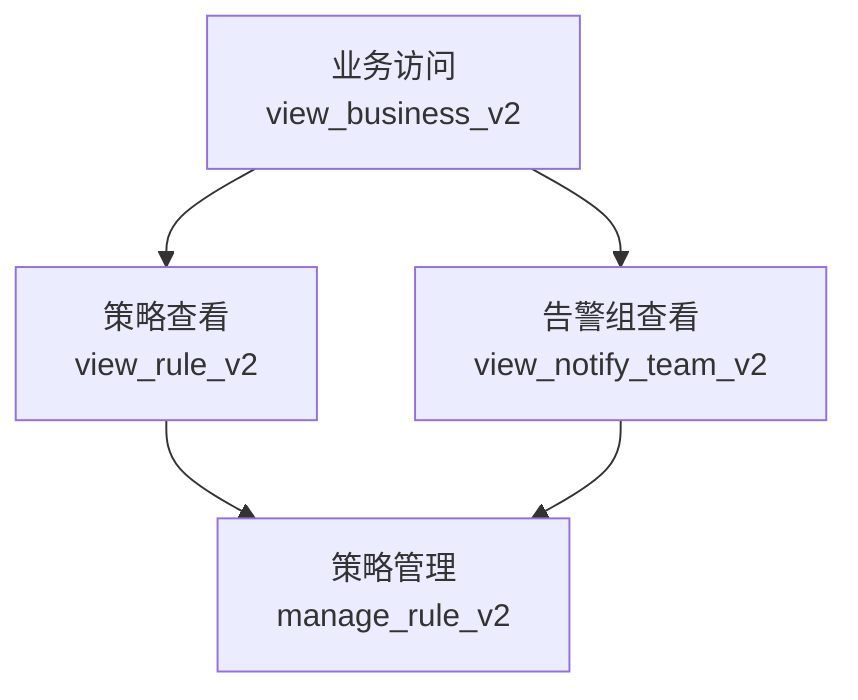
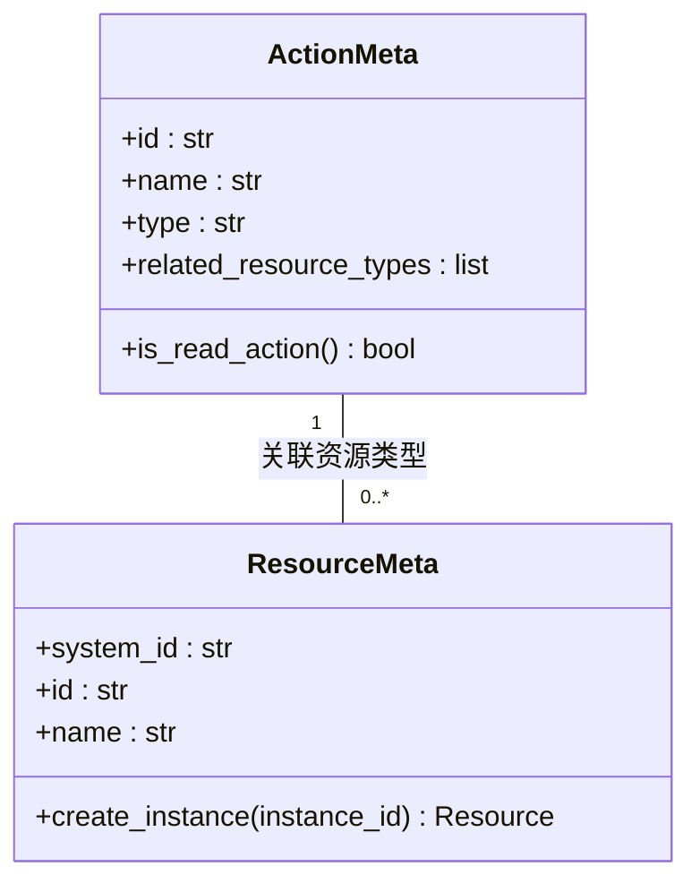
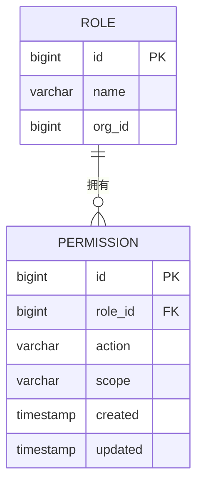
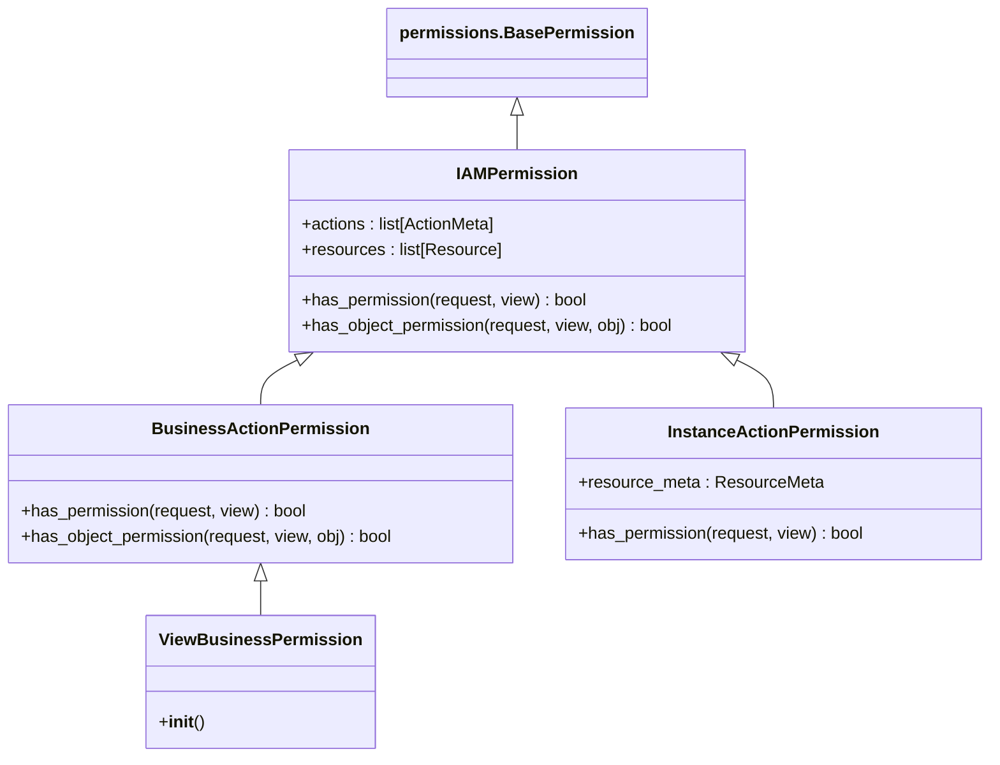

# 权限模型

<cite>
**本文档引用的文件**
- [resource.py](file://bkmonitor/bkmonitor/iam/resource.py)
- [action.py](file://bkmonitor/bkmonitor/iam/action.py)
- [drf.py](file://bkmonitor/bkmonitor/iam/drf.py)
- [permission.py](file://bkmonitor/bkmonitor/iam/permission.py)
- [models.py](file://bkmonitor/bk_dataview/models.py)
</cite>

## 目录
1. [简介](#简介)
2. [权限类型定义](#权限类型定义)
3. [权限级别与范围](#权限级别与范围)
4. [资源类型定义](#资源类型定义)
5. [权限模型数据库设计](#权限模型数据库设计)
6. [API权限集成](#api权限集成)
7. [开发者扩展实践](#开发者扩展实践)

## 简介
本系统采用基于IAM（Identity and Access Management）的精细化权限控制模型，实现了对监控平台各类资源的细粒度访问控制。权限模型设计遵循最小权限原则，通过定义明确的权限类型、资源类型和权限级别，确保用户只能访问其被授权的资源和操作。该模型不仅支持全局权限管理，还能够实现基于业务、应用等维度的精细化权限控制，为系统的安全性和可管理性提供了坚实基础。

## 权限类型定义
系统定义了丰富的权限类型，涵盖查看、编辑、删除等基本操作，以及特定业务场景下的自定义权限。

### 基本操作权限
系统将权限分为两大类：**查看（view）** 和 **管理（manage）**。所有权限均以`_v2`后缀标识，表明其为第二代权限体系。

- **查看权限 (type: "view")**: 允许用户读取和查看资源信息。
- **管理权限 (type: "manage")**: 允许用户对资源进行创建、修改、删除等操作。

### 预定义权限类型
以下是系统中定义的核心权限类型枚举（`ActionEnum`）：

```python
class ActionEnum:
    # 业务访问
    VIEW_BUSINESS = ActionMeta(id="view_business_v2", name=_("业务访问"), type="view", ...)
    # 指标检索
    EXPLORE_METRIC = ActionMeta(id="explore_metric_v2", name=_("指标检索"), type="view", ...)
    # 拨测管理
    VIEW_SYNTHETIC = ActionMeta(id="view_synthetic_v2", name=_("拨测查看"), type="view", ...)
    MANAGE_SYNTHETIC = ActionMeta(id="manage_synthetic_v2", name=_("拨测管理"), type="manage", ...)
    # 主机管理
    VIEW_HOST = ActionMeta(id="view_host_v2", name=_("主机详情查看"), type="view", ...)
    MANAGE_HOST = ActionMeta(id="manage_host_v2", name=_("主机详情管理"), type="manage", ...)
    # 事件中心
    VIEW_EVENT = ActionMeta(id="view_event_v2", name=_("事件中心查看"), type="view", ...)
    MANAGE_EVENT = ActionMeta(id="manage_event_v2", name=_("事件中心管理"), type="manage", ...)
    # 策略管理
    VIEW_RULE = ActionMeta(id="view_rule_v2", name=_("策略查看"), type="view", ...)
    MANAGE_RULE = ActionMeta(id="manage_rule_v2", name=_("策略管理"), type="manage", ...)
    # 仪表盘管理
    VIEW_DASHBOARD = ActionMeta(id="view_dashboard_v2", name=_("仪表盘查看"), type="view", ...)
    MANAGE_DASHBOARD = ActionMeta(id="manage_dashboard_v2", name=_("仪表盘管理"), type="manage", ...)
    # APM应用
    VIEW_APM_APPLICATION = ActionMeta(id="view_apm_application_v2", name=_("APM应用查看"), type="view", ...)
    MANAGE_APM_APPLICATION = ActionMeta(id="manage_apm_application_v2", name=_("APM应用管理"), type="manage", ...)
    # 全局配置
    VIEW_GLOBAL_SETTING = ActionMeta(id="view_global_setting", name=_("全局配置查看"), type="view", ...)
    MANAGE_GLOBAL_SETTING = ActionMeta(id="manage_global_setting", name=_("全局配置编辑"), type="manage", ...)
```

### 权限依赖关系
部分权限具有依赖关系，即拥有高级权限的用户通常也应拥有其依赖的基础权限。例如，`MANAGE_RULE`（策略管理）权限依赖于`VIEW_RULE`（策略查看）和`VIEW_NOTIFY_TEAM`（告警组查看）权限。



**Diagram sources**
- [action.py](file://bkmonitor/bkmonitor/iam/action.py#L130-L150)

**Section sources**
- [action.py](file://bkmonitor/bkmonitor/iam/action.py#L100-L200)

## 权限级别与范围
权限模型通过资源实例和权限级别的组合，实现了多维度的权限控制。

### 权限级别划分
权限级别主要依据所操作的资源范围进行划分：

1.  **全局权限 (Global Permissions)**:
    *   **定义**: 不关联具体资源实例的权限，通常用于系统级配置。
    *   **应用场景**: 如`VIEW_GLOBAL_SETTING`（全局配置查看）、`MANAGE_CALENDAR`（日历服务管理）等。
    *   **特点**: `related_resource_types`为空列表。

2.  **业务权限 (Business Permissions)**:
    *   **定义**: 关联到`Business`（业务/空间）资源实例的权限。
    *   **应用场景**: 绝大多数监控功能，如查看和管理策略、事件、仪表盘等。权限的效力范围限定在指定的业务（`bk_biz_id`）内。
    *   **特点**: `related_resource_types`包含`SPACE_RESOURCE`。

3.  **资源实例权限 (Instance Permissions)**:
    *   **定义**: 关联到特定资源实例的权限，粒度最细。
    *   **应用场景**: 如`VIEW_SINGLE_DASHBOARD`（仪表盘实例查看）和`EDIT_SINGLE_DASHBOARD`（仪表盘实例编辑），这些权限直接作用于某个具体的仪表盘（由`uid`标识）。
    *   **特点**: `related_resource_types`包含如`GRAFANA_DASHBOARD_RESOURCE`等特定资源。

### 权限范围界定
权限范围通过`related_resource_types`字段明确界定，该字段指定了权限所关联的资源类型及其选择模式。

- **跨业务权限**: 指定`related_resource_types`为空的权限，如`MANAGE_PUBLIC_PLUGIN`（公共插件管理），这类权限不受业务限制。
- **限定业务权限**: 指定`related_resource_types`为`[SPACE_RESOURCE]`的权限，如`MANAGE_RULE`，这类权限必须与一个具体的业务实例绑定才能生效。



**Diagram sources**
- [action.py](file://bkmonitor/bkmonitor/iam/action.py#L50-L80)
- [resource.py](file://bkmonitor/bkmonitor/iam/resource.py#L20-L50)

**Section sources**
- [action.py](file://bkmonitor/bkmonitor/iam/action.py#L50-L90)
- [resource.py](file://bkmonitor/bkmonitor/iam/resource.py#L20-L60)

## 资源类型定义
资源是权限控制的基本对象，系统通过`ResourceMeta`基类和`ResourceEnum`枚举来定义和管理所有资源类型。

### 资源基类 (ResourceMeta)
`ResourceMeta`是一个抽象基类，定义了所有资源的通用属性和方法。

```python
class ResourceMeta(metaclass=abc.ABCMeta):
    system_id: str = ""      # 资源所属系统ID
    id: str = ""             # 资源类型ID
    name: str = ""           # 资源类型名称
    selection_mode: str = "" # 选择模式 (如 "instance")
    related_instance_selections: List = "" # 关联的实例视图

    @classmethod
    def create_simple_instance(cls, instance_id: str, attribute=None) -> Resource:
        """创建简单资源实例"""
        return Resource(cls.system_id, cls.id, str(instance_id), attribute)

    @classmethod
    def create_instance(cls, instance_id: str, attribute=None) -> Resource:
        """创建资源实例（可由子类重载以包含更多属性）"""
        return cls.create_simple_instance(instance_id, attribute)
```

### 预定义资源类型
通过`ResourceEnum`枚举，系统定义了以下核心资源类型：

```python
class ResourceEnum:
    BUSINESS = Business
    APM_APPLICATION = ApmApplication
    GRAFANA_DASHBOARD = GrafanaDashboard
```

- **Business (业务/空间)**:
    *   `id`: "space"
    *   `name`: "空间"
    *   `create_instance`方法会查询`bkm_space`服务以获取业务的详细信息（如名称），并将其作为资源属性。

- **ApmApplication (APM应用)**:
    *   `id`: "apm_application"
    *   `name`: "APM应用"
    *   `create_simple_instance`方法会查询`apm_web`模块的`Application`模型，以获取应用名称和所属业务ID。

- **GrafanaDashboard (Grafana仪表盘)**:
    *   `id`: "grafana_dashboard"
    *   `create_simple_instance`方法会查询`bk_dataview`模块的`Dashboard`模型，以获取仪表盘标题和所属组织ID。

**Section sources**
- [resource.py](file://bkmonitor/bkmonitor/iam/resource.py#L20-L213)

## 权限模型数据库设计
系统的权限数据持久化主要依赖于`bk_dataview`应用中的`permission`表。

### 数据库表结构
`permission`表用于存储角色（Role）对特定作用域（Scope）的权限（Action）。

```python
class Permission(models.Model):
    id = models.BigAutoField(primary_key=True)
    role_id = models.BigIntegerField()
    action = models.CharField(max_length=190)  # 对应 ActionMeta.id
    scope = models.CharField(max_length=190)   # 作用域，如 "dashboards:uid:abc123"
    created = models.DateTimeField(auto_now_add=True)
    updated = models.DateTimeField(auto_now=True)

    class Meta:
        db_table = "permission"
        unique_together = (("role_id", "action", "scope"),)
        indexes = [models.Index(fields=["role_id"])]
```

### 关键字段说明
- **`role_id`**: 外键，指向`role`表，标识该权限属于哪个角色。
- **`action`**: 字符串，存储权限类型ID（如`"view_dashboard_v2"`）。
- **`scope`**: 字符串，定义了权限的作用域。其格式为`{资源类型}:{标识符}:{具体ID}`。例如：
    - `dashboards:uid:abc123` 表示对ID为`abc123`的仪表盘的权限。
    - `spaces:bk_biz_id:2` 表示对业务ID为2的空间的权限。
- **`unique_together`**: 确保一个角色对同一作用域的同一操作只能有一条记录。

### 相关数据模型


**Diagram sources**
- [models.py](file://bkmonitor/bk_dataview/models.py#L251-L264)

**Section sources**
- [models.py](file://bkmonitor/bk_dataview/models.py#L250-L265)

## API权限集成
权限模型通过Django REST Framework（DRF）的权限类与API视图进行集成，实现请求级别的访问控制。

### 核心权限类
`drf.py`文件定义了多个权限类，用于在API层面执行鉴权。



**Diagram sources**
- [drf.py](file://bkmonitor/bkmonitor/iam/drf.py#L50-L150)

**Section sources**
- [drf.py](file://bkmonitor/bkmonitor/iam/drf.py#L50-L200)

### 鉴权流程
1.  **`IAMPermission`**: 最基础的权限类。在`has_permission`方法中，它会使用`Permission`类（来自`permission.py`）调用IAM后端API，检查当前用户是否被允许执行`self.actions`列表中的任一操作。
2.  **`BusinessActionPermission`**: 专门用于业务权限。它会从`request.biz_id`或`obj.bk_biz_id`中获取业务ID，并创建一个`Business`资源实例，然后调用父类的鉴权方法。
3.  **`InstanceActionPermission`**: 用于资源实例权限。它会从URL参数（`view.kwargs`）中获取实例ID，根据`resource_meta`创建对应的资源实例，再进行鉴权。
4.  **`ViewBusinessPermission`**: 一个具体的权限类，用于检查用户是否具有访问特定业务的权限。它是`BusinessActionPermission`的一个实例，预设了`[ActionEnum.VIEW_BUSINESS]`作为其`actions`。

### 装饰器与工具函数
系统还提供了`insert_permission_field`装饰器，用于在API返回的数据中动态插入用户的权限信息，方便前端进行UI控制。

```python
@insert_permission_field(
    actions=[ActionEnum.VIEW_DASHBOARD, ActionEnum.EDIT_SINGLE_DASHBOARD],
    resource_meta=ResourceEnum.GRAFANA_DASHBOARD,
    id_field=lambda item: item["uid"],
)
def list_dashboards(request):
    # 返回的每个仪表盘数据中都会包含一个 "permission" 字段
    return Response(dashboard_list)
```

## 开发者扩展实践
为开发者提供扩展权限模型的最佳实践和注意事项。

### 扩展权限类型
1.  **在`action.py`中定义新权限**:
    在`ActionEnum`类中添加新的`ActionMeta`实例。确保`id`唯一，`type`正确（"view"或"manage"），并根据需要设置`related_resource_types`。

    ```python
    NEW_FEATURE_VIEW = ActionMeta(
        id="view_new_feature_v2",
        name=_("新功能查看"),
        name_en="View New Feature",
        type="view",
        related_resource_types=[SPACE_RESOURCE], # 关联业务资源
        version=1,
    )
    ```

2.  **更新权限全集**:
    新增的权限会自动被`_all_actions`字典收集，无需手动添加。

### 扩展资源类型
1.  **在`resource.py`中定义新资源**:
    创建一个继承自`ResourceMeta`的新类，并实现必要的属性和`create_instance`方法。

    ```python
    class MyNewResource(ResourceMeta):
        system_id = settings.BK_IAM_SYSTEM_ID
        id = "my_new_resource"
        name = _lazy("我的新资源")
        selection_mode = "instance"
        related_instance_selections = [{"system_id": system_id, "id": "my_new_resource_list"}]

        @classmethod
        def create_instance(cls, instance_id: str, attribute=None) -> Resource:
            # 实现逻辑以获取实例的详细信息
            return super().create_simple_instance(instance_id, attribute)
    ```

2.  **在`ResourceEnum`中注册**:
    将新资源类添加到`ResourceEnum`枚举中。

    ```python
    class ResourceEnum:
        # ... existing resources
        MY_NEW_RESOURCE = MyNewResource
    ```

### 注意事项
- **权限ID唯一性**: 所有权限ID必须全局唯一，建议使用`<操作>_<资源>_v2`的命名规范。
- **资源ID唯一性**: 同样，资源类型ID也必须在系统内唯一。
- **性能考虑**: `create_instance`方法可能会查询数据库，对于列表接口，应考虑使用`batch_create_instance`等批量方法以减少查询次数。
- **缓存**: 对于不常变动的资源信息（如应用名称），可以使用`@lru_cache_with_ttl`等装饰器进行缓存，以提高鉴权性能。
- **权限申请**: 当用户鉴权失败时，系统会自动生成权限申请链接，引导用户申请所需权限。