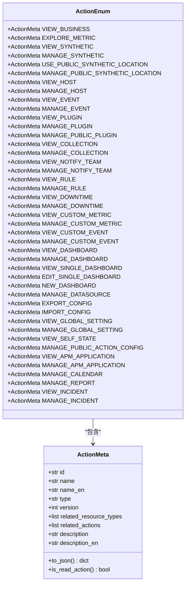
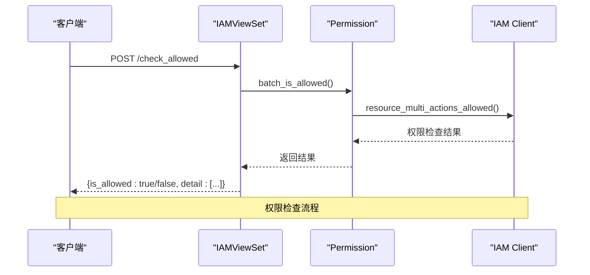
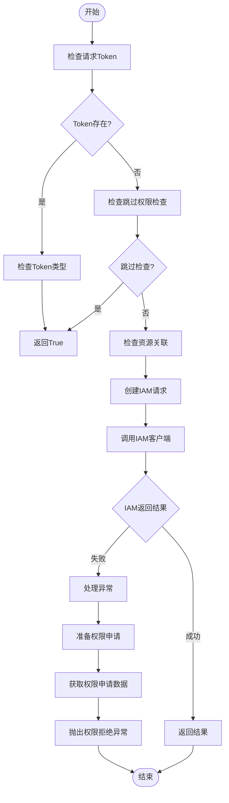

# 权限类型

<cite>
**本文档引用的文件**   
- [action.py](file://bkmonitor/bkmonitor/iam/action.py)
- [permission.py](file://bkmonitor/bkmonitor/iam/permission.py)
- [drf.py](file://bkmonitor/bkmonitor/iam/drf.py)
- [resources.py](file://bkmonitor/packages/monitor_web/iam/resources.py)
- [views.py](file://bkmonitor/packages/monitor_web/iam/views.py)
</cite>

## 目录
1. [简介](#简介)
2. [权限类型定义](#权限类型定义)
3. [权限类型技术实现](#权限类型技术实现)
4. [自定义权限类型](#自定义权限类型)
5. [API接口关联机制](#api接口关联机制)
6. [权限验证执行流程](#权限验证执行流程)
7. [新增权限类型指导](#新增权限类型指导)
8. [常见问题解决方案](#常见问题解决方案)

## 简介
本文档全面描述了监控平台系统中定义的各种权限类型。文档详细说明了每种权限类型的技术实现，包括查看、编辑、删除等基本操作权限的定义方式和使用场景。同时，文档解释了自定义权限类型的创建方法和命名规范，提供了权限类型在代码中的具体实现示例，并说明了权限类型与API接口的关联机制以及权限验证的执行流程。为开发者提供了新增权限类型的步骤指导和常见问题解决方案。

## 权限类型定义

### 基本权限类型
系统中定义了多种基本权限类型，主要分为查看（view）和管理（manage）两大类。查看权限允许用户访问和查看特定资源，而管理权限则允许用户对资源进行修改、创建和删除等操作。



**图示来源**
- [action.py](file://bkmonitor/bkmonitor/iam/action.py#L17-L61)

**本节来源**
- [action.py](file://bkmonitor/bkmonitor/iam/action.py#L17-L61)

### 权限类型分类
权限类型根据其功能和作用范围可分为以下几类：

#### 业务相关权限
这类权限与具体的业务（Business）相关，用户需要先拥有业务访问权限才能进行其他操作。

- **业务访问** (`view_business_v2`): 允许用户访问特定业务
- **指标检索** (`explore_metric_v2`): 允许用户在业务中检索指标数据
- **主机详情查看** (`view_host_v2`): 允许用户查看业务中的主机详情
- **主机详情管理** (`manage_host_v2`): 允许用户管理业务中的主机

#### 监控功能权限
这类权限与系统的监控功能相关，包括事件、策略、屏蔽等。

- **事件中心查看** (`view_event_v2`): 允许用户查看事件中心
- **事件中心管理** (`manage_event_v2`): 允许用户管理事件中心
- **策略查看** (`view_rule_v2`): 允许用户查看告警策略
- **策略管理** (`manage_rule_v2`): 允许用户管理告警策略
- **屏蔽查看** (`view_downtime_v2`): 允许用户查看屏蔽规则
- **屏蔽管理** (`manage_downtime_v2`): 允许用户管理屏蔽规则

#### 数据管理权限
这类权限与数据的采集、上报和管理相关。

- **采集查看** (`view_collection_v2`): 允许用户查看数据采集配置
- **采集管理** (`manage_collection_v2`): 允许用户管理数据采集配置
- **自定义指标上报查看** (`view_custom_metric_v2`): 允许用户查看自定义指标上报
- **自定义指标上报管理** (`manage_custom_metric_v2`): 允许用户管理自定义指标上报
- **自定义事件上报查看** (`view_custom_event_v2`): 允许用户查看自定义事件上报
- **自定义事件上报管理** (`manage_custom_event_v2`): 允许用户管理自定义事件上报

#### 可视化权限
这类权限与仪表盘和数据可视化相关。

- **仪表盘查看** (`view_dashboard_v2`): 允许用户查看仪表盘
- **仪表盘管理** (`manage_dashboard_v2`): 允许用户管理仪表盘
- **仪表盘实例查看** (`view_single_dashboard`): 允许用户查看单个仪表盘实例
- **仪表盘实例编辑** (`edit_single_dashboard`): 允许用户编辑单个仪表盘实例
- **新建仪表盘** (`new_dashboard`): 允许用户创建新的仪表盘

#### 系统管理权限
这类权限与系统的全局配置和管理相关。

- **全局配置查看** (`view_global_setting`): 允许用户查看全局配置
- **全局配置编辑** (`manage_global_setting`): 允许用户编辑全局配置
- **日历服务管理** (`manage_calendar`): 允许用户管理日历服务
- **订阅管理** (`manage_report`): 允许用户管理订阅报告

**本节来源**
- [action.py](file://bkmonitor/bkmonitor/iam/action.py#L87-L400)

## 权限类型技术实现

### ActionMeta类实现
权限类型的核心实现是`ActionMeta`类，该类继承自IAM系统的`Action`类，定义了权限类型的各种属性和方法。

```python
class ActionMeta(Action):
    """
    动作定义
    """

    def __init__(
        self,
        id: str,
        name: str,
        name_en: str,
        type: str,
        version: int,
        related_resource_types: list = None,
        related_actions: list = None,
        description: str = "",
        description_en: str = "",
    ):
        super().__init__(id)
        self.name = name
        self.name_en = name_en
        self.type = type
        self.version = version
        self.related_resource_types = related_resource_types or []
        self.related_actions = related_actions or []
        self.description = description
        self.description_en = description_en

    def to_json(self):
        return {
            "id": self.id,
            "name": self.name,
            "name_en": self.name_en,
            "type": self.type,
            "version": self.version,
            "related_resource_types": self.related_resource_types,
            "related_actions": self.related_actions,
            "description": self.description,
            "description_en": self.description_en,
        }

    def is_read_action(self):
        """
        是否为读权限
        """
        return self.type == "view"
```

**本节来源**
- [action.py](file://bkmonitor/bkmonitor/iam/action.py#L17-L61)

### 权限类型定义示例
在`ActionEnum`类中，通过实例化`ActionMeta`类来定义具体的权限类型。每个权限类型都有唯一的ID、中文和英文名称、类型（view或manage）、关联的资源类型和相关动作。

```python
class ActionEnum:
    VIEW_BUSINESS = ActionMeta(
        id="view_business_v2",
        name=_("业务访问"),
        name_en="View Business",
        type="view",
        related_resource_types=[SPACE_RESOURCE],
        related_actions=[],
        version=1,
    )

    MANAGE_RULE = ActionMeta(
        id="manage_rule_v2",
        name=_("策略管理"),
        name_en="Manage Rule",
        type="manage",
        related_resource_types=[SPACE_RESOURCE],
        related_actions=[VIEW_BUSINESS.id, VIEW_RULE.id, VIEW_NOTIFY_TEAM.id],
        version=1,
    )
```

**本节来源**
- [action.py](file://bkmonitor/bkmonitor/iam/action.py#L87-L400)

### 权限类型与资源关联
权限类型通过`related_resource_types`属性与特定的资源类型关联。系统中定义了多种资源类型，如业务空间、APM应用、仪表盘等。

```python
# CMDB 业务资源类型
SPACE_RESOURCE = {
    "id": "space",
    "system_id": settings.BK_IAM_SYSTEM_ID,
    "selection_mode": "instance",
    "related_instance_selections": [{"system_id": "bk_monitorv3", "id": "space_list"}],
}

APM_APPLICATION_RESOURCE = {
    "id": "apm_application",
    "system_id": settings.BK_IAM_SYSTEM_ID,
    "selection_mode": "instance",
    "related_instance_selections": [{"system_id": settings.BK_IAM_SYSTEM_ID, "id": "apm_application_list_v2"}],
}

GRAFANA_DASHBOARD_RESOURCE = {
    "id": "grafana_dashboard",
    "system_id": settings.BK_IAM_SYSTEM_ID,
    "selection_mode": "instance",
    "related_instance_selections": [{"system_id": settings.BK_IAM_SYSTEM_ID, "id": "grafana_dashboard_list"}],
}
```

**本节来源**
- [action.py](file://bkmonitor/bkmonitor/iam/action.py#L63-L85)

## 自定义权限类型

### 创建方法
创建自定义权限类型需要遵循以下步骤：

1. 在`action.py`文件中找到`ActionEnum`类
2. 添加新的`ActionMeta`实例，定义权限类型的各项属性
3. 确保权限ID的唯一性，通常采用`[功能]_[操作]_v[版本]`的命名规范
4. 设置正确的`related_resource_types`和`related_actions`

```python
# 示例：创建一个新的自定义权限类型
NEW_CUSTOM_PERMISSION = ActionMeta(
    id="new_custom_permission_v1",
    name=_("新自定义权限"),
    name_en="New Custom Permission",
    type="manage",  # 或 "view"
    related_resource_types=[SPACE_RESOURCE],  # 关联的资源类型
    related_actions=[VIEW_BUSINESS.id],  # 依赖的其他权限
    version=1,
    description="这是一个新的自定义权限类型",
    description_en="This is a new custom permission type",
)
```

### 命名规范
权限类型的命名应遵循以下规范：

- **ID命名**: `[功能]_[操作]_v[版本]`，例如`view_dashboard_v2`
- **中文名称**: 使用简明扼要的中文描述，例如"仪表盘查看"
- **英文名称**: 使用对应的英文描述，例如"View Dashboard"
- **类型**: 使用"view"表示查看权限，"manage"表示管理权限

### 权限依赖关系
权限类型可以定义依赖关系，通过`related_actions`属性指定执行当前权限所需的前提权限。这种设计实现了权限的层级结构，确保用户必须先拥有基础权限才能获得高级权限。

```python
MANAGE_DASHBOARD = ActionMeta(
    id="manage_dashboard_v2",
    name=_("仪表盘管理"),
    name_en="Manage Dashboard",
    type="manage",
    related_resource_types=[SPACE_RESOURCE],
    related_actions=[VIEW_BUSINESS.id, VIEW_DASHBOARD.id],  # 需要业务访问和仪表盘查看权限
    version=1,
)
```

**本节来源**
- [action.py](file://bkmonitor/bkmonitor/iam/action.py#L87-L400)

## API接口关联机制

### 权限检查API
系统提供了多个API接口用于权限检查和管理，这些接口通过`ResourceViewSet`注册到路由中。



**图示来源**
- [views.py](file://bkmonitor/packages/monitor_web/iam/views.py#L24-L53)
- [resources.py](file://bkmonitor/packages/monitor_web/iam/resources.py#L114-L141)

### API路由配置
权限相关的API接口在`views.py`文件中通过`ResourceRoute`进行配置，每个接口对应一个具体的资源处理函数。

```python
class IAMViewSet(ResourceViewSet):
    permission_classes = []

    resource_routes = [
        ResourceRoute("GET", resource.iam.get_authority_meta, endpoint="get_authority_meta"),
        ResourceRoute("POST", resource.iam.check_allowed_by_action_ids, endpoint="check_allowed_by_action_ids"),
        ResourceRoute("POST", resource.iam.get_authority_detail, endpoint="get_authority_detail"),
        ResourceRoute("POST", resource.iam.check_allowed, endpoint="check_allowed"),
        ResourceRoute("POST", resource.iam.check_allowed_by_apm_application, endpoint="check_allowed_by_apm_application"),
        ResourceRoute("POST", resource.iam.get_authority_apply_info, endpoint="get_authority_apply_info"),
        ResourceRoute("GET", resource.iam.test, endpoint="test"),
    ]
```

**本节来源**
- [views.py](file://bkmonitor/packages/monitor_web/iam/views.py#L24-L53)

### 权限检查资源实现
权限检查的具体逻辑在`resources.py`文件中实现，通过`CheckAllowedResource`类处理权限检查请求。

```python
class CheckAllowedResource(Resource):
    class RequestSerializer(serializers.Serializer):
        class ResourceSerializer(serializers.Serializer):
            type = serializers.CharField(required=True, label="资源类型")
            id = serializers.CharField(required=True, label="资源ID")

        resources = serializers.ListField(required=True, allow_empty=False, label="资源列表", child=ResourceSerializer())
        action_ids = serializers.ListField(required=True, allow_empty=False, label="动作ID列表")
        username = serializers.CharField(required=False, allow_null=True, label="指定用户名")

    def perform_request(self, validated_request_data):
        action_ids = validated_request_data.get("action_ids", [])
        resources = Permission.batch_make_resource(validated_request_data.get("resources", []))
        client = Permission()
        detail = []
        for action_id in action_ids:
            is_allowed = client.is_allowed(action_id, resources)
            detail.append({"action_id": action_id, "is_allowed": is_allowed})
        all_allowed = all(d["is_allowed"] for d in detail)
        apply_url = ""
        if not all_allowed:
            _, apply_url = client.get_apply_data(action_ids, resources)
        return {"is_allowed": all_allowed, "detail": detail, "apply_url": apply_url}
```

**本节来源**
- [resources.py](file://bkmonitor/packages/monitor_web/iam/resources.py#L114-L141)

## 权限验证执行流程

### 核心验证流程
权限验证的核心流程由`Permission`类的`is_allowed`方法实现，该方法处理单个权限的验证请求。



**图示来源**
- [permission.py](file://bkmonitor/bkmonitor/iam/permission.py#L300-L350)

### 详细执行步骤
1. **初始化权限客户端**: 创建`Permission`实例，获取当前用户的用户名和租户ID
2. **检查特殊条件**: 检查请求是否携带Token或是否配置了跳过权限检查
3. **构建权限请求**: 使用`make_request`方法创建IAM权限请求对象
4. **执行权限检查**: 调用IAM客户端的`is_allowed`方法进行实际的权限验证
5. **处理结果**: 根据验证结果返回布尔值，如果权限不足则准备权限申请信息

```python
def is_allowed(self, action: ActionMeta | str, resources: list[Resource] = None, raise_exception: bool = False):
    """
    校验用户是否有动作的权限
    :param action: 动作
    :param resources: 依赖的资源实例列表
    :param raise_exception: 鉴权失败时是否需要抛出异常
    """
    # 如果request header 中携带token，通过获取token中的鉴权类型type匹配action
    if self.request and getattr(self.request, "token", None):
        try:
            record = ApiAuthToken.objects.get(token=self.request.token, bk_tenant_id=self.request.user.tenant_id)
        except ApiAuthToken.DoesNotExist:
            record = None
        if isinstance(action, ActionMeta):
            action_id = action.id
        else:
            action_id = action
        # 业务查看权限校验/操作对应类型action/graph_unify_query跳过，在auth中间件中已校验
        if (
            action_id == ActionEnum.VIEW_BUSINESS.id
            or (record and action in ActionIdMap[record.type])
            or path in self.request.path
            for path in api_paths
        ):
            return True

    if self.skip_check:
        return True

    resources = resources or []

    action = get_action_by_id(action)
    if not action.related_resource_types:
        resources = []

    request = self.make_request(action, resources)

    try:
        if action.is_read_action():
            # 仅对读权限做缓存
            result = self.iam_client.is_allowed_with_cache(request)
        else:
            result = self.iam_client.is_allowed(request)
    except AuthAPIError as e:
        logger.exception("[IAM AuthAPI Error]: %s", e)
        result = False

    if not result and raise_exception:
        # 对资源信息(如资源名称)进行补全
        # 先判断是否是SaaS空间
        actions, detail_resources = self.prepare_apply_for_saas(resources)
        if not actions:
            # 非SaaS空间
            detail_resources = []
            for resource in resources:
                resource_mata = get_resource_by_id(resource.type)
                detail_resources.append(resource_mata.create_instance(resource.id))
            actions = [action]
        apply_data, apply_url = self.get_apply_data(actions, detail_resources)

        raise PermissionDeniedError(
            context={"action_name": action.name},
            data={"apply_url": apply_url},
            extra={"permission": apply_data},
        )

    return result
```

**本节来源**
- [permission.py](file://bkmonitor/bkmonitor/iam/permission.py#L300-L350)

### 批量权限验证
系统还提供了批量权限验证功能，可以同时检查多个权限和资源组合。

```python
def batch_is_allowed(self, actions: list[ActionMeta], resources: list[list[Resource]]):
    """
    查询某批资源某批操作是否有权限
    """
    result = defaultdict(dict)
    # 请求头携带token，临时分享模式权限豁免
    # TODO: iam租户改造时需要同步修改
    if self.request and getattr(self.request, "token", None):
        try:
            record = ApiAuthToken.objects.get(token=self.request.token, bk_tenant_id=self.request.user.tenant_id)
        except ApiAuthToken.DoesNotExist:
            raise TokenValidatedError
        for action in actions:
            for resource in resources:
                resource_id = resource[0].id
                action_id = action.id
                if action_id == "view_business" or (record and action in ActionIdMap[record.type]):
                    result[resource_id][action_id] = True
                else:
                    result[resource_id][action_id] = False
        return result

    # 开发环境变量配置权限豁免
    if self.skip_check:
        for action in actions:
            for resource in resources:
                resource_id = resource[0].id
                action_id = action.id
                result[resource_id][action_id] = True
        return result

    request = self.make_multi_action_request(actions)
    result = self.iam_client.batch_resource_multi_actions_allowed(request, resources)

    return result
```

**本节来源**
- [permission.py](file://bkmonitor/bkmonitor/iam/permission.py#L400-L450)

## 新增权限类型指导

### 新增步骤
1. **确定权限需求**: 明确新权限的功能、作用范围和权限级别
2. **选择权限ID**: 按照命名规范创建唯一的权限ID
3. **定义权限类型**: 在`action.py`文件的`ActionEnum`类中添加新的`ActionMeta`实例
4. **设置关联资源**: 确定该权限关联的资源类型
5. **配置依赖权限**: 设置执行此权限所需的前提权限
6. **更新迁移文件**: 运行相关命令生成权限迁移文件
7. **测试验证**: 在测试环境中验证新权限的功能

### 代码示例
```python
# 在 action.py 文件中添加新的权限类型
NEW_FEATURE_MANAGE = ActionMeta(
    id="manage_new_feature_v1",
    name=_("新功能管理"),
    name_en="Manage New Feature",
    type="manage",
    related_resource_types=[SPACE_RESOURCE],
    related_actions=[VIEW_BUSINESS.id],
    version=1,
    description="管理新功能模块的权限",
    description_en="Permission to manage the new feature module",
)
```

### 注意事项
- **权限ID唯一性**: 确保新权限的ID在整个系统中是唯一的
- **版本管理**: 新增权限时使用新的版本号，避免与现有权限冲突
- **权限最小化**: 遵循最小权限原则，只授予完成任务所需的最低权限
- **文档更新**: 更新相关文档，记录新权限的用途和使用方法

**本节来源**
- [action.py](file://bkmonitor/bkmonitor/iam/action.py#L87-L400)

## 常见问题解决方案

### 权限不生效
**问题描述**: 新增的权限在系统中不生效，用户无法获得预期的访问权限。

**解决方案**:
1. 检查权限ID是否正确，确保没有拼写错误
2. 确认权限迁移是否已执行，检查数据库中的权限记录
3. 验证权限依赖关系是否正确配置
4. 清除权限缓存，重新进行权限检查

### 权限循环依赖
**问题描述**: 权限之间出现循环依赖，导致权限检查无法正常进行。

**解决方案**:
1. 检查`related_actions`配置，确保没有形成循环引用
2. 重新设计权限层级结构，避免复杂的依赖关系
3. 使用工具分析权限依赖图，识别潜在的循环依赖

### 权限检查性能问题
**问题描述**: 大量权限检查请求导致系统性能下降。

**解决方案**:
1. 对读权限使用缓存机制，减少对IAM服务的调用
2. 批量处理权限检查请求，减少网络开销
3. 优化权限查询逻辑，避免不必要的权限检查

### 权限申请链接错误
**问题描述**: 权限不足时生成的权限申请链接不正确或无法访问。

**解决方案**:
1. 检查`get_apply_url`方法的实现，确保正确生成申请链接
2. 验证IAM系统的配置，确保权限申请功能正常
3. 检查网络配置，确保权限申请页面可访问

**本节来源**
- [permission.py](file://bkmonitor/bkmonitor/iam/permission.py#L250-L300)
- [action.py](file://bkmonitor/bkmonitor/iam/action.py#L400-L450)