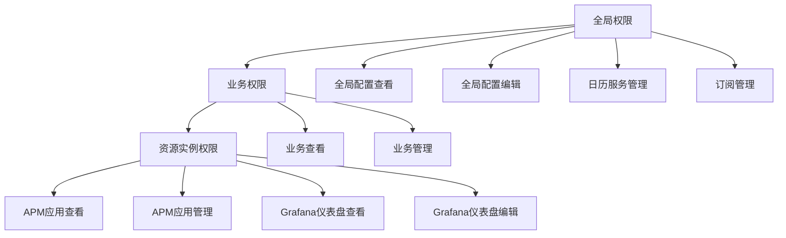

# 权限级别

<cite>
**本文档引用的文件**  
- [bkmonitor\bkmonitor\iam\permission.py](file://bkmonitor\bkmonitor\iam\permission.py)
- [bkmonitor\bkmonitor\iam\resource.py](file://bkmonitor\bkmonitor\iam\resource.py)
- [bkmonitor\bkmonitor\iam\action.py](file://bkmonitor\bkmonitor\iam\action.py)
- [bkmonitor\bkmonitor\iam\compatible.py](file://bkmonitor\bkmonitor\iam\compatible.py)
- [bkmonitor\bkmonitor\iam\migrate.py](file://bkmonitor\bkmonitor\iam\migrate.py)
- [bkmonitor\bkmonitor\iam\drf.py](file://bkmonitor\bkmonitor\iam\drf.py)
- [bkmonitor\bkm_space\api.py](file://bkmonitor\bkm_space\api.py)
- [bkmonitor\bkm_space\define.py](file://bkmonitor\bkm_space\define.py)
</cite>

## 目录
1. [权限级别概述](#权限级别概述)
2. [权限级别划分标准](#权限级别划分标准)
3. [权限级别实现机制](#权限级别实现机制)
4. [权限级别与组织架构的对应关系](#权限级别与组织架构的对应关系)
5. [跨层级权限继承的实现逻辑](#跨层级权限继承的实现逻辑)
6. [权限级别的数据库存储结构](#权限级别的数据库存储结构)
7. [权限级别验证流程](#权限级别验证流程)
8. [权限级别扩展的最佳实践](#权限级别扩展的最佳实践)

## 权限级别概述

权限级别是系统中用于控制用户访问和操作资源的重要机制。通过定义不同的权限级别，系统能够实现精细化的访问控制，确保用户只能访问其被授权的资源和功能。本文档将详细描述系统中权限级别的划分标准、实现机制、存储结构、验证流程以及与组织架构的对应关系。

**权限级别与组织架构的对应关系**
- [bkmonitor\bkm_space\api.py](file://bkmonitor\bkm_space\api.py#L0-L88)
- [bkmonitor\bkm_space\define.py](file://bkmonitor\bkm_space\define.py#L0-L84)

## 权限级别划分标准

系统中的权限级别主要分为全局权限、业务权限和资源实例权限三个层次。

### 全局权限

全局权限是指对整个系统或跨业务范围的资源进行访问和操作的权限。这类权限通常由系统管理员或具有高级管理权限的用户持有。全局权限的典型例子包括：

- **全局配置查看** (`view_global_setting`)：允许用户查看系统的全局配置。
- **全局配置编辑** (`manage_global_setting`)：允许用户编辑系统的全局配置。
- **日历服务管理** (`manage_calendar`)：允许用户管理日历服务。
- **订阅管理** (`manage_report`)：允许用户管理订阅。

### 业务权限

业务权限是指对特定业务范围内的资源进行访问和操作的权限。业务权限通常与具体的业务ID（`bk_biz_id`）相关联。业务权限的典型例子包括：

- **业务查看** (`view_business_v2`)：允许用户查看特定业务的详细信息。
- **业务管理** (`manage_business_v2`)：允许用户管理特定业务的配置和资源。

### 资源实例权限

资源实例权限是指对具体资源实例进行访问和操作的权限。这类权限通常与具体的资源ID相关联。资源实例权限的典型例子包括：

- **APM应用查看** (`view_apm_application_v2`)：允许用户查看特定APM应用的详细信息。
- **APM应用管理** (`manage_apm_application_v2`)：允许用户管理特定APM应用的配置和资源。
- **Grafana仪表盘查看** (`view_single_dashboard`)：允许用户查看特定Grafana仪表盘的内容。
- **Grafana仪表盘编辑** (`edit_single_dashboard`)：允许用户编辑特定Grafana仪表盘的内容。



**图示来源**
- [bkmonitor\bkmonitor\iam\action.py](file://bkmonitor\bkmonitor\iam\action.py#L100-L620)
- [bkmonitor\bkmonitor\iam\resource.py](file://bkmonitor\bkmonitor\iam\resource.py#L0-L213)

## 权限级别实现机制

权限级别的实现机制主要依赖于权限管理系统中的动作（Action）和资源（Resource）定义。每个权限级别对应一个或多个动作，而每个动作又与一个或多个资源类型相关联。

### 动作定义

动作定义了用户可以执行的具体操作。每个动作都有一个唯一的ID、名称、类型以及相关的资源类型。例如，`view_business_v2` 动作允许用户查看业务信息，其相关资源类型为 `space`。

```python
VIEW_BUSINESS = ActionMeta(
    id="view_business_v2",
    name=_("业务查看"),
    name_en="View Business",
    type="view",
    related_resource_types=[SPACE_RESOURCE],
    version=1,
)
```

### 资源定义

资源定义了系统中的各种资源类型及其属性。每个资源类型都有一个唯一的ID、名称、选择模式以及相关的实例选择。例如，`Business` 资源类型表示CMDB业务，其选择模式为 `instance`，表示用户可以选择具体的业务实例。

```python
class Business(ResourceMeta):
    system_id = settings.BK_IAM_SYSTEM_ID
    id = "space"
    name = _lazy("空间")
    selection_mode = "instance"
    related_instance_selections = [{"system_id": system_id, "id": "space_list"}]
```

### 权限验证

权限验证是通过调用权限管理系统的API来完成的。系统会根据用户请求的动作和资源，检查用户是否具有相应的权限。如果用户没有权限，系统会返回相应的错误信息。

```python
def is_allowed_by_biz(self, bk_biz_id: int, action: ActionMeta | str, raise_exception: bool = False):
    """
    判断用户对当前动作在该业务下是否有权限
    """
    if self.skip_check:
        return True

    resources = [ResourceEnum.BUSINESS.create_simple_instance(bk_biz_id)]
    return self.is_allowed(action, resources, raise_exception)
```

**权限级别实现机制**
- [bkmonitor\bkmonitor\iam\action.py](file://bkmonitor\bkmonitor\iam\action.py#L100-L620)
- [bkmonitor\bkmonitor\iam\resource.py](file://bkmonitor\bkmonitor\iam\resource.py#L0-L213)
- [bkmonitor\bkmonitor\iam\permission.py](file://bkmonitor\bkmonitor\iam\permission.py#L350-L383)

## 权限级别与组织架构的对应关系

权限级别与组织架构的对应关系主要通过“空间”（Space）的概念来实现。每个空间代表一个独立的业务单元或组织单元，用户在不同的空间中拥有不同的权限。

### 空间定义

空间定义了系统中的各种组织单元，每个空间都有一个唯一的ID、类型、名称和状态。空间类型包括CMDB业务（`bkcc`）、BCS（`bcs`）、蓝盾（`bkci`）和蓝鲸应用（`bksaas`）等。

```python
class SpaceTypeEnum(Enum):
    BKCC = "bkcc"  # CMDB 业务
    BCS = "bcs"  # BCS
    BKCI = "bkci"  # 蓝盾
    BKSAAS = "bksaas"  # 蓝鲸应用
```

### 空间详情

空间详情包含了空间的具体信息，如ID、类型、名称、状态、业务ID等。用户在访问某个空间时，系统会根据用户的权限级别来决定其可以执行的操作。

```python
@dataclass
class Space:
    id: int
    space_type_id: str
    space_id: str
    space_name: str
    status: str
    space_code: Union[None, str]
    space_uid: str
    type_name: Union[None, str]
    bk_biz_id: int
    is_demo: bool = False
    time_zone: str = "Asia/Shanghai"
    bk_tenant_id: str = DEFAULT_TENANT_ID
```

### 空间API

空间API提供了查询空间列表、查看具体空间实例详情等功能。通过这些API，系统可以动态地获取用户的权限信息，并进行相应的权限验证。

```python
class AbstractSpaceApi(metaclass=abc.ABCMeta):
    @classmethod
    def get_space_detail(cls, space_uid: str = "", bk_biz_id: int = 0) -> Union[None, Space]:
        """
        查看具体空间实例详情
        :param space_uid: 空间唯一标识
        :param bk_biz_id: 业务id，当大于0时，表示bkccid，会转换成space_uid 小于0时， 表示其他空间，绝对值等于自增id
        """
        raise NotImplementedError

    @classmethod
    def list_spaces(cls, refresh=False, bk_tenant_id: Optional[str] = None) -> List[Space]:
        """
        查询空间列表
        """
        raise NotImplementedError
```

**权限级别与组织架构的对应关系**
- [bkmonitor\bkm_space\define.py](file://bkmonitor\bkm_space\define.py#L0-L84)
- [bkmonitor\bkm_space\api.py](file://bkmonitor\bkm_space\api.py#L0-L88)

## 跨层级权限继承的实现逻辑

跨层级权限继承的实现逻辑主要通过权限管理系统中的“相关动作”（related_actions）机制来实现。每个动作可以定义其依赖的其他动作，当用户拥有某个动作的权限时，系统会自动检查其依赖的动作是否也具有权限。

### 相关动作

相关动作定义了动作之间的依赖关系。例如，`manage_business_v2` 动作依赖于 `view_business_v2` 动作，这意味着用户必须先拥有 `view_business_v2` 动作的权限，才能获得 `manage_business_v2` 动作的权限。

```python
MANAGE_BUSINESS = ActionMeta(
    id="manage_business_v2",
    name=_("业务管理"),
    name_en="Manage Business",
    type="manage",
    related_resource_types=[SPACE_RESOURCE],
    related_actions=[VIEW_BUSINESS.id],
    version=1,
)
```

### 递归获取相关动作

系统通过递归函数 `fetch_related_actions` 来获取某个动作的所有相关动作。这个函数会遍历动作的 `related_actions` 列表，并递归地获取每个相关动作的依赖动作。

```python
def fetch_related_actions(actions: list[ActionMeta | str]) -> dict[str, ActionMeta]:
    """
    递归获取 action 动作依赖列表
    """
    actions = [get_action_by_id(action) for action in actions]

    def fetch_related_actions_recursive(_action: ActionMeta):
        _related_actions = {}
        for related_action_id in _action.related_actions:
            try:
                related_action = get_action_by_id(related_action_id)
            except ActionNotExistError:
                continue
            _related_actions[related_action_id] = related_action
            _related_actions.update(fetch_related_actions_recursive(related_action))
        return _related_actions

    related_actions = {}
    for action in actions:
        related_actions.update(fetch_related_actions_recursive(action))

    # 剔除根节点本身
    for action in actions:
        related_actions.pop(action.id, None)

    return related_actions
```

### 权限继承验证

在进行权限验证时，系统会首先检查用户是否具有请求动作的权限，然后递归地检查其所有相关动作的权限。只有当用户拥有所有相关动作的权限时，才会认为用户具有请求动作的权限。

```python
def is_allowed_by_biz(self, bk_biz_id: int, action: ActionMeta | str, raise_exception: bool = False):
    """
    判断用户对当前动作在该业务下是否有权限
    """
    if self.skip_check:
        return True

    resources = [ResourceEnum.BUSINESS.create_simple_instance(bk_biz_id)]
    return self.is_allowed(action, resources, raise_exception)
```

**跨层级权限继承的实现逻辑**
- [bkmonitor\bkmonitor\iam\action.py](file://bkmonitor\bkmonitor\iam\action.py#L100-L620)
- [bkmonitor\bkmonitor\iam\permission.py](file://bkmonitor\bkmonitor\iam\permission.py#L350-L383)

## 权限级别的数据库存储结构

权限级别的数据库存储结构主要由权限管理系统中的策略（Policy）和资源（Resource）表组成。每个策略记录了用户对特定资源的操作权限，而资源表则记录了系统中的各种资源实例。

### 策略表

策略表存储了用户的权限策略，包括用户ID、动作ID、资源ID、权限表达式和过期时间等字段。权限表达式是一个JSON格式的字符串，用于描述用户对资源的具体权限。

```python
class Policy(models.Model):
    user_id = models.CharField("用户ID", max_length=32)
    action_id = models.CharField("动作ID", max_length=64)
    resource_id = models.CharField("资源ID", max_length=128)
    expression = models.TextField("权限表达式")
    expired_at = models.DateTimeField("过期时间")
```

### 资源表

资源表存储了系统中的各种资源实例，包括资源ID、资源类型、资源名称和属性等字段。属性字段是一个JSON格式的字符串，用于存储资源的额外信息。

```python
class Resource(models.Model):
    resource_id = models.CharField("资源ID", max_length=128)
    resource_type = models.CharField("资源类型", max_length=64)
    resource_name = models.CharField("资源名称", max_length=128)
    attribute = models.TextField("属性")
```

### 权限迁移

为了支持权限系统的升级和迁移，系统提供了 `PolicyMigrator` 类，用于将旧版本的权限策略迁移到新版本。`PolicyMigrator` 类通过查询旧版本的权限策略，并将其转换为新版本的格式，然后批量授权给用户。

```python
class PolicyMigrator:
    def __init__(self, username: str = ""):
        self.iam_client = Permission.get_iam_client(DEFAULT_TENANT_ID)
        self.system_id = settings.BK_IAM_SYSTEM_ID
        self.username = username

    def query_polices_by_action_id(self, action_id: str):
        """
        查询指定操作ID的权限策略列表
        """
        page_size = 500
        page = 1

        policies = []

        query_result = self.iam_client.query_polices_with_action_id(
            self.system_id, {"action_id": action_id, "page": page, "page_size": page_size}
        )
        if not query_result["results"]:
            return policies

        policies.extend(query_result["results"])

        total = query_result["count"]

        while page * page_size < total:
            page += 1
            query_result = self.iam_client.query_polices_with_action_id(
                self.system_id, {"action_id": action_id, "page": page, "page_size": page_size}
            )
            policies.extend(query_result["results"])

        if self.username:
            policies = [policy for policy in policies if policy["subject"]["id"] == self.username]
        return policies
```

**权限级别的数据库存储结构**
- [bkmonitor\bkmonitor\iam\migrate.py](file://bkmonitor\bkmonitor\iam\migrate.py#L0-L199)

## 权限级别验证流程

权限级别验证流程主要包括以下几个步骤：

1. **解析请求**：系统首先解析用户请求，提取出请求的动作ID和资源ID。
2. **创建资源实例**：根据资源ID，系统创建相应的资源实例。
3. **检查权限**：系统调用权限管理系统的API，检查用户是否具有请求动作的权限。
4. **返回结果**：根据权限检查的结果，系统返回相应的响应。

### 解析请求

系统通过解析用户请求，提取出请求的动作ID和资源ID。例如，用户请求查看某个业务的详细信息，系统会提取出 `view_business_v2` 动作ID和业务ID。

```python
def perform_request(self, validated_request_data):
    action_id = validated_request_data["action_id"]
    resource_id = validated_request_data["resource_id"]
    # 进行权限验证
    permission_result = Permission().is_allowed(action_id, [ResourceEnum.BUSINESS.create_simple_instance(resource_id)])
    return {"is_allowed": permission_result}
```

### 创建资源实例

根据资源ID，系统创建相应的资源实例。例如，对于业务资源，系统会调用 `Business.create_simple_instance` 方法创建一个业务资源实例。

```python
resources = [ResourceEnum.BUSINESS.create_simple_instance(bk_biz_id)]
```

### 检查权限

系统调用权限管理系统的API，检查用户是否具有请求动作的权限。如果用户没有权限，系统会返回相应的错误信息。

```python
def is_allowed_by_biz(self, bk_biz_id: int, action: ActionMeta | str, raise_exception: bool = False):
    """
    判断用户对当前动作在该业务下是否有权限
    """
    if self.skip_check:
        return True

    resources = [ResourceEnum.BUSINESS.create_simple_instance(bk_biz_id)]
    return self.is_allowed(action, resources, raise_exception)
```

### 返回结果

根据权限检查的结果，系统返回相应的响应。如果用户有权限，系统返回成功响应；如果用户没有权限，系统返回错误响应。

```python
if permission_result:
    return {"result": True, "message": "Permission granted"}
else:
    return {"result": False, "message": "Permission denied"}
```

**权限级别验证流程**
- [bkmonitor\bkmonitor\iam\permission.py](file://bkmonitor\bkmonitor\iam\permission.py#L350-L383)
- [bkmonitor\bkmonitor\iam\drf.py](file://bkmonitor\bkmonitor\iam\drf.py#L200-L338)

## 权限级别扩展的最佳实践

在扩展权限级别时，应遵循以下最佳实践：

1. **定义清晰的动作和资源**：确保每个动作和资源都有明确的定义和用途，避免模糊不清的命名。
2. **使用相关动作机制**：利用相关动作机制来实现权限的继承和依赖，确保权限的合理性和一致性。
3. **提供详细的文档**：为每个权限级别提供详细的文档，包括权限的用途、适用场景和使用方法。
4. **进行充分的测试**：在扩展权限级别后，进行充分的测试，确保权限的正确性和安全性。
5. **定期审查权限**：定期审查系统的权限设置，确保权限的合理性和安全性，及时发现和修复潜在的安全问题。

**权限级别扩展的最佳实践**
- [bkmonitor\bkmonitor\iam\action.py](file://bkmonitor\bkmonitor\iam\action.py#L100-L620)
- [bkmonitor\bkmonitor\iam\resource.py](file://bkmonitor\bkmonitor\iam\resource.py#L0-L213)