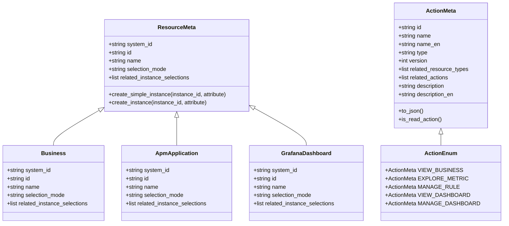
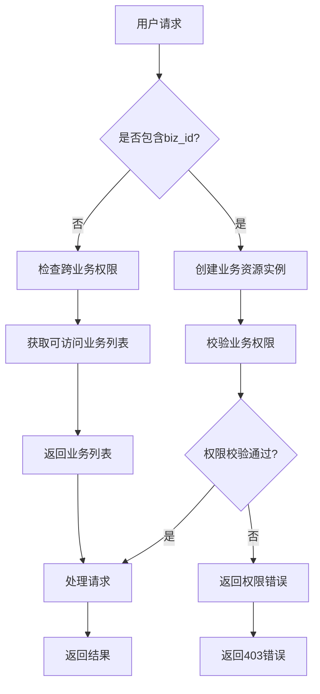
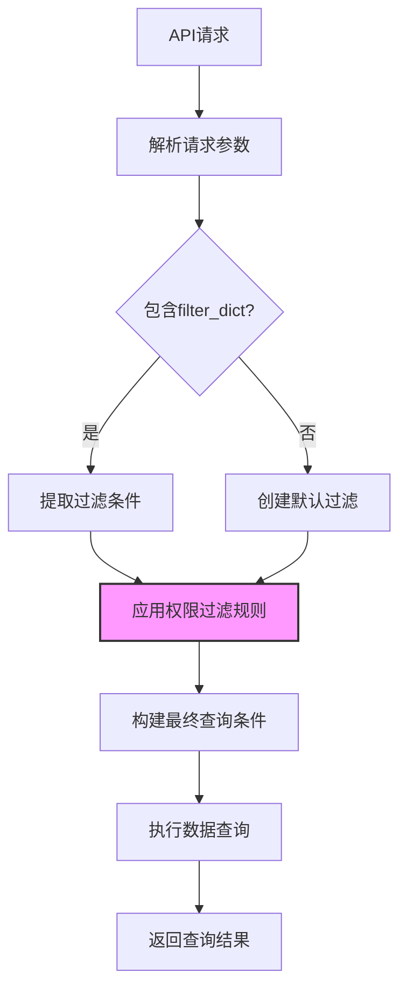
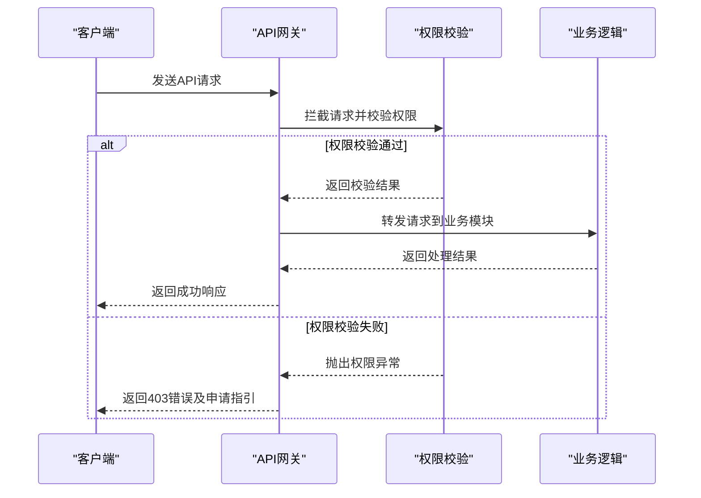
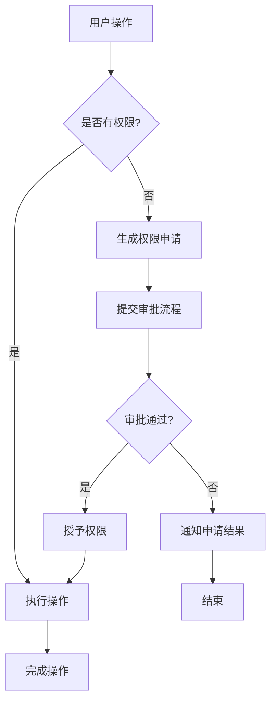

# 权限范围

<cite>
**本文档引用文件**   
- [resource.py](file://bkmonitor/bkmonitor/iam/resource.py)
- [action.py](file://bkmonitor/bkmonitor/iam/action.py)
- [permission.py](file://bkmonitor/bkmonitor/iam/permission.py)
- [drf.py](file://bkmonitor/bkmonitor/iam/drf.py)
- [api_auth_resource.py](file://bkmonitor/bkmonitor/share/api_auth_resource.py)
- [utils.py](file://bkmonitor/metadata/models/space/utils.py)
- [space_table_id_redis.py](file://bkmonitor/metadata/models/space/space_table_id_redis.py)
- [unify_query.py](file://bkmonitor/packages/monitor_web/grafana/resources/unify_query.py)
- [time_series_unify_query.md](file://bkmonitor/docs/api/apidocs/zh_hans/time_series_unify_query.md)
</cite>

## 目录
1. [引言](#引言)
2. [权限范围界定规则](#权限范围界定规则)
3. [跨业务与限定业务权限](#跨业务与限定业务权限)
4. [数据访问控制机制](#数据访问控制机制)
5. [API请求处理中的权限校验](#api请求处理中的权限校验)
6. [用户角色与权限范围关联](#用户角色与权限范围关联)
7. [权限范围配置指导](#权限范围配置指导)

## 引言
权限范围是监控平台安全体系的核心组成部分，用于精确控制用户对系统资源的访问权限。本文档详细阐述了权限范围的界定规则、实现方式及其在数据访问控制中的作用机制。通过分析跨业务权限和限定业务权限的区别与应用场景，解释权限校验的执行流程，并提供开发者配置指导和常见问题解决方案，帮助开发者全面理解并正确使用权限系统。

## 权限范围界定规则

权限范围的界定基于资源类型和权限动作两个核心维度。系统通过定义具体的资源类型和权限动作，构建完整的权限控制体系。

### 资源类型定义
资源类型定义了系统中可被授权管理的对象。在`bkmonitor/iam/resource.py`文件中，通过`ResourceMeta`基类和具体的资源类来定义各种资源类型：

```python
class ResourceMeta(metaclass=abc.ABCMeta):
    """
    资源定义
    """
    system_id: str = ""
    id: str = ""
    name: str = ""
    selection_mode: str = ""
    related_instance_selections: List = ""

class Business(ResourceMeta):
    """
    CMDB业务
    """
    system_id = settings.BK_IAM_SYSTEM_ID
    id = "space"
    name = _lazy("空间")
    selection_mode = "instance"
    related_instance_selections = [{"system_id": system_id, "id": "space_list"}]

class ApmApplication(ResourceMeta):
    system_id = settings.BK_IAM_SYSTEM_ID
    id = "apm_application"
    name = _lazy("APM应用")
    selection_mode = "instance"
    related_instance_selections = [{"system_id": system_id, "id": "apm_application_list_v2"}]
```

**资源类型关键属性说明：**
- **system_id**: 资源所属系统的唯一标识
- **id**: 资源类型的唯一标识
- **name**: 资源类型的中文名称
- **selection_mode**: 选择模式，如"instance"表示实例选择
- **related_instance_selections**: 关联的实例选择路径

### 权限动作定义
权限动作定义了用户可以对资源执行的操作。在`bkmonitor/iam/action.py`文件中，通过`ActionMeta`类和`ActionEnum`枚举来定义各种权限动作：

```python
class ActionMeta(Action):
    """
    动作定义
    """
    def __init__(
        self,
        id: str,
        name: str,
        name_en: str,
        type: str,
        version: int,
        related_resource_types: list = None,
        related_actions: list = None,
        description: str = "",
        description_en: str = "",
    ):
        super().__init__(id)
        self.name = name
        self.name_en = name_en
        self.type = type
        self.version = version
        self.related_resource_types = related_resource_types or []
        self.related_actions = related_actions or []
        self.description = description
        self.description_en = description_en

class ActionEnum:
    VIEW_BUSINESS = ActionMeta(
        id="view_business_v2",
        name=_("业务访问"),
        name_en="View Business",
        type="view",
        related_resource_types=[SPACE_RESOURCE],
        related_actions=[],
        version=1,
    )

    MANAGE_RULE = ActionMeta(
        id="manage_rule_v2",
        name=_("策略管理"),
        name_en="Manage Rule",
        type="manage",
        related_resource_types=[SPACE_RESOURCE],
        related_actions=[VIEW_BUSINESS.id, VIEW_RULE.id, VIEW_NOTIFY_TEAM.id],
        version=1,
    )
```

**权限动作关键属性说明：**
- **id**: 动作的唯一标识
- **name**: 动作的中文名称
- **type**: 动作类型，如"view"(查看)、"manage"(管理)
- **related_resource_types**: 关联的资源类型
- **related_actions**: 关联的前置动作，形成权限依赖链



**图示来源**
- [resource.py](file://bkmonitor/bkmonitor/iam/resource.py#L1-L214)
- [action.py](file://bkmonitor/bkmonitor/iam/action.py#L1-L621)

**本节来源**
- [resource.py](file://bkmonitor/bkmonitor/iam/resource.py#L1-L214)
- [action.py](file://bkmonitor/bkmonitor/iam/action.py#L1-L621)

## 跨业务与限定业务权限

系统实现了跨业务权限和限定业务权限两种模式，以满足不同场景下的权限管理需求。

### 跨业务权限
跨业务权限允许用户访问多个业务空间的资源，适用于需要全局视角的管理角色。这种权限模式通过空间(Space)资源类型实现，用户被授予对特定空间的访问权限。

```python
class Business(ResourceMeta):
    """
    CMDB业务
    """
    system_id = settings.BK_IAM_SYSTEM_ID
    id = "space"
    name = _lazy("空间")
    selection_mode = "instance"
    related_instance_selections = [{"system_id": system_id, "id": "space_list"}]
```

在权限校验时，系统会根据用户被授予的空间权限，过滤出用户有权访问的业务列表：

```python
def perform_request(self, validated_request_data):
    biz_dict = {}
    perm_client = Permission(validated_request_data["username"], bk_tenant_id=get_request_tenant_id())
    perm_client.skip_check = False
    for action_id in validated_request_data["action_ids"]:
        # 根据权限中心的【业务访问】权限，对业务列表进行过滤
        business_list = perm_client.filter_space_list_by_action(action_id)
        for business in business_list:
            biz_dict.setdefault(
                business["bk_biz_id"], {"id": business["bk_biz_id"], "text": business["display_name"]}
            )
    return list(biz_dict.values())
```

### 限定业务权限
限定业务权限将用户的访问范围限制在特定业务内，适用于需要隔离不同业务数据的场景。这种权限模式通过在API请求中传递`biz_id`参数来实现：

```python
class BusinessActionPermission(IAMPermission):
    """
    关联业务的动作权限检查
    """
    def has_permission(self, request, view):
        if not request.biz_id:
            return True
        self.resources = [ResourceEnum.BUSINESS.create_instance(request.biz_id)]
        return super().has_permission(request, view)
```

当API请求包含`biz_id`参数时，系统会自动创建对应业务的资源实例，并进行权限校验。如果用户没有该业务的访问权限，则请求会被拒绝。

### 应用场景对比
| 权限模式 | 适用场景 | 安全性 | 管理复杂度 |
|---------|--------|-------|---------|
| **跨业务权限** | 全局监控、跨业务分析、平台管理员 | 较低 | 较高 |
| **限定业务权限** | 业务专属监控、数据隔离、业务负责人 | 较高 | 较低 |



**图示来源**
- [permission.py](file://bkmonitor/kernel_api/resource/permission.py#L28-L53)
- [drf.py](file://bkmonitor/bkmonitor/iam/drf.py#L72-L114)

**本节来源**
- [permission.py](file://bkmonitor/kernel_api/resource/permission.py#L28-L53)
- [drf.py](file://bkmonitor/bkmonitor/iam/drf.py#L72-L114)

## 数据访问控制机制

权限范围在数据访问控制中发挥着关键作用，通过查询过滤和数据隔离实现细粒度的数据保护。

### 查询过滤实现
系统在数据查询过程中自动添加权限相关的过滤条件，确保用户只能访问其有权查看的数据。在`metadata/models/space/utils.py`文件中，`update_filters_with_alias`函数负责更新查询条件中的过滤器：

```python
def update_filters_with_alias(space_type, space_id, values):
    """
    更新 _values 中的 filters，将 key 替换为 filter_alias.
    :param space_type: 空间类型，用于查询 SpaceTypeToResultTableFilterAlias
    :param space_id: 空间 ID，用于日志记录
    :param values: 存放表数据的字典，格式为 {'table_id': {'filters': [...]}}
    :return: 更新后的 values 字典
    """
    # 获取所有的 filter_alias 映射关系
    alias_map = {
        (alias.table_id, alias.space_type): alias.filter_alias
        for alias in SpaceTypeToResultTableFilterAlias.objects.filter(space_type=space_type, status=True)
    }

    # 遍历 values 字典
    for table_id, table_data in values.items():
        # 如果当前 table_id 在 alias_map 中存在映射关系
        if (table_id, space_type) in alias_map:
            logger.info(
                "update_filters_with_alias: space_type->[%s],space_id->[%s],found filter_alias->[%s] for "
                "table_id->[%s]",
                space_type,
                space_id,
                alias_map[(table_id, space_type)],
                table_id,
            )
            # 获取当前表的 filter_alias
            filter_alias = alias_map[(table_id, space_type)]
            # 遍历 filters，替换 key 为 filter_alias
            for filter_dict in table_data.get("filters", []):
                for key in list(filter_dict.keys()):
                    # 替换 key 为 filter_alias
                    filter_dict[filter_alias] = filter_dict.pop(key)
    return values
```

### 数据隔离策略
对于自定义时序数据等敏感数据，系统实施严格的数据隔离策略。在`metadata/models/space/space_table_id_redis.py`文件中，`is_need_filter`函数判断是否需要对数据查询进行过滤：

```python
def is_need_filter(data_id_detail, space_type, space_id):
    """
    判断是否需要对数据查询进行过滤
    """
    # 对自定义插件的处理，兼容黑白名单对类型的更改
    # 黑名单时，会更改为单指标单表
    if is_platform_data_id and (
        measurement_type == MeasurementType.BK_EXPORTER.value
        or (
            data_id_detail["etl_config"]
            in [EtlConfigs.BK_EXPORTER.value, EtlConfigs.BK_STANDARD_V2_TIME_SERIES.value]
            and measurement_type == MeasurementType.BK_SPLIT.value
        )
    ):
        # 如果space_id与data_id所属空间UID相同，则不需要过滤
        if data_id_detail["space_uid"] == f"{space_type}__{space_id}":
            return False
        else:
            return True
```

### 统一查询接口的权限处理
在统一查询接口中，系统通过`filter_dict`参数实现权限相关的查询过滤。根据`docs/api/apidocs/zh_hans/time_series_unify_query.md`文档，`query_configs`参数包含`filter_dict`字段：

| 字段 | 类型 | 描述 | 是否必选 |
|------|------|------|--------|
| filter_dict | dict | 过滤条件，默认为空字典 | 否 |

```python
class UnifyQueryResource(Resource):
    @classmethod
    def process_params(cls, params: dict) -> dict:
        # 处理排名过滤
        rank_filter = []
        for dimension_value in dimension_value_list:
            if not dimension_value[0]:
                continue
            rank_filter.append({key: value for key, value in dimension_value[0]})
            if len(rank_filter) >= n:
                break

        if rank_filter:
            query_config["filter_dict"]["rank"] = rank_filter
```



**图示来源**
- [utils.py](file://bkmonitor/metadata/models/space/utils.py#L1152-L1189)
- [space_table_id_redis.py](file://bkmonitor/metadata/models/space/space_table_id_redis.py#L1403-L1432)
- [unify_query.py](file://bkmonitor/packages/monitor_web/grafana/resources/unify_query.py#L313-L352)

**本节来源**
- [utils.py](file://bkmonitor/metadata/models/space/utils.py#L1152-L1189)
- [space_table_id_redis.py](file://bkmonitor/metadata/models/space/space_table_id_redis.py#L1403-L1432)
- [time_series_unify_query.md](file://bkmonitor/docs/api/apidocs/zh_hans/time_series_unify_query.md#L30-L48)

## API请求处理中的权限校验

权限校验在API请求处理流程中扮演着关键角色，确保每个请求都在授权范围内执行。

### 权限校验执行流程
API请求的权限校验流程遵循以下步骤：

1. **请求拦截**: API网关或中间件拦截所有进入的请求
2. **身份认证**: 验证用户身份和令牌有效性
3. **权限检查**: 根据请求的资源和动作进行权限校验
4. **执行处理**: 权限校验通过后执行业务逻辑
5. **结果返回**: 返回处理结果或权限错误

```python
class Permission:
    """
    权限中心鉴权封装
    """
    def is_allowed(self, action: ActionMeta | str, resources: list[Resource] = None, raise_exception: bool = False):
        """
        校验用户是否有动作的权限
        :param action: 动作
        :param resources: 依赖的资源实例列表
        :param raise_exception: 鉴权失败时是否需要抛出异常
        """
        # 如果request header 中携带token，通过获取token中的鉴权类型type匹配action
        if self.request and getattr(self.request, "token", None):
            try:
                record = ApiAuthToken.objects.get(token=self.request.token, bk_tenant_id=self.request.user.tenant_id)
            except ApiAuthToken.DoesNotExist:
                record = None
            if isinstance(action, ActionMeta):
                action_id = action.id
            else:
                action_id = action
            # 业务查看权限校验/操作对应类型action/graph_unify_query跳过，在auth中间件中已校验
            if (
                action_id == ActionEnum.VIEW_BUSINESS.id
                or (record and action in ActionIdMap[record.type])
                or path in self.request.path
                for path in api_paths
            ):
                return True

        if self.skip_check:
            return True

        resources = resources or []
        action = get_action_by_id(action)
```

### 异常处理机制
当权限校验失败时，系统会抛出相应的异常，并提供权限申请指引：

```python
class APIPermissionDeniedError(APIError):
    def __init__(self, context=None, data=None, extra=None, **kwargs):
        permission_actions = []
        extra = extra or {}
        for action in extra.get("permission", {}).get("actions", []):
            action_name = action["name"]
            resource_name = _lazy("无实例")
            related_resources = action.get("related_resource_types", [])
            for resource in related_resources:
                instances = resource.get("instances", [])
                try:
                    resource_name = instances[0][0]["name"]
                    break
                except BaseException as error:
                    logger.error("get related resource name error %s", str(error))
            permission_actions.append("{}-{}".format(action_name, resource_name))
        kwargs.update(permission=",".join(permission_actions))
        super(APIPermissionDeniedError, self).__init__(context, data, extra, **kwargs)

    message_tpl = _lazy("请求[{system_name}]系统[{url}]权限校验不通过，请前往权限中心申请对应权限[{permission}]")
```

### Token模式权限校验
系统支持通过Token进行API权限校验，适用于自动化脚本和第三方集成场景：

```python
class ApiAuthResource(Resource):
    """
    api鉴权resource
    """
    def validate_request_data(self, request_data):
        # api携带token模式进行参数校验
        check_api_permission(get_request(peaceful=True), request_data)
        return validated_request_data
```



**图示来源**
- [permission.py](file://bkmonitor/bkmonitor/iam/permission.py#L290-L322)
- [api_auth_resource.py](file://bkmonitor/bkmonitor/share/api_auth_resource.py#L57-L64)
- [core/drf_resource/contrib/api.py](file://bkmonitor/core/drf_resource/contrib/api.py#L287-L318)

**本节来源**
- [permission.py](file://bkmonitor/bkmonitor/iam/permission.py#L290-L322)
- [api_auth_resource.py](file://bkmonitor/bkmonitor/share/api_auth_resource.py#L57-L64)

## 用户角色与权限范围关联

权限范围与用户角色通过动态计算逻辑紧密关联，实现灵活的权限管理体系。

### 角色-权限映射
系统通过`ActionIdMap`常量定义了不同角色类型与权限动作的映射关系：

```python
ActionIdMap = {
    # 场景视图
    "host": [ActionEnum.VIEW_HOST],
    "collect": [ActionEnum.VIEW_COLLECTION],
    "uptime_check": [ActionEnum.VIEW_SYNTHETIC],
    "custom_metric": [ActionEnum.VIEW_CUSTOM_METRIC],
    "custom_event": [ActionEnum.VIEW_CUSTOM_EVENT],
    "kubernetes": [ActionEnum.VIEW_BUSINESS],
    # 自定义场景
    "scene_collect": [ActionEnum.VIEW_COLLECTION],
    "scene_custom_metric": [ActionEnum.VIEW_CUSTOM_METRIC],
    "scene_custom_event": [ActionEnum.VIEW_CUSTOM_EVENT],
    # 事件中心
    "event": [ActionEnum.VIEW_EVENT],
    # 仪表盘
    "dashboard": [ActionEnum.VIEW_SINGLE_DASHBOARD],
    # APM
    "apm": [ActionEnum.VIEW_APM_APPLICATION],
    # 故障根因定位
    "incident": [ActionEnum.VIEW_INCIDENT],
}
```

### 动态权限范围计算
系统在运行时动态计算用户的权限范围，确保权限信息的实时性和准确性：

```python
def is_allowed_by_biz(self, bk_biz_id: int, action: ActionMeta | str, raise_exception: bool = False):
    """
    判断用户对当前动作在该业务下是否有权限
    """
    if self.skip_check:
        return True

    resources = [ResourceEnum.BUSINESS.create_simple_instance(bk_biz_id)]
    return self.is_allowed(action, resources, raise_exception)
```

### 权限申请与审批流程
当用户缺少必要权限时，系统提供完整的权限申请和审批流程：

```python
class GetAuthorityApplyInfoResource(Resource):
    def perform_request(self, validated_request_data):
        action_ids = validated_request_data.get("action_ids", [])
        resources = validated_request_data.get("resources", [])
        client = Permission()
        resources = client.batch_make_resource(resources)
        apply_data, apply_url = client.get_apply_data(action_ids, resources)
        return {
            "authority_list": apply_data,
            "apply_url": apply_url,
        }
```



**图示来源**
- [permission.py](file://bkmonitor/bkmonitor/iam/permission.py#L350-L383)
- [packages/monitor_web/iam/resources.py](file://bkmonitor/packages/monitor_web/iam/resources.py#L169-L204)

**本节来源**
- [permission.py](file://bkmonitor/bkmonitor/iam/permission.py#L350-L383)
- [packages/monitor_web/iam/resources.py](file://bkmonitor/packages/monitor_web/iam/resources.py#L169-L204)

## 权限范围配置指导

为帮助开发者正确配置和使用权限范围，提供以下指导和常见问题解决方案。

### 配置最佳实践
1. **最小权限原则**: 只授予用户完成工作所需的最小权限
2. **资源粒度控制**: 根据业务需求选择合适的资源粒度
3. **权限继承**: 合理利用权限继承关系，简化权限管理
4. **定期审计**: 定期审查权限分配情况，及时清理过期权限

### 常见问题及解决方案
**问题1: 权限校验总是失败**
- **原因**: 用户未被授予相应权限
- **解决方案**: 
  - 检查`ActionIdMap`配置是否正确
  - 确认用户角色与权限的映射关系
  - 通过权限申请流程获取必要权限

**问题2: 跨业务权限无法正常工作**
- **原因**: 业务ID传递错误或权限配置不完整
- **解决方案**:
  - 确保API请求中正确传递`biz_id`参数
  - 检查`BusinessActionPermission`的配置
  - 验证用户是否被授予跨业务访问权限

**问题3: 数据查询结果为空**
- **原因**: 查询过滤条件过于严格或权限限制
- **解决方案**:
  - 检查`filter_dict`中的过滤条件
  - 确认用户对查询数据的访问权限
  - 调整查询范围或申请更广的权限

### 调试工具
系统提供了多种调试工具帮助开发者排查权限问题：

```python
class CheckAllowedResource(Resource):
    def perform_request(self, validated_request_data):
        action_ids = validated_request_data.get("action_ids", [])
        resources = Permission.batch_make_resource(validated_request_data.get("resources", []))
        client = Permission()
        detail = []
        for action_id in action_ids:
            is_allowed = client.is_allowed(action_id, resources)
            detail.append({"action_id": action_id, "is_allowed": is_allowed})
        all_allowed = all(d["is_allowed"] for d in detail)
        apply_url = ""
        if not all_allowed:
            _, apply_url = client.get_apply_data(action_ids, resources)
        return {"is_allowed": all_allowed, "detail": detail, "apply_url": apply_url}
```

此资源可用于测试特定用户对特定资源的权限状态，帮助快速定位权限问题。

**本节来源**
- [packages/monitor_web/iam/resources.py](file://bkmonitor/packages/monitor_web/iam/resources.py#L114-L141)
- [permission.py](file://bkmonitor/bkmonitor/iam/permission.py#L230-L260)