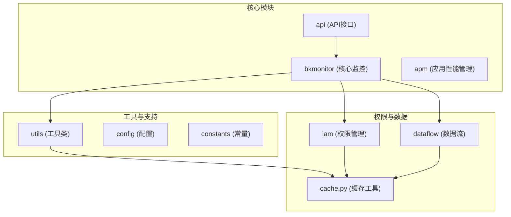
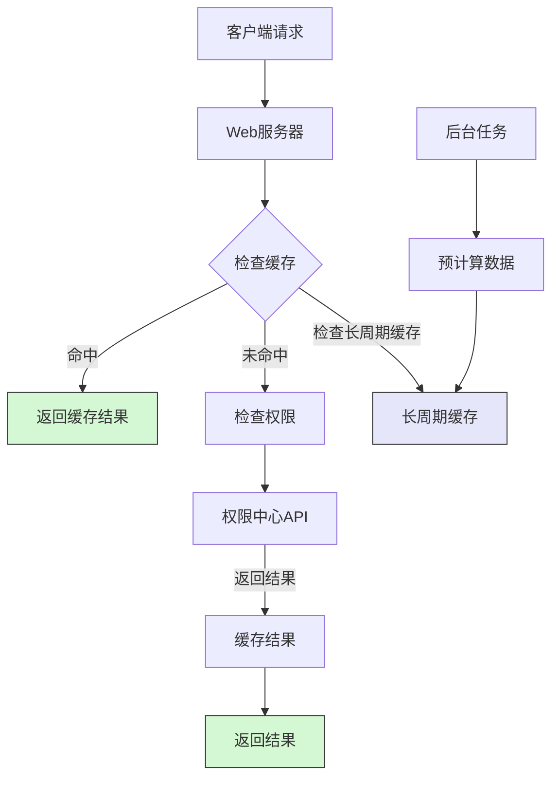
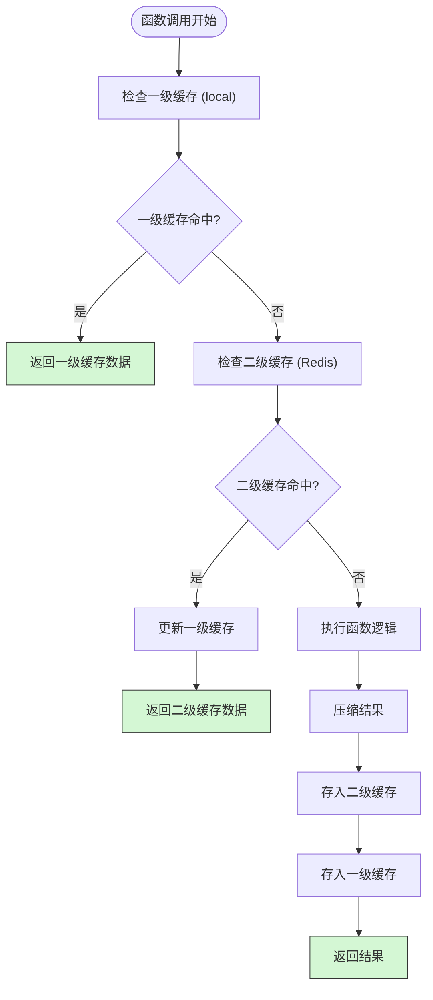
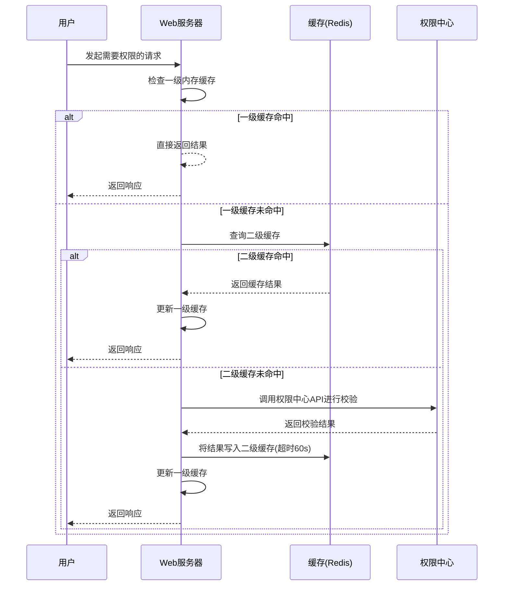
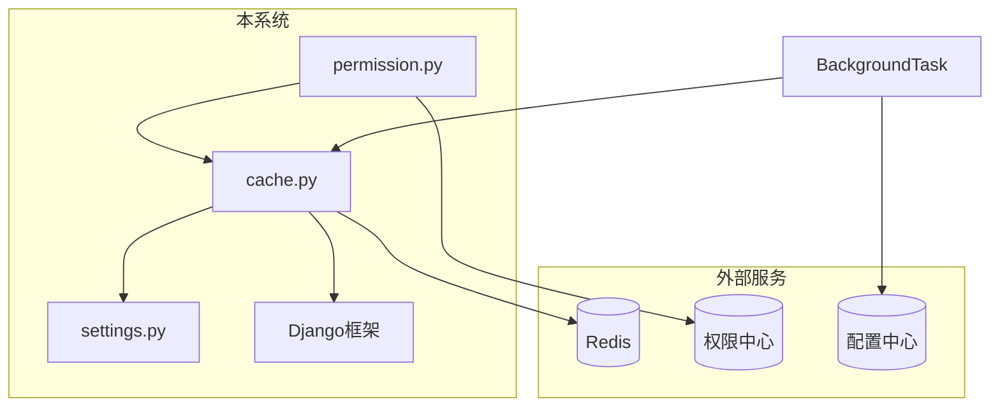

# 性能优化方案

<cite>
**本文档引用的文件**   
- [cache.py](file://bkmonitor\bkmonitor\utils\cache.py)
- [permission.py](file://bkmonitor\bkmonitor\iam\permission.py)
</cite>

## 目录
1. [简介](#简介)
2. [项目结构](#项目结构)
3. [核心组件](#核心组件)
4. [架构概述](#架构概述)
5. [详细组件分析](#详细组件分析)
6. [依赖分析](#依赖分析)
7. [性能考虑](#性能考虑)
8. [故障排除指南](#故障排除指南)
9. [结论](#结论)

## 简介
本文档全面介绍了蓝鲸监控平台中权限继承性能优化的详细方案，重点阐述了权限缓存策略和预计算机制。文档详细解释了缓存的存储结构、失效策略和更新机制，并说明了预计算的触发时机和执行流程。同时，提供了关键的性能监控指标（如缓存命中率、计算耗时）和调优建议，为开发者提供了自定义优化策略的扩展点和配置方法。

## 项目结构
蓝鲸监控平台（bk-monitor）是一个功能复杂的监控系统，其项目结构体现了清晰的模块化设计。核心功能模块包括`ai_agent`、`bkmonitor`、`api`、`apm`等，其中`bkmonitor`是核心监控模块，包含了权限管理（iam）、数据流（dataflow）、策略（strategy）等子系统。`utils`目录下的工具类，特别是`cache.py`，为整个系统提供了关键的缓存支持。

**Diagram sources**
- [project_structure](file://workspace_path)

**Section sources**
- [project_structure](file://workspace_path)

## 核心组件
本文档的核心是分析权限继承的性能优化，主要涉及两个关键组件：`bkmonitor.utils.cache`模块提供的缓存框架和`bkmonitor.iam.permission`模块实现的权限校验逻辑。`cache.py`定义了灵活的缓存策略和多级缓存机制，而`permission.py`则利用这些机制来优化权限查询性能，避免了对权限中心（IAM）的频繁调用。

**Section sources**
- [cache.py](file://bkmonitor\bkmonitor\utils\cache.py)
- [permission.py](file://bkmonitor\bkmonitor\iam\permission.py)

## 架构概述
系统的性能优化架构围绕着“缓存”和“预计算”两大核心思想构建。当用户发起一个需要权限校验的请求时，系统首先会检查多级缓存（内存缓存和分布式缓存），如果命中则直接返回结果，避免了昂贵的远程API调用。对于读操作，权限中心的响应结果会被自动缓存。此外，系统通过后台任务对一些高频、低变的数据（如CMDB数据）进行预计算和长周期缓存，从根本上减少了实时计算的压力。

**Diagram sources**
- [cache.py](file://bkmonitor\bkmonitor\utils\cache.py#L120-L150)
- [permission.py](file://bkmonitor\bkmonitor\iam\permission.py#L300-L310)

## 详细组件分析
### 缓存策略分析
权限缓存的核心是`bkmonitor.utils.cache`模块。它提供了一个强大的装饰器`using_cache`，可以轻松地为任何函数添加缓存功能。

#### 缓存存储结构与多级缓存机制
该模块实现了创新的两级缓存机制，极大地提升了性能。
- **一级缓存（Local Cache）**：基于Django的`local`对象，作用域为单次请求（线程）。在同一个HTTP请求中，对同一数据的多次访问会直接命中一级缓存，避免了重复的序列化/反序列化开销。
- **二级缓存（Distributed Cache）**：基于Redis等分布式缓存后端，作用域为整个应用。当一级缓存未命中时，会查询二级缓存。

**Diagram sources**
- [cache.py](file://bkmonitor\bkmonitor\utils\cache.py#L120-L150)

#### 缓存键（Key）生成策略
缓存键的生成非常精细，确保了数据的隔离性和唯一性。
- **前缀**：`web_cache`，标识这是一个Web层的缓存。
- **缓存类型**：来自`CacheType`枚举，如`biz`、`host`等，用于区分不同业务的缓存。
- **函数标识**：由`func_key_generator`生成，通常是`模块名.函数名`。
- **参数摘要**：使用`count_md5`对函数的`args`和`kwargs`进行哈希，确保不同参数的调用结果被分别缓存。
- **用户标识**：如果`user_related=True`，则包含用户名，实现用户级别的数据隔离。
- **语言标识**：根据当前语言环境（`zh-hans`或`en`）进行区分。

最终的缓存键格式为：`web_cache:{缓存类型}:{函数标识}:{参数摘要}[用户名]语言`。

**Section sources**
- [cache.py](file://bkmonitor\bkmonitor\utils\cache.py#L100-L120)

### 预计算机制分析
预计算机制主要体现在对`CC_CACHE_ALWAYS`这类长周期缓存的使用上。系统通过后台的周期性任务（cron worker）主动刷新这些缓存，而不是在用户请求时才去计算。

#### 触发时机与执行流程
1.  **后台任务触发**：一个名为`bk-monitor-alarm-api-cron-worker`的后台进程会定期运行。
2.  **数据拉取与计算**：该任务会主动调用CMDB等外部系统的API，拉取最新的数据（如业务、主机、集群信息）。
3.  **结果预计算**：对拉取的数据进行必要的处理和计算。
4.  **写入长周期缓存**：将预计算的结果写入`CC_CACHE_ALWAYS`等缓存中，其超时时间长达1小时。
5.  **用户请求**：当用户发起相关请求时，系统可以直接从这个“已准备就绪”的缓存中获取数据，响应速度极快。

这种机制将计算压力从用户请求的“热路径”转移到了后台的“冷路径”，保证了前端服务的高响应性。

**Section sources**
- [cache.py](file://bkmonitor\bkmonitor\utils\cache.py#L316)
- [comment in cache.py](file://bkmonitor\bkmonitor\utils\cache.py#L318-L320)

### 权限校验流程分析
`bkmonitor.iam.permission`模块是权限校验的入口，它巧妙地利用了上述缓存机制。

#### 缓存失效策略与更新机制
- **失效策略**：
    - **基于超时**：每个`CacheTypeItem`都定义了`timeout`，缓存数据在指定时间后自动失效。例如，`DB_CACHE`的超时时间为3分钟。
    - **手动清除**：`InstanceCache`类提供了`clear()`方法，可以在特定事件（如配置变更）后手动清除缓存。
- **更新机制**：
    - **写时更新**：当函数执行后，其返回值会通过`set_value`方法写入缓存。
    - **强制刷新**：`UsingCache`装饰器提供了`refresh`模式，可以强制绕过缓存，重新执行函数并更新缓存。

在`permission.py`中，`is_allowed`方法对读操作（`is_read_action`）使用了`is_allowed_with_cache`，这会自动利用缓存，而写操作则直接调用，保证了数据的实时性。

**Diagram sources**
- [cache.py](file://bkmonitor\bkmonitor\utils\cache.py#L120-L200)
- [permission.py](file://bkmonitor\bkmonitor\iam\permission.py#L250-L300)

## 依赖分析
本性能优化方案的实现依赖于多个核心模块和外部服务。
- **内部依赖**：
    - `Django`框架：提供基础的`cache`和`local`对象。
    - `settings`模块：定义了各种缓存的超时时间（如`CACHE_BIZ_TIMEOUT`）。
    - `bkm_space`模块：提供空间（Space）相关的API，其结果也被缓存。
- **外部依赖**：
    - **Redis**：作为分布式缓存后端，存储二级缓存数据。
    - **权限中心 (IAM)**：提供最终的权限校验服务，是缓存的源头。
    - **配置中心 (CC)**：提供业务、主机等配置数据，是预计算的主要数据源。

**Diagram sources**
- [cache.py](file://bkmonitor\bkmonitor\utils\cache.py)
- [permission.py](file://bkmonitor\bkmonitor\iam\permission.py)

## 性能考虑
### 性能监控指标
为了有效监控和调优缓存性能，应关注以下关键指标：
- **缓存命中率**：这是最核心的指标。高命中率（>90%）表明缓存策略有效。可以通过在`get_value`方法中添加计数器来统计命中与未命中的次数。
- **计算耗时**：对比使用缓存和不使用缓存时的函数执行时间。理想情况下，命中缓存的耗时应远低于直接调用API的耗时。
- **缓存大小与内存占用**：监控Redis实例的内存使用情况，防止缓存占用过多内存导致性能下降。
- **缓存写入/读取频率**：了解缓存的使用热点，有助于优化缓存策略。

### 调优建议
1.  **合理设置超时时间**：根据数据的变更频率设置`timeout`。对于几乎不变的数据（如静态配置），可设置较长的超时时间（如`CC_CACHE_ALWAYS`的1小时）；对于频繁变更的数据，应缩短超时时间或考虑不缓存。
2.  **优化缓存键**：确保缓存键的生成逻辑高效，避免使用过长或复杂的键。
3.  **启用压缩**：对于较大的缓存值，启用`compress=True`可以显著减少网络传输和内存占用。
4.  **监控后台任务**：确保`bk-monitor-alarm-api-cron-worker`等后台任务稳定运行，它们是预计算机制的基石。
5.  **使用合适的缓存类型**：选择正确的`CacheType`，例如，用户相关的数据使用`user_related=True`，避免数据污染。

## 故障排除指南
- **问题：权限变更后长时间不生效**。
  - **原因**：很可能是`CC_CACHE_ALWAYS`等长周期缓存未被正确刷新。
  - **排查**：检查`bk-monitor-alarm-api-cron-worker`进程是否在正常运行，查看其日志是否有错误。
- **问题：缓存命中率低**。
  - **原因**：可能是缓存键设计不合理，导致缓存未被有效复用；或是超时时间设置过短。
  - **排查**：检查缓存键的生成逻辑，确认`user_related`等参数设置是否正确；分析业务逻辑，看是否有大量唯一性参数导致缓存碎片化。
- **问题：Redis内存占用过高**。
  - **原因**：缓存数据量过大或存在内存泄漏。
  - **排查**：使用Redis的`INFO`命令或`redis-cli --bigkeys`工具分析大key；检查是否有未设置超时的缓存。

**Section sources**
- [cache.py](file://bkmonitor\bkmonitor\utils\cache.py#L170-L180)
- [comment in cache.py](file://bkmonitor\bkmonitor\utils\cache.py#L318-L320)

## 结论
本文档详细阐述了蓝鲸监控平台在权限继承方面的性能优化方案。通过引入多级缓存（内存+Redis）和后台预计算机制，系统成功地将昂贵的权限校验和数据查询操作从用户请求的主路径中剥离，极大地提升了系统的响应速度和整体性能。`bkmonitor.utils.cache`模块提供了一个灵活、可配置的缓存框架，而`bkmonitor.iam.permission`模块则有效地利用了这一框架。开发者可以通过调整`CacheType`的超时时间、配置后台任务和监控关键性能指标来进一步优化系统性能。