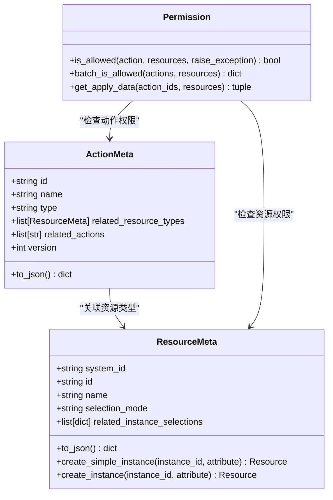
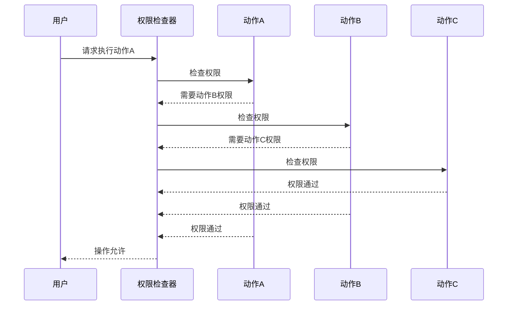
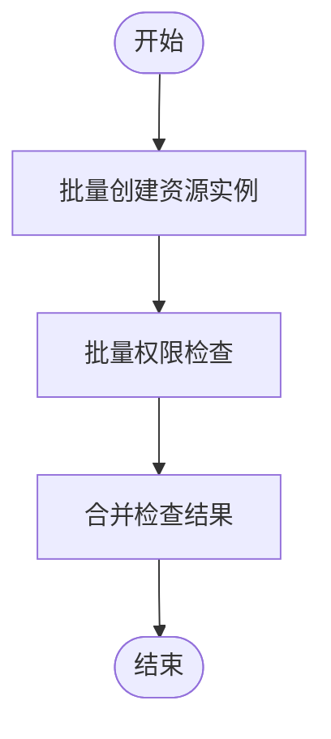

# 权限叠加策略

<cite>
**本文档引用的文件**
- [action.py](file://bkmonitor/bkmonitor/iam/action.py)
- [resource.py](file://bkmonitor/bkmonitor/iam/resource.py)
- [drf.py](file://bkmonitor/bkmonitor/iam/drf.py)
- [strategy.py](file://bkmonitor/bkmonitor/models/strategy.py)
- [priority.py](file://alarm_backends/service/access/priority.py)
</cite>

## 目录
1. [简介](#简介)
2. [权限系统核心组件](#权限系统核心组件)
3. [权限叠加与继承机制](#权限叠加与继承机制)
4. [权限优先级处理原则](#权限优先级处理原则)
5. [权限叠加计算算法](#权限叠加计算算法)
6. [性能优化建议](#性能优化建议)
7. [自定义叠加策略扩展](#自定义叠加策略扩展)

## 简介
本文档详细阐述了蓝鲸监控平台（BlueKing - Monitor）中权限叠加策略的设计与实现。该策略用于处理多级继承权限的合并规则，解决权限冲突时的优先级问题，并提供高效的权限计算算法。文档深入解析了权限系统的核心组件、继承关系、优先级处理机制以及性能优化方案，为开发者提供全面的技术指导和扩展接口。

## 权限系统核心组件

权限系统由动作（Action）、资源（Resource）和权限（Permission）三大核心组件构成。动作定义了用户可执行的操作，资源定义了操作的目标对象，权限则管理动作与资源之间的关联关系。



**图示来源**
- [action.py](file://bkmonitor/bkmonitor/iam/action.py#L1-L621)
- [resource.py](file://bkmonitor/bkmonitor/iam/resource.py#L0-L213)
- [drf.py](file://bkmonitor/bkmonitor/iam/drf.py#L0-L338)

**本节来源**
- [action.py](file://bkmonitor/bkmonitor/iam/action.py#L1-L621)
- [resource.py](file://bkmonitor/bkmonitor/iam/resource.py#L0-L213)

## 权限叠加与继承机制

权限系统支持多级继承，通过`related_actions`字段定义动作之间的依赖关系。当用户拥有某个动作的权限时，会自动继承其所有相关动作的权限。

### 继承关系解析
`fetch_related_actions`函数递归获取指定动作的所有依赖动作，形成权限继承链。该函数确保权限检查时能够完整地评估所有相关权限。

```python
def fetch_related_actions(actions: list[ActionMeta | str]) -> dict[str, ActionMeta]:
    """
    递归获取 action 动作依赖列表
    """
    actions = [get_action_by_id(action) for action in actions]

    def fetch_related_actions_recursive(_action: ActionMeta):
        _related_actions = {}
        for related_action_id in _action.related_actions:
            try:
                related_action = get_action_by_id(related_action_id)
            except ActionNotExistError:
                continue
            _related_actions[related_action_id] = related_action
            _related_actions.update(fetch_related_actions_recursive(related_action))
        return _related_actions

    related_actions = {}
    for action in actions:
        related_actions.update(fetch_related_actions_recursive(action))

    # 剔除根节点本身
    for action in actions:
        related_actions.pop(action.id, None)

    return related_actions
```

### 权限冲突处理
当不同层级的权限发生冲突时，系统遵循以下原则：
- **显式拒绝优先**：如果任何层级的权限明确拒绝某个操作，则该操作被拒绝。
- **最近继承优先**：在没有显式拒绝的情况下，采用最近继承的权限作为最终决策。



**图示来源**
- [action.py](file://bkmonitor/bkmonitor/iam/action.py#L400-L621)
- [drf.py](file://bkmonitor/bkmonitor/iam/drf.py#L0-L338)

**本节来源**
- [action.py](file://bkmonitor/bkmonitor/iam/action.py#L400-L621)

## 权限优先级处理原则

权限系统采用多层次的优先级处理机制，确保在复杂场景下能够做出正确的权限决策。

### 优先级层级
1. **显式拒绝**：最高优先级，一旦出现即生效。
2. **最近继承**：次高优先级，在无显式拒绝时采用。
3. **资源范围**：基于资源的粒度进行优先级判断。
4. **时间戳**：基于权限创建或更新的时间进行判断。

### 优先级计算
权限优先级的计算遵循以下算法：
1. 首先检查是否存在显式拒绝。
2. 如果没有显式拒绝，则查找最近继承的权限。
3. 根据资源范围和时间戳进行最终决策。

```python
def is_inhibited(self, record: Union[DataRecord, EventRecord], item: Item) -> bool:
    """
    判断数据点是否被抑制，同时记录需要更新的优先级信息
    """
    now_timestamp = time.time()

    if isinstance(record, DataRecord):
        dimensions_md5 = record.record_id.split(".")[0]
    else:
        dimensions_md5 = record.md5_dimension
    strategy_priority = item.strategy.priority

    # 如果没有优先级信息，则更新优先级信息
    priority = self.priority_cache.get(dimensions_md5)
    if not priority:
        # 如果策略优先级为0，则不更新优先级信息，因为它已经是最小值了，没有存储的意义，减少内存占用
        if strategy_priority:
            self.need_update[dimensions_md5] = "{}:{}".format(strategy_priority, now_timestamp)
            self.priority_cache[dimensions_md5] = "{}:{}".format(strategy_priority, now_timestamp)
        return False

    priority, timestamp = priority.split(":")

    interval = item.strategy.get_interval()

    # 如果过期或优先级更高，则更新优先级信息
    if float(timestamp) + interval * 5 < now_timestamp or int(priority) <= strategy_priority:
        # 如果策略优先级为0，则不更新优先级信息，因为它已经是最小值了，没有存储的意义，减少内存占用
        if strategy_priority:
            self.need_update[dimensions_md5] = "{}:{}".format(strategy_priority, now_timestamp)
            self.priority_cache[dimensions_md5] = "{}:{}".format(strategy_priority, now_timestamp)
        return False

    return True
```

**本节来源**
- [priority.py](file://alarm_backends/service/access/priority.py#L0-L158)
- [strategy.py](file://bkmonitor/bkmonitor/models/strategy.py#L370-L569)

## 权限叠加计算算法

权限叠加的计算算法是系统性能的关键。本节详细解析算法的实现逻辑和优化策略。

### 算法流程
1. **批量创建资源实例**：使用`batch_create_instance`函数批量创建资源实例，减少数据库查询次数。
2. **批量权限检查**：使用`batch_is_allowed`函数进行批量权限检查，提高效率。
3. **结果合并**：将批量检查的结果合并到原始数据中。

```python
def filter_data_by_permission(
    data: list[dict] | dict,
    actions: list[ActionMeta],
    resource_meta: ResourceMeta,
    id_field: Callable[[dict], str] = lambda item: item["id"],
    always_allowed: Callable[[dict], bool] = lambda item: False,
    instance_create_func: Callable[[dict], Resource] | None = None,
    mode: Literal["any", "all", "insert"] = "any",
    username: str | None = None,
) -> list[dict]:
    """
    根据权限过滤数据
    :param mode: 过滤模式，"any" 表示只要有一个权限通过就返回，"all" 表示所有权限通过才返回, "insert" 表示插入权限信息，但不过滤数据
    """
    if isinstance(data, dict):
        data = [data]

    resources = []
    for item in data:
        if not id_field(item):
            continue
        attribute = extract_attribute(item)

        if instance_create_func:
            resources.append([instance_create_func(item)])
        else:
            resources.append([resource_meta.create_simple_instance(instance_id=id_field(item), attribute=attribute)])

    if not resources:
        return []

    # 批量鉴权
    permission_result = Permission(username=username, bk_tenant_id=get_request_tenant_id()).batch_is_allowed(
        actions, resources
    )

    allowed_data = []
    for item in data:
        # 获取实例ID
        origin_instance_id = id_field(item)
        if not origin_instance_id:
            continue
        instance_id = str(origin_instance_id)

        # 插入权限信息
        if mode == "insert":
            item["permission"] = permission_result[instance_id]
            if always_allowed(item):
                for action_id in item["permission"]:
                    item["permission"][action_id] = True
            allowed_data.append(item)
            continue

        # 过滤数据
        if mode == "any":
            filter_func = any
        else:
            filter_func = all

        if always_allowed(item) or filter_func(permission_result[instance_id].values()):
            allowed_data.append(item)

    return allowed_data
```



**图示来源**
- [drf.py](file://bkmonitor/bkmonitor/iam/drf.py#L200-L338)

**本节来源**
- [drf.py](file://bkmonitor/bkmonitor/iam/drf.py#L200-L338)

## 性能优化建议

为确保权限系统的高性能运行，建议采取以下优化措施：

### 缓存策略
1. **内存缓存**：使用`lru_cache_with_ttl`装饰器对频繁调用的方法进行内存缓存。
2. **Redis缓存**：将权限检查结果存储在Redis中，减少数据库查询。

### 批量处理
1. **批量创建**：使用`batch_create_instance`函数批量创建资源实例。
2. **批量检查**：使用`batch_is_allowed`函数进行批量权限检查。

### 异步处理
对于耗时较长的权限检查操作，建议使用异步任务处理，避免阻塞主线程。

```python
def batch_create_instance(
    result_list: list,
    resource_meta: ResourceMeta,
    id_field: Callable = lambda item: item["id"],
    instance_create_func: Callable[[dict], Resource] | None = None,
):
    """
    批量创建实例
    """
    resources = []
    futures = []
    pool = ThreadPool()
    for item in result_list:
        if not id_field(item):
            continue
        attribute = extract_attribute(item)
        if instance_create_func:
            future = futures.append(pool.apply_async(instance_create_func, kwds=item))
        else:
            kwargs = {"instance_id": id_field(item), "attribute": attribute}
            future = futures.append(pool.apply_async(resource_meta.create_simple_instance, kwds=kwargs))
        futures.append(future)

    for future in futures:
        try:
            resources.append([future.get()])
        except Exception as e:  # pylint: disable=broad-except
            logger.error(f"[APM] batch_create_instance error: {e}")

    return resources
```

**本节来源**
- [drf.py](file://bkmonitor/bkmonitor/iam/drf.py#L200-L338)
- [priority.py](file://alarm_backends/service/access/priority.py#L0-L158)

## 自定义叠加策略扩展

开发者可以通过以下方式扩展权限叠加策略：

### 自定义权限检查器
继承`IAMPermission`类，实现自定义的权限检查逻辑。

```python
class CustomPermission(IAMPermission):
    def has_permission(self, request, view):
        # 自定义权限检查逻辑
        pass
```

### 自定义资源类型
继承`ResourceMeta`类，定义新的资源类型。

```python
class CustomResource(ResourceMeta):
    system_id = settings.BK_IAM_SYSTEM_ID
    id = "custom_resource"
    name = _lazy("自定义资源")
    selection_mode = "instance"
    related_instance_selections = [{"system_id": system_id, "id": "custom_resource_list"}]
```

### 自定义动作类型
在`ActionEnum`中添加新的动作类型。

```python
CUSTOM_ACTION = ActionMeta(
    id="custom_action",
    name=_("自定义操作"),
    name_en="Custom Action",
    type="manage",
    related_resource_types=[CUSTOM_RESOURCE],
    related_actions=[VIEW_BUSINESS.id],
    version=1,
)
```

**本节来源**
- [drf.py](file://bkmonitor/bkmonitor/iam/drf.py#L0-L338)
- [resource.py](file://bkmonitor/bkmonitor/iam/resource.py#L0-L213)
- [action.py](file://bkmonitor/bkmonitor/iam/action.py#L1-L621)