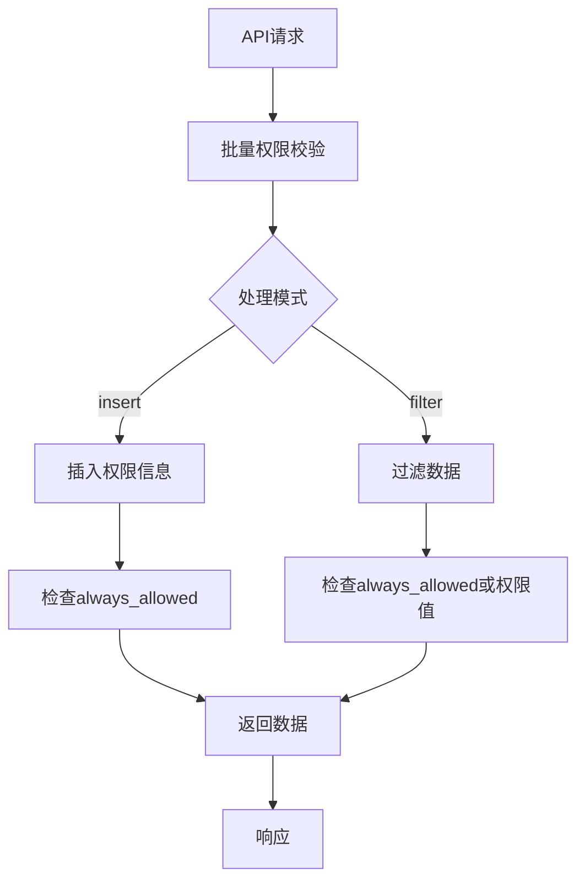
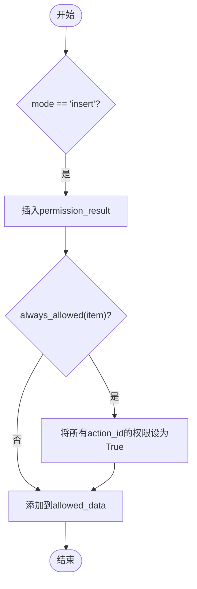
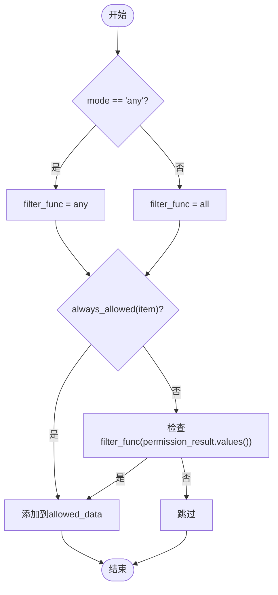
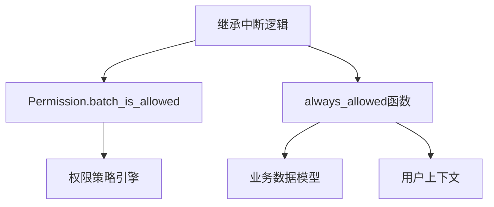

# 继承中断机制

<cite>
**本文档引用的文件**  
- [drf.py](file://bkmonitor/bkmonitor/iam/drf.py#L300-L338)
</cite>

## 目录
1. [引言](#引言)
2. [项目结构](#项目结构)
3. [核心组件](#核心组件)
4. [架构概述](#架构概述)
5. [详细组件分析](#详细组件分析)
6. [依赖分析](#依赖分析)
7. [性能考虑](#性能考虑)
8. [故障排除指南](#故障排除指南)
9. [结论](#结论)

## 引言
本文档旨在全面描述监控系统中权限继承中断机制的实现逻辑。该机制用于在特定条件下中断权限的默认继承行为，实现权限隔离与精细化控制。文档将详细解释权限继承中断的触发条件、实现方式、中断后的权限计算逻辑以及相关配置方法，为开发者提供清晰的技术指导。

## 项目结构
本项目是一个基于Django框架的大型监控系统，采用模块化设计。核心权限管理功能位于`bkmonitor/iam/`目录下，其中`drf.py`文件负责处理与Django REST framework集成的权限校验逻辑。权限继承中断机制作为权限系统的一部分，其核心逻辑嵌入在数据过滤和权限检查流程中。

## 核心组件
权限继承中断机制的核心实现位于`bkmonitor/iam/drf.py`文件中。该机制并非通过一个独立的“中断”函数实现，而是通过在权限校验流程中引入条件判断和数据过滤逻辑，从而达到中断或覆盖默认继承行为的效果。关键组件包括权限校验器（`Permission`类）、数据过滤模式（`mode`参数）以及权限结果的后处理逻辑。

**Section sources**
- [drf.py](file://bkmonitor/bkmonitor/iam/drf.py#L300-L338)

## 架构概述
权限继承中断机制是整个系统权限架构中的一个关键环节。它位于API请求处理流程的权限校验阶段，作用于数据返回之前。当API请求需要返回一组资源数据时，系统会先进行批量权限校验，然后根据配置的模式对结果进行处理，最终决定哪些数据可以返回给用户。

**Diagram sources**
- [drf.py](file://bkmonitor/bkmonitor/iam/drf.py#L300-L338)

## 详细组件分析
### 权限继承中断逻辑分析
权限继承中断机制的实现逻辑主要体现在`drf.py`文件中的数据处理流程。其核心思想是通过不同的`mode`（模式）来控制权限信息如何与数据集结合，从而实现对继承行为的控制。

#### 权限信息插入模式 (insert)
当`mode`为`"insert"`时，系统会将完整的权限校验结果直接插入到每条数据项中。这是最直接的权限信息暴露方式。然而，该模式包含一个关键的中断逻辑：`always_allowed`函数。

**Diagram sources**
- [drf.py](file://bkmonitor/bkmonitor/iam/drf.py#L300-L338)

在此模式下，如果`always_allowed(item)`函数返回`True`，则会**中断**正常的权限校验结果，强制将该数据项的所有权限（`action_id`）都设置为`True`。这相当于完全中断了基于角色或策略的权限继承，实现了最高级别的权限豁免。`always_allowed`函数的实现逻辑（未在搜索结果中显示）是判断是否触发中断的关键，它可能基于数据项的特定属性（如所有者、状态等）来决定。

#### 数据过滤模式 (any/all)
当`mode`为`"any"`或`"all"`时，系统会根据权限校验结果来过滤数据集，决定哪些数据项可以返回给用户。此模式同样包含中断逻辑。

**Diagram sources**
- [drf.py](file://bkmonitor/bkmonitor/iam/drf.py#L300-L338)

在此模式下，如果`always_allowed(item)`返回`True`，则会**中断**后续的权限值检查（`filter_func(permission_result[instance_id].values())`），直接将该数据项加入返回结果。这同样是一种权限继承的中断，它允许特定的数据项无视其常规权限配置，直接被授权访问。

### 中断后权限计算的特殊处理逻辑
一旦触发`always_allowed`条件，权限计算逻辑就会发生根本性变化：
1.  **在`insert`模式下**：权限计算结果被完全覆盖，所有操作（`action_id`）的权限值都被强制设为`True`。
2.  **在`any/all`模式下**：权限计算流程被提前终止，系统不再检查`permission_result`的具体值，而是直接认定该数据项是“被允许的”。

这种处理逻辑确保了在特殊情况下，权限系统可以快速、确定地做出放行决策，而不受复杂继承规则的影响。

### 中断状态的持久化存储方案
根据现有代码分析，`always_allowed`函数的判断逻辑很可能是基于数据项本身的属性（如`item`的某个字段）或上下文信息（如当前用户、请求参数）进行的实时计算。这意味着“中断状态”本身**并未作为一种独立的状态被持久化存储**。相反，持久化的是能够触发`always_allowed`条件的**原始数据或配置**。例如，如果一个数据项的`owner`字段等于当前用户，则`always_allowed`可能返回`True`。此时，`owner`字段的值就是持久化的关键信息，而“中断状态”是根据这个持久化信息在运行时动态计算得出的。

### 配置继承中断规则的方法和使用场景示例
#### 配置方法
开发者无法直接配置“继承中断规则”，而是通过实现`always_allowed`函数的逻辑来间接实现。这通常需要修改或扩展权限校验器的代码。`always_allowed`函数的实现会检查数据项的特定属性，例如：
-   数据项的创建者（`creator`）是否为当前用户。
-   数据项是否处于某种特殊状态（如“草稿”、“公开”）。
-   数据项是否属于某个特定的、被豁免的业务模块。

#### 使用场景示例
1.  **个人资源访问**：用户总是可以查看和编辑自己创建的告警策略或仪表盘，即使这些资源的权限继承自一个限制性更强的父级策略。此时，`always_allowed`会检查`item.creator == current_user`。
2.  **系统级资源豁免**：某些核心的、全局的监控配置（如基础指标定义）可能对所有管理员都开放，不受业务空间权限的限制。`always_allowed`会检查`item.is_global == True`。
3.  **调试与维护模式**：在特定的调试环境下，系统管理员可能需要临时绕过所有权限检查。`always_allowed`可以根据一个全局的调试开关配置返回`True`。

**Section sources**
- [drf.py](file://bkmonitor/bkmonitor/iam/drf.py#L300-L338)

## 依赖分析
权限继承中断机制依赖于系统的核心权限框架，特别是`Permission`类的`batch_is_allowed`方法来获取基础的权限校验结果。同时，它也依赖于Django REST framework的权限校验流程。`always_allowed`函数的实现则可能依赖于具体的业务模型（如`Item`、`Strategy`等）来获取数据项的属性。

**Diagram sources**
- [drf.py](file://bkmonitor/bkmonitor/iam/drf.py#L300-L338)

## 性能考虑
该机制的性能开销主要在于`always_allowed`函数的执行。如果该函数的逻辑过于复杂（例如，涉及多次数据库查询），可能会成为性能瓶颈。最佳实践是确保`always_allowed`的判断逻辑尽可能简单，最好只依赖于数据项中已加载的字段，避免额外的I/O操作。

## 故障排除指南
如果发现权限继承中断机制未按预期工作，应检查以下几点：
1.  **确认`always_allowed`逻辑**：检查`always_allowed`函数的实现，确保其判断条件正确无误。
2.  **检查数据项属性**：验证触发中断的数据项是否具备`always_allowed`函数所期望的属性。
3.  **验证处理模式**：确认API端点使用的`mode`是`"insert"`还是`"any"/"all"`，因为中断的实现方式在这两种模式下有所不同。
4.  **审查权限校验结果**：在调试模式下，检查`permission_result`的原始值，以区分是`always_allowed`生效导致的中断，还是正常的权限校验结果。

**Section sources**
- [drf.py](file://bkmonitor/bkmonitor/iam/drf.py#L300-L338)

## 结论
继承中断机制通过在权限校验流程中引入`always_allowed`这样的短路逻辑，实现了对默认权限继承规则的灵活中断。它不是通过修改继承链本身，而是在运行时动态地覆盖或跳过继承结果。这种设计既保持了权限系统的整体一致性，又为处理特殊情况提供了必要的灵活性。开发者应谨慎使用此机制，确保`always_allowed`的条件定义清晰、安全，以避免产生意外的权限漏洞。