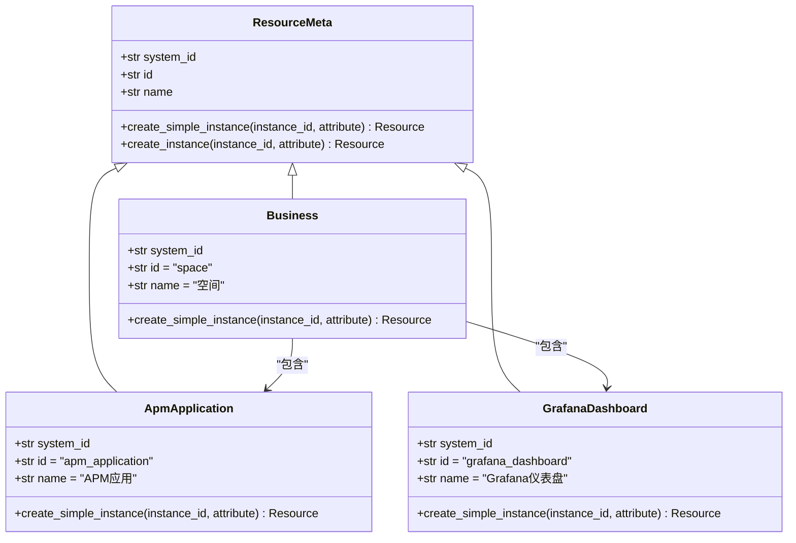
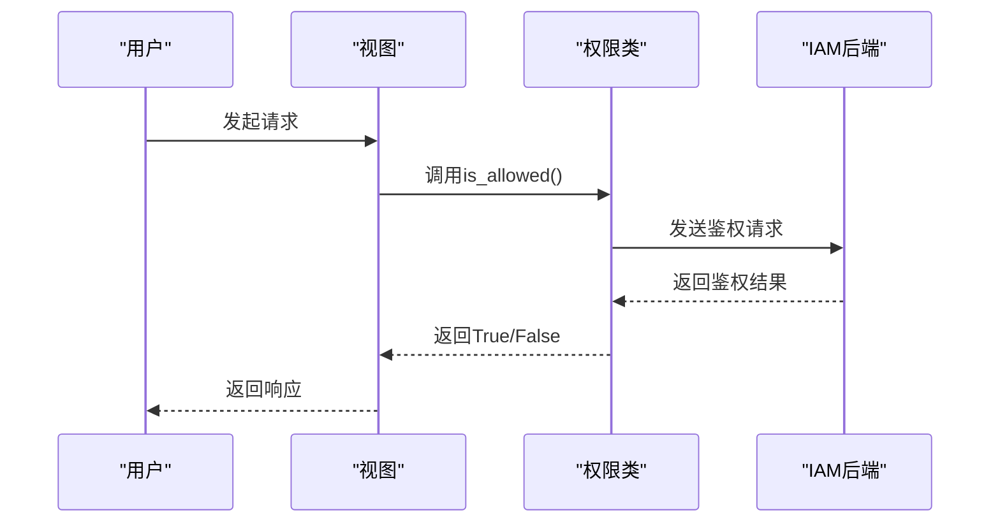
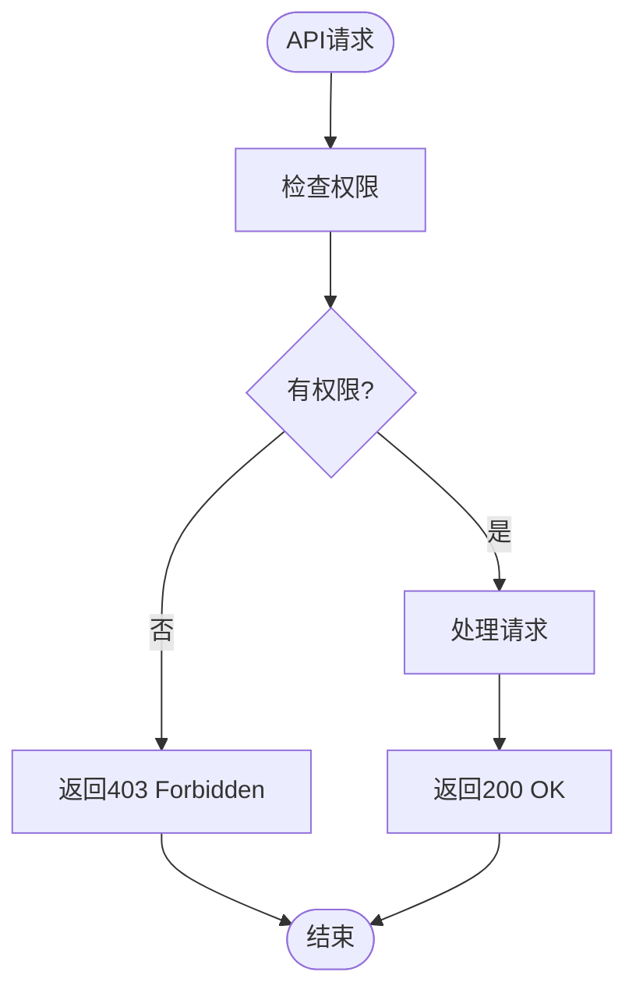
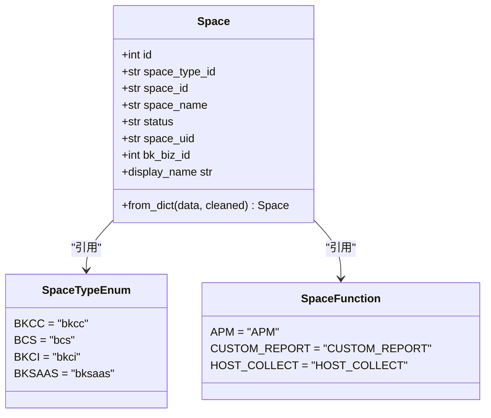
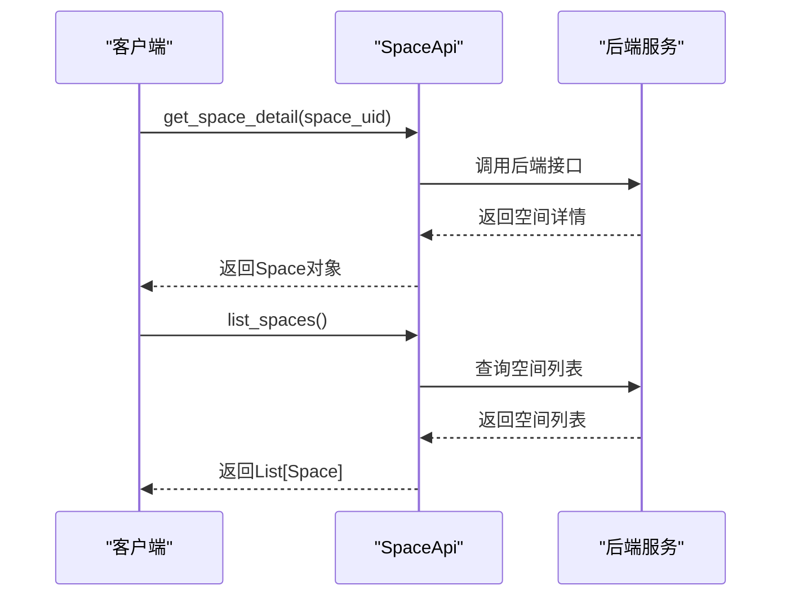
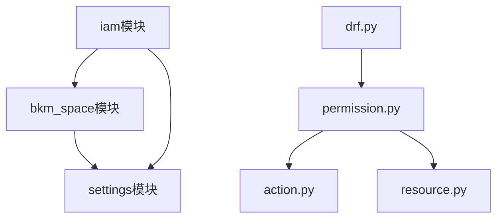

# 继承层级结构

<cite>
**本文档中引用的文件**   
- [resource.py](file://bkmonitor\bkmonitor\iam\resource.py)
- [permission.py](file://bkmonitor\bkmonitor\iam\permission.py)
- [action.py](file://bkmonitor\bkmonitor\iam\action.py)
- [drf.py](file://bkmonitor\bkmonitor\iam\drf.py)
- [api.py](file://bkmonitor\bkm_space\api.py)
- [define.py](file://bkmonitor\bkm_space\define.py)
</cite>

## 目录
1. [简介](#简介)
2. [项目结构](#项目结构)
3. [核心组件](#核心组件)
4. [架构概述](#架构概述)
5. [详细组件分析](#详细组件分析)
6. [依赖分析](#依赖分析)
7. [性能考虑](#性能考虑)
8. [故障排除指南](#故障排除指南)
9. [结论](#结论)

## 简介
本文档全面描述了蓝鲸监控平台（bk-monitor）中权限继承层级的详细结构。该系统通过业务层级、资源层级和组织架构层级的多维度继承关系，实现了精细化的权限控制。文档深入解析了各层级之间的关联方式、继承路径以及数据流转机制，并为开发者提供了层级结构调整的配置方法和最佳实践。

## 项目结构
项目采用模块化设计，核心权限管理功能集中在`bkmonitor/iam`和`bkm_space`模块中。`iam`模块负责权限的定义、检查和继承，而`bkm_space`模块则定义了组织架构和业务空间的模型。

```mermaid
graph TD
subgraph "核心模块"
iam[iam模块]
bkm_space[bkm_space模块]
end
subgraph "iam模块"
resource[resource.py]
permission[permission.py]
action[action.py]
drf[drf.py]
end
subgraph "bkm_space模块"
api[api.py]
define[define.py]
end
iam --> bkm_space : "依赖"
```

**图示来源**
- [resource.py](file://bkmonitor\bkmonitor\iam\resource.py)
- [api.py](file://bkmonitor\bkm_space\api.py)

## 核心组件
系统的核心组件包括权限（Action）、资源（Resource）和空间（Space）。权限定义了用户可以执行的操作，资源是权限作用的对象，而空间则代表了组织架构中的业务单元。三者通过继承关系构成了一个完整的权限管理体系。

**章节来源**
- [action.py](file://bkmonitor\bkmonitor\iam\action.py)
- [resource.py](file://bkmonitor\bkmonitor\iam\resource.py)
- [define.py](file://bkmonitor\bkm_space\define.py)

## 架构概述
系统的权限继承架构基于蓝鲸的IAM（身份与访问管理）体系，通过“空间”作为组织架构的根节点，向下延伸出各种业务资源。权限的继承遵循“自上而下”的原则，即上级空间的权限会自动继承给其下的所有资源。

```mermaid
graph TB
subgraph "组织架构层级"
Space[空间]
end
subgraph "业务层级"
Biz[业务]
end
subgraph "资源层级"
APM[APM应用]
Grafana[仪表盘]
end
Space --> Biz : "包含"
Biz --> APM : "拥有"
Biz --> Grafana : "拥有"
subgraph "权限继承"
ViewBusiness[业务访问]
ViewAPM[查看APM应用]
ViewGrafana[查看仪表盘]
end
ViewBusiness --> ViewAPM : "继承"
ViewBusiness --> ViewGrafana : "继承"
```

**图示来源**
- [resource.py](file://bkmonitor\bkmonitor\iam\resource.py)
- [action.py](file://bkmonitor\bkmonitor\iam\action.py)

## 详细组件分析
### 权限继承机制分析
#### 资源定义与继承
资源是权限继承的基础。每个资源类型都定义了其在继承链中的位置和与其他资源的关系。



**图示来源**
- [resource.py](file://bkmonitor\bkmonitor\iam\resource.py)

#### 权限检查流程
权限检查通过`Permission`类实现，它负责与IAM后端进行通信，验证用户是否拥有执行特定操作的权限。



**图示来源**
- [permission.py](file://bkmonitor\bkmonitor\iam\permission.py)

#### 权限与DRF集成
`drf.py`文件中的类将权限逻辑无缝集成到Django REST Framework中，使得权限检查可以自动应用于API视图。



**图示来源**
- [drf.py](file://bkmonitor\bkmonitor\iam\drf.py)

### 空间与组织架构分析
#### 空间定义
`Space`类定义了组织架构中的基本单元，每个空间都有唯一的类型和ID。



**图示来源**
- [define.py](file://bkmonitor\bkm_space\define.py)

#### 空间API
`SpaceApi`提供了对空间的查询和管理接口，是业务层级继承的入口。



**图示来源**
- [api.py](file://bkmonitor\bkm_space\api.py)

## 依赖分析
系统各组件之间存在紧密的依赖关系。`iam`模块依赖`bkm_space`模块来获取空间信息，而`bkm_space`模块又依赖`settings`等全局配置。



**图示来源**
- [permission.py](file://bkmonitor\bkmonitor\iam\permission.py)
- [api.py](file://bkmonitor\bkm_space\api.py)

## 性能考虑
权限检查是高频操作，系统通过缓存和批量请求来优化性能。例如，`_get_app_simple_info_by_id_or_none`方法使用了内存缓存来提高鉴权性能。

## 故障排除指南
当遇到权限问题时，应首先检查用户是否拥有对应空间的`VIEW_BUSINESS`权限，然后检查具体资源的权限。可以通过日志查看详细的鉴权过程。

**章节来源**
- [permission.py](file://bkmonitor\bkmonitor\iam\permission.py)
- [logger](file://bkmonitor\bkmonitor\iam\permission.py)

## 结论
蓝鲸监控平台的权限继承层级结构设计精巧，通过业务、资源和组织架构三个维度的继承，实现了灵活而强大的权限控制。开发者在进行层级结构调整时，应遵循模块化的设计原则，确保权限继承的清晰和可维护性。