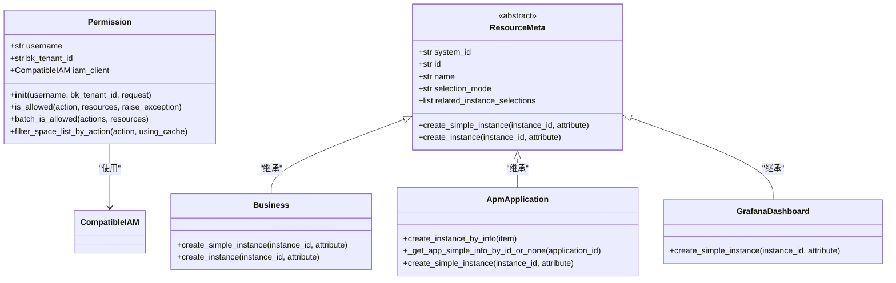
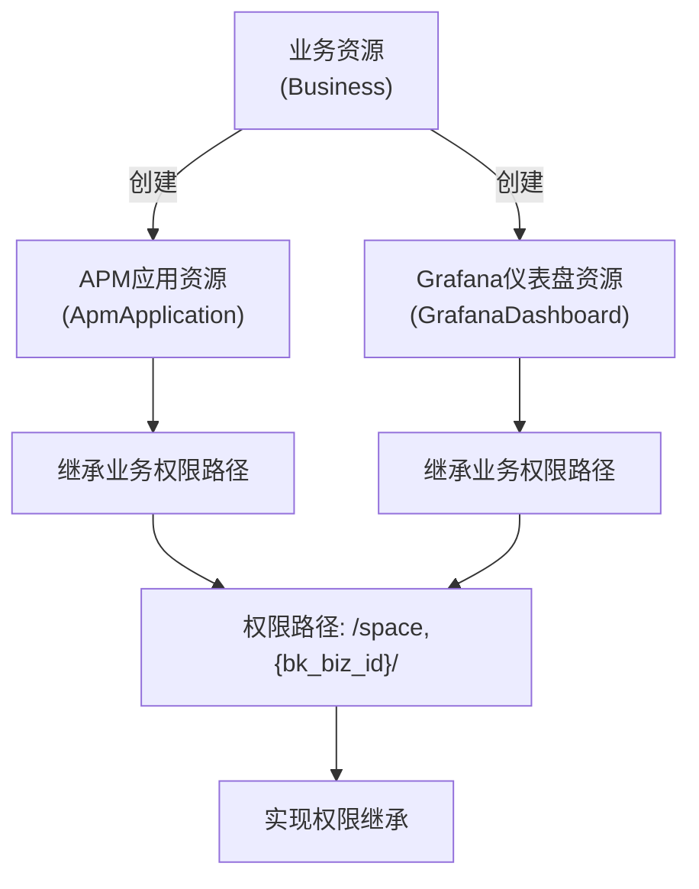
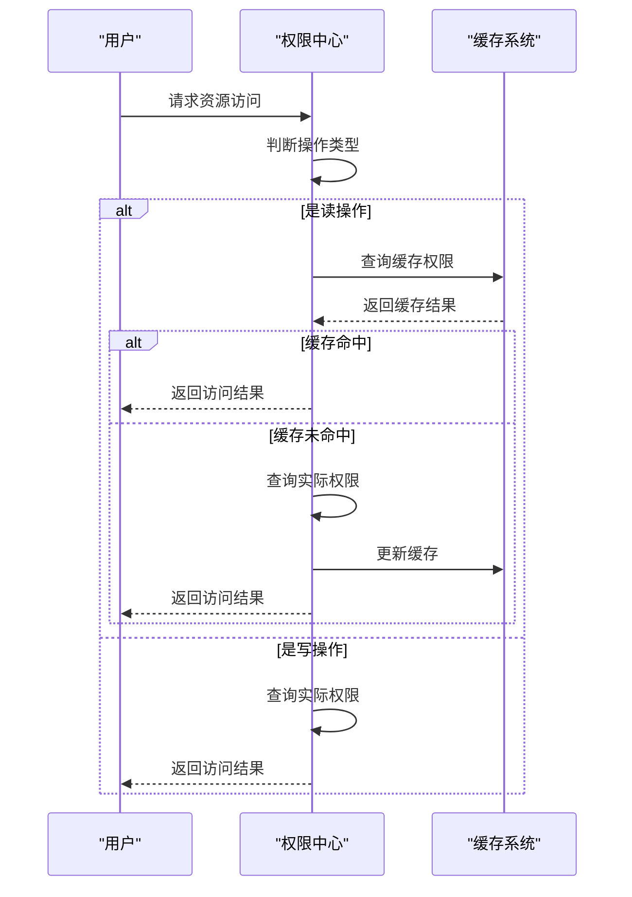
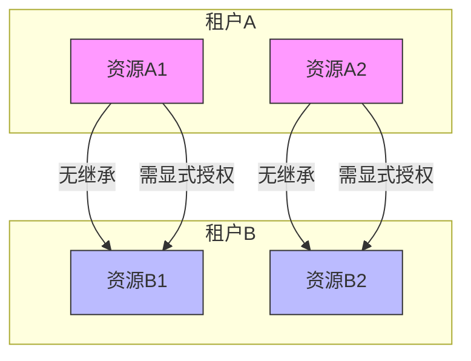
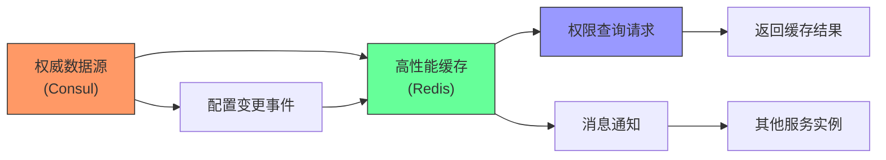
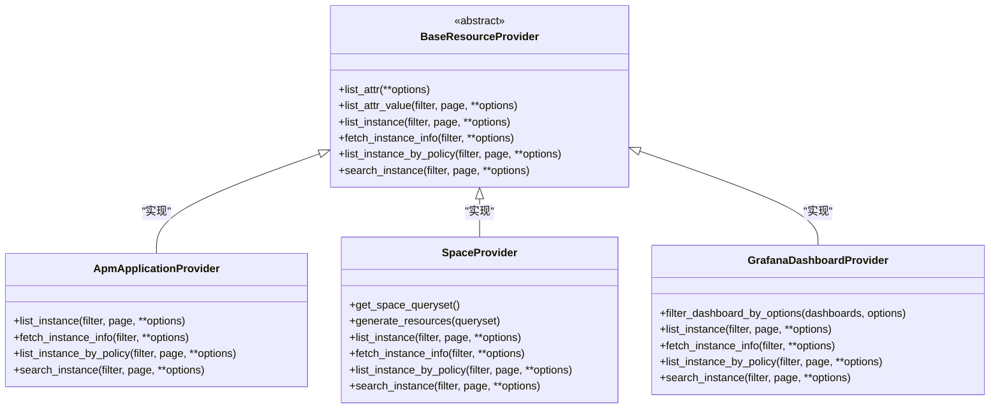

# 继承规则

<cite>
**本文档引用的文件**   
- [permission.py](file://bkmonitor\bkmonitor\iam\permission.py)
- [resource.py](file://bkmonitor\bkmonitor\iam\resource.py)
- [compatible.py](file://bkmonitor\bkmonitor\iam\compatible.py)
- [views.py](file://bkmonitor\packages\monitor_web\iam\views.py)
- [readme.md](file://bkmonitor\alarm_backends\core\api_cache\readme.md)
</cite>

## 目录
1. [引言](#引言)
2. [权限继承机制概述](#权限继承机制概述)
3. [权限继承的层级结构](#权限继承的层级结构)
4. [权限叠加与优先级处理](#权限叠加与优先级处理)
5. [继承中断与权限隔离](#继承中断与权限隔离)
6. [性能优化方案](#性能优化方案)
7. [自定义扩展点与配置方法](#自定义扩展点与配置方法)
8. [结论](#结论)

## 引言
本文档详细阐述了蓝鲸监控平台中权限继承规则的实现原理。系统通过IAM（身份与访问管理）框架实现了复杂的权限继承机制，支持业务层级、资源层级和组织架构层级的多级权限继承。文档深入解析了权限继承的实现逻辑、层级结构、叠加策略、中断规则以及性能优化方案，为开发者提供了全面的技术参考。

## 权限继承机制概述

权限继承机制是蓝鲸监控平台安全体系的核心组成部分，它通过`Permission`类和`ResourceMeta`类协同工作，实现了灵活而强大的权限管理功能。系统基于资源类型和动作ID构建权限策略，通过路径表达式（_bk_iam_path_）实现资源间的继承关系。



**图例来源**
- [permission.py](file://bkmonitor\bkmonitor\iam\permission.py#L100-L517)
- [resource.py](file://bkmonitor\bkmonitor\iam\resource.py#L20-L213)

**本节来源**
- [permission.py](file://bkmonitor\bkmonitor\iam\permission.py#L100-L517)
- [resource.py](file://bkmonitor\bkmonitor\iam\resource.py#L20-L213)

## 权限继承的层级结构

权限继承的层级结构基于资源类型枚举`ResourceEnum`实现，形成了清晰的继承链条。系统定义了三种核心资源类型：业务（Business）、APM应用（ApmApplication）和Grafana仪表盘（GrafanaDashboard），它们之间通过路径表达式建立继承关系。

### 业务层级继承
业务层级继承以`Business`资源为核心，通过`bk_biz_id`标识业务实例。当创建业务资源时，系统会自动为其生成权限路径`/_bk_iam_path_`，格式为`/space,{bk_biz_id}/`，这为下层资源的权限继承提供了基础。

### 资源层级继承
资源层级继承体现在子资源对父资源权限的继承。例如，`ApmApplication`资源在创建时会继承其所属业务的权限路径：

```python
"_bk_iam_path_": f"/{Business.id},{bk_biz_id}/"
```

这种设计确保了APM应用能够继承其所属业务的所有权限，实现了资源间的自然继承。

### 组织架构层级继承
组织架构层级继承通过`Space`（空间）概念实现。系统使用`space_uid`和`bk_biz_id`的映射关系来管理不同类型的组织单元。`SpaceProvider`类负责处理空间资源的查询和权限继承，支持按空间类型、空间ID和空间名称进行搜索和过滤。



**图例来源**
- [resource.py](file://bkmonitor\bkmonitor\iam\resource.py#L128-L187)
- [views.py](file://bkmonitor\packages\monitor_web\iam\views.py#L116-L320)

**本节来源**
- [resource.py](file://bkmonitor\bkmonitor\iam\resource.py#L128-L187)
- [views.py](file://bkmonitor\packages\monitor_web\iam\views.py#L116-L320)

## 权限叠加与优先级处理

权限叠加策略决定了当用户从多个路径获得同一资源的权限时，系统如何处理这些权限。蓝鲸监控平台采用"或"（OR）逻辑进行权限叠加，确保用户只要在任一路径上拥有权限即可访问资源。

### 多级继承时的权限叠加
当系统检测到用户具有多个版本的权限策略时，会将这些策略进行合并。在`CompatibleIAM`类中，系统会同时查询V1和V2版本的权限策略，并将它们组合起来：

```python
if v1_policies:
    if not policies:
        policies = v1_policies
    else:
        # 将两个版本的 action 的策略组合起来
        policies = {
            "op": "OR",
            "content": [policies, v1_policies],
        }
```

### 优先级处理机制
系统采用"显式拒绝优先"的原则处理权限冲突。如果某个策略明确拒绝了某项操作，则该拒绝优先级高于任何允许策略。此外，系统还实现了策略缓存机制，对于读操作权限会进行缓存，以提高性能：

```python
if action.is_read_action():
    # 仅对读权限做缓存
    result = self.iam_client.is_allowed_with_cache(request)
else:
    result = self.iam_client.is_allowed(request)
```



**图例来源**
- [permission.py](file://bkmonitor\bkmonitor\iam\permission.py#L300-L320)
- [compatible.py](file://bkmonitor\bkmonitor\iam\compatible.py#L88-L90)

**本节来源**
- [permission.py](file://bkmonitor\bkmonitor\iam\permission.py#L300-L320)
- [compatible.py](file://bkmonitor\bkmonitor\iam\compatible.py#L88-L90)

## 继承中断与权限隔离

继承中断规则和权限隔离机制是权限系统的重要安全特性，用于防止权限的意外传播和滥用。

### 特殊情况下的继承中断
系统在以下情况下会中断权限继承：
1. **显式权限拒绝**：当策略中包含明确的拒绝规则时，继承链在此处中断。
2. **资源类型变更**：当资源类型发生根本性变化时，系统会重新评估权限，而不是简单继承。
3. **跨租户访问**：不同租户之间的资源访问需要重新授权，不会继承原租户的权限。

### 权限隔离机制
权限隔离通过`bk_tenant_id`（租户ID）实现，确保不同租户之间的权限完全隔离。`ResourceApiDispatcher`类在处理请求时会自动添加租户信息：

```python
def _get_options(self, request):
    options = super()._get_options(request)
    if not options.get("bk_tenant_id"):
        options["bk_tenant_id"] = DEFAULT_TENANT_ID
    return options
```

此外，系统还实现了外部权限管理，通过`ExternalPermission`模型来管理跨空间的权限授予，确保权限隔离的同时支持必要的权限共享。



**图例来源**
- [views.py](file://bkmonitor\packages\monitor_web\iam\views.py#L100-L120)
- [permission.py](file://bkmonitor\bkmonitor\iam\permission.py#L484-L516)

**本节来源**
- [views.py](file://bkmonitor\packages\monitor_web\iam\views.py#L100-L120)
- [permission.py](file://bkmonitor\bkmonitor\iam\permission.py#L484-L516)

## 性能优化方案

为确保权限系统在大规模环境下的高性能运行，系统实现了多种性能优化方案，包括权限缓存策略和预计算机制。

### 权限缓存策略
系统采用分层缓存策略，区分客户端缓存和服务端缓存：

- **客户端缓存**：使用`cache_type`配置，基于用户名进行缓存，适用于用户相关的接口。
- **服务端缓存**：使用`backend_cache_type`配置，适用于用户无关的接口或定时任务。

```python
class HostPerformanceResource(CacheResource):
    cache_type = CacheType.HOST
    backend_cache_type = CacheType.CC_BACKEND
```

这种分离设计确保了前端对信息时效性的高要求，同时为后端定时任务提供了稳定的缓存服务。

### 预计算机制
系统通过`lru_cache_with_ttl`装饰器实现内存缓存，对频繁查询但不常变更的数据进行预计算和缓存：

```python
@lru_cache_with_ttl(maxsize=128, ttl=60 * 60, decision_to_drop_func=lambda v: v is None)
def _get_app_simple_info_by_id_or_none(cls, application_id: str) -> Optional[Dict[str, Any]]:
    # 获取应用概要信息，不存在则返回 None。
    # 应用概要信息不会修改，此处给 60 min 的内存缓存，以提高整体鉴权性能。
```

此外，系统还采用了Consul作为权威数据源和配置中心，Redis作为高性能缓存和消息中心的双写设计，确保了配置的一致性和可靠性。



**图例来源**
- [readme.md](file://bkmonitor\alarm_backends\core\api_cache\readme.md#L51-L68)
- [resource.py](file://bkmonitor\bkmonitor\iam\resource.py#L187-L200)

**本节来源**
- [readme.md](file://bkmonitor\alarm_backends\core\api_cache\readme.md#L51-L68)
- [resource.py](file://bkmonitor\bkmonitor\iam\resource.py#L187-L200)

## 自定义扩展点与配置方法

系统提供了多个扩展点，允许开发者根据业务需求自定义权限继承规则。

### 扩展点实现
系统在`extend/`目录下提供了接口扩展机制，开发者可以通过创建新的资源提供者（ResourceProvider）来扩展权限系统：

```python
class BaseResourceProvider(ResourceProvider, metaclass=abc.ABCMeta):
    def list_attr(self, **options):
        return ListResult(results=[], count=0)

    def list_attr_value(self, filter, page, **options):
        return ListResult(results=[], count=0)
```

开发者可以继承`BaseResourceProvider`并实现相应的方法来支持新的资源类型。

### 配置方法
权限继承规则的配置主要通过以下方式实现：
1. **资源定义**：在`ResourceMeta`的子类中定义资源的继承关系和属性。
2. **动作定义**：通过`ActionEnum`定义可继承的动作类型。
3. **系统配置**：在`settings.py`中配置系统级的权限管理参数。

此外，系统还支持通过API动态创建和更新外部权限，提供了`create_or_update_external_permission`等接口：

```python
ResourceRoute(
    "POST", resource.iam.create_or_update_external_permission, endpoint="create_or_update_external_permission"
)
```

这些扩展点和配置方法为系统提供了高度的灵活性和可定制性。



**图例来源**
- [views.py](file://bkmonitor\packages\monitor_web\iam\views.py#L80-L377)
- [README.md](file://bkmonitor\bkmonitor\docs\api\README.md#L7-L10)

**本节来源**
- [views.py](file://bkmonitor\packages\monitor_web\iam\views.py#L80-L377)
- [README.md](file://bkmonitor\bkmonitor\docs\api\README.md#L7-L10)

## 结论
蓝鲸监控平台的权限继承规则通过精心设计的层级结构、灵活的叠加策略、严格的隔离机制和高效的性能优化，构建了一个安全、可靠且高性能的权限管理体系。系统不仅满足了复杂的业务需求，还提供了丰富的扩展点，便于开发者根据实际场景进行定制和优化。通过对`Permission`、`ResourceMeta`等核心组件的深入理解，开发者可以更好地利用这一权限系统，为应用提供坚实的安全保障。