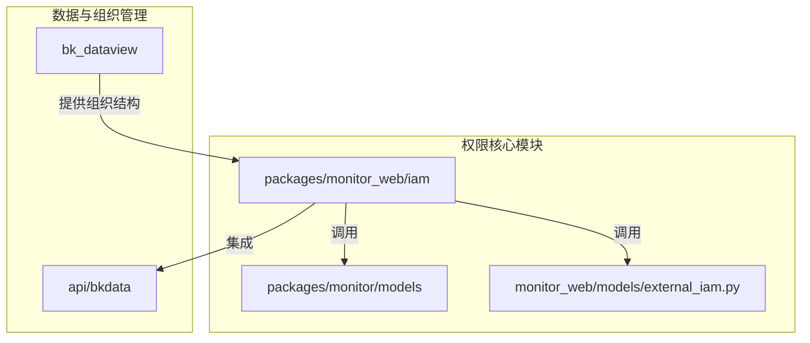
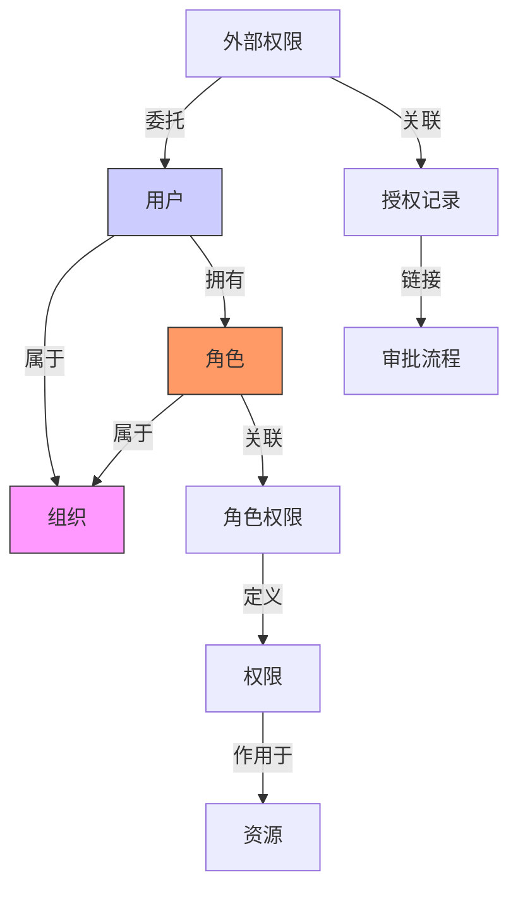
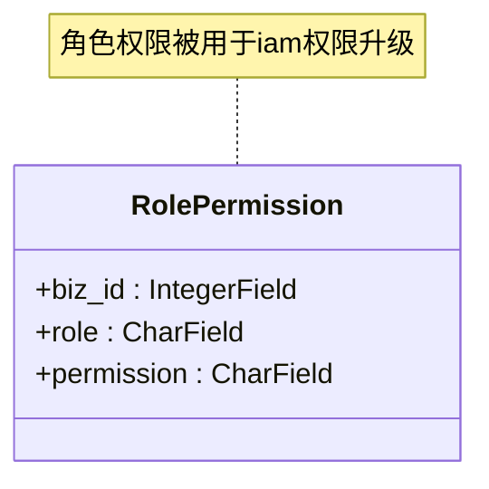
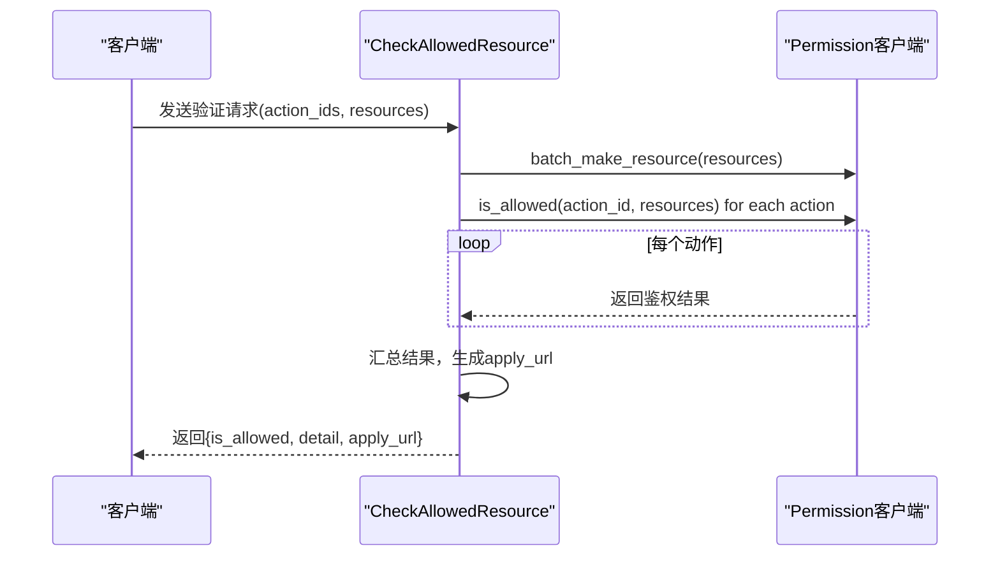
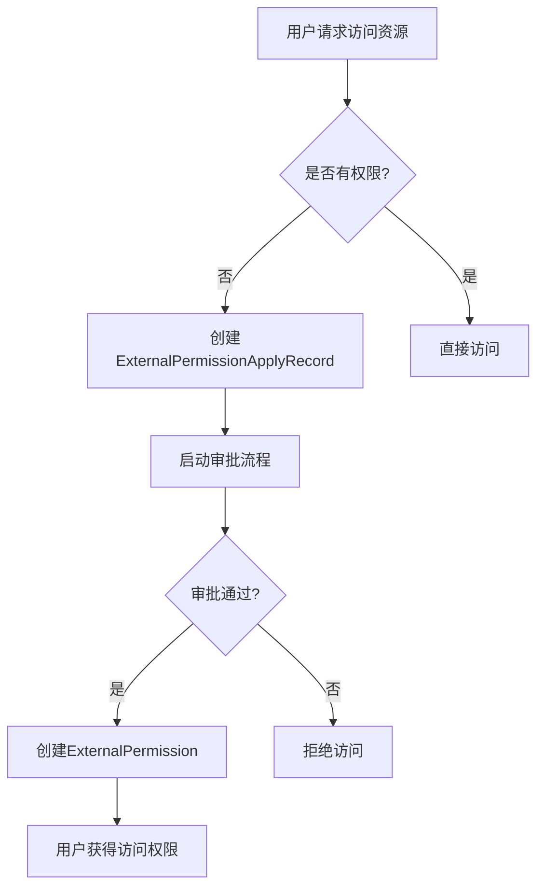
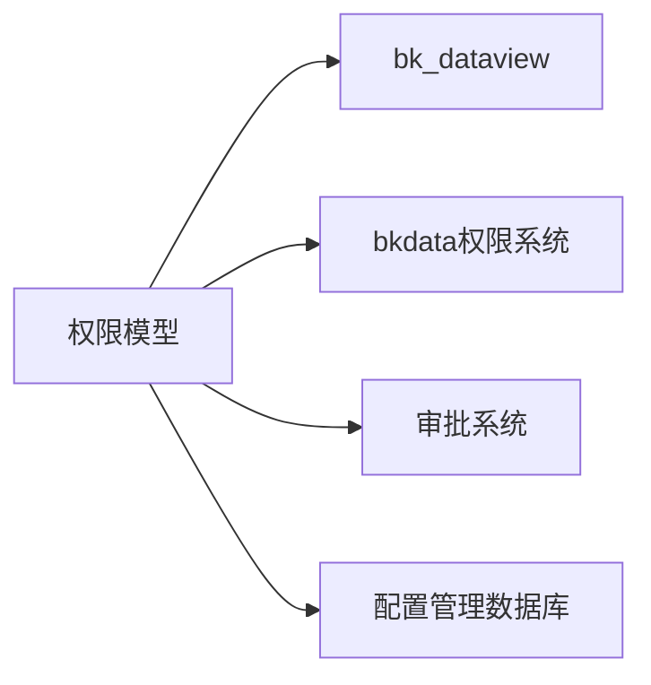

# 用户权限模型

<cite>
**本文档引用的文件**  
- [models.py](file://bkmonitor\packages\monitor\models\models.py#L26-L64)
- [resources.py](file://bkmonitor\packages\monitor_web\iam\resources.py#L114-L141)
- [resources.py](file://bkmonitor\packages\monitor_web\iam\resources.py#L169-L204)
- [resources.py](file://bkmonitor\packages\monitor_web\iam\resources.py#L309-L335)
- [resources.py](file://bkmonitor\packages\monitor_web\iam\resources.py#L381-L409)
- [external_iam.py](file://bkmonitor\bkmonitor\models\external_iam.py#L67-L99)
- [models.py](file://bkmonitor\bk_dataview\models.py#L58-L123)
</cite>

## 目录
1. [简介](#简介)
2. [项目结构](#项目结构)
3. [核心组件](#核心组件)
4. [架构概述](#架构概述)
5. [详细组件分析](#详细组件分析)
6. [依赖分析](#依赖分析)
7. [性能考虑](#性能考虑)
8. [故障排除指南](#故障排除指南)
9. [结论](#结论)

## 简介
本文档全面描述了蓝鲸监控系统中的用户权限模型，重点分析其数据库设计、权限控制机制以及与监控策略、告警处理等核心功能的集成。文档深入解析了用户、角色、权限等实体的字段定义，并通过ER图展示其关系。同时，详细说明了基于角色的访问控制（RBAC）和基于属性的访问控制（ABAC）的实现流程，以及权限继承、委托等高级特性，为开发者提供最佳实践和配置示例。

## 项目结构
蓝鲸监控（bk-monitor）项目的权限模型主要分布在多个模块中，核心权限逻辑位于`packages/monitor_web/iam`和`bkmonitor/api/bkdata`等目录。`bk_dataview`模块负责组织（Org）和用户（User）的管理，而`monitor`和`monitor_web`包则包含了具体的权限模型和业务逻辑。

**图源**  
- [models.py](file://bkmonitor\packages\monitor\models\models.py#L26-L64)
- [resources.py](file://bkmonitor\packages\monitor_web\iam\resources.py#L114-L141)

## 核心组件
系统权限模型的核心是`RolePermission`模型和`ExternalPermission`模型。`RolePermission`用于定义业务（biz_id）中特定角色（role）所拥有的权限（permission），是IAM权限升级的基础。`ExternalPermission`及其关联的`ExternalPermissionApplyRecord`则用于管理外部人员的权限申请和记录，支持基于审批的权限委托。

**本节来源**  
- [models.py](file://bkmonitor\packages\monitor\models\models.py#L42-L49)
- [external_iam.py](file://bkmonitor\bkmonitor\models\external_iam.py#L67-L99)

## 架构概述
系统采用分层的权限控制架构。底层由`bk_dataview`模块管理组织（Org）和用户（User）的映射关系。中间层通过`RolePermission`实现基于角色的静态权限分配。顶层则通过`packages/monitor_web/iam`模块实现动态的、基于API的权限验证和委托，该模块与蓝鲸数据平台（bkdata）的权限系统集成，实现细粒度的资源访问控制。

**图源**  
- [models.py](file://bkmonitor\bk_dataview\models.py#L58-L96)
- [models.py](file://bkmonitor\packages\monitor\models\models.py#L42-L49)

## 详细组件分析

### RolePermission 模型分析
`RolePermission`模型是系统权限控制的基础，它将业务、角色和具体权限三者关联起来。

**图源**  
- [models.py](file://bkmonitor\packages\monitor\models\models.py#L42-L49)

### 权限验证流程分析
权限验证主要通过`CheckAllowedResource`资源类实现。该流程接收用户请求的动作ID（action_ids）和资源列表（resources），调用`Permission`客户端进行批量鉴权。

**图源**  
- [resources.py](file://bkmonitor\packages\monitor_web\iam\resources.py#L114-L141)

### 权限委托与继承分析
系统通过`ExternalPermission`和`ExternalPermissionApplyRecord`模型实现权限委托。当用户需要访问未授权的资源时，系统会生成一个授权申请记录（`ExternalPermissionApplyRecord`），并启动审批流程。审批通过后，相应的`ExternalPermission`会被创建，实现临时或永久的权限授予。

**图源**  
- [resources.py](file://bkmonitor\packages\monitor_web\iam\resources.py#L309-L335)
- [external_iam.py](file://bkmonitor\bkmonitor\models\external_iam.py#L67-L99)

## 依赖分析
用户权限模型高度依赖于`bk_dataview`提供的组织和用户信息，并与`bkdata`平台的权限系统深度集成以实现数据层面的访问控制。同时，权限委托功能依赖于ITSM（itsm）等外部审批系统。

**图源**  
- [models.py](file://bkmonitor\bk_dataview\models.py#L58-L96)
- [default.py](file://bkmonitor\bkmonitor\api\bkdata\default.py#L228-L268)

## 性能考虑
权限验证是高频操作，系统通过批量鉴权（`batch_is_allowed`）和缓存机制来优化性能。`ExternalPermission`的查询应建立在`bk_biz_id`和`action_id`上的数据库索引，以确保在大量授权记录下的查询效率。

## 故障排除指南
当出现权限问题时，应首先检查`RolePermission`表中对应业务和角色的权限配置。对于外部权限问题，需检查`ExternalPermissionApplyRecord`表中的审批状态和过期时间。同时，确认`bkdata`平台的权限是否已正确同步。

**本节来源**  
- [models.py](file://bkmonitor\packages\monitor\models\models.py#L42-L49)
- [external_iam.py](file://bkmonitor\bkmonitor\models\external_iam.py#L67-L99)

## 结论
蓝鲸监控系统的用户权限模型是一个结合了RBAC和ABAC的混合模型。它通过`RolePermission`实现了基础的角色权限分配，并通过`ExternalPermission`机制支持灵活的权限委托和审批流程。该模型设计清晰，与组织架构和外部系统集成良好，为系统的安全访问提供了坚实的基础。