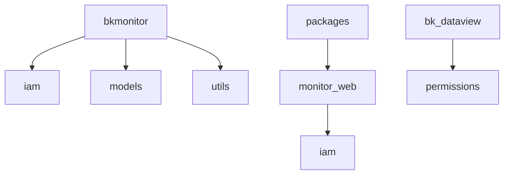
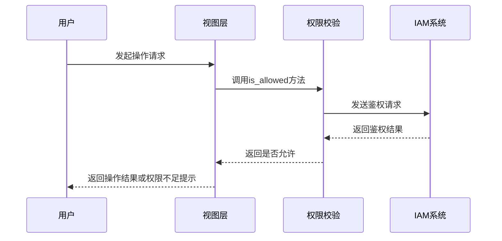
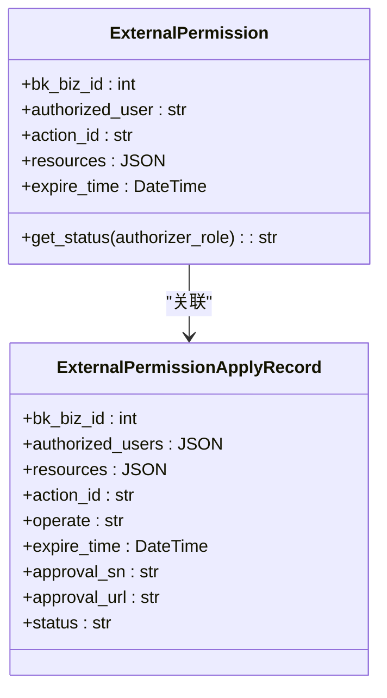
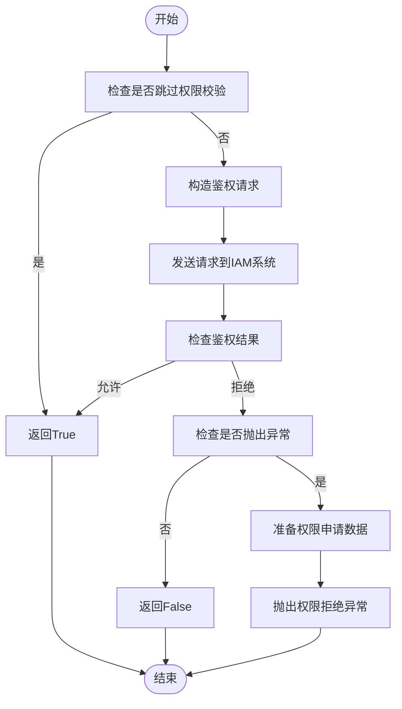
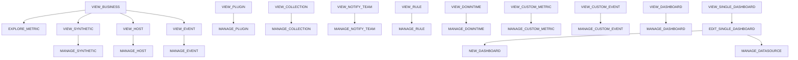
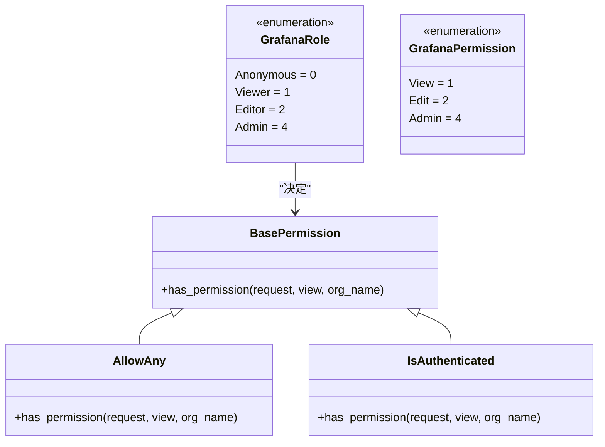
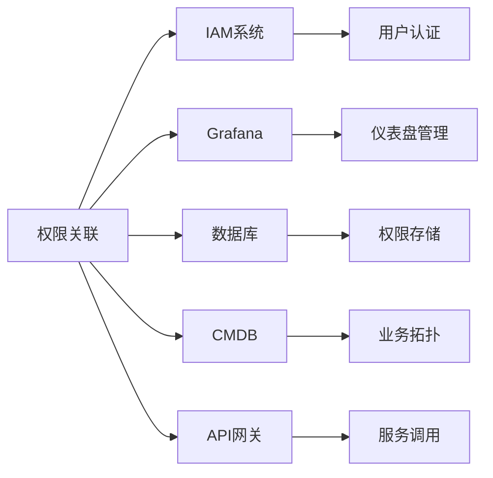

# 权限关联

<cite>
**本文档引用文件**   
- [ExternalPermission](file://bkmonitor\bkmonitor\models\external_iam.py#L29-L69)
- [ExternalPermissionSerializer](file://bkmonitor\packages\monitor_web\iam\serializers.py#L14-L20)
- [Permission](file://bkmonitor\bkmonitor\iam\permission.py#L82-L516)
- [ActionEnum](file://bkmonitor\bkmonitor\iam\action.py#L87-L511)
- [GrafanaRole](file://bkmonitor\bk_dataview\permissions.py#L33-L79)
</cite>

## 目录
1. [引言](#引言)
2. [项目结构](#项目结构)
3. [核心组件](#核心组件)
4. [架构概述](#架构概述)
5. [详细组件分析](#详细组件分析)
6. [依赖分析](#依赖分析)
7. [性能考虑](#性能考虑)
8. [故障排除指南](#故障排除指南)
9. [结论](#结论)

## 引言
本文档旨在深入解析蓝鲸监控平台中的权限关联机制，详细阐述角色与权限的绑定关系、权限校验流程以及细粒度权限控制的实现方式。通过分析核心代码文件，为开发者提供权限策略配置的最佳实践和安全建议。

## 项目结构
蓝鲸监控平台的项目结构遵循模块化设计原则，将不同功能划分为独立的模块。权限管理相关的核心代码主要分布在`bkmonitor`模块下的`iam`子模块中，同时涉及`packages/monitor_web/iam`和`bk_dataview`等模块。

**图示来源**
- [external_iam.py](file://bkmonitor\bkmonitor\models\external_iam.py)
- [permission.py](file://bkmonitor\bkmonitor\iam\permission.py)
- [resources.py](file://bkmonitor\packages\monitor_web\iam\resources.py)

## 核心组件
权限关联机制的核心组件包括权限模型、权限校验类、操作枚举和资源类型枚举。这些组件共同构成了一个完整的权限管理体系。

**本节来源**
- [external_iam.py](file://bkmonitor\bkmonitor\models\external_iam.py#L29-L69)
- [permission.py](file://bkmonitor\bkmonitor\iam\permission.py#L82-L516)

## 架构概述
权限关联机制采用基于IAM（Identity and Access Management）系统的集中式权限管理架构。系统通过定义操作（Action）和资源（Resource）来实现细粒度的权限控制。

**图示来源**
- [permission.py](file://bkmonitor\bkmonitor\iam\permission.py#L82-L516)

## 详细组件分析

### 权限模型分析
权限模型定义了权限的存储结构和状态管理逻辑。`ExternalPermission`模型用于存储外部权限信息，包括业务ID、被授权人、操作类型、资源列表和过期时间。

**图示来源**
- [external_iam.py](file://bkmonitor\bkmonitor\models\external_iam.py#L29-L69)

### 权限校验流程分析
权限校验流程通过`Permission`类实现，该类封装了与IAM系统的交互逻辑。校验过程包括构造请求、发送鉴权请求和处理结果。

**图示来源**
- [permission.py](file://bkmonitor\bkmonitor\iam\permission.py#L82-L516)

### 操作与资源类型分析
系统通过`ActionEnum`和`ResourceEnum`定义了所有可用的操作和资源类型。操作之间存在依赖关系，例如管理操作通常依赖于查看操作。

**图示来源**
- [action.py](file://bkmonitor\bkmonitor\iam\action.py#L87-L511)

### 细粒度权限控制分析
细粒度权限控制通过Grafana角色实现，定义了从匿名用户到管理员的多个权限级别。不同操作需要不同的角色权限。

**图示来源**
- [permissions.py](file://bkmonitor\bk_dataview\permissions.py#L33-L79)

## 依赖分析
权限关联机制依赖于多个外部系统和模块，包括IAM系统、Grafana、数据库等。这些依赖关系确保了权限管理的完整性和一致性。

**图示来源**
- [permission.py](file://bkmonitor\bkmonitor\iam\permission.py#L82-L516)
- [external_iam.py](file://bkmonitor\bkmonitor\models\external_iam.py#L29-L69)

## 性能考虑
权限校验对系统性能有重要影响，特别是在高并发场景下。系统通过缓存读权限校验结果来提高性能。

**本节来源**
- [permission.py](file://bkmonitor\bkmonitor\iam\permission.py#L82-L516)

## 故障排除指南
常见权限问题包括权限不足、权限缓存不一致等。开发者应检查权限配置、清除缓存并验证IAM系统状态。

**本节来源**
- [permission.py](file://bkmonitor\bkmonitor\iam\permission.py#L82-L516)
- [external_iam.py](file://bkmonitor\bkmonitor\models\external_iam.py#L29-L69)

## 结论
蓝鲸监控平台的权限关联机制通过IAM系统实现了灵活、细粒度的权限管理。开发者应遵循最佳实践，合理配置权限策略，确保系统安全性和可用性。