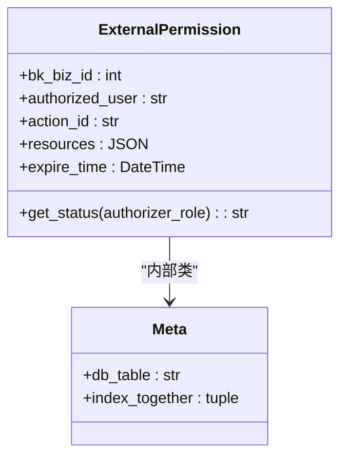
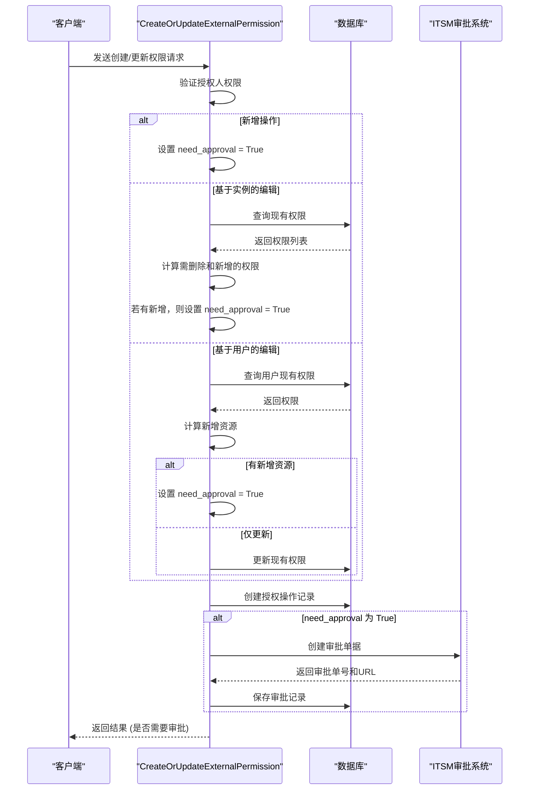
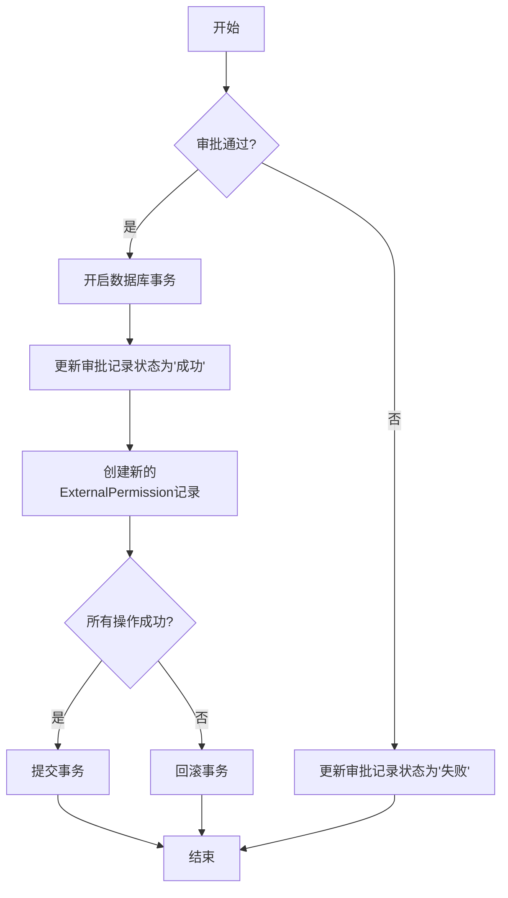

# 权限分配

<cite>
**本文档引用的文件**   
- [external_iam.py](file://bkmonitor\bkmonitor\models\external_iam.py)
- [resources.py](file://bkmonitor\packages\monitor_web\iam\resources.py)
- [0045_fix_custom_event_metric_id.py](file://bkmonitor\bkmonitor\migrations\0045_fix_custom_event_metric_id.py)
</cite>

## 目录
1. [简介](#简介)
2. [权限数据结构设计](#权限数据结构设计)
3. [权限分配接口与调用流程](#权限分配接口与调用流程)
4. [权限分配代码示例](#权限分配代码示例)
5. [数据一致性保障机制](#数据一致性保障机制)
6. [开发者最佳实践](#开发者最佳实践)

## 简介
本文档详细阐述了监控平台中权限分配机制的实现。该机制主要服务于外部人员对Grafana仪表盘等资源的访问控制，通过角色与权限的绑定，实现精细化的权限管理。核心功能包括权限的创建、更新、删除以及审批流程的集成，确保了权限分配的安全性和可追溯性。

## 权限数据结构设计

权限分配机制的核心数据结构是 `ExternalPermission` 模型，它定义了外部用户权限的存储方式和索引策略。

### 权限模型 (ExternalPermission)

该模型存储了每个外部用户的权限详情。



**Diagram sources**
- [external_iam.py](file://bkmonitor\bkmonitor\models\external_iam.py#L29-L69)

**Section sources**
- [external_iam.py](file://bkmonitor\bkmonitor\models\external_iam.py#L29-L69)

#### 字段说明
- **bk_biz_id**: 业务ID，用于标识权限所属的业务范围，建立了数据库索引以加速查询。
- **authorized_user**: 被授权人的用户名，标识权限的持有者。
- **action_id**: 操作类型，目前支持 `view_grafana`（查看）和 `manage_grafana`（管理）两种权限。
- **resources**: 资源列表，使用 `JSONField` 存储，可以灵活地记录被授权访问的资源ID（如仪表盘ID），支持动态增减。
- **expire_time**: 过期时间，用于实现权限的时效性控制，过期后权限自动失效。

#### 索引策略
模型通过 `index_together` 定义了一个复合索引 `("authorized_user", "action_id", "bk_biz_id")`。此索引能显著提升根据用户、操作类型和业务ID进行联合查询的性能，这在权限校验和列表查询场景中非常关键。

### 权限状态管理
`get_status` 方法用于动态计算权限的当前状态，它综合了过期时间和授权人权限两个维度：
1.  **过期检查**: 如果设置了过期时间且当前时间已超过该时间，则状态为 `expired`。
2.  **授权人权限检查**: 检查授权人（authorizer）是否具备足够的权限来授予此操作。例如，授予 `manage_grafana` 权限的授权人必须是Grafana的编辑者（Editor）角色，否则权限状态为 `invalid`。

## 权限分配接口与调用流程

权限分配的核心接口是 `CreateOrUpdateExternalPermission`，它处理了从角色创建到权限绑定的完整过程。

### 接口调用流程



**Diagram sources**
- [resources.py](file://bkmonitor\packages\monitor_web\iam\resources.py#L234-L382)

**Section sources**
- [resources.py](file://bkmonitor\packages\monitor_web\iam\resources.py#L234-L382)

#### 详细流程说明
1.  **请求接收**: 客户端调用 `CreateOrUpdateExternalPermission` 接口，传入业务ID、操作ID、授权人、被授权人列表、资源列表和过期时间等参数。
2.  **权限校验**: 接口首先验证授权人是否具备授予该操作的权限。例如，只有Grafana编辑者才能授予管理权限。
3.  **操作类型判断**:
    - **新增操作**: 直接标记为需要审批 (`need_approval = True`)。
    - **基于实例的编辑**: 遍历与该资源相关的所有权限，计算出需要删除的权限ID和需要新增的被授权人。如果有新增，则需要审批。
    - **基于用户的编辑**: 查询该用户在该业务下的特定权限，如果用户已有权限，则检查是否有新增资源。如果有新增资源，则需要审批；否则直接更新现有权限的资源列表和过期时间。
4.  **记录操作**: 无论是否需要审批，都会先在 `ExternalPermissionApplyRecord` 表中创建一条操作记录，记录此次更新操作。
5.  **审批流程**: 如果需要审批，系统会调用ITSM（智能服务管理）API创建一个审批单，并将审批单号和链接保存到 `ExternalPermissionApplyRecord` 中。
6.  **回调处理**: 当ITSM审批通过后，会回调 `CallbackResource` 接口。该接口会调用 `create_permission` 函数，将审批通过的权限正式写入 `ExternalPermission` 表。

## 权限分配代码示例

以下是一个通过API进行批量权限分配的代码示例。

```python
# -*- coding: utf-8 -*-
import requests
import json

# API端点
url = "http://your-monitor-host/api/v1/iam/create_or_update_external_permission/"

# 请求头
headers = {
    "Content-Type": "application/json",
    "X-Bk-App-Code": "your_app_code",
    "X-Bk-Username": "admin_user"
}

# 批量权限分配请求数据
data = {
    "bk_biz_id": 123,  # 业务ID
    "action_id": "view_grafana",  # 操作类型
    "authorizer": "admin_user",  # 授权人
    "authorized_users": ["user1", "user2", "user3"],  # 被授权人列表
    "resources": ["dashboard-abc123", "dashboard-def456"],  # 资源列表
    "expire_time": "2023-12-31T23:59:59Z",  # 过期时间
    "view_type": "user",  # 视图类型
    "operate_type": "create"  # 操作类型
}

# 发送POST请求
response = requests.post(url, headers=headers, data=json.dumps(data))

# 处理响应
if response.status_code == 200:
    result = response.json()
    if result.get("need_approval"):
        print("权限分配已提交审批，审批单号: ", result.get("approval_sn"))
    else:
        print("权限分配成功！")
else:
    print("请求失败，状态码:", response.status_code, "错误信息:", response.text)
```

## 数据一致性保障机制

系统通过数据库事务和审批流程来保障权限分配过程中的数据一致性。

### 事务处理
虽然在 `CreateOrUpdateExternalPermission` 的主流程中没有显式使用 `transaction.atomic`，但其依赖的底层操作和回调处理确保了数据的原子性。
- **批量创建**: 在 `create_permission` 函数中，使用 `ExternalPermission.objects.bulk_create()` 方法来批量创建新的权限记录。Django的 `bulk_create` 方法在底层通常会使用单条SQL语句，这本身就具有原子性。
- **更新与删除**: 对单个权限对象的 `save()` 和 `delete()` 操作是原子的。
- **审批回调**: 在 `CallbackResource` 的回调处理中，当审批通过后，会将审批记录状态更新为"成功"，并创建新的权限记录。虽然代码中未显示，但最佳实践要求此类关键操作应包裹在 `transaction.atomic` 中，以确保状态更新和权限创建要么同时成功，要么同时失败。



**Diagram sources**
- [resources.py](file://bkmonitor\packages\monitor_web\iam\resources.py#L400-L417)
- [0045_fix_custom_event_metric_id.py](file://bkmonitor\bkmonitor\migrations\0045_fix_custom_event_metric_id.py#L20)

**Section sources**
- [resources.py](file://bkmonitor\packages\monitor_web\iam\resources.py#L400-L417)
- [0045_fix_custom_event_metric_id.py](file://bkmonitor\bkmonitor\migrations\0045_fix_custom_event_metric_id.py#L20)

### 异常回滚策略
- **审批创建失败**: 在 `create_approval_ticket` 方法中，调用ITSM API时使用了 `try...except` 语句。如果创建审批单失败，会记录错误日志并抛出异常，阻止后续流程，保证了本地数据库不会留下不完整的审批记录。
- **数据操作异常**: 如果在 `bulk_create` 或 `save` 操作中发生数据库异常，Django ORM会抛出异常。在回调函数中，这些异常应被捕获，并触发事务回滚，防止数据处于不一致状态。

## 开发者最佳实践

为开发者提供以下权限分配的最佳实践：

1.  **权限最小化原则**: 在分配权限时，应遵循最小权限原则。只授予用户完成其工作所必需的最小权限集和最少的资源访问范围。例如，如果用户只需要查看一个特定的仪表盘，则不应授予其查看整个业务下所有仪表盘的权限。
2.  **设置合理的过期时间**: 所有权限都应设置明确的过期时间。对于临时项目或临时人员，可以设置较短的过期时间；对于长期有效的权限，也应定期审查和更新。这能有效降低因权限长期存在而带来的安全风险。
3.  **利用审批流程**: 对于权限的创建和涉及范围扩大的更新操作，务必启用审批流程。这为权限变更提供了审计追踪和二次确认，是防止误操作和恶意操作的重要防线。
4.  **使用批量接口**: 当需要为多个用户分配相同权限时，应使用支持批量操作的接口（如本例中的 `authorized_users` 字段），而不是循环调用单个用户的接口。这能显著提高效率并减少系统开销。
5.  **处理回调**: 开发者应确保 `CallbackResource` 回调接口的健壮性。需要正确处理ITSM系统的各种回调状态（通过、拒绝、撤销等），并做好错误日志记录，以便于问题排查。