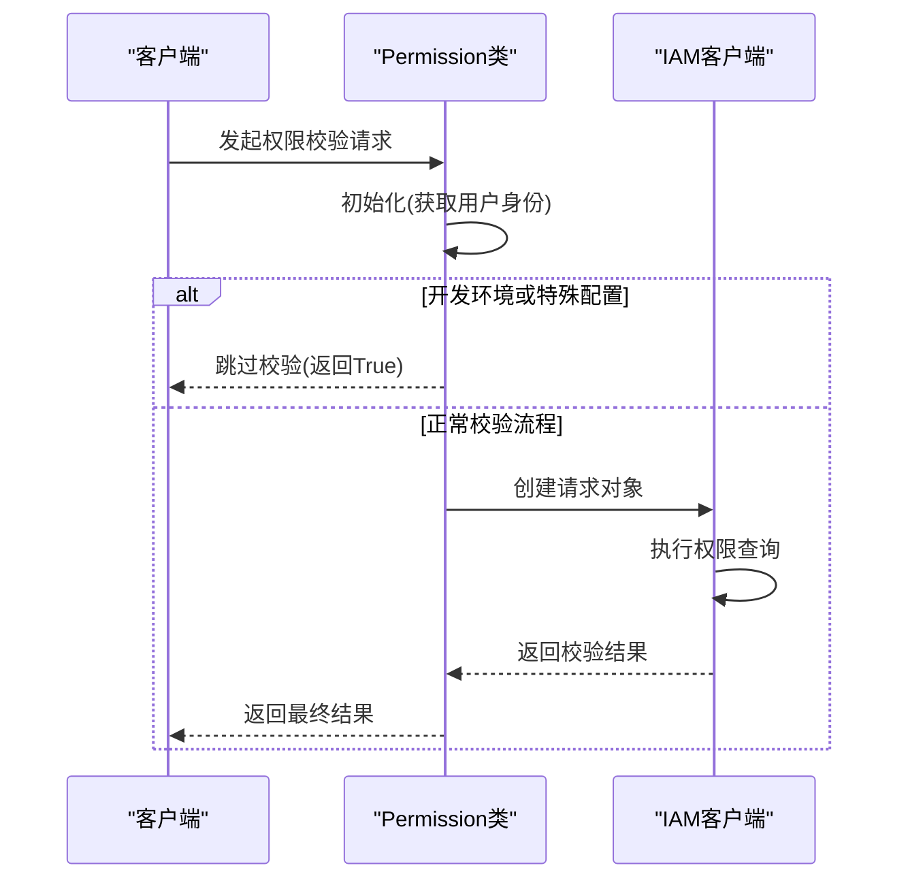
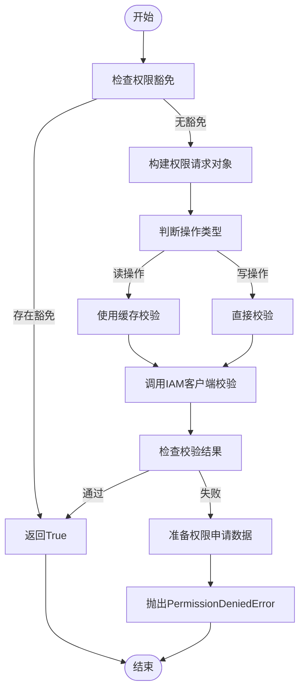
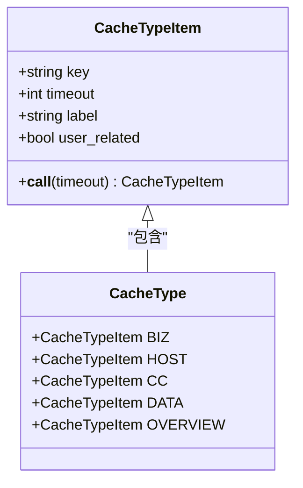
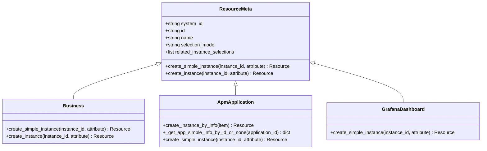
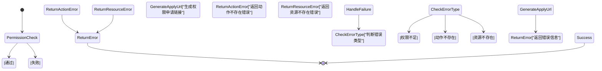

# 权限校验

<cite>
**本文档引用文件**   
- [permission.py](file://bkmonitor/bkmonitor/iam/permission.py)
- [resource.py](file://bkmonitor/bkmonitor/iam/resource.py)
- [action.py](file://bkmonitor/bkmonitor/iam/action.py)
- [drf.py](file://bkmonitor/bkmonitor/iam/drf.py)
- [compatible.py](file://bkmonitor/bkmonitor/iam/compatible.py)
- [iam.py](file://core/errors/iam.py)
</cite>

## 目录
1. [简介](#简介)
2. [权限校验执行流程](#权限校验执行流程)
3. [权限缓存设计与实现](#权限缓存设计与实现)
4. [多级权限校验处理逻辑](#多级权限校验处理逻辑)
5. [权限校验失败处理方案](#权限校验失败处理方案)
6. [权限校验性能优化建议](#权限校验性能优化建议)
7. [常见问题排查指南](#常见问题排查指南)

## 简介
本文档详细解析了基于IAM系统的权限验证机制，深入探讨了权限校验的执行流程、缓存设计、多级权限处理逻辑以及失败处理方案。文档旨在为开发者提供全面的权限校验知识体系，包括性能优化建议和常见问题排查指南，帮助开发者更好地理解和应用权限校验系统。

## 权限校验执行流程

### 请求接入与初始化
权限校验流程始于`Permission`类的初始化。该类负责封装IAM权限中心的鉴权逻辑，通过接收用户名、租户ID或请求对象来确定当前用户身份。初始化过程中，系统会根据用户角色（如API、Worker）选择相应的应用代码和密钥，并创建`CompatibleIAM`客户端实例。



**图示来源**
- [permission.py](file://bkmonitor/bkmonitor/iam/permission.py#L50-L100)

### 权限判定完整链路
权限判定的核心方法是`is_allowed`，它构成了从请求接收到权限判定的完整链路。该方法首先检查是否存在权限豁免条件，如请求头携带token或开发环境配置跳过校验。若无豁免，则构建权限请求对象并调用IAM客户端进行实际校验。

对于读操作权限，系统会使用带缓存的校验方法`is_allowed_with_cache`以提高性能；而对于写操作，则直接调用`is_allowed`方法确保实时性。当校验失败时，系统会准备权限申请数据并抛出`PermissionDeniedError`异常。



**图示来源**
- [permission.py](file://bkmonitor/bkmonitor/iam/permission.py#L290-L350)

**本节来源**
- [permission.py](file://bkmonitor/bkmonitor/iam/permission.py#L50-L350)

## 权限缓存设计与实现

### 缓存结构与策略
权限校验系统采用了多层次的缓存策略来优化性能。核心缓存机制体现在`CacheType`类中，该类定义了不同类型的缓存选项，包括业务相关、主机信息、CC模块等。每种缓存类型都有明确的超时设置和用户关联属性。



**图示来源**
- [cache.py](file://bkmonitor/bkmonitor/utils/cache.py#L266-L302)

缓存策略的关键在于区分用户相关和非用户相关的缓存。用户相关缓存会以用户名作为缓存键的一部分，确保不同用户的缓存数据隔离；而非用户相关缓存则可以被所有用户共享，适用于系统级配置数据。

### 性能优化实现
权限校验的性能优化主要体现在两个方面：读操作缓存和批量校验。对于读操作，系统使用`is_allowed_with_cache`方法，通过缓存减少对IAM服务的直接调用频率。同时，`batch_is_allowed`方法支持批量权限校验，能够一次性处理多个资源和操作的权限查询，显著降低了网络开销。

```python
def batch_is_allowed(self, actions: list[ActionMeta], resources: list[list[Resource]]):
    """
    查询某批资源某批操作是否有权限
    """
    # ... 豁免检查逻辑 ...
    
    request = self.make_multi_action_request(actions)
    result = self.iam_client.batch_resource_multi_actions_allowed(request, resources)
    return result
```

**本节来源**
- [permission.py](file://bkmonitor/bkmonitor/iam/permission.py#L384-L419)
- [cache.py](file://bkmonitor/bkmonitor/utils/cache.py#L266-L302)

## 多级权限校验处理逻辑

### 项目级、业务级和资源级权限叠加
系统实现了多层次的权限校验机制，支持项目级、业务级和资源级权限的叠加计算。这种设计通过`ResourceEnum`枚举类实现，该类定义了不同级别的资源类型，如`BUSINESS`（业务）、`APM_APPLICATION`（APM应用）和`GRAFANA_DASHBOARD`（Grafana仪表盘）。



**图示来源**
- [resource.py](file://bkmonitor/bkmonitor/iam/resource.py#L10-L213)

### 权限叠加计算机制
权限叠加计算通过`ActionEnum`类中的`related_actions`属性实现。每个动作可以关联其他依赖动作，形成权限依赖链。例如，管理事件中心的权限`MANAGE_EVENT`依赖于查看事件中心的权限`VIEW_EVENT`。这种设计确保了权限的层次性和完整性。

```python
class ActionEnum:
    VIEW_EVENT = ActionMeta(
        id="view_event_v2",
        name=_("事件中心查看"),
        type="view",
        related_resource_types=[SPACE_RESOURCE],
        related_actions=[VIEW_BUSINESS.id],
        version=1,
    )

    MANAGE_EVENT = ActionMeta(
        id="manage_event_v2",
        name=_("事件中心管理"),
        type="manage",
        related_resource_types=[SPACE_RESOURCE],
        related_actions=[VIEW_EVENT.id],
        version=1,
    )
```

**本节来源**
- [resource.py](file://bkmonitor/bkmonitor/iam/resource.py#L10-L213)
- [action.py](file://bkmonitor/bkmonitor/iam/action.py#L150-L200)

## 权限校验失败处理方案

### 错误码说明
当权限校验失败时，系统会抛出相应的异常并返回详细的错误信息。主要的错误类型包括：

- **PermissionDeniedError**: 权限校验不通过，状态码403，代码9900403
- **ActionNotExistError**: 动作ID不存在，状态码400，代码3399001
- **ResourceNotExistError**: 资源ID不存在，状态码400，代码3399002



**图示来源**
- [iam.py](file://core/errors/iam.py#L0-L65)

### 失败处理流程
权限校验失败的处理流程主要包括三个步骤：准备权限申请数据、生成申请链接和抛出异常。系统会调用`get_apply_data`方法准备权限申请所需的数据，并通过`get_apply_url`方法生成跳转到权限中心的申请链接。最后，将这些信息封装在`PermissionDeniedError`异常中抛出。

```python
def is_allowed(self, action: ActionMeta | str, resources: list[Resource] = None, raise_exception: bool = False):
    # ... 校验逻辑 ...
    if not result and raise_exception:
        actions, detail_resources = self.prepare_apply_for_saas(resources)
        if not actions:
            detail_resources = []
            for resource in resources:
                resource_mata = get_resource_by_id(resource.type)
                detail_resources.append(resource_mata.create_instance(resource.id))
            actions = [action]
        apply_data, apply_url = self.get_apply_data(actions, detail_resources)

        raise PermissionDeniedError(
            context={"action_name": action.name},
            data={"apply_url": apply_url},
            extra={"permission": apply_data},
        )
```

**本节来源**
- [permission.py](file://bkmonitor/bkmonitor/iam/permission.py#L330-L350)
- [iam.py](file://core/errors/iam.py#L0-L65)

## 权限校验性能优化建议

### 批量校验与缓存策略
为了提高权限校验的性能，建议采用以下优化策略：

1. **使用批量校验**: 对于需要校验多个资源或操作的场景，应优先使用`batch_is_allowed`方法，避免多次单独调用。
2. **合理利用缓存**: 对于频繁访问的读操作，确保启用了缓存机制，减少对IAM服务的直接调用。
3. **预加载常用资源**: 在系统启动或用户登录时，预加载常用的资源实例，减少运行时的查询开销。

```python
# 推荐的批量校验用法
def check_multiple_permissions(self, actions, resources):
    return self.batch_is_allowed(actions, resources)
```

### 代码层面优化
在代码实现层面，可以通过以下方式进一步优化性能：

1. **减少不必要的校验**: 在开发环境或特定场景下，可以通过配置`SKIP_IAM_PERMISSION_CHECK`变量来跳过权限校验。
2. **优化资源实例创建**: 使用`create_simple_instance`方法创建简单的资源实例，避免不必要的属性查询。
3. **异步处理**: 对于不影响主流程的权限校验，可以考虑使用异步方式处理，提高响应速度。

**本节来源**
- [permission.py](file://bkmonitor/bkmonitor/iam/permission.py#L384-L419)
- [cache.py](file://bkmonitor/bkmonitor/utils/cache.py#L266-L302)

## 常见问题排查指南

### 权限校验不通过
当遇到权限校验不通过的问题时，可以按照以下步骤进行排查：

1. **检查用户身份**: 确认当前用户的用户名和租户ID是否正确。
2. **验证动作ID**: 确保请求的动作ID存在于`ActionEnum`枚举中。
3. **检查资源实例**: 确认资源实例的ID和类型是否正确，并且资源确实存在。
4. **查看权限策略**: 登录权限中心，检查用户是否被授予了相应的权限策略。

### 缓存相关问题
针对缓存相关的问题，建议采取以下措施：

1. **检查缓存配置**: 确认`CacheType`的超时设置是否合理。
2. **验证缓存键**: 检查缓存键的生成逻辑，确保不会出现键冲突。
3. **监控缓存命中率**: 通过监控系统观察缓存的命中率，及时发现性能瓶颈。

### 兼容性问题
由于系统支持V1和V2版本的权限模型，可能会遇到兼容性问题。此时应：

1. **检查兼容模式**: 确认`in_compatibility_mode`的返回值，了解当前是否处于兼容模式。
2. **审查策略表达式**: 使用`_patch_policy_expression`方法确保V1和V2策略的正确转换。
3. **更新权限配置**: 及时将旧版权限配置迁移到新版模型。

**本节来源**
- [permission.py](file://bkmonitor/bkmonitor/iam/permission.py)
- [compatible.py](file://bkmonitor/bkmonitor/iam/compatible.py)
- [cache.py](file://bkmonitor/bkmonitor/utils/cache.py)