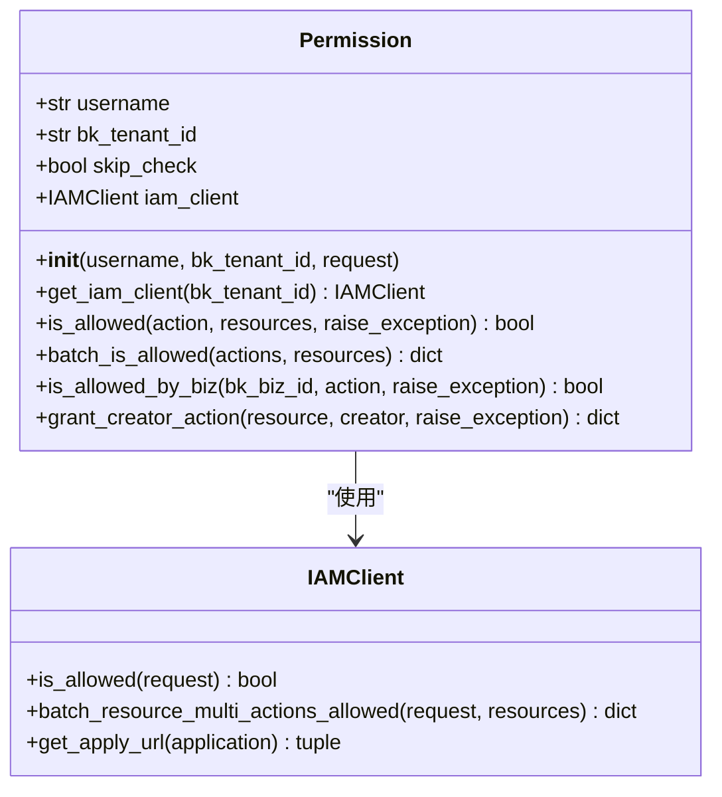
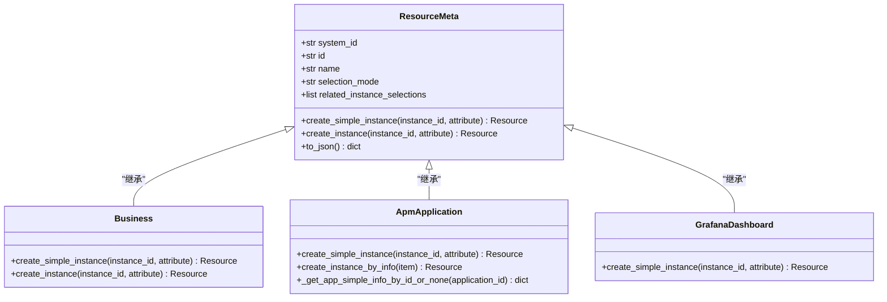
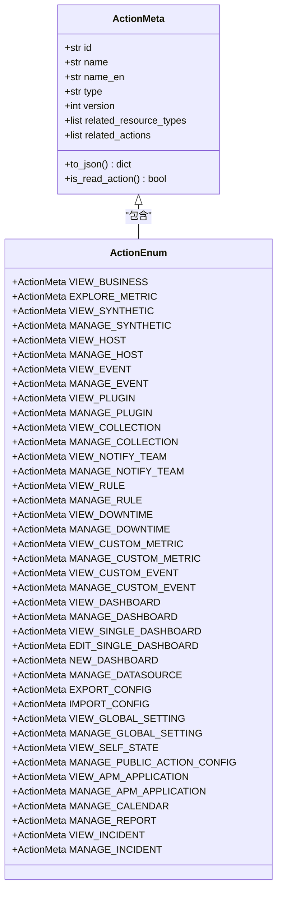
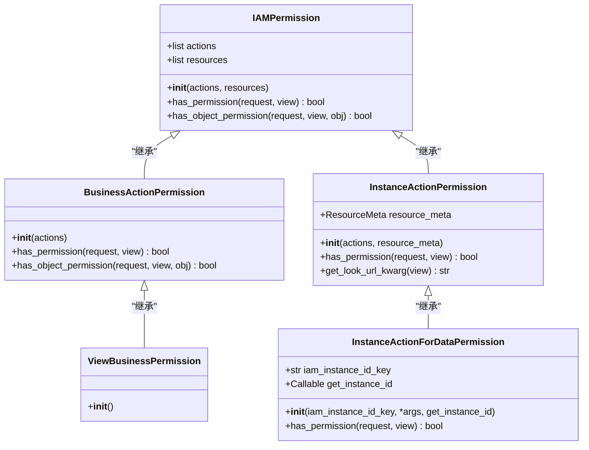
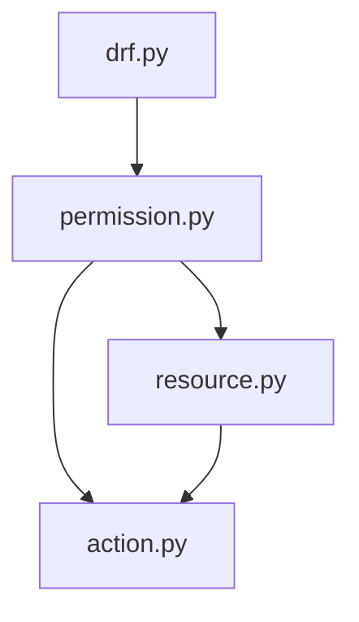
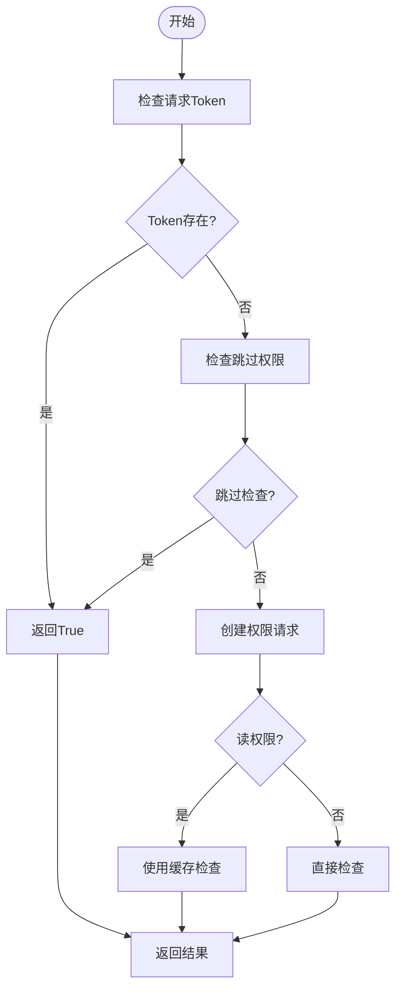

# 权限继承

<cite>
**本文档中引用的文件**   
- [drf.py](file://bkmonitor/bkmonitor/iam/drf.py)
- [permission.py](file://bkmonitor/bkmonitor/iam/permission.py)
- [resource.py](file://bkmonitor/bkmonitor/iam/resource.py)
- [action.py](file://bkmonitor/bkmonitor/iam/action.py)
</cite>

## 目录
1. [简介](#简介)
2. [项目结构](#项目结构)
3. [核心组件](#核心组件)
4. [架构概述](#架构概述)
5. [详细组件分析](#详细组件分析)
6. [依赖分析](#依赖分析)
7. [性能考虑](#性能考虑)
8. [故障排除指南](#故障排除指南)
9. [结论](#结论)

## 简介
本文档详细阐述了蓝鲸监控平台中的权限继承机制，重点描述了资源层级间的权限传递规则。文档深入分析了权限继承的实现方式，包括继承链的构建和权限计算算法。同时，解释了不同资源类型间的继承策略差异，如业务、集群、服务等层级的权限传递规则。此外，文档还提供了权限继承冲突的解决机制，以及性能优化方案和配置最佳实践，为开发者提供全面的技术指导。

## 项目结构
蓝鲸监控平台的权限管理模块主要位于`bkmonitor/bkmonitor/iam/`目录下，包含四个核心文件：`drf.py`、`permission.py`、`resource.py`和`action.py`。这些文件共同构成了权限继承机制的基础。

```mermaid
graph TD
subgraph "权限管理模块"
drf[drf.py<br/>DRF权限装饰器]
permission[permission.py<br/>权限核心逻辑]
resource[resource.py<br/>资源类型定义]
action[action.py<br/>动作类型定义]
end
drf --> permission : "调用"
permission --> resource : "引用"
permission --> action : "引用"
resource --> action : "关联"
```

**图示来源**
- [drf.py](file://bkmonitor/bkmonitor/iam/drf.py)
- [permission.py](file://bkmonitor/bkmonitor/iam/permission.py)
- [resource.py](file://bkmonitor/bkmonitor/iam/resource.py)
- [action.py](file://bkmonitor/bkmonitor/iam/action.py)

**本节来源**
- [drf.py](file://bkmonitor/bkmonitor/iam/drf.py)
- [permission.py](file://bkmonitor/bkmonitor/iam/permission.py)
- [resource.py](file://bkmonitor/bkmonitor/iam/resource.py)
- [action.py](file://bkmonitor/bkmonitor/iam/action.py)

## 核心组件
权限继承机制的核心组件包括权限检查器（`Permission`类）、资源类型（`ResourceMeta`类）、动作类型（`ActionMeta`类）以及DRF框架集成（`IAMPermission`类）。这些组件协同工作，实现了复杂的权限继承和传递逻辑。

**本节来源**
- [permission.py](file://bkmonitor/bkmonitor/iam/permission.py#L100-L500)
- [resource.py](file://bkmonitor/bkmonitor/iam/resource.py#L10-L200)
- [action.py](file://bkmonitor/bkmonitor/iam/action.py#L10-L500)
- [drf.py](file://bkmonitor/bkmonitor/iam/drf.py#L10-L300)

## 架构概述
权限继承机制的架构基于资源-动作模型，通过定义资源类型和动作类型之间的关系来实现权限的传递和继承。系统采用分层设计，从底层的资源定义到上层的权限检查，形成了一个完整的权限管理体系。

```mermaid
graph TB
subgraph "权限管理层"
IAMPermission[IAMPermission<br/>DRF权限检查]
BusinessActionPermission[BusinessActionPermission<br/>业务动作权限]
InstanceActionPermission[InstanceActionPermission<br/>实例动作权限]
end
subgraph "权限核心层"
Permission[Permission<br/>权限核心逻辑]
batch_is_allowed[batch_is_allowed<br/>批量权限检查]
is_allowed[is_allowed<br/>单个权限检查]
end
subgraph "资源与动作层"
ResourceMeta[ResourceMeta<br/>资源类型定义]
ActionMeta[ActionMeta<br/>动作类型定义]
ResourceEnum[ResourceEnum<br/>资源枚举]
ActionEnum[ActionEnum<br/>动作枚举]
end
IAMPermission --> Permission : "调用"
Permission --> ResourceMeta : "引用"
Permission --> ActionMeta : "引用"
ResourceEnum --> ResourceMeta : "继承"
ActionEnum --> ActionMeta : "继承"
```

**图示来源**
- [drf.py](file://bkmonitor/bkmonitor/iam/drf.py#L10-L300)
- [permission.py](file://bkmonitor/bkmonitor/iam/permission.py#L100-L500)
- [resource.py](file://bkmonitor/bkmonitor/iam/resource.py#L10-L200)
- [action.py](file://bkmonitor/bkmonitor/iam/action.py#L10-L500)

## 详细组件分析

### 权限核心逻辑分析
`Permission`类是权限继承机制的核心，负责处理所有权限检查请求。它通过与IAM（身份与访问管理）系统的交互，实现权限的查询和验证。



**图示来源**
- [permission.py](file://bkmonitor/bkmonitor/iam/permission.py#L100-L500)

**本节来源**
- [permission.py](file://bkmonitor/bkmonitor/iam/permission.py#L100-L500)

### 资源类型定义分析
`ResourceMeta`类是所有资源类型的基类，定义了资源的基本属性和创建方法。不同的资源类型通过继承`ResourceMeta`来实现特定的资源逻辑。



**图示来源**
- [resource.py](file://bkmonitor/bkmonitor/iam/resource.py#L10-L200)

**本节来源**
- [resource.py](file://bkmonitor/bkmonitor/iam/resource.py#L10-L200)

### 动作类型定义分析
`ActionMeta`类定义了所有动作类型的基本属性，包括动作ID、名称、类型和相关资源类型。`ActionEnum`枚举类则具体定义了系统中的所有动作。



**图示来源**
- [action.py](file://bkmonitor/bkmonitor/iam/action.py#L10-L500)

**本节来源**
- [action.py](file://bkmonitor/bkmonitor/iam/action.py#L10-L500)

### DRF框架集成分析
`IAMPermission`类及其子类实现了与Django REST Framework的集成，使得权限检查可以无缝地应用于API视图。



**图示来源**
- [drf.py](file://bkmonitor/bkmonitor/iam/drf.py#L10-L300)

**本节来源**
- [drf.py](file://bkmonitor/bkmonitor/iam/drf.py#L10-L300)

## 依赖分析
权限继承机制的各个组件之间存在明确的依赖关系。`drf.py`文件中的权限检查器依赖于`permission.py`中的核心逻辑，而核心逻辑又依赖于`resource.py`和`action.py`中定义的资源和动作类型。



**图示来源**
- [drf.py](file://bkmonitor/bkmonitor/iam/drf.py)
- [permission.py](file://bkmonitor/bkmonitor/iam/permission.py)
- [resource.py](file://bkmonitor/bkmonitor/iam/resource.py)
- [action.py](file://bkmonitor/bkmonitor/iam/action.py)

**本节来源**
- [drf.py](file://bkmonitor/bkmonitor/iam/drf.py)
- [permission.py](file://bkmonitor/bkmonitor/iam/permission.py)
- [resource.py](file://bkmonitor/bkmonitor/iam/resource.py)
- [action.py](file://bkmonitor/bkmonitor/iam/action.py)

## 性能考虑
权限继承机制在设计时充分考虑了性能优化。`Permission`类中的`batch_is_allowed`方法支持批量权限检查，减少了与IAM系统的交互次数。此外，`ApmApplication`类中的`_get_app_simple_info_by_id_or_none`方法使用了内存缓存，提高了鉴权性能。



**图示来源**
- [permission.py](file://bkmonitor/bkmonitor/iam/permission.py#L300-L400)

## 故障排除指南
当遇到权限相关问题时，可以按照以下步骤进行排查：
1. 检查用户是否具有基本的`VIEW_BUSINESS`权限
2. 确认资源ID和动作ID是否正确
3. 查看IAM系统的返回结果
4. 检查是否有权限豁免条件被触发

**本节来源**
- [permission.py](file://bkmonitor/bkmonitor/iam/permission.py#L400-L500)
- [drf.py](file://bkmonitor/bkmonitor/iam/drf.py#L300-L338)

## 结论
蓝鲸监控平台的权限继承机制通过精心设计的资源-动作模型，实现了灵活而强大的权限管理功能。系统采用分层架构，将权限检查的核心逻辑与框架集成分离，提高了代码的可维护性和可扩展性。通过批量权限检查和内存缓存等优化措施，系统在保证安全性的同时也兼顾了性能。开发者在使用该机制时，应遵循最佳实践，合理定义资源和动作类型，确保权限系统的稳定运行。