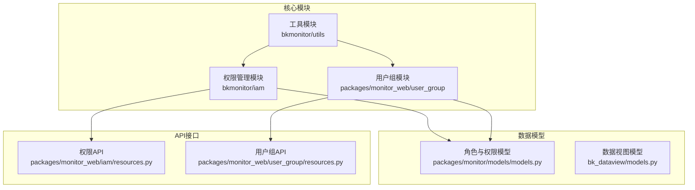
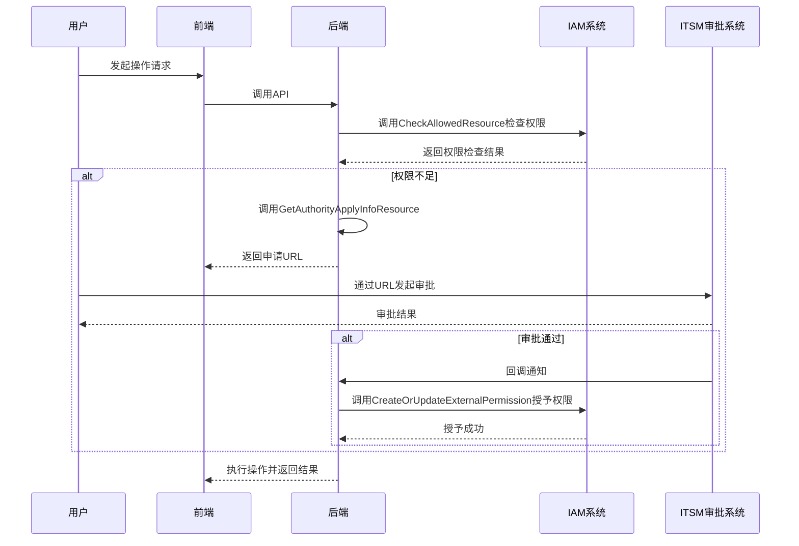
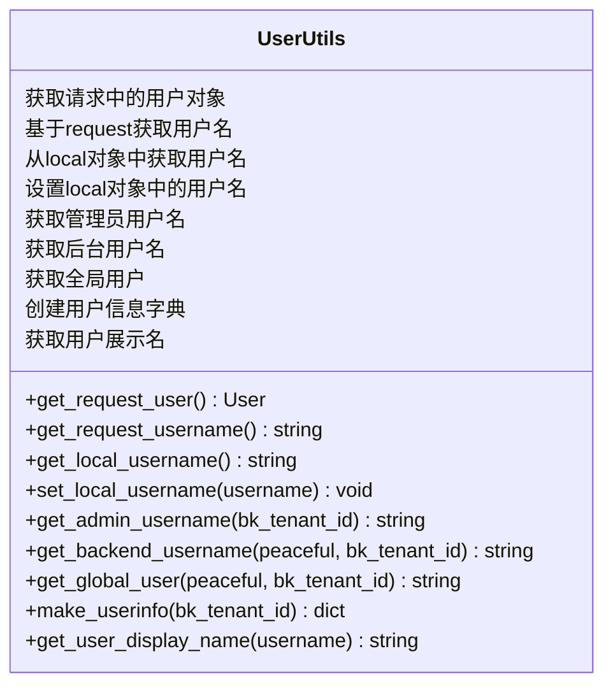
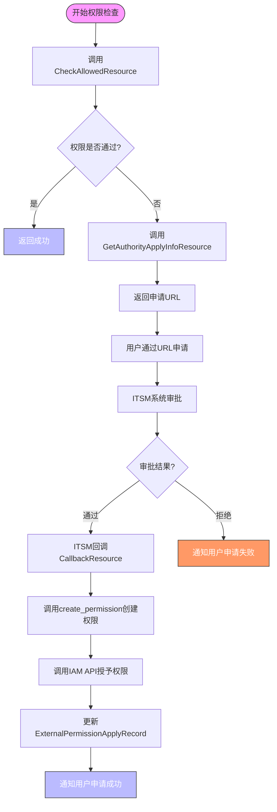
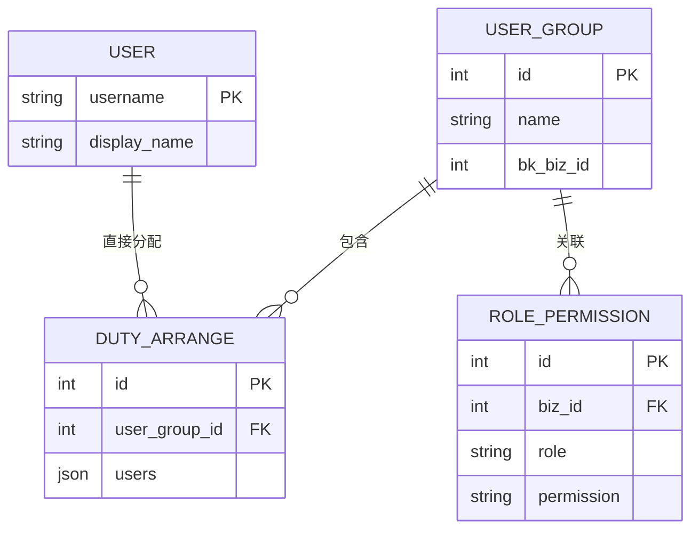
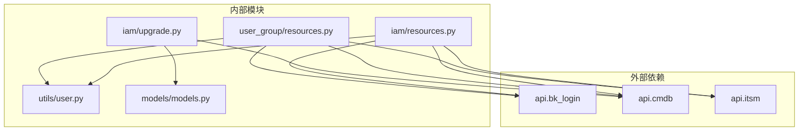

# 用户角色关系

<cite>
**本文档引用的文件**   
- [user.py](file://bkmonitor\bkmonitor\utils\user.py)
- [resources.py](file://bkmonitor\packages\monitor_web\iam\resources.py)
- [upgrade.py](file://bkmonitor\bkmonitor\iam\upgrade.py)
- [models.py](file://bkmonitor\packages\monitor\models\models.py)
- [strategy.py](file://bkmonitor\action\serializers\strategy.py)
- [resources.py](file://bkmonitor\packages\monitor_web\user_group\resources.py)
- [models.py](file://bkmonitor\bk_dataview\models.py)
</cite>

## 目录
1. [简介](#简介)
2. [项目结构](#项目结构)
3. [核心组件](#核心组件)
4. [架构概述](#架构概述)
5. [详细组件分析](#详细组件分析)
6. [依赖分析](#依赖分析)
7. [性能考虑](#性能考虑)
8. [故障排除指南](#故障排除指南)
9. [结论](#结论)

## 简介
本文档详细阐述了蓝鲸监控平台中用户角色关系的管理机制。文档深入解析了用户与角色的关联方式，包括直接分配和通过用户组间接分配的实现。详细描述了多角色用户的权限合并策略、角色生效范围的控制机制，以及角色冲突的检测与解决策略。同时提供了用户角色管理的操作指南、代码示例和最佳实践，旨在为开发者提供全面的技术参考。

## 项目结构
蓝鲸监控平台的项目结构清晰，采用了模块化的设计。与用户角色管理相关的核心模块主要分布在`bkmonitor`、`packages`和`utils`目录下。`bkmonitor/iam`模块负责权限管理，`packages/monitor_web`包含用户组和权限相关的业务逻辑，`bkmonitor/utils`则提供了用户信息处理的工具函数。

**图源**
- [models.py](file://bkmonitor\packages\monitor\models\models.py)
- [resources.py](file://bkmonitor\packages\monitor_web\iam\resources.py)
- [resources.py](file://bkmonitor\packages\monitor_web\user_group\resources.py)

## 核心组件
用户角色管理的核心组件包括用户工具、权限检查、用户组序列化和角色升级。`utils/user.py`提供了获取当前请求用户、后台用户等基础功能。`packages/monitor_web/iam/resources.py`实现了权限的检查、申请和审批流程。`action/serializers/strategy.py`中的序列化器定义了用户组与用户、通知策略的关联关系。`bkmonitor/iam/upgrade.py`则负责将CMDB中的业务角色权限同步到IAM系统。

**组件源**
- [user.py](file://bkmonitor\bkmonitor\utils\user.py#L0-L130)
- [resources.py](file://bkmonitor\packages\monitor_web\iam\resources.py#L0-L619)
- [strategy.py](file://bkmonitor\action\serializers\strategy.py#L700-L1050)
- [upgrade.py](file://bkmonitor\bkmonitor\iam\upgrade.py#L0-L128)

## 架构概述
系统采用基于IAM（Identity and Access Management）的权限控制架构。用户角色的分配和权限的授予通过多个层次实现。首先，用户可以直接被赋予角色，也可以通过加入用户组来间接获得角色。角色权限的定义存储在数据库中，并通过`RolePermission`模型与业务ID关联。当用户请求访问资源时，系统会调用`Permission`类进行权限校验，如果权限不足，则引导用户通过ITSM系统发起审批流程。

**图源**
- [resources.py](file://bkmonitor\packages\monitor_web\iam\resources.py#L0-L619)

## 详细组件分析

### 用户工具组件分析
`utils/user.py`模块提供了获取用户信息的一系列工具函数，是整个权限系统的基础。

**图源**
- [user.py](file://bkmonitor\bkmonitor\utils\user.py#L0-L130)

### 权限检查与申请组件分析
`packages/monitor_web/iam/resources.py`模块实现了完整的权限检查、申请和审批流程。

**图源**
- [resources.py](file://bkmonitor\packages\monitor_web\iam\resources.py#L0-L619)

### 用户组与角色分配分析
用户组是实现角色间接分配的核心。用户通过加入用户组来获得该组所关联的角色和权限。

**图源**
- [strategy.py](file://bkmonitor\action\serializers\strategy.py#L700-L1050)
- [models.py](file://bkmonitor\packages\monitor\models\models.py#L26-L64)

## 依赖分析
用户角色管理系统依赖于多个外部系统和内部模块。它依赖`api.bk_login`获取用户信息，依赖`api.cmdb`获取业务和用户组信息，依赖`api.itsm`发起审批流程。在内部，`utils/user.py`是基础依赖，被`iam/resources.py`和`user_group/resources.py`等多个模块调用。`RolePermission`模型是权限数据的核心，被`upgrade.py`用于权限同步。

**图源**
- [resources.py](file://bkmonitor\packages\monitor_web\iam\resources.py#L0-L619)
- [resources.py](file://bkmonitor\packages\monitor_web\user_group\resources.py#L0-L364)
- [upgrade.py](file://bkmonitor\bkmonitor\iam\upgrade.py#L0-L128)

## 性能考虑
1.  **缓存机制**：对于频繁查询的用户信息，应使用`@lru_cache`等缓存机制，避免重复调用API。
2.  **批量操作**：在处理用户组成员或权限批量更新时，应使用`bulk_create`和`bulk_update`等批量操作，减少数据库交互次数。
3.  **权限预加载**：在序列化用户组信息时，应通过`select_related`和`prefetch_related`预加载关联数据，避免N+1查询问题。
4.  **异步处理**：复杂的权限同步或审批流程可以考虑使用Celery进行异步处理，提高接口响应速度。

## 故障排除指南
1.  **用户无法访问功能**：首先检查`CheckAllowedResource`的返回结果，确认权限是否被正确授予。检查`ExternalPermission`表中是否存在对应的权限记录。
2.  **审批流程未触发**：确认`CreateOrUpdateExternalPermission`的`need_approval`逻辑是否正确，检查`settings.EXTERNAL_APPROVAL_SERVICE_ID`配置是否正确。
3.  **用户信息获取失败**：检查`get_request_user`、`get_local_username`和`get_backend_username`的调用顺序和返回值，确保在各种上下文（Web请求、Celery任务）下都能正确获取用户。
4.  **角色权限未同步**：运行`UpgradeManager.upgrade()`方法，检查日志中是否有错误信息，确认CMDB中的角色信息是否正确。

**组件源**
- [resources.py](file://bkmonitor\packages\monitor_web\iam\resources.py#L0-L619)
- [user.py](file://bkmonitor\bkmonitor\utils\user.py#L0-L130)
- [upgrade.py](file://bkmonitor\bkmonitor\iam\upgrade.py#L0-L128)

## 结论
蓝鲸监控平台的用户角色管理系统设计复杂而完善，通过直接分配和用户组间接分配相结合的方式，实现了灵活的权限管理。系统与IAM和ITSM深度集成，支持权限的动态申请和审批。开发者在进行二次开发时，应遵循现有的权限检查和申请流程，合理利用提供的工具函数和API，以确保系统的安全性和一致性。