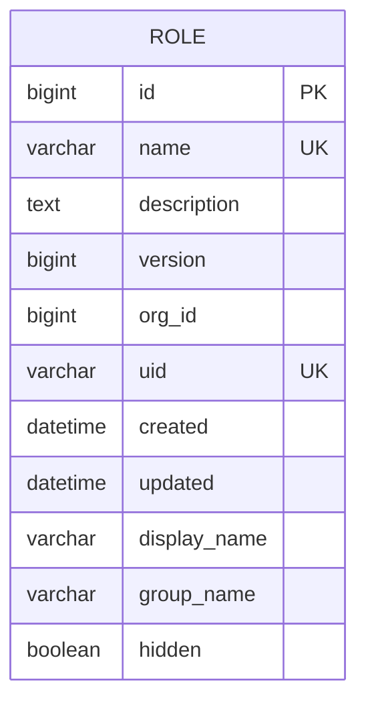
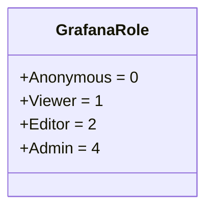
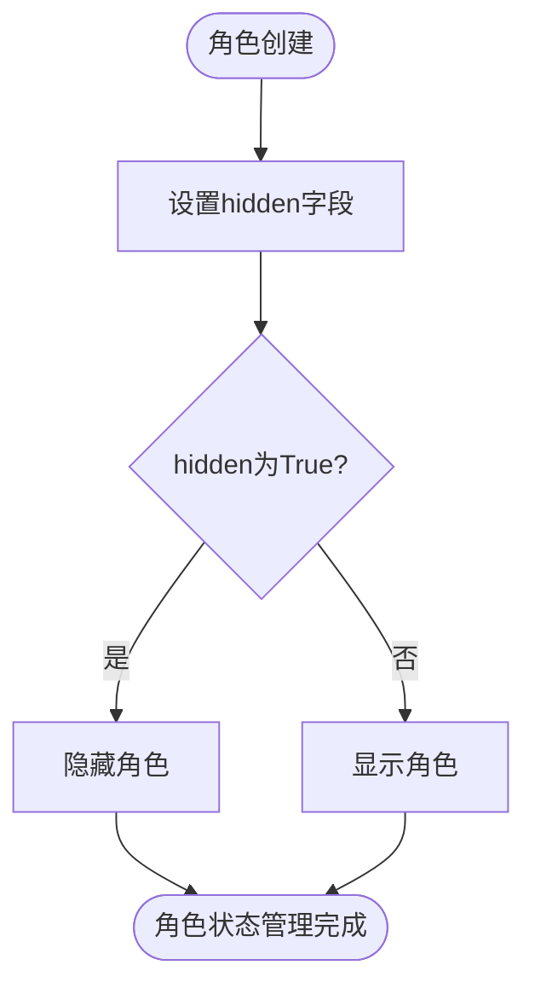

# 角色定义

<cite>
**本文档中引用的文件**   
- [models.py](file://bkmonitor/bk_dataview/models.py#L261-L316)
- [permissions.py](file://bkmonitor/bk_dataview/permissions.py#L33-L95)
- [default.py](file://bkmonitor/config/default.py#L1184-L1222)
- [api.py](file://bkmonitor/bk_dataview/api.py#L272-L415)
</cite>

## 目录
1. [角色实体数据模型](#角色实体数据模型)
2. [角色分类机制](#角色分类机制)
3. [角色状态管理](#角色状态管理)
4. [角色创建与属性管理API](#角色创建与属性管理api)
5. [系统内置角色](#系统内置角色)

## 角色实体数据模型

角色实体的数据模型主要由`Role`模型定义，该模型位于`bkmonitor/bk_dataview/models.py`文件中。以下是`Role`模型的核心属性及其数据类型和约束条件的详细描述：

- **id**: `BigAutoField`，主键，自增。
- **name**: `CharField`，最大长度190，数据库索引，唯一性约束（与`org_id`组合）。
- **description**: `TextField`，可为空，默认为空字符串。
- **version**: `BigIntegerField`，默认值为0。
- **org_id**: `BigIntegerField`，数据库索引。
- **uid**: `CharField`，最大长度40，可为空，唯一。
- **created**: `DateTimeField`，自动添加创建时间。
- **updated**: `DateTimeField`，自动更新修改时间。
- **display_name**: `CharField`，最大长度190，可为空，默认为空字符串。
- **group_name**: `CharField`，最大长度190，可为空，默认为空字符串。
- **hidden**: `BooleanField`，默认值为False。



**图表来源**
- [models.py](file://bkmonitor/bk_dataview/models.py#L261-L316)

**章节来源**
- [models.py](file://bkmonitor/bk_dataview/models.py#L261-L316)

## 角色分类机制

角色分类机制通过`GrafanaRole`枚举类实现，该类定义了四种角色类型：`Anonymous`、`Viewer`、`Editor`和`Admin`。这些角色类型在`bkmonitor/bk_dataview/permissions.py`文件中定义，具体如下：

- **Anonymous**: 值为0，表示匿名用户。
- **Viewer**: 值为1，表示查看者。
- **Editor**: 值为2，表示编辑者。
- **Admin**: 值为4，表示管理员。

角色类型通过数值大小来表示权限等级，数值越大，权限越高。例如，`Admin`角色的权限高于`Editor`，`Editor`高于`Viewer`，以此类推。



**图表来源**
- [permissions.py](file://bkmonitor/bk_dataview/permissions.py#L33-L95)

**章节来源**
- [permissions.py](file://bkmonitor/bk_dataview/permissions.py#L33-L95)

## 角色状态管理

角色状态管理通过`hidden`字段实现，该字段位于`Role`模型中，类型为`BooleanField`，默认值为False。当`hidden`字段为True时，表示该角色被隐藏，用户无法看到或使用该角色。此字段用于控制角色的可见性，而不是启用或禁用角色的功能。



**图表来源**
- [models.py](file://bkmonitor/bk_dataview/models.py#L261-L316)

**章节来源**
- [models.py](file://bkmonitor/bk_dataview/models.py#L261-L316)

## 角色创建与属性管理API

角色创建和基本属性管理的API接口主要通过`api.py`文件中的函数实现。以下是一个示例API调用，用于创建角色：

```python
def create_role(org_id, name, description="", display_name=None, group_name=None):
    """
    创建角色
    :param org_id: 组织ID
    :param name: 角色名称
    :param description: 角色描述
    :param display_name: 显示名称
    :param group_name: 组名称
    :return: 创建的角色对象
    """
    role = Role.objects.create(
        org_id=org_id,
        name=name,
        description=description,
        display_name=display_name,
        group_name=group_name
    )
    return role
```

**章节来源**
- [api.py](file://bkmonitor/bk_dataview/api.py#L272-L415)

## 系统内置角色

系统内置角色包括超级管理员、监控管理员和普通用户等。这些角色的定义和使用场景在`config/default.py`文件中配置。例如，`MONITOR_MANAGERS`列表用于配置监控管理员，`GSE_MANAGERS`列表用于配置GSE管理员。

```python
# 平台管理员
GSE_MANAGERS = []
MONITOR_MANAGERS = []
OFFICIAL_PLUGINS_MANAGERS = []
```

这些列表为空，表示默认情况下没有预设的管理员。管理员需要通过其他方式添加。

**章节来源**
- [default.py](file://bkmonitor/config/default.py#L1184-L1222)