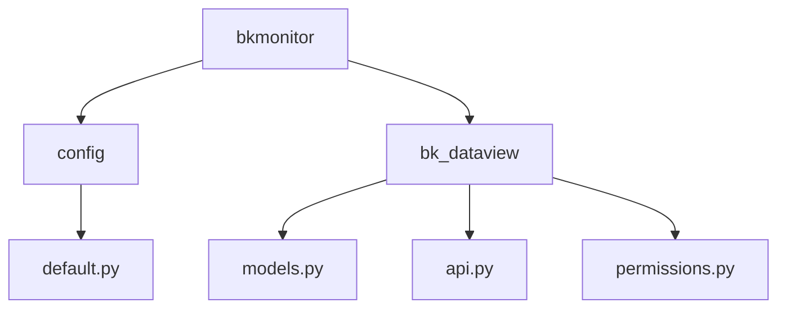
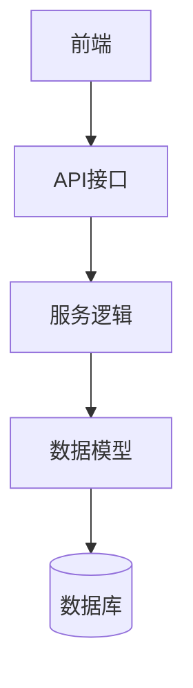
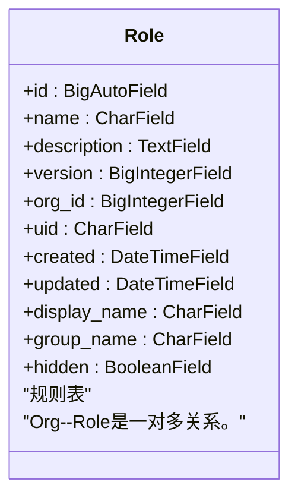
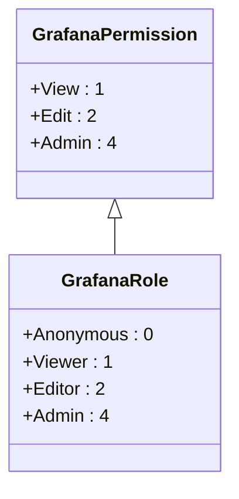
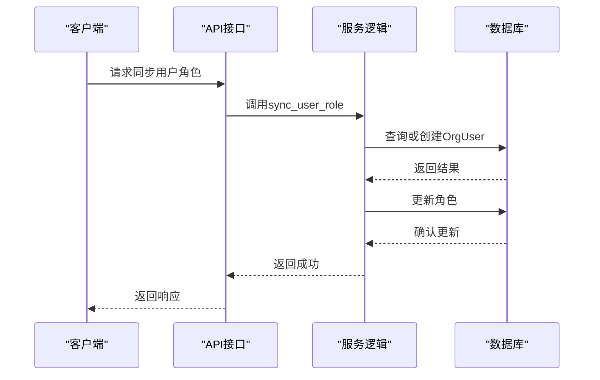
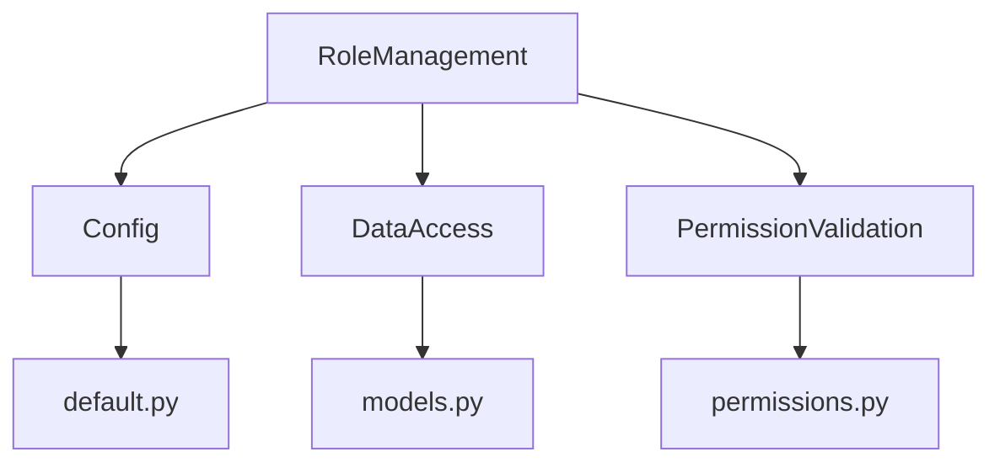

# 角色管理

<cite>
**本文档引用的文件**   
- [default.py](file://bkmonitor/config/default.py#L978-L979)
- [default.py](file://bkmonitor/config/default.py#L1040-L1060)
- [models.py](file://bkmonitor/bk_dataview/models.py#L282-L304)
- [api.py](file://bkmonitor/bk_dataview/api.py#L250-L443)
- [permissions.py](file://bkmonitor/bk_dataview/permissions.py#L0-L95)
</cite>

## 目录
1. [引言](#引言)
2. [项目结构](#项目结构)
3. [核心组件](#核心组件)
4. [架构概述](#架构概述)
5. [详细组件分析](#详细组件分析)
6. [依赖分析](#依赖分析)
7. [性能考虑](#性能考虑)
8. [故障排除指南](#故障排除指南)
9. [结论](#结论)

## 引言
本文档旨在深入解析监控平台中的角色管理模块，涵盖角色实体的设计与实现、权限配置、角色与用户的关系以及操作指南。通过详细的代码分析和示例，为开发者提供创建自定义角色的最佳实践。

## 项目结构
角色管理功能主要分布在`bkmonitor`目录下的多个子模块中，特别是`bk_dataview`和`config`目录。这些模块共同协作，实现了角色的创建、修改、删除及权限分配等功能。

**图示来源**
- [default.py](file://bkmonitor/config/default.py)
- [models.py](file://bkmonitor/bk_dataview/models.py)
- [api.py](file://bkmonitor/bk_dataview/api.py)
- [permissions.py](file://bkmonitor/bk_dataview/permissions.py)

**节来源**
- [default.py](file://bkmonitor/config/default.py)
- [models.py](file://bkmonitor/bk_dataview/models.py)
- [api.py](file://bkmonitor/bk_dataview/api.py)
- [permissions.py](file://bkmonitor/bk_dataview/permissions.py)

## 核心组件
角色管理的核心组件包括角色模型、权限定义、API接口和服务逻辑。这些组件协同工作，确保了角色管理的安全性和灵活性。

**节来源**
- [models.py](file://bkmonitor/bk_dataview/models.py#L282-L304)
- [permissions.py](file://bkmonitor/bk_dataview/permissions.py#L0-L95)
- [api.py](file://bkmonitor/bk_dataview/api.py#L250-L443)

## 架构概述
角色管理模块采用分层架构设计，主要包括数据层、服务层和接口层。数据层负责存储角色和权限信息；服务层处理业务逻辑；接口层提供RESTful API供前端调用。

**图示来源**
- [api.py](file://bkmonitor/bk_dataview/api.py)
- [models.py](file://bkmonitor/bk_dataview/models.py)

## 详细组件分析

### 角色模型分析
角色模型定义了角色的基本属性，如ID、名称、描述等，并通过外键关联到组织。

**图示来源**
- [models.py](file://bkmonitor/bk_dataview/models.py#L282-L304)

**节来源**
- [models.py](file://bkmonitor/bk_dataview/models.py#L282-L304)

### 权限定义分析
权限定义使用枚举类型来表示不同的权限级别，包括查看、编辑和管理员权限。

**图示来源**
- [permissions.py](file://bkmonitor/bk_dataview/permissions.py#L0-L95)

**节来源**
- [permissions.py](file://bkmonitor/bk_dataview/permissions.py#L0-L95)

### API接口分析
API接口提供了同步用户角色和仪表盘权限的功能，确保用户在不同组织中的权限一致。

**图示来源**
- [api.py](file://bkmonitor/bk_dataview/api.py#L250-L443)

**节来源**
- [api.py](file://bkmonitor/bk_dataview/api.py#L250-L443)

## 依赖分析
角色管理模块依赖于多个外部服务和内部组件，包括配置管理、数据访问和权限验证。这些依赖关系确保了系统的稳定性和安全性。

**图示来源**
- [default.py](file://bkmonitor/config/default.py)
- [models.py](file://bkmonitor/bk_dataview/models.py)
- [permissions.py](file://bkmonitor/bk_dataview/permissions.py)

**节来源**
- [default.py](file://bkmonitor/config/default.py)
- [models.py](file://bkmonitor/bk_dataview/models.py)
- [permissions.py](file://bkmonitor/bk_dataview/permissions.py)

## 性能考虑
为了提高性能，角色管理模块采用了缓存机制，减少了对数据库的频繁访问。同时，批量操作被用于减少网络延迟。

## 故障排除指南
常见问题包括权限同步失败和角色更新不及时。建议检查日志文件并确认服务状态。

**节来源**
- [api.py](file://bkmonitor/bk_dataview/api.py#L250-L443)
- [permissions.py](file://bkmonitor/bk_dataview/permissions.py#L0-L95)

## 结论
本文档详细介绍了监控平台中角色管理模块的设计与实现。通过理解角色模型、权限定义和API接口，开发者可以更好地利用该模块进行自定义角色的创建和管理。