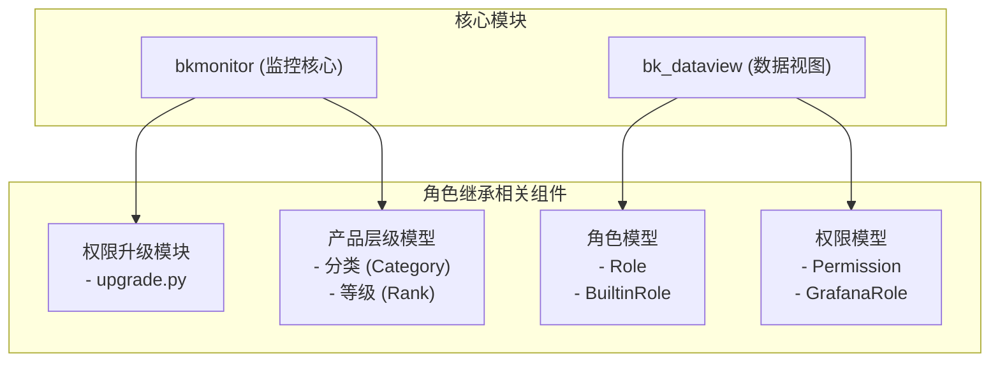
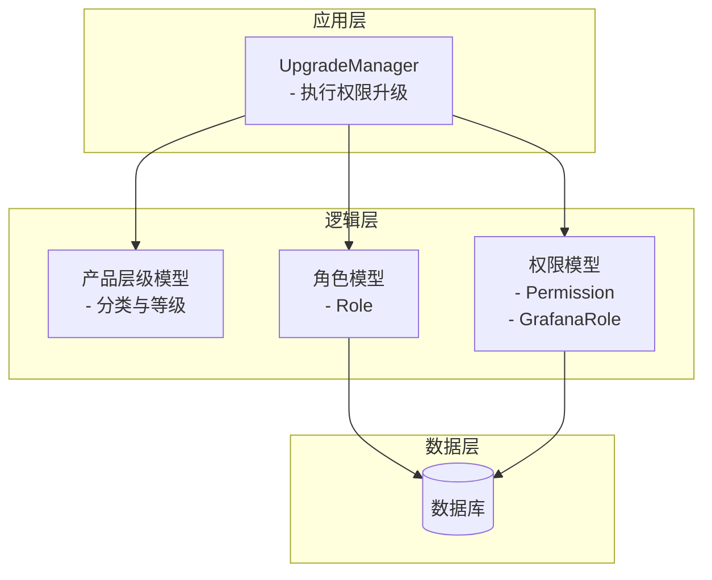
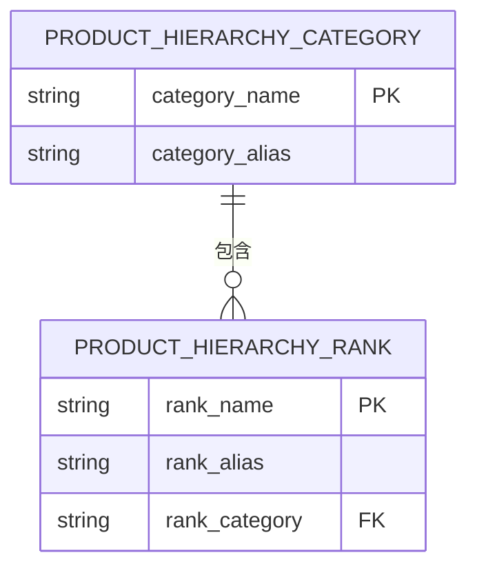
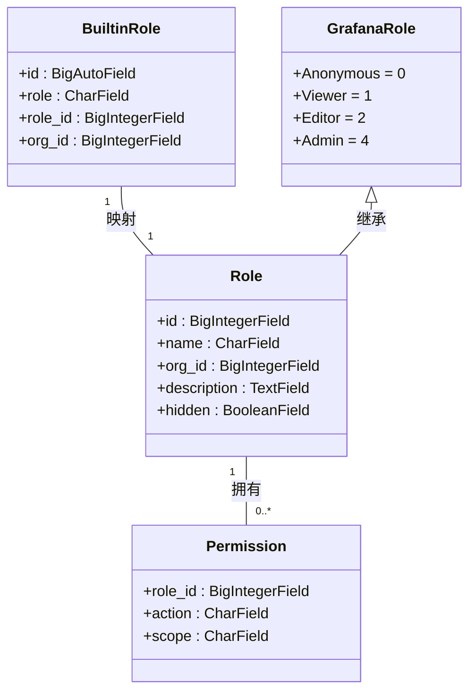
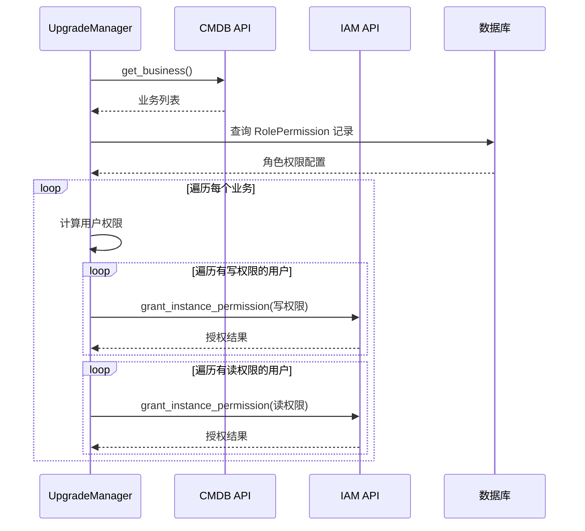
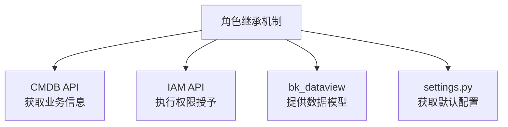

# 角色继承

<cite>
**本文档中引用的文件**   
- [resources.py](file://bkmonitor/packages/monitor_web/incident/resources.py)
- [permissions.py](file://bkmonitor/bk_dataview/permissions.py)
- [models.py](file://bkmonitor/bk_dataview/models.py)
- [upgrade.py](file://bkmonitor/bkmonitor/iam/upgrade.py)
</cite>

## 目录
1. [简介](#简介)
2. [项目结构](#项目结构)
3. [核心组件](#核心组件)
4. [架构概述](#架构概述)
5. [详细组件分析](#详细组件分析)
6. [依赖分析](#依赖分析)
7. [性能考虑](#性能考虑)
8. [故障排除指南](#故障排除指南)
9. [结论](#结论)

## 简介
本文档旨在深入解析蓝鲸监控平台中的角色继承机制。该机制通过产品层级模型（Product Hierarchy）实现，将角色权限与业务实体的层级结构相结合，从而构建出一个灵活、可扩展的权限管理体系。文档将详细阐述角色继承的数据模型、权限传递规则、实现原理以及最佳实践。

## 项目结构
蓝鲸监控平台的代码库采用模块化设计，角色继承相关的功能主要分布在 `bkmonitor` 和 `bk_dataview` 两个核心模块中。`bkmonitor` 负责业务逻辑和权限管理，而 `bk_dataview` 则提供了底层的权限模型和数据视图。

**图源**
- [resources.py](file://bkmonitor/packages/monitor_web/incident/resources.py)
- [models.py](file://bkmonitor/bk_dataview/models.py)
- [upgrade.py](file://bkmonitor/bkmonitor/iam/upgrade.py)

## 核心组件
角色继承机制的核心由四个部分构成：产品层级模型、角色模型、权限模型和权限升级模块。产品层级模型定义了业务实体的分类和等级，是角色继承的骨架。角色模型和权限模型定义了权限的主体和客体。权限升级模块则负责将基于产品层级的配置同步到实际的权限系统中。

**节源**
- [resources.py](file://bkmonitor/packages/monitor_web/incident/resources.py#L300-L350)
- [models.py](file://bkmonitor/bk_dataview/models.py#L260-L316)
- [permissions.py](file://bkmonitor/bk_dataview/permissions.py#L0-L80)

## 架构概述
整个角色继承机制的架构可以分为三层：数据层、逻辑层和应用层。数据层由数据库中的 `role`、`permission` 等表构成。逻辑层通过 `Role`、`GrafanaRole` 等类实现核心逻辑。应用层则通过 `UpgradeManager` 等服务类，将产品层级的配置转化为具体的权限分配。

**图源**
- [upgrade.py](file://bkmonitor/bkmonitor/iam/upgrade.py#L30-L128)
- [models.py](file://bkmonitor/bk_dataview/models.py#L260-L316)

## 详细组件分析

### 产品层级模型分析
产品层级模型是角色继承的基础，它通过“分类”和“等级”两个维度来组织业务实体。一个“分类”（如“服务”、“主机/云平台”）可以包含多个“等级”（如“服务模块”、“K8S”）。这种结构允许权限沿着层级进行继承和传递。

#### 分类与等级关系图

**图源**
- [resources.py](file://bkmonitor/packages/monitor_web/incident/resources.py#L318-L345)
- [test_processor.py](file://bkmonitor/alarm_backends/tests/service/access/incident/test_processor.py#L139-L179)

### 角色与权限模型分析
角色和权限模型定义了权限的主体和客体。`Role` 模型代表一个角色，`Permission` 模型代表一个具体的权限项。`GrafanaRole` 枚举定义了角色的等级，其值越大，权限越高。

#### 角色与权限类图

**图源**
- [models.py](file://bkmonitor/bk_dataview/models.py#L260-L316)
- [permissions.py](file://bkmonitor/bk_dataview/permissions.py#L33-L79)

### 权限升级流程分析
权限升级模块是角色继承机制的执行引擎。它读取产品层级的配置，计算出每个用户应拥有的权限，并调用底层API进行授权。

#### 权限升级序列图

**图源**
- [upgrade.py](file://bkmonitor/bkmonitor/iam/upgrade.py#L30-L128)

## 依赖分析
角色继承机制依赖于多个外部系统和内部模块。它依赖 `CMDB` 获取业务信息，依赖 `IAM` (身份与访问管理) 系统执行最终的权限授予，并依赖 `bk_dataview` 提供的数据库模型。

**图源**
- [upgrade.py](file://bkmonitor/bkmonitor/iam/upgrade.py#L30-L128)
- [models.py](file://bkmonitor/bk_dataview/models.py#L260-L316)

## 性能考虑
权限升级是一个批量操作，可能涉及大量用户和权限项。为提高性能，系统采用了以下策略：
1.  **批量处理**：在 `upgrade.py` 中，权限授予是按业务批量进行的。
2.  **并发执行**：虽然当前代码是串行处理业务，但可以很容易地通过多线程或异步任务进行优化。
3.  **缓存机制**：频繁访问的业务信息（`biz_info`）在 `UpgradeManager` 初始化时就被加载到内存中，避免了重复的API调用。

## 故障排除指南
在使用角色继承机制时，可能会遇到以下问题：
1.  **权限未生效**：检查 `RolePermission` 表中的配置是否正确，确认 `upgrade.py` 脚本是否已成功执行。
2.  **用户角色错误**：检查 `OrgUser` 表中用户的 `role` 字段是否与预期一致。
3.  **产品层级配置错误**：检查 `product_hierarchy_rank` 和 `product_hierarchy_category` 的配置，确保等级和分类的关联正确。

**节源**
- [upgrade.py](file://bkmonitor/bkmonitor/iam/upgrade.py#L30-L128)
- [models.py](file://bkmonitor/bk_dataview/models.py#L260-L316)

## 结论
蓝鲸监控平台的角色继承机制通过产品层级模型，实现了对复杂业务场景下权限的精细化管理。该机制将静态的角色权限与动态的业务实体结构相结合，极大地提高了权限管理的灵活性和可维护性。开发者在设计类似系统时，应借鉴其分层架构和模块化设计思想，同时注意性能优化和错误处理。