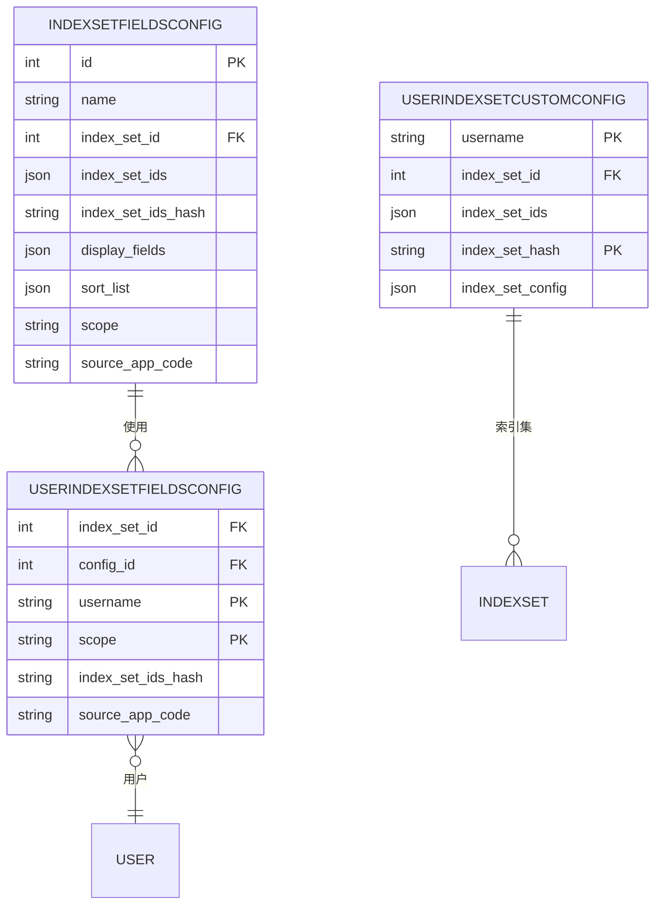

# 用户配置模型

<cite>
**本文档引用的文件**   
- [models.py](file://bklog/apps/log_search/models.py)
- [index_set.py](file://bklog/apps/log_search/handlers/index_set.py)
- [search_views.py](file://bklog/apps/log_search/views/search_views.py)
- [serializers.py](file://bklog/apps/log_search/serializers.py)
- [10_获取表格配置列表以及当前使用配置.md](file://bkm_search_module/docs/apidocs/10_获取表格配置列表以及当前使用配置.md)
</cite>

## 目录
1. [引言](#引言)
2. [核心实体结构](#核心实体结构)
3. [用户个性化设置功能](#用户个性化设置功能)
4. [用户配置与索引集的关联机制](#用户配置与索引集的关联机制)
5. [搜索历史记录中的应用](#搜索历史记录中的应用)
6. [用户配置的同步策略和数据一致性保证](#用户配置的同步策略和数据一致性保证)
7. [用户体验优化建议](#用户体验优化建议)
8. [结论](#结论)

## 引言
本文档旨在详细描述蓝鲸日志平台中的用户配置模型，重点分析`UserIndexSetConfig`、`IndexSetFieldsConfig`等用户相关实体的结构和行为。文档将解释`scope`、`from_favorite_id`、`custom_config`等字段的用户个性化设置功能，阐明用户配置与索引集的关联机制，以及在搜索历史记录中的应用。同时，文档将提供用户配置的同步策略、数据一致性保证机制，并给出用户体验优化建议。

## 核心实体结构

### UserIndexSetCustomConfig 模型
`UserIndexSetCustomConfig`模型用于存储用户的索引集自定义配置，是实现用户个性化设置的核心实体。

**模型字段**:
- `username` (字符串): 用户名，标识配置所属的用户。
- `index_set_id` (整数): 索引集ID，当配置为单个索引集时使用。
- `index_set_ids` (JSON字段): 索引集ID列表，当配置为联合索引集时使用。
- `index_set_hash` (字符串): 索引集哈希值，作为唯一标识符，确保配置的唯一性。
- `index_set_config` (JSON字段): 存储具体的用户自定义配置内容，如字段宽度等。

**关键特性**:
- 通过`index_set_hash`和`username`的组合保证了每个用户对特定索引集（或联合索引集）的配置是唯一的。
- 使用`get_index_set_hash`类方法根据`index_set_id`或`index_set_ids`生成哈希值，作为`index_set_hash`的值。

**Section sources**
- [models.py](file://bklog/apps/log_search/models.py#L1515-L1532)

### IndexSetFieldsConfig 模型
`IndexSetFieldsConfig`模型定义了索引集的展示字段和排序规则的配置模板。

**模型字段**:
- `name` (字符串): 配置名称，如“默认”、“上下文”等。
- `index_set_id` (整数): 关联的单个索引集ID。
- `index_set_ids` (JSON字段): 关联的联合索引集ID列表。
- `index_set_ids_hash` (字符串): 联合索引集ID列表的哈希值。
- `display_fields` (JSON字段): 需要展示的字段列表。
- `sort_list` (JSON字段): 排序规则列表。
- `scope` (字符串): 应用范围，如`default`（默认搜索）、`search_context`（上下文搜索）等。
- `source_app_code` (字符串): 来源系统。

**关键特性**:
- 通过`index_set_id`或`index_set_ids_hash`与`name`和`scope`的组合来唯一标识一个配置。
- 提供了`delete_config`类方法来安全地删除配置，确保默认配置不会被删除，并将引用该配置的用户配置指向默认配置。

**Section sources**
- [models.py](file://bklog/apps/log_search/models.py#L1393-L1447)

### UserIndexSetFieldsConfig 模型
`UserIndexSetFieldsConfig`模型是用户与`IndexSetFieldsConfig`之间的关联表，记录了用户当前使用的配置。

**模型字段**:
- `index_set_id` (整数): 用户当前使用的单个索引集ID。
- `config_id` (整数): 用户当前使用的`IndexSetFieldsConfig`的ID。
- `username` (字符串): 用户名。
- `scope` (字符串): 当前应用的范围。
- `index_set_ids` (JSON字段): 用户当前使用的联合索引集ID列表。
- `index_set_ids_hash` (字符串): 联合索引集ID列表的哈希值。

**关键特性**:
- 通过`index_set_id`（或`index_set_ids_hash`）、`username`、`scope`和`source_app_code`的组合来唯一标识一个用户的当前配置。
- 提供了`get_config`类方法来获取用户在特定索引集和范围下的配置，如果用户没有自定义配置，则返回该索引集的默认配置。

**Section sources**
- [models.py](file://bklog/apps/log_search/models.py#L1449-L1503)

## 用户个性化设置功能

### scope 字段
`scope`字段定义了配置的应用范围。不同的搜索场景（如默认搜索、上下文搜索、实时日志）可以有不同的字段展示和排序规则。例如，在“上下文”搜索中，用户可能希望看到`offset`和`iterationIndex`等定位字段，而在默认搜索中则不需要。

### from_favorite_id 字段
`from_favorite_id`字段记录了本次搜索是基于哪个收藏（Favorite）发起的。这使得用户可以从收藏中快速恢复之前的搜索条件，包括关键词、时间范围、IP选择器等，极大地提升了搜索效率和用户体验。

**Section sources**
- [models.py](file://bklog/apps/log_search/models.py#L733)
- [search_views.py](file://bklog/apps/log_search/views/search_views.py#L1866-L1901)

### custom_config 字段
`custom_config`字段（在`UserIndexSetCustomConfig`模型中以`index_set_config`形式存在）是一个JSON字段，用于存储用户自定义的配置。目前，它主要用于存储字段的宽度配置（`fields_width`），允许用户根据自己的屏幕和阅读习惯调整不同字段的显示宽度。

## 用户配置与索引集的关联机制

用户配置与索引集的关联通过`UserIndexSetFieldsConfig`模型实现。其核心流程如下：

1.  **配置创建**: 当用户创建一个新的字段配置（如“我的配置”）时，系统会创建一个`IndexSetFieldsConfig`实例，存储`display_fields`和`sort_list`。
2.  **配置关联**: 系统会创建或更新一个`UserIndexSetFieldsConfig`实例，将用户的`username`、当前的`index_set_id`（或`index_set_ids_hash`）、`scope`与新创建的`IndexSetFieldsConfig`的`config_id`关联起来。
3.  **配置应用**: 当用户再次访问该索引集时，系统通过`UserIndexSetFieldsConfig.get_config`方法，根据用户的`username`、`index_set_id`和`scope`查找其当前使用的`config_id`，然后加载对应的`IndexSetFieldsConfig`来应用配置。

这种设计实现了配置的复用（多个用户可以使用同一个`IndexSetFieldsConfig`）和个性化（每个用户可以有自己的`UserIndexSetFieldsConfig`指向不同的配置）。

**Diagram sources**
- [models.py](file://bklog/apps/log_search/models.py#L1393-L1532)

## 搜索历史记录中的应用

用户配置模型与搜索历史记录紧密集成，主要体现在`UserIndexSetSearchHistory`模型中。

### 关联机制
`UserIndexSetSearchHistory`模型记录了用户的每一次搜索行为，其关键字段包括：
- `index_set_id`: 搜索的索引集ID。
- `params`: 搜索的详细参数，如关键词、时间范围等。
- `from_favorite_id`: 记录此次搜索是基于哪个收藏发起的。
- `search_type`: 搜索类型，如`default`（默认搜索）。

当用户执行一次搜索时，系统会创建一条`UserIndexSetSearchHistory`记录。如果这次搜索是基于一个收藏，`from_favorite_id`字段会被填充。这使得系统能够追溯搜索的来源。

### 应用场景
1.  **历史记录恢复**: 用户可以在历史记录中查看过去的搜索，并一键恢复到当时的搜索状态。
2.  **收藏管理**: 通过`from_favorite_id`，可以知道哪些历史记录是由特定收藏产生的，便于进行收藏的使用统计和管理。
3.  **个性化推荐**: 系统可以分析用户的搜索历史，结合其收藏和配置，为用户推荐可能感兴趣的索引集或搜索模式。

**Section sources**
- [models.py](file://bklog/apps/log_search/models.py#L720-L734)

## 用户配置的同步策略和数据一致性保证

### 同步策略
用户配置的同步主要发生在用户主动操作时，属于**写时同步**策略：
- **创建/更新配置**: 当用户通过`UserIndexSetConfigHandler`更新或创建`UserIndexSetCustomConfig`时，操作会直接写入数据库。
- **切换配置**: 当用户通过`IndexSetHandler.config`方法切换`IndexSetFieldsConfig`时，系统会更新`UserIndexSetFieldsConfig`表，整个过程在一个数据库事务中完成，保证了原子性。

### 数据一致性保证
系统通过多种机制保证数据一致性：
1.  **数据库约束**: 使用`unique_together`约束确保`UserIndexSetCustomConfig`和`UserIndexSetFieldsConfig`的唯一性，防止数据重复。
2.  **事务处理**: 在删除`IndexSetFieldsConfig`时，使用`@atomic`装饰器确保更新所有引用该配置的`UserIndexSetFieldsConfig`并删除原配置的操作在一个事务中完成，避免出现“悬挂”引用。
3.  **哈希标识**: 使用`index_set_hash`和`index_set_ids_hash`作为唯一标识，避免了因ID列表顺序不同而导致的逻辑错误。
4.  **默认配置保护**: `delete_config`方法会检查被删除的配置是否为默认配置，如果是，则抛出异常，防止系统缺少基础配置。

**Section sources**
- [index_set.py](file://bklog/apps/log_search/handlers/index_set.py#L134-L150)
- [models.py](file://bklog/apps/log_search/models.py#L1416-L1443)

## 用户体验优化建议

### 默认配置设置
- **提供多样化的默认配置**: 除了“默认”配置外，为不同的搜索场景（如上下文、实时日志）提供预设的、经过优化的默认配置。例如，上下文搜索的默认配置应包含`offset`和`iterationIndex`等关键定位字段。
- **智能推荐**: 根据用户最常使用的字段和排序规则，动态生成一个“智能推荐”配置，并将其置顶，方便用户快速选择。

### 配置迁移方案
- **配置导出/导入**: 提供配置的导出（为JSON文件）和导入功能，允许用户在不同环境或账号间迁移自己的个性化配置。
- **配置模板**: 允许管理员或高级用户创建“配置模板”，并分享给团队成员，新用户可以一键应用团队标准配置，降低上手成本。
- **向后兼容**: 当系统升级导致字段名称或结构发生变化时，应在后台自动将旧配置映射到新字段，避免用户配置失效。

## 结论
蓝鲸日志平台的用户配置模型通过`UserIndexSetCustomConfig`、`IndexSetFieldsConfig`和`UserIndexSetFieldsConfig`三个核心模型，构建了一个灵活、可扩展且一致的个性化配置体系。该模型不仅支持用户对字段展示、排序和宽度的深度定制，还通过`from_favorite_id`等字段与搜索历史、收藏功能深度集成，形成了完整的用户体验闭环。通过严格的数据库约束和事务处理，系统保证了配置数据的一致性和可靠性。未来可通过引入配置模板和导出/导入功能，进一步提升用户体验和配置的可移植性。