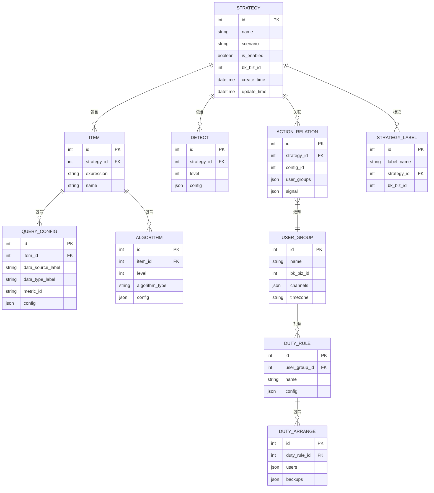
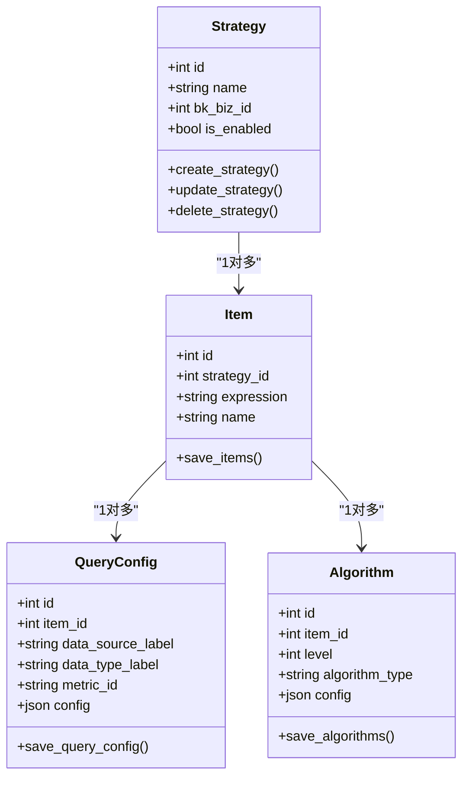
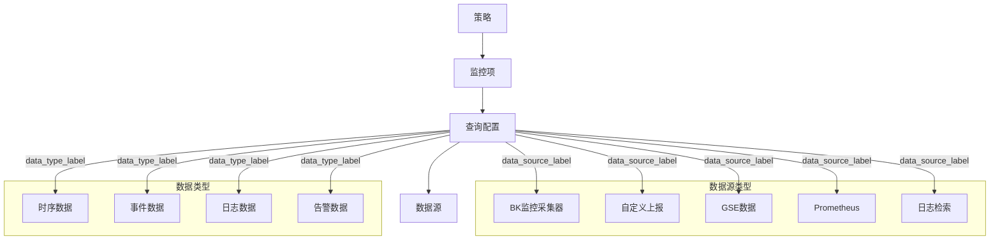
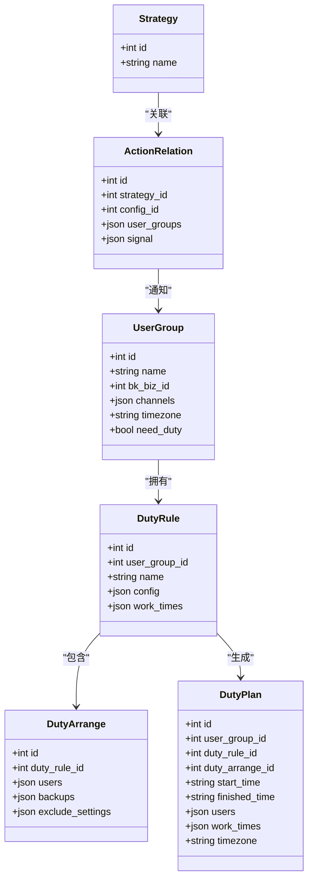
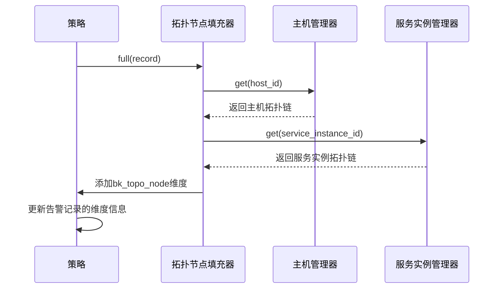
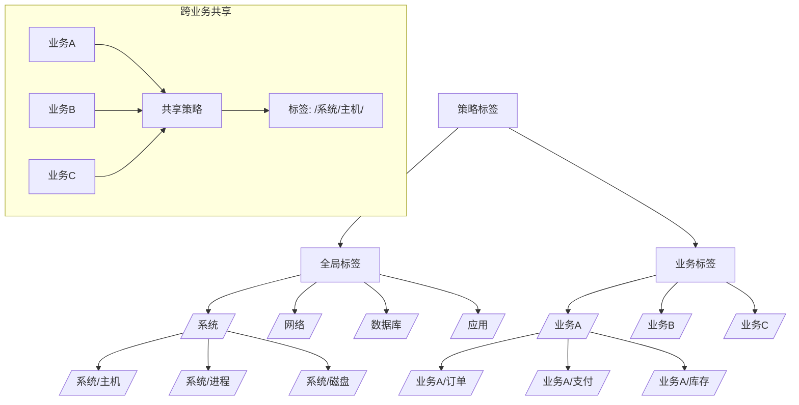
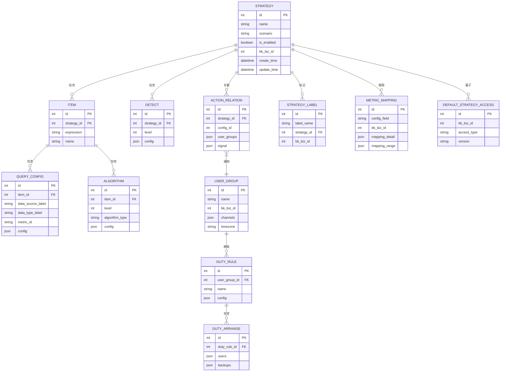

# 实体关系

<cite>
**本文档引用的文件**   
- [strategy.py](file://bkmonitor/bkmonitor/models/strategy.py)
- [test_base.py](file://bkmonitor/bkmonitor/strategy/tests/test_base.py)
- [v2.py](file://packages/monitor_web/strategies/resources/v2.py)
- [public.py](file://packages/monitor_web/strategies/resources/public.py)
- [new_strategy.py](file://bkmonitor/bkmonitor/strategy/new_strategy.py)
- [strategy_label.py](file://packages/monitor_web/strategies/resources/strategy_label.py)
- [query_config.py](file://bkmonitor/bkmonitor/strategy/query_config.py)
- [action.py](file://bkmonitor/bkmonitor/action/serializers/strategy.py)
</cite>

## 目录
1. [引言](#引言)
2. [策略模型核心实体](#策略模型核心实体)
3. [策略与指标的关系](#策略与指标的关系)
4. [策略与数据源的关系](#策略与数据源的关系)
5. [策略与用户组的关系](#策略与用户组的关系)
6. [策略与服务拓扑的关系](#策略与服务拓扑的关系)
7. [策略标签系统与跨业务共享](#策略标签系统与跨业务共享)
8. [外键约束与级联操作](#外键约束与级联操作)
9. [实体关系图](#实体关系图)

## 引言
本文档深入分析监控系统中策略模型与其他核心实体的关系，包括与指标、数据源、用户组、服务拓扑的关联方式。通过详细分析代码结构和数据模型，揭示了策略ID如何关联到具体的监控数据源和采集配置，以及如何实现跨业务的策略共享和复用机制。文档还解释了外键约束和级联操作的具体实现方式。

## 策略模型核心实体
策略模型是监控系统的核心，它定义了监控规则、告警条件和响应动作。策略模型通过多个关联模型来实现复杂的监控逻辑。



**图示来源**
- [strategy.py](file://bkmonitor/bkmonitor/models/strategy.py)

**本节来源**
- [strategy.py](file://bkmonitor/bkmonitor/models/strategy.py)

## 策略与指标的关系
策略通过指标配置来定义监控的具体内容。每个策略包含一个或多个监控项（Item），每个监控项又包含一个或多个查询配置（QueryConfig）和算法配置（Algorithm）。



**图示来源**
- [strategy.py](file://bkmonitor/bkmonitor/models/strategy.py)
- [new_strategy.py](file://bkmonitor/bkmonitor/strategy/new_strategy.py)

**本节来源**
- [strategy.py](file://bkmonitor/bkmonitor/models/strategy.py)
- [new_strategy.py](file://bkmonitor/bkmonitor/strategy/new_strategy.py)

## 策略与数据源的关系
策略通过查询配置模型与具体的数据源建立关联。数据源标签（data_source_label）和数据类型标签（data_type_label）用于标识数据来源。



**图示来源**
- [strategy.py](file://bkmonitor/bkmonitor/models/strategy.py)
- [query_config.py](file://bkmonitor/bkmonitor/strategy/query_config.py)

**本节来源**
- [strategy.py](file://bkmonitor/bkmonitor/models/strategy.py)
- [query_config.py](file://bkmonitor/bkmonitor/strategy/query_config.py)

## 策略与用户组的关系
策略通过动作配置关系模型与用户组建立关联，实现告警通知的分发。用户组还包含轮值规则，用于定义值班安排。



**图示来源**
- [strategy.py](file://bkmonitor/bkmonitor/models/strategy.py)
- [action.py](file://bkmonitor/bkmonitor/action/serializers/strategy.py)

**本节来源**
- [strategy.py](file://bkmonitor/bkmonitor/models/strategy.py)
- [action.py](file://bkmonitor/bkmonitor/action/serializers/strategy.py)

## 策略与服务拓扑的关系
策略通过目标（target）配置与服务拓扑建立关联。服务拓扑信息用于确定监控范围和告警上下文。



**图示来源**
- [test_fullers.py](file://alarm_backends/tests/service/access/data/test_fullers.py)

**本节来源**
- [test_fullers.py](file://alarm_backends/tests/service/access/data/test_fullers.py)

## 策略标签系统与跨业务共享
策略标签系统实现了策略的分类管理和跨业务共享。通过标签的层级结构和业务ID的组合，实现了灵活的策略组织方式。



**图示来源**
- [public.py](file://packages/monitor_web/strategies/resources/public.py)
- [strategy_label.py](file://packages/monitor_web/strategies/resources/strategy_label.py)

**本节来源**
- [public.py](file://packages/monitor_web/strategies/resources/public.py)
- [strategy_label.py](file://packages/monitor_web/strategies/resources/strategy_label.py)

## 外键约束与级联操作
系统通过外键约束和级联操作确保数据的一致性和完整性。当删除策略时，相关的监控项、查询配置、算法等都会被级联删除。

```mermaid
classDiagram
class StrategyModel {
+int id
+on_delete : CASCADE
}
class ItemModel {
+int id
+int strategy_id
+on_delete : CASCADE
}
class QueryConfigModel {
+int id
+int item_id
+on_delete : CASCADE
}
class AlgorithmModel {
+int id
+int item_id
+on_delete : CASCADE
}
class DetectModel {
+int id
+int strategy_id
+on_delete : CASCADE
}
class RelationModel {
+int id
+int strategy_id
+on_delete : CASCADE
}
class StrategyLabel {
+int id
+int strategy_id
+on_delete : CASCADE
}
StrategyModel --> ItemModel : "1对多"
ItemModel --> QueryConfigModel : "1对多"
ItemModel --> AlgorithmModel : "1对多"
StrategyModel --> DetectModel : "1对多"
StrategyModel --> RelationModel : "1对多"
StrategyModel --> StrategyLabel : "1对多"
note right of StrategyModel
删除策略时，
所有关联的监控项、
查询配置、算法等
都会被级联删除
end note
```

**图示来源**
- [strategy.py](file://bkmonitor/bkmonitor/models/strategy.py)
- [test_base.py](file://bkmonitor/bkmonitor/strategy/tests/test_base.py)

**本节来源**
- [strategy.py](file://bkmonitor/bkmonitor/models/strategy.py)
- [test_base.py](file://bkmonitor/bkmonitor/strategy/tests/test_base.py)

## 实体关系图
综合以上分析，策略模型与其他核心实体的关系如下：



**图示来源**
- [strategy.py](file://bkmonitor/bkmonitor/models/strategy.py)
- [test_base.py](file://bkmonitor/bkmonitor/strategy/tests/test_base.py)
- [v2.py](file://packages/monitor_web/strategies/resources/v2.py)

**本节来源**
- [strategy.py](file://bkmonitor/bkmonitor/models/strategy.py)
- [test_base.py](file://bkmonitor/bkmonitor/strategy/tests/test_base.py)
- [v2.py](file://packages/monitor_web/strategies/resources/v2.py)