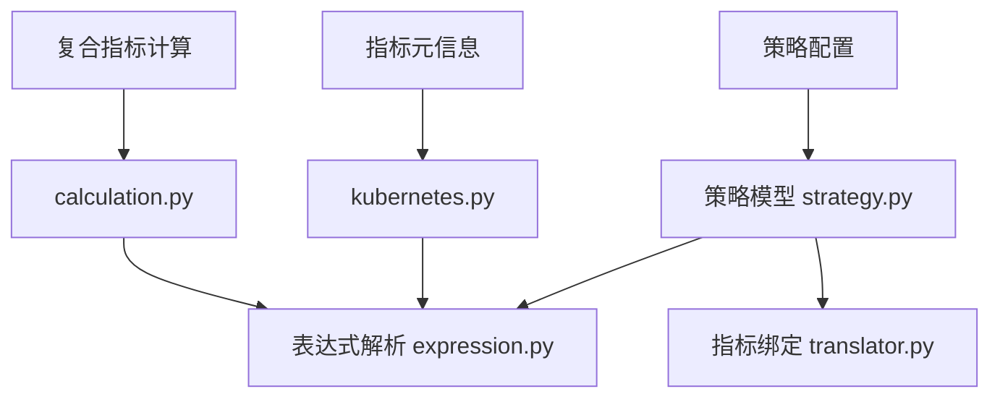
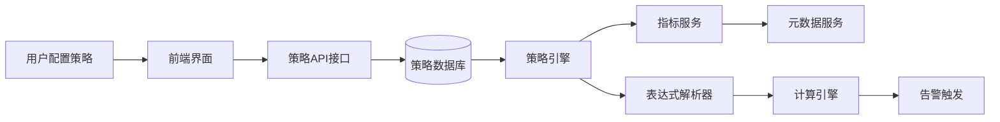
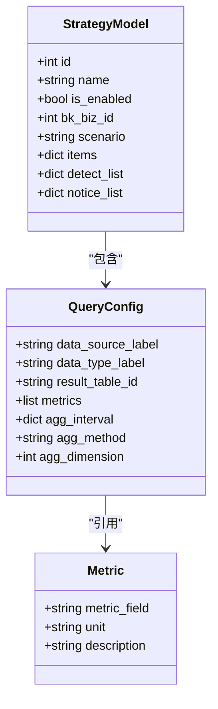
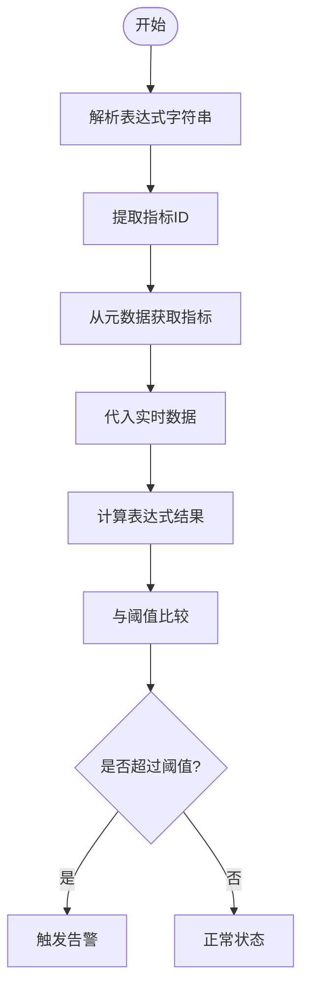
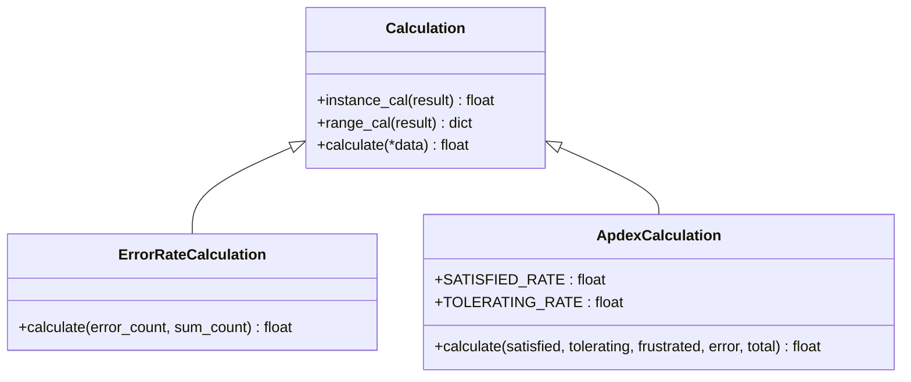
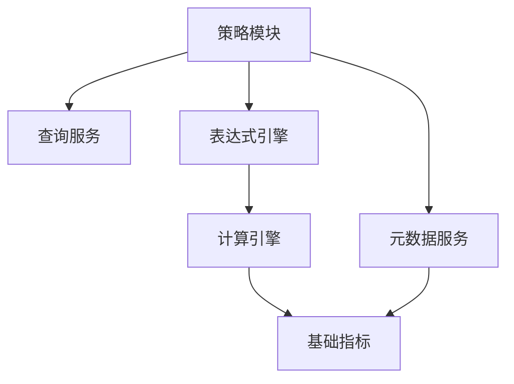

# 策略与指标关联

<cite>
**本文档引用文件**  
- [strategy.py](file://bkmonitor/bkmonitor/models/strategy.py)
- [expression.py](file://bkmonitor/bkmonitor/strategy/expression.py)
- [calculation.py](file://bkmonitor/packages/apm_web/calculation.py)
- [translator.py](file://bkmonitor/packages/fta_web/alert/handlers/translator.py)
- [strategy.py](file://bkmonitor/constants/strategy.py)
- [kubernetes.py](file://bkmonitor/packages/monitor_web/scene_view/builtin/constants/kubernetes.py)
</cite>

## 目录
1. [引言](#引言)
2. [项目结构](#项目结构)
3. [核心组件](#核心组件)
4. [架构概览](#架构概览)
5. [详细组件分析](#详细组件分析)
6. [依赖分析](#依赖分析)
7. [性能考量](#性能考量)
8. [故障排查指南](#故障排查指南)
9. [结论](#结论)

## 引言
本文档深入解析监控系统中策略与监控指标的映射关系，涵盖指标ID绑定机制、字段提取逻辑、多指标聚合策略实现方式，以及策略配置中条件与阈值规则的定义方法。同时说明指标元信息从元数据服务到策略引擎的传递流程，并通过实际案例展示复合指标（如CPU使用率）的计算实现。

## 项目结构
项目采用模块化设计，主要功能分布在多个子目录中。核心策略逻辑位于`bkmonitor/bkmonitor/strategy/`目录下，指标处理相关代码分散在`packages/`模块中，而策略模型定义则位于`models/strategy.py`。表达式解析用于实现策略条件判断，复合指标计算逻辑在APM模块的`calculation.py`中实现。

**图示来源**  
- [strategy.py](file://bkmonitor/bkmonitor/models/strategy.py)
- [expression.py](file://bkmonitor/bkmonitor/strategy/expression.py)
- [calculation.py](file://bkmonitor/packages/apm_web/calculation.py)
- [kubernetes.py](file://bkmonitor/packages/monitor_web/scene_view/builtin/constants/kubernetes.py)

**本节来源**  
- [strategy.py](file://bkmonitor/bkmonitor/models/strategy.py)
- [expression.py](file://bkmonitor/bkmonitor/strategy/expression.py)

## 核心组件
系统通过`StrategyModel`类定义策略实体，每个策略可绑定一个或多个查询配置（query_configs），每个查询配置指向具体的监控指标。指标通过`metric_id`进行唯一标识，该ID由数据源标签、指标字段名等组合生成。策略条件通过表达式语言定义，支持阈值比较、逻辑运算等操作。

**本节来源**  
- [strategy.py](file://bkmonitor/bkmonitor/models/strategy.py)
- [constants/strategy.py](file://bkmonitor/constants/strategy.py)

## 架构概览
整个策略与指标关联系统由策略配置层、表达式解析层、指标绑定层和计算执行层构成。用户在前端配置策略时，选择目标指标并设置阈值条件；系统将策略保存至数据库，并通过表达式引擎解析条件逻辑；在告警检测阶段，系统根据策略绑定的指标ID从数据源获取实时数据，代入表达式进行计算判断是否触发告警。

**图示来源**  
- [strategy.py](file://bkmonitor/bkmonitor/models/strategy.py)
- [expression.py](file://bkmonitor/bkmonitor/strategy/expression.py)
- [translator.py](file://bkmonitor/packages/fta_web/alert/handlers/translator.py)

## 详细组件分析

### 策略模型分析
`StrategyModel`是策略的核心数据结构，包含策略名称、启用状态、业务ID、场景分类及详细的查询配置列表。每个查询配置包含数据源信息、结果表ID、指标字段名和维度条件，用于精确指定监控目标。

**图示来源**  
- [strategy.py](file://bkmonitor/bkmonitor/models/strategy.py)

**本节来源**  
- [strategy.py](file://bkmonitor/bkmonitor/models/strategy.py)

### 表达式与阈值规则分析
策略条件通过表达式定义，支持数学运算和逻辑判断。表达式中使用别名（如A、B）代表不同指标，通过四则运算和函数组合形成复杂条件。阈值规则以表达式结果与常数比较的形式存在，例如`A > 80`表示指标A超过80即触发告警。

**图示来源**  
- [expression.py](file://bkmonitor/bkmonitor/strategy/expression.py)

**本节来源**  
- [expression.py](file://bkmonitor/bkmonitor/strategy/expression.py)

### 复合指标计算分析
复合指标通过基础指标的数学组合计算得出。例如CPU使用率通过`used/total*100`公式计算。系统在`calculation.py`中定义了多种计算策略类，如`ErrorRateCalculation`用于错误率计算，`ApdexCalculation`用于用户体验评分计算。

**图示来源**  
- [calculation.py](file://bkmonitor/packages/apm_web/calculation.py)

**本节来源**  
- [calculation.py](file://bkmonitor/packages/apm_web/calculation.py)

## 依赖分析
策略系统依赖多个核心模块：元数据服务提供指标定义，查询服务负责数据获取，表达式引擎处理条件逻辑，计算引擎执行复合指标运算。各组件通过标准化接口通信，确保松耦合和高可维护性。

**图示来源**  
- [strategy.py](file://bkmonitor/bkmonitor/models/strategy.py)
- [expression.py](file://bkmonitor/bkmonitor/strategy/expression.py)
- [calculation.py](file://bkmonitor/packages/apm_web/calculation.py)

**本节来源**  
- [strategy.py](file://bkmonitor/bkmonitor/models/strategy.py)
- [expression.py](file://bkmonitor/bkmonitor/strategy/expression.py)

## 性能考量
为提升性能，系统采用指标ID缓存机制，避免重复解析指标路径。复合指标计算在数据查询层完成，减少网络传输量。表达式引擎使用预编译技术，加快条件判断速度。对于高频策略，系统支持聚合计算优化，降低资源消耗。

## 故障排查指南
当策略未按预期触发时，应检查：策略是否启用、指标ID是否正确、数据源是否有数据、表达式语法是否合法、阈值设置是否合理。可通过查看策略执行日志和指标查询结果来定位问题。

**本节来源**  
- [strategy.py](file://bkmonitor/bkmonitor/models/strategy.py)
- [expression.py](file://bkmonitor/bkmonitor/strategy/expression.py)

## 结论
本系统通过灵活的策略模型和表达式引擎，实现了监控指标与告警策略的高效关联。支持从简单阈值到复杂复合指标的全方位监控需求，具备良好的扩展性和可维护性，为业务稳定性提供有力保障。