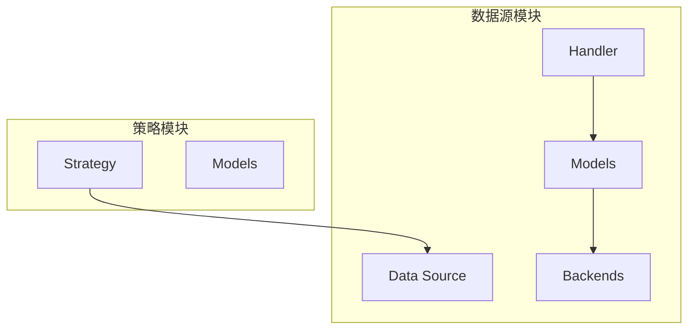
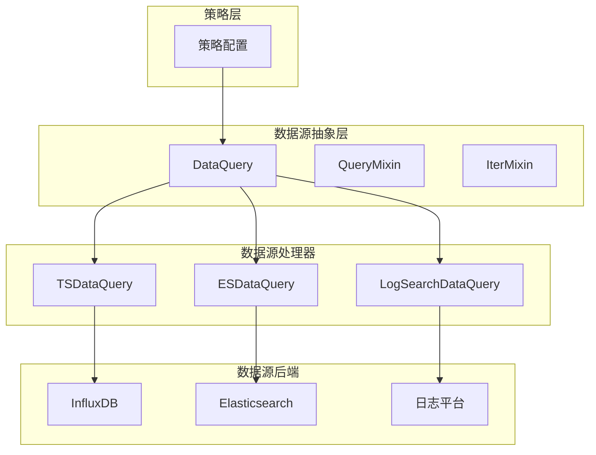
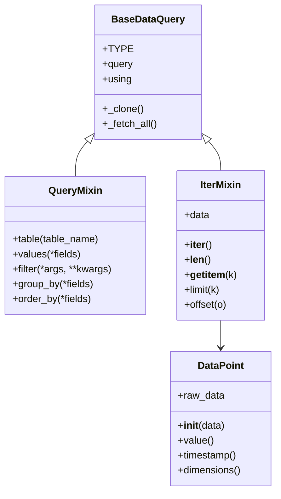
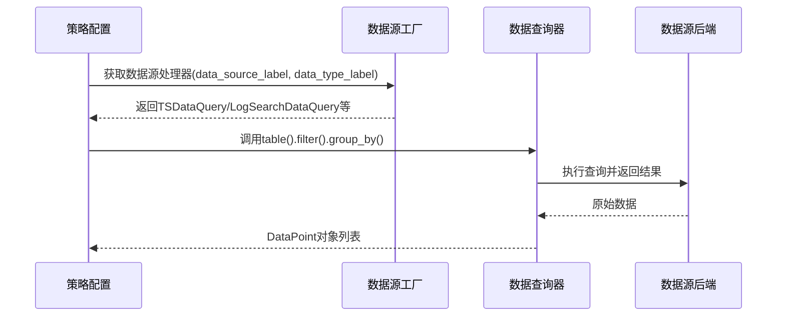
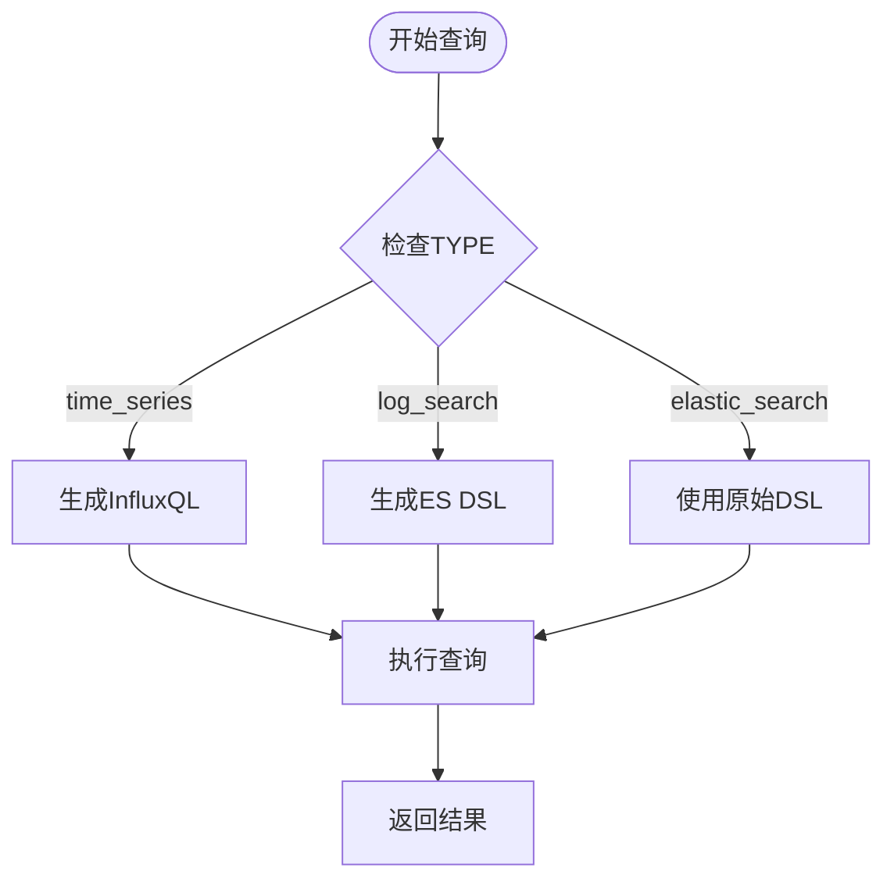
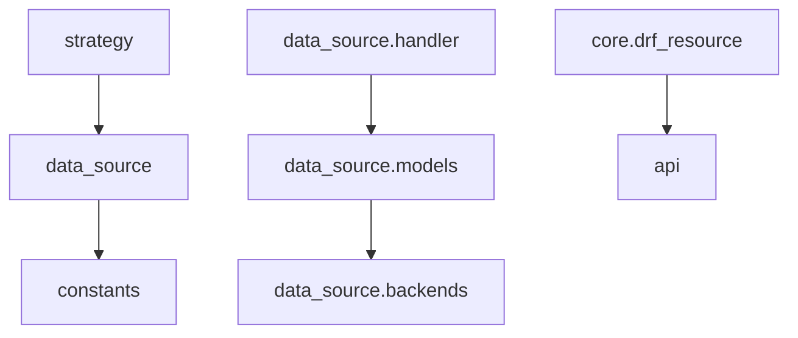

# 策略与数据源关联

<cite>
**本文档引用文件**  
- [data_structure.py](file://bkmonitor/bkmonitor/data_source/models/data_structure.py)
- [query.py](file://bkmonitor/bkmonitor/data_source/models/query.py)
- [time_series.py](file://bkmonitor/bkmonitor/data_source/handler/time_series.py)
- [log_search.py](file://bkmonitor/bkmonitor/data_source/handler/log_search.py)
- [elastic_search.py](file://bkmonitor/bkmonitor/data_source/handler/elastic_search.py)
- [__init__.py](file://bkmonitor/bkmonitor/data_source/__init__.py)
- [data_source/__init__.py](file://bkmonitor/bkmonitor/data_source/data_source/__init__.py)
- [strategy.py](file://bkmonitor/bkmonitor/models/strategy.py)
- [constants.py](file://constants/data_source.py)
</cite>

## 目录
1. [引言](#引言)
2. [项目结构](#项目结构)
3. [核心组件](#核心组件)
4. [架构概览](#架构概览)
5. [详细组件分析](#详细组件分析)
6. [依赖分析](#依赖分析)
7. [性能考量](#性能考量)
8. [故障排除指南](#故障排除指南)
9. [结论](#结论)

## 引言
本文档详细阐述了监控系统中策略如何与具体数据源进行关联的机制。重点分析了数据源类型的定义、查询语句的生成与执行流程、策略配置中数据源ID的指定方式，以及如何通过数据源模型获取指标元数据。通过代码示例展示了策略执行时的数据源查询流程，并解释了系统如何处理时间序列、日志和事件等不同类型数据源的适配逻辑。

## 项目结构
项目采用模块化设计，核心监控功能位于`bkmonitor/bkmonitor`目录下。与策略和数据源关联最相关的模块是`data_source`和`strategy`。`data_source`模块负责定义不同类型的数据源（如时间序列、日志、Elasticsearch）及其查询逻辑，而`strategy`模块则定义了告警策略的结构和行为。两者通过统一的查询接口和数据模型进行交互。

**图示来源**
- [data_source/__init__.py](file://bkmonitor/bkmonitor/data_source/__init__.py)
- [strategy.py](file://bkmonitor/bkmonitor/models/strategy.py)

**本节来源**
- [data_source](file://bkmonitor/bkmonitor/data_source)
- [strategy](file://bkmonitor/bkmonitor/strategy)

## 核心组件
系统的核心组件包括`DataQuery`抽象查询类、具体的数据源处理器（如`TSDataQuery`、`LogSearchDataQuery`）以及策略模型。`DataQuery`定义了通用的查询方法（如`filter`、`group_by`），而具体的处理器则根据数据源类型实现这些方法。策略模型中包含一个`query_config`字段，该字段指定了所使用的数据源ID和查询参数，从而建立了策略与数据源之间的关联。

**本节来源**
- [query.py](file://bkmonitor/bkmonitor/data_source/models/query.py#L1-L280)
- [time_series.py](file://bkmonitor/bkmonitor/data_source/handler/time_series.py#L1-L21)
- [strategy.py](file://bkmonitor/bkmonitor/models/strategy.py)

## 架构概览
系统的整体架构遵循分层设计原则。最上层是策略层，定义了告警的业务逻辑。中间是数据源抽象层，提供统一的查询接口。底层是具体的数据源后端（如InfluxDB、Elasticsearch、日志平台），负责执行实际的查询操作。当策略需要执行时，它会根据`query_config`中的`data_source_label`和`data_type_label`选择正确的数据源处理器，然后构建并执行查询。

**图示来源**
- [query.py](file://bkmonitor/bkmonitor/data_source/models/query.py)
- [time_series.py](file://bkmonitor/bkmonitor/data_source/handler/time_series.py)
- [log_search.py](file://bkmonitor/bkmonitor/data_source/handler/log_search.py)
- [elastic_search.py](file://bkmonitor/bkmonitor/data_source/handler/elastic_search.py)

## 详细组件分析

### 数据源模型分析
数据源模型的核心是`DataPoint`类，它封装了从数据源返回的原始数据点，并提供了访问其值、时间戳和维度的方法。`BaseDataQuery`类作为所有查询的基类，集成了`QueryMixin`、`IterMixin`和`DslMixin`等混入类，提供了丰富的查询构建能力。

**图示来源**
- [data_structure.py](file://bkmonitor/bkmonitor/data_source/models/data_structure.py#L1-L24)
- [query.py](file://bkmonitor/bkmonitor/data_source/models/query.py#L1-L280)

**本节来源**
- [data_structure.py](file://bkmonitor/bkmonitor/data_source/models/data_structure.py)
- [query.py](file://bkmonitor/bkmonitor/data_source/models/query.py)

### 策略与数据源关联分析
策略通过`query_config`字段与数据源关联。`query_config`中包含`data_source_label`（如`bk_monitor`、`bk_data`）和`data_type_label`（如`time_series`、`log`、`event`）来唯一标识一个数据源。系统根据这些标签动态选择对应的数据源处理器。

**图示来源**
- [data_source/__init__.py](file://bkmonitor/bkmonitor/data_source/data_source/__init__.py)
- [time_series.py](file://bkmonitor/bkmonitor/data_source/handler/time_series.py)
- [strategy.py](file://bkmonitor/bkmonitor/models/strategy.py)

**本节来源**
- [data_source/__init__.py](file://bkmonitor/bkmonitor/data_source/data_source/__init__.py)
- [strategy.py](file://bkmonitor/bkmonitor/models/strategy.py)

### 不同数据源的适配逻辑
系统通过继承`DataQuery`并重写`TYPE`属性来实现不同数据源的适配。例如，`TSDataQuery`的`TYPE`为`"time_series"`，`LogSearchDataQuery`的`TYPE`为`"log_search"`。在查询执行时，系统根据`TYPE`选择对应的后端编译器（如`time_series`后端使用InfluxQL编译器，`log_search`后端使用ES DSL编译器）。

**图示来源**
- [time_series.py](file://bkmonitor/bkmonitor/data_source/handler/time_series.py#L1-L21)
- [log_search.py](file://bkmonitor/bkmonitor/data_source/handler/log_search.py#L1-L16)
- [elastic_search.py](file://bkmonitor/bkmonitor/data_source/handler/elastic_search.py#L1-L16)

**本节来源**
- [time_series.py](file://bkmonitor/bkmonitor/data_source/handler/time_series.py)
- [log_search.py](file://bkmonitor/bkmonitor/data_source/handler/log_search.py)
- [elastic_search.py](file://bkmonitor/bkmonitor/data_source/handler/elastic_search.py)

## 依赖分析
系统各组件之间存在清晰的依赖关系。`strategy`模块依赖`data_source`模块来执行数据查询。`data_source`模块内部，`handler`依赖`models`中的查询模型，而`models`又依赖`backends`来执行具体的数据库操作。这种分层依赖确保了系统的可维护性和可扩展性。

**图示来源**
- [strategy.py](file://bkmonitor/bkmonitor/models/strategy.py)
- [__init__.py](file://bkmonitor/bkmonitor/data_source/__init__.py)
- [data_source/__init__.py](file://bkmonitor/bkmonitor/data_source/data_source/__init__.py)

**本节来源**
- [strategy.py](file://bkmonitor/bkmonitor/models/strategy.py)
- [__init__.py](file://bkmonitor/bkmonitor/data_source/__init__.py)

## 性能考量
在查询性能方面，系统通过自动计算聚合周期（`get_auto_interval`函数）来优化大数据量的查询。对于复杂的过滤条件，系统使用`dict_to_q`函数高效地将前端传入的嵌套字典转换为Django的Q对象，减少了查询构建的开销。此外，查询结果被缓存（`_result_cache`），避免了重复执行相同的查询。

## 故障排除指南
当策略无法正确查询数据时，应首先检查`query_config`中的`data_source_label`和`data_type_label`是否正确。其次，确认所选数据源的后端服务（如InfluxDB、Elasticsearch）是否正常运行。最后，检查查询条件中的字段名和操作符是否符合该数据源的要求，例如时间序列数据源使用`time_field`方法指定时间字段。

**本节来源**
- [data_source/__init__.py](file://bkmonitor/bkmonitor/data_source/data_source/__init__.py)
- [query.py](file://bkmonitor/bkmonitor/data_source/models/query.py)

## 结论
本文档详细解析了监控系统中策略与数据源的关联机制。系统通过标签化的配置和面向对象的继承体系，实现了对多种数据源的灵活支持。策略通过`query_config`指定数据源，数据源处理器负责将通用的查询方法转换为特定后端的查询语言。这种设计既保证了策略配置的统一性，又提供了对不同数据存储技术的扩展能力。