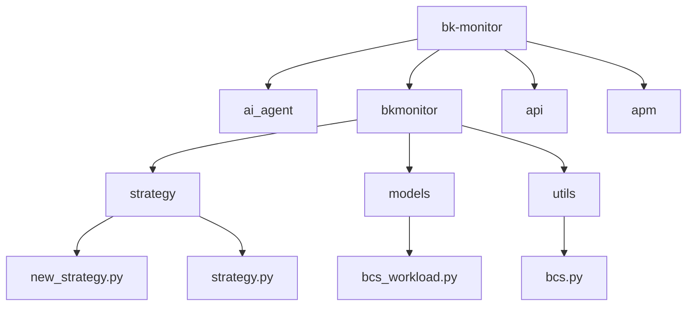
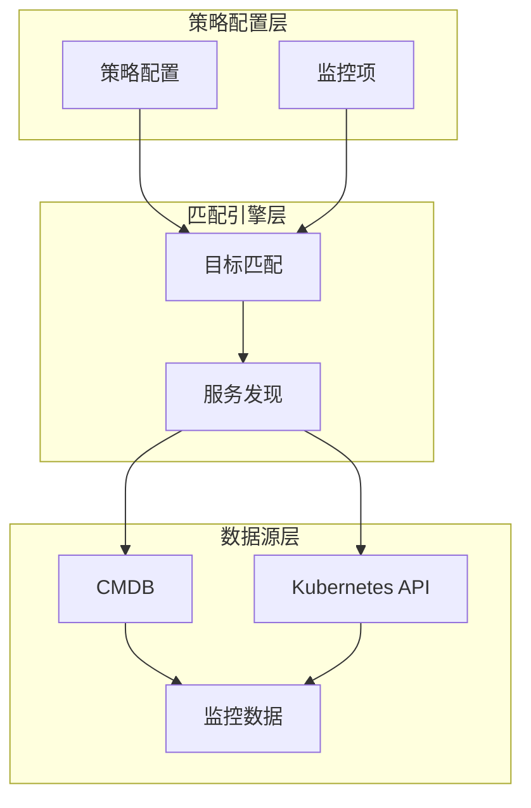
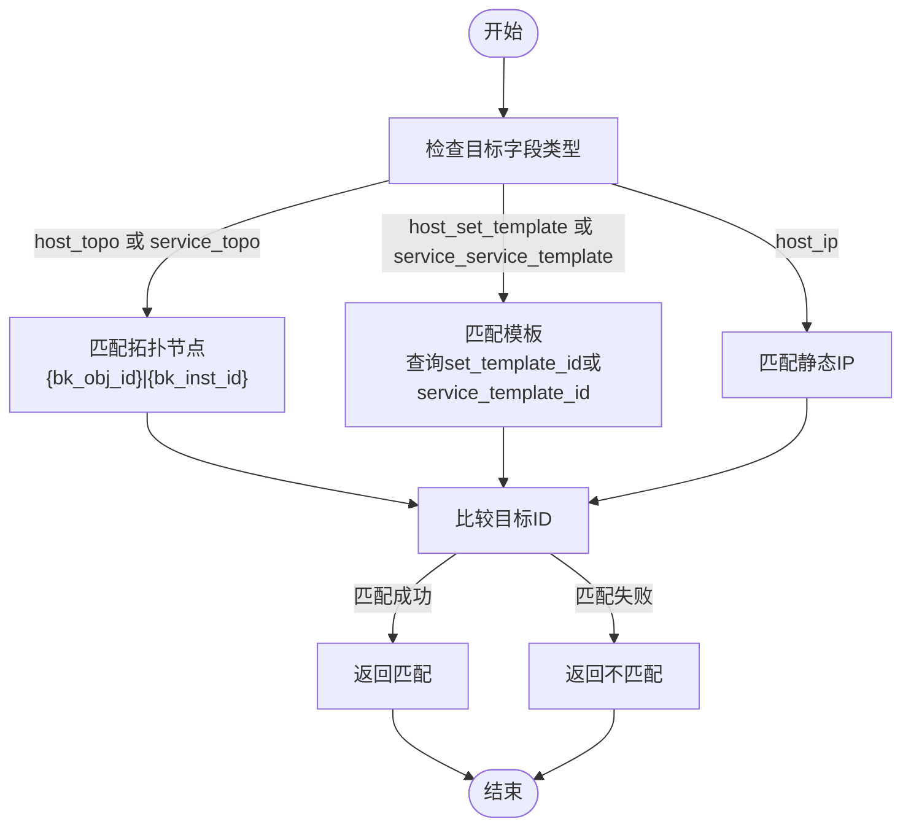
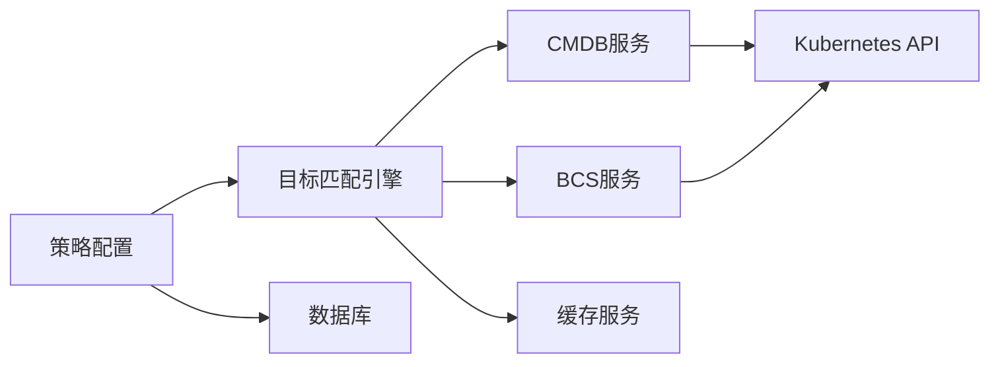

# 策略与服务拓扑关联

<cite>
**本文档引用文件**  
- [strategy.py](file://bkmonitor\bkmonitor\strategy\strategy.py)
- [bcs_workload.py](file://bkmonitor\bkmonitor\models\bcs_workload.py)
- [strategy.py](file://bkmonitor\constants\strategy.py)
- [cmdb.py](file://bkmonitor\packages\monitor_web\cc\resources\cmdb.py)
- [new_strategy.py](file://bkmonitor\bkmonitor\strategy\new_strategy.py)
- [bcs.py](file://bkmonitor\bkmonitor\utils\bcs.py)
- [策略引擎.md](file://wiki\策略引擎.md)
- [strategy.py](file://bkmonitor\bkmonitor\models\strategy.py)
</cite>

## 目录
1. [引言](#引言)
2. [项目结构分析](#项目结构分析)
3. [核心组件](#核心组件)
4. [架构概览](#架构概览)
5. [详细组件分析](#详细组件分析)
6. [依赖分析](#依赖分析)
7. [性能考量](#性能考量)
8. [故障排除指南](#故障排除指南)
9. [结论](#结论)

## 引言
本文档详细阐述了监控平台中策略如何与服务拓扑结构进行关联的机制。通过分析业务拓扑、集群、命名空间等维度，说明策略绑定的实现方式，服务实例发现过程，目标匹配算法，以及在微服务架构下策略的自动分发与继承。特别以Kubernetes场景为例，说明策略如何关联到Deployment、StatefulSet等工作负载。

## 项目结构分析
项目采用模块化设计，主要功能模块包括`ai_agent`、`bkmonitor`、`api`、`apm`等。`bkmonitor`是核心监控模块，其内部结构清晰，包含`strategy`（策略）、`models`（数据模型）、`utils`（工具）等子模块。策略相关的逻辑主要集中在`bkmonitor\bkmonitor\strategy`目录下，而与Kubernetes（BCS）相关的模型则位于`bkmonitor\bkmonitor\models`中。



**图源**  
- [project_structure](file://workspace_path)

## 核心组件
策略与服务拓扑关联的核心组件包括：
- **策略配置模型** (`StrategyModel`): 定义策略的元数据和配置。
- **监控项模型** (`ItemModel`): 定义具体的监控指标和目标。
- **目标字段类型** (`TargetFieldType`): 定义策略可以绑定到的拓扑维度。
- **BCS工作负载模型** (`BCSWorkloadModel`): 映射Kubernetes资源。
- **CMDB资源服务** (`cmdb.py`): 提供拓扑查询和策略匹配服务。

**本节来源**  
- [strategy.py](file://bkmonitor\bkmonitor\models\strategy.py#L333-L422)
- [bcs_workload.py](file://bkmonitor\bkmonitor\models\bcs_workload.py)
- [strategy.py](file://bkmonitor\constants\strategy.py#L200-L219)
- [cmdb.py](file://bkmonitor\packages\monitor_web\cc\resources\cmdb.py)

## 架构概览
系统通过一个分层的架构实现策略与拓扑的关联。上层是策略配置，中层是目标匹配引擎，底层是CMDB和Kubernetes API。策略配置通过`target`字段指定其作用范围，匹配引擎根据`TargetFieldType`解析目标，并通过CMDB或BCS API查询实际的服务实例，最终将策略应用到具体的监控数据流上。



**图源**  
- [策略引擎.md](file://wiki\策略引擎.md)
- [cmdb.py](file://bkmonitor\packages\monitor_web\cc\resources\cmdb.py)

## 详细组件分析

### 策略目标匹配机制分析
策略通过`ItemModel`中的`target`字段与服务拓扑关联。该字段是一个JSON结构，包含`field`、`method`和`value`三个关键属性。

#### 目标字段类型
`TargetFieldType`枚举定义了所有可用的拓扑维度：
- `host_topo`: 主机拓扑节点
- `service_topo`: 服务拓扑节点
- `host_ip`: 静态IP
- `host_set_template`: 集群模板
- `service_service_template`: 服务模板
- `dynamic_group`: 动态分组

```python
class TargetFieldType:
    host_topo = "host_topo_node"  # 动态拓扑
    service_topo = "service_topo_node"
    host_ip = "ip"  # 静态拓扑
    host_target_ip = "bk_target_ip"
    host_set_template = "host_set_template"  # 集群模板
    service_service_template = "service_service_template" # 服务模板
    dynamic_group = "dynamic_group"  # 动态分组
```

#### 目标匹配算法
匹配算法在`cmdb.py`的`get_topo_strategy_count`和`get_host_strategy_count`函数中实现。其核心逻辑如下：



**图源**  
- [strategy.py](file://bkmonitor\constants\strategy.py#L200-L219)
- [cmdb.py](file://bkmonitor\packages\monitor_web\cc\resources\cmdb.py#L300-L499)

**本节来源**  
- [strategy.py](file://bkmonitor\constants\strategy.py#L200-L219)
- [cmdb.py](file://bkmonitor\packages\monitor_web\cc\resources\cmdb.py#L300-L499)

### Kubernetes场景下策略关联分析
在Kubernetes（BCS）场景下，策略通过`BCSWorkloadModel`与工作负载（如Deployment、StatefulSet）关联。

#### BCS工作负载模型
`BCSWorkloadModel`定义了Kubernetes资源的数据库模型，包含`cluster_id`、`namespace`、`workload_kind`（如Deployment）、`workload_name`等字段。

#### 关联实现
1.  **服务发现**: 系统通过`BcsKubeClient`工具类，利用Kubernetes API查询指定集群和命名空间下的所有工作负载。
2.  **拓扑映射**: 将Kubernetes的`namespace`映射为CMDB中的“业务”（bk_biz_id），将`workload`映射为“服务实例”。
3.  **策略绑定**: 当策略的`target`字段设置为`service_topo`，且其`value`指向某个命名空间或工作负载时，系统会自动发现该命名空间下的所有Pod，并将策略应用到这些Pod的监控指标上。

```python
class BcsKubeClient:
    """
    通过 BCS 集群 ID，构造一个类似 k8s 的 client
    """
    def __init__(self, cluster_id):
        self.cluster_id = cluster_id

    @cached_property
    def api(self):
        return client.AppsV1Api(client.ApiClient(self.auth))

    @cached_property
    def core_api(self):
        return client.CoreV1Api(client.ApiClient(self.auth))
```

**图源**  
- [bcs_workload.py](file://bkmonitor\bkmonitor\models\bcs_workload.py)
- [bcs.py](file://bkmonitor\bkmonitor\utils\bcs.py)

**本节来源**  
- [bcs_workload.py](file://bkmonitor\bkmonitor\models\bcs_workload.py)
- [bcs.py](file://bkmonitor\bkmonitor\utils\bcs.py)

### 策略继承与自动分发
策略的继承和自动分发是通过“自上而下”的匹配逻辑实现的。

#### 实现机制
1.  **继承**: 当一个策略绑定到一个高层级的拓扑节点（如“业务”或“集群”）时，该策略会自动继承到其所有子节点（如“模块”或“命名空间”）。
2.  **自动分发**: 系统在进行目标匹配时，会遍历所有策略。对于每一个服务实例（如一个Pod），系统会检查其所属的每一个拓扑节点，看是否有策略绑定到该节点或其父节点。如果有，则该策略对该实例生效。

例如，一个绑定到“业务A”的策略，会自动对“业务A”下的所有“模块”和“命名空间”生效。

**本节来源**  
- [cmdb.py](file://bkmonitor\packages\monitor_web\cc\resources\cmdb.py#L300-L499)
- [策略引擎.md](file://wiki\策略引擎.md)

## 依赖分析
策略与服务拓扑关联功能依赖于多个核心模块。



**图源**  
- [cmdb.py](file://bkmonitor\packages\monitor_web\cc\resources\cmdb.py)
- [bcs.py](file://bkmonitor\bkmonitor\utils\bcs.py)

**本节来源**  
- [cmdb.py](file://bkmonitor\packages\monitor_web\cc\resources\cmdb.py)
- [bcs.py](file://bkmonitor\bkmonitor\utils\bcs.py)

## 性能考量
目标匹配算法的性能是关键。当前实现中，`get_host_strategy_count`函数在匹配模板时存在多次API调用的问题，文档中已标记为`TODO`，需要优化。建议采用缓存机制，将模板与主机的映射关系缓存起来，避免实时查询。

## 故障排除指南
- **问题**: 策略未应用到预期的Pod上。
  - **排查步骤**:
    1.  检查策略的`target`字段配置是否正确，`field`是否为`service_topo`，`value`中的`bk_obj_id`和`bk_inst_id`是否与目标命名空间或工作负载的拓扑ID匹配。
    2.  检查`BCSWorkloadModel`中是否已成功同步了目标集群和命名空间的信息。
    3.  检查`BcsKubeClient`与Kubernetes API的连接是否正常。

## 结论
本系统通过灵活的`TargetFieldType`和强大的CMDB/BCS集成，实现了策略与服务拓扑的深度关联。在Kubernetes场景下，能够通过命名空间和工作负载类型实现策略的精准绑定和自动继承，为微服务架构提供了高效的监控管理能力。未来可通过优化模板匹配的性能，进一步提升系统的响应速度。