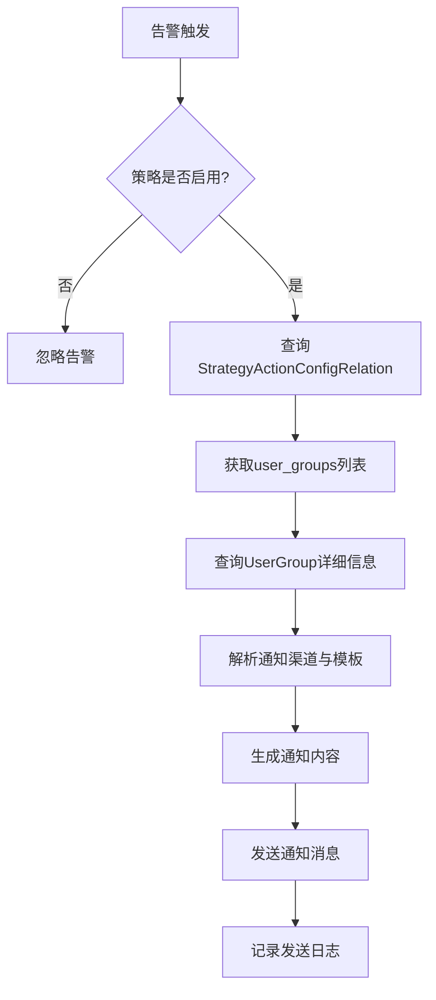
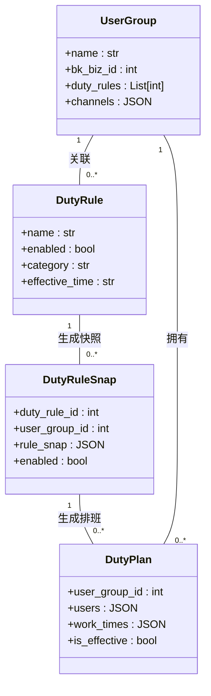

# 策略与用户组关联

<cite>
**本文档引用文件**  
- [action.py](file://bkmonitor/bkmonitor/models/fta/action.py#L850-L888)
- [strategy.py](file://bkmonitor/bkmonitor/models/strategy.py#L0-L799)
- [duty_manage.py](file://bkmonitor/bkmonitor/action/duty_manage.py#L0-L799)
- [new_strategy.py](file://bkmonitor/bkmonitor/strategy/new_strategy.py#L1950-L2149)
- [cache.py](file://bkmonitor/bkmonitor/utils/cache.py#L266-L302)
- [readme.md](file://bkmonitor/alarm_backends/core/api_cache/readme.md#L51-L68)
</cite>

## 目录
1. [策略与用户组关联机制](#策略与用户组关联机制)  
2. [用户组存储结构](#用户组存储结构)  
3. [告警通知流程](#告警通知流程)  
4. [用户组层级继承与优先级处理](#用户组层级继承与优先级处理)  
5. [查询路径与缓存优化](#查询路径与缓存优化)  
6. [代码示例](#代码示例)

## 策略与用户组关联机制

在监控系统中，策略与用户组的关联是实现告警通知和处理权限控制的核心机制。该机制通过将告警策略与特定的用户组进行绑定，确保当告警触发时，相关责任人能够及时收到通知并采取相应措施。

策略与用户组之间的关联主要通过 `StrategyActionConfigRelation` 模型实现。该模型定义了策略与响应动作配置之间的多对多关系，并通过 `user_groups` 字段存储关联的用户组 ID 列表。每个策略可以配置多个处理套餐或通知方式，而每个处理套餐或通知方式也可以被多个策略共享。

当告警事件发生时，系统会根据策略 ID 查询对应的 `StrategyActionConfigRelation` 记录，获取其中的 `user_groups` 字段值，从而确定需要通知的目标用户组。这一过程实现了告警通知对象的动态确定，支持灵活的告警分发策略。

**Section sources**  
- [action.py](file://bkmonitor/bkmonitor/models/fta/action.py#L850-L888)

## 用户组存储结构

用户组信息在数据库中通过 `UserGroup` 模型进行存储，其核心字段包括：

- **name**: 用户组名称
- **bk_biz_id**: 所属业务 ID
- **desc**: 说明/备注
- **channels**: 告警通知渠道配置
- **alert_notice**: 告警通知配置
- **action_notice**: 执行通知配置
- **duty_rules**: 轮值规则

策略与用户组的关联关系则存储在 `StrategyActionConfigRelation` 表中，关键字段如下：

```python
class StrategyActionConfigRelation(AbstractRecordModel):
    strategy_id = models.IntegerField("故障自愈的策略ID", null=False, db_index=True)
    config_id = models.IntegerField("响应动作配置ID", null=False, db_index=True)
    relate_type = models.CharField("关联类型", max_length=32, choices=RELATE_TYPE_CHOICES)
    signal = models.JSONField("触发信号", default=default_list)
    user_groups = models.JSONField("用户组", default=default_list)  # 存储用户组ID列表
    user_type = models.CharField("人员类型", default=UserGroupType.MAIN, choices=UserGroupType.CHOICE, max_length=32)
    options = models.JSONField("高级设置", default=default_dict)
```

`user_groups` 字段以 JSON 格式存储用户组 ID 列表，支持一个策略关联多个用户组。同时，`validated_user_groups` 属性会对该列表进行验证，过滤掉无效的 ID。

**Section sources**  
- [action.py](file://bkmonitor/bkmonitor/models/fta/action.py#L850-L888)
- [strategy.py](file://bkmonitor/bkmonitor/models/strategy.py#L0-L799)

## 告警通知流程

告警通知流程从策略触发开始，经过用户组查询、通知配置解析，最终完成消息发送。具体流程如下：



1. 当监控指标达到阈值时，告警引擎触发策略。
2. 系统检查策略的 `is_enabled` 状态，仅对启用的策略继续处理。
3. 根据策略 ID 查询 `StrategyActionConfigRelation` 表，获取关联的用户组 ID 列表。
4. 通过 `UserGroup` 模型查询用户组详情，包括通知渠道、接收人等配置。
5. 解析告警通知模板，结合当前告警上下文生成最终通知内容。
6. 调用消息网关（如 CMSI）发送通知至指定渠道（邮件、短信、微信等）。
7. 记录通知发送日志，便于后续审计与追踪。

**Diagram sources**  
- [strategy.py](file://bkmonitor/bkmonitor/models/strategy.py#L0-L799)
- [duty_manage.py](file://bkmonitor/bkmonitor/action/duty_manage.py#L0-L799)

**Section sources**  
- [strategy.py](file://bkmonitor/bkmonitor/models/strategy.py#L0-L799)

## 用户组层级继承与优先级处理

系统支持复杂的用户组层级继承机制，主要体现在轮值规则（DutyRule）与用户组（UserGroup）的多对多关系上。一个用户组可以配置多个轮值规则，而一个轮值规则也可以被多个用户组引用。

### 层级继承机制



**Diagram sources**  
- [strategy.py](file://bkmonitor/bkmonitor/models/strategy.py#L0-L799)
- [duty_manage.py](file://bkmonitor/bkmonitor/action/duty_manage.py#L0-L799)

**Section sources**  
- [duty_manage.py](file://bkmonitor/bkmonitor/action/duty_manage.py#L0-L799)

### 优先级处理逻辑

当一个用户组关联多个轮值规则时，系统按照以下优先级进行处理：

1. **时间优先级**：根据 `effective_time` 和 `end_time` 确定规则的有效期，优先使用当前时间范围内最新的规则。
2. **快照机制**：通过 `DutyRuleSnap` 快照记录规则的历史状态，避免规则变更影响正在进行的值班安排。
3. **冲突解决**：新创建的快照会禁用与其时间范围重叠的旧快照，确保同一时间段内只有一个有效的排班计划。

`GroupDutyRuleManager` 类负责管理用户组的轮值规则，其 `manage_duty_rule_snap` 方法实现了快照的创建、更新和删除逻辑，确保值班安排的连续性和一致性。

## 查询路径与缓存优化

为了提高系统性能，减少数据库查询压力，系统采用了多层次的缓存优化策略。

### 查询路径

从策略到用户组的完整查询路径如下：

1. 通过策略 ID 查询 `StrategyActionConfigRelation` 表
2. 获取 `user_groups` 字段中的用户组 ID 列表
3. 批量查询 `UserGroup` 表获取用户组详细信息
4. 根据需要查询 `DutyPlan` 表获取当前值班人员

### 缓存优化策略

系统使用 `CacheResource` 基类实现 API 缓存，支持客户端和服务端两种缓存类型：

```python
from core.drf_resource.contrib.cache import CacheResource
from bkmonitor.utils.cache import CacheType

class HostPerformanceResource(CacheResource):
    cache_type = CacheType.HOST
    backend_cache_type = CacheType.CC_BACKEND
```

`CacheType` 定义了多种缓存类型：

```python
class CacheType:
    BIZ = CacheTypeItem(key="biz", timeout=settings.CACHE_BIZ_TIMEOUT, label="业务及人员相关", user_related=True)
    HOST = CacheTypeItem(key="host", timeout=settings.CACHE_HOST_TIMEOUT, label="主机信息相关", user_related=False)
    CC = CacheTypeItem(key="cc", timeout=settings.CACHE_CC_TIMEOUT, label="CC模块和Set相关", user_related=True)
    DATA = CacheTypeItem(key="data", timeout=settings.CACHE_DATA_TIMEOUT, label="计算平台接口相关", user_related=False)
```

缓存策略区分 `cache_type`（客户端使用）和 `backend_cache_type`（服务端使用），前者用于用户相关的接口，后者用于定时任务等用户无关的查询。这种设计既保证了前端信息的时效性，又提高了后端服务的性能。

**Section sources**  
- [cache.py](file://bkmonitor/bkmonitor/utils/cache.py#L266-L302)
- [readme.md](file://bkmonitor/alarm_backends/core/api_cache/readme.md#L51-L68)

## 代码示例

以下代码展示了如何根据策略配置填充用户组信息：

```python
@classmethod
def fill_user_groups(cls, configs: list[dict], with_detail=False):
    """
    根据配置列表填充用户组信息
    """
    # 提取所有配置的ID
    strategy_ids = [config["id"] for config in configs]

    # 获取所有相关的操作关系
    action_relations = RelationModel.objects.filter(strategy_id__in=strategy_ids)

    # 提取所有用户组ID
    user_group_ids = []
    for action_relation in action_relations:
        user_group_ids.extend(action_relation.validated_user_groups)

    # 获取用户组信息
    if with_detail:
        user_groups_slz = UserGroupDetailSlz(UserGroup.objects.filter(id__in=user_group_ids), many=True).data
    else:
        user_groups_slz = UserGroupSlz(UserGroup.objects.filter(id__in=user_group_ids), many=True).data

    # 构建用户组字典
    user_groups = {group["id"]: dict(group) for group in user_groups_slz}

    # 为每个配置添加用户组列表
    for config in configs:
        for action in config["actions"] + [config["notice"]]:
            user_group_list = []
            for user_group_id in action["user_groups"]:
                if user_group_id and user_group_id in user_groups:
                    user_group_list.append(user_groups[user_group_id])
            action["user_group_list"] = user_group_list
```

该方法接收策略配置列表，批量查询关联的用户组信息，并将其填充到原始配置中，避免了 N+1 查询问题，显著提升了性能。

**Section sources**  
- [new_strategy.py](file://bkmonitor/bkmonitor/strategy/new_strategy.py#L1950-L2149)