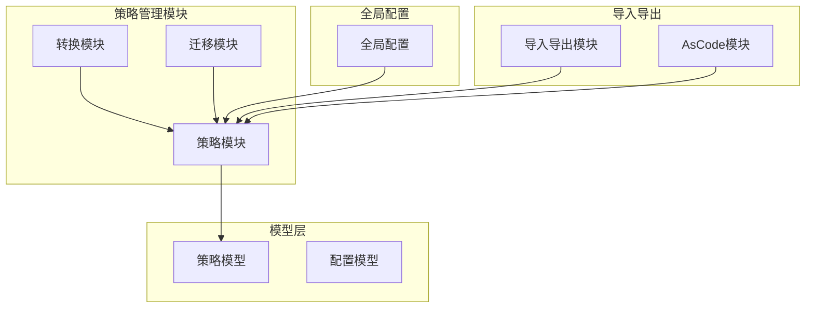
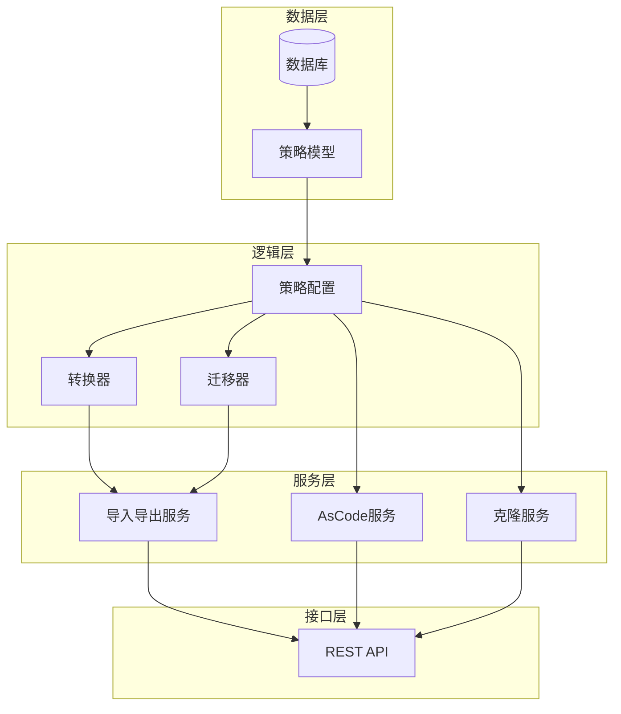
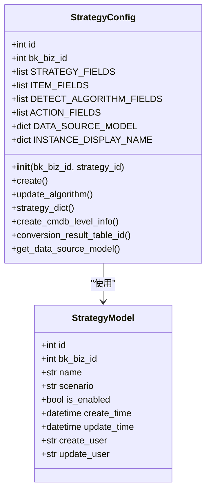
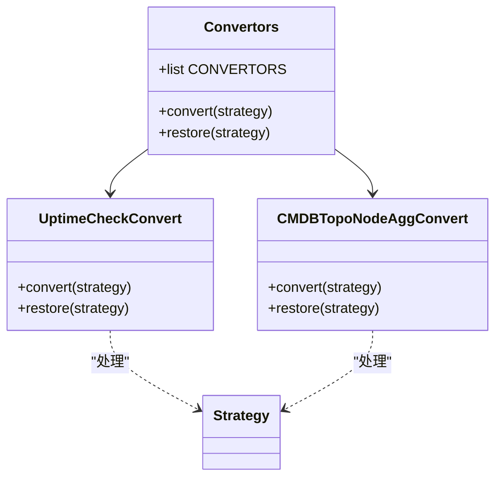
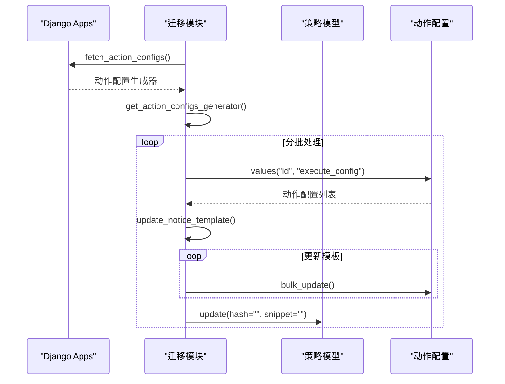
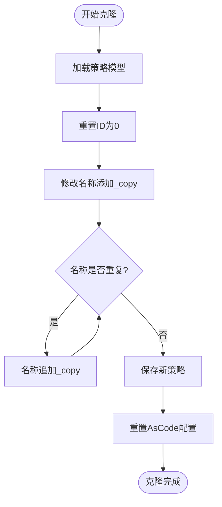
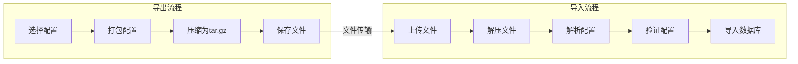
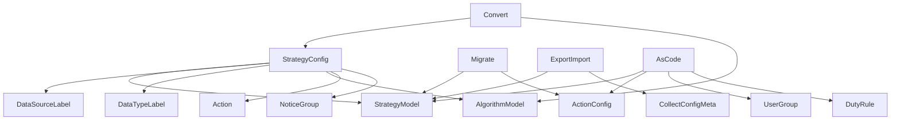

# 策略共享与复用机制

<cite>
**本文档引用的文件**   
- [strategy.py](file://bkmonitor\bkmonitor\strategy\strategy.py)
- [convert.py](file://bkmonitor\bkmonitor\strategy\convert.py)
- [migrate.py](file://bkmonitor\bkmonitor\strategy\migrate.py)
- [strategy.py](file://bkmonitor\bkmonitor\models\strategy.py)
- [global_config.py](file://bkmonitor\bkmonitor\define\global_config.py)
- [v2.py](file://bkmonitor\packages\monitor_web\strategies\resources\v2.py)
- [resources.py](file://bkmonitor\packages\monitor_web\export_import\resources.py)
- [resources.py](file://bkmonitor\packages\monitor_web\as_code\resources.py)
</cite>

## 目录
1. [引言](#引言)
2. [项目结构](#项目结构)
3. [核心组件](#核心组件)
4. [架构概述](#架构概述)
5. [详细组件分析](#详细组件分析)
6. [依赖分析](#依赖分析)
7. [性能考虑](#性能考虑)
8. [故障排除指南](#故障排除指南)
9. [结论](#结论)

## 引言
本文档全面介绍了跨业务策略共享和复用的技术实现，包括全局策略标识的生成规则、策略模板的抽象方法以及版本管理机制。详细说明了如何通过策略克隆、导入导出实现配置复用，并解析了策略迁移过程中的兼容性处理。最后提供了最佳实践建议，指导用户在多环境间高效复用监控策略。

## 项目结构
项目采用分层模块化设计，主要包含监控核心模块、API接口、策略管理、数据源处理等组件。策略共享与复用功能主要集中在`bkmonitor/bkmonitor/strategy`目录下。

**图示来源**
- [strategy.py](file://bkmonitor\bkmonitor\strategy\strategy.py)
- [models\strategy.py](file://bkmonitor\bkmonitor\models\strategy.py)
- [global_config.py](file://bkmonitor\bkmonitor\define\global_config.py)

## 核心组件
策略共享与复用的核心组件包括策略配置管理、转换器、迁移工具和导入导出功能。这些组件共同实现了策略的标准化、版本控制和跨环境迁移。

**组件来源**
- [strategy.py](file://bkmonitor\bkmonitor\strategy\strategy.py#L0-L199)
- [convert.py](file://bkmonitor\bkmonitor\strategy\convert.py#L0-L199)
- [migrate.py](file://bkmonitor\bkmonitor\strategy\migrate.py#L0-L126)

## 架构概述
系统采用分层架构，从数据模型到业务逻辑再到API接口，形成了完整的策略管理闭环。策略共享与复用功能通过标准化的数据结构和转换机制实现。

**图示来源**
- [models\strategy.py](file://bkmonitor\bkmonitor\models\strategy.py#L0-L199)
- [strategy.py](file://bkmonitor\bkmonitor\strategy\strategy.py#L0-L199)
- [v2.py](file://bkmonitor\packages\monitor_web\strategies\resources\v2.py#L2950-L3000)

## 详细组件分析

### 策略配置分析
策略配置组件负责管理策略的完整数据结构，包括策略基本信息、监控项、检测算法和动作配置。

**图示来源**
- [strategy.py](file://bkmonitor\bkmonitor\strategy\strategy.py#L0-L199)
- [models\strategy.py](file://bkmonitor\bkmonitor\models\strategy.py#L0-L199)

### 策略转换分析
策略转换组件实现了特殊策略类型的转换逻辑，确保不同策略类型之间的兼容性和一致性。

**图示来源**
- [convert.py](file://bkmonitor\bkmonitor\strategy\convert.py#L0-L199)

### 策略迁移分析
策略迁移组件提供了批量更新和兼容性处理功能，确保策略在不同环境间的平滑迁移。

**图示来源**
- [migrate.py](file://bkmonitor\bkmonitor\strategy\migrate.py#L0-L126)

### 策略克隆分析
策略克隆功能通过复制现有策略并修改关键字段来实现快速配置复用。

**图示来源**
- [v2.py](file://bkmonitor\packages\monitor_web\strategies\resources\v2.py#L2950-L3000)

### 策略导入导出分析
导入导出模块实现了策略配置的打包、解包和迁移功能，支持跨环境配置复用。

**图示来源**
- [resources.py](file://bkmonitor\packages\monitor_web\export_import\resources.py#L0-L199)

## 依赖分析
策略共享与复用功能依赖于多个核心模块，形成了复杂的依赖关系网络。

**图示来源**
- [strategy.py](file://bkmonitor\bkmonitor\strategy\strategy.py#L0-L199)
- [convert.py](file://bkmonitor\bkmonitor\strategy\convert.py#L0-L199)
- [migrate.py](file://bkmonitor\bkmonitor\strategy\migrate.py#L0-L126)
- [resources.py](file://bkmonitor\packages\monitor_web\export_import\resources.py#L0-L199)
- [resources.py](file://bkmonitor\packages\monitor_web\as_code\resources.py#L0-L199)

## 性能考虑
策略共享与复用功能在设计时考虑了性能优化，主要体现在以下几个方面：
1. 使用生成器分批处理大量数据，避免内存溢出
2. 采用批量数据库操作减少IO开销
3. 实现缓存机制提高查询效率
4. 通过异步任务处理耗时操作

## 故障排除指南
常见问题及解决方案：
1. **策略克隆失败**：检查目标业务下是否存在同名策略
2. **导入导出错误**：验证文件格式和权限设置
3. **迁移兼容性问题**：确认源和目标环境的版本兼容性
4. **转换逻辑异常**：检查特殊策略类型的配置是否符合要求

**问题来源**
- [strategy.py](file://bkmonitor\bkmonitor\strategy\strategy.py#L0-L199)
- [convert.py](file://bkmonitor\bkmonitor\strategy\convert.py#L0-L199)
- [migrate.py](file://bkmonitor\bkmonitor\strategy\migrate.py#L0-L126)

## 结论
本文档详细介绍了策略共享与复用的技术实现，涵盖了从全局标识生成到版本管理的完整生命周期。通过策略克隆、导入导出和迁移工具，用户可以在多环境间高效复用监控策略，大大提升了运维效率。建议在实际使用中遵循最佳实践，确保策略配置的一致性和可靠性。