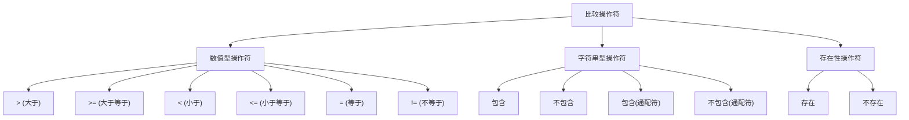
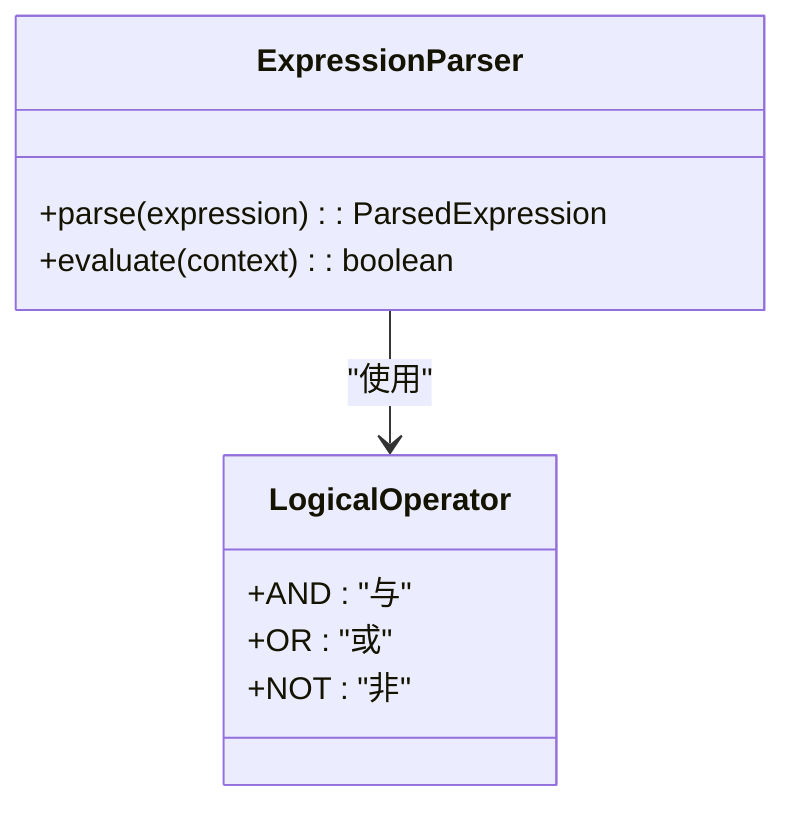
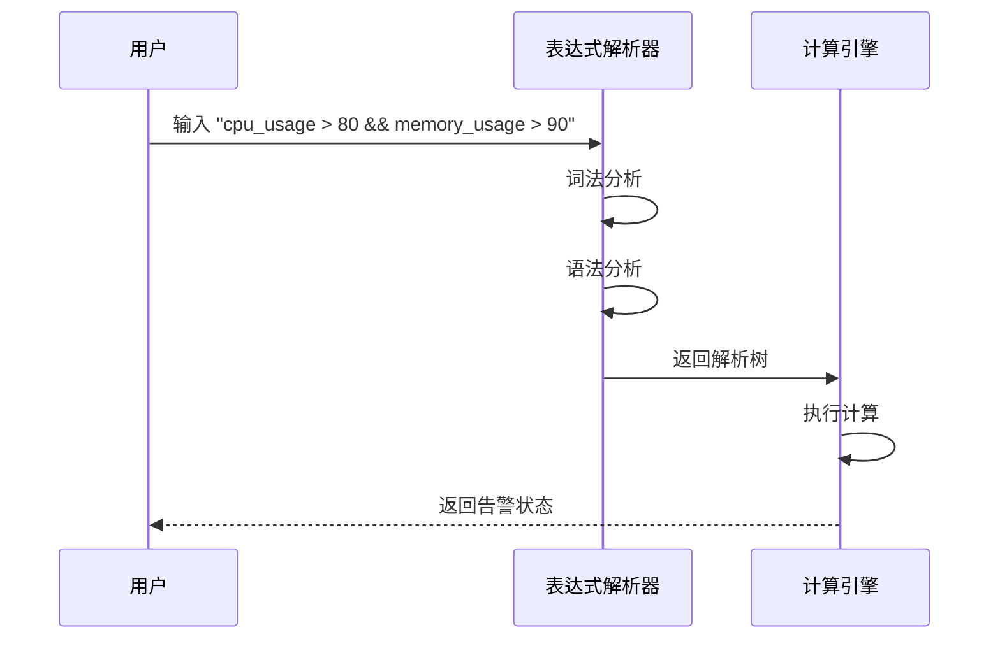

# 操作符支持

<cite>
**本文档中引用的文件**   
- [expression.py](file://bkmonitor\bkmonitor\strategy\expression.py)
- [strategy.py](file://bkmonitor\constants\strategy.py)
- [constants.py](file://bkmonitor\packages\apm_web\trace\constants.py)
- [elasticsearch.py](file://bkmonitor\constants\elasticsearch.py)
- [test_conditions.py](file://bkmonitor\bkmonitor\data_source\tests\test_conditions.py)
- [parsetab.py](file://bkmonitor\bkmonitor\as_code\ply\conditions\parsetab.py)
</cite>

## 目录
1. [简介](#简介)
2. [比较操作符](#比较操作符)
3. [逻辑操作符](#逻辑操作符)
4. [操作符使用场景与参数](#操作符使用场景与参数)
5. [代码示例与应用](#代码示例与应用)
6. [操作符组合最佳实践](#操作符组合最佳实践)

## 简介
本文档全面介绍蓝鲸监控平台支持的比较操作符和逻辑操作符。通过分析核心代码文件，详细说明各操作符的使用场景、参数要求和返回值类型，并提供实际监控策略中的应用示例。

**Section sources**
- [expression.py](file://bkmonitor\bkmonitor\strategy\expression.py#L0-L240)
- [constants.py](file://bkmonitor\packages\apm_web\trace\constants.py#L0-L285)

## 比较操作符

### 支持的比较操作符
蓝鲸监控平台支持多种比较操作符，根据数据类型的不同，可用的操作符也有所区别。



**Diagram sources**
- [constants.py](file://bkmonitor\packages\apm_web\trace\constants.py#L28-L140)
- [elasticsearch.py](file://bkmonitor\constants\elasticsearch.py#L62-L74)

**Section sources**
- [constants.py](file://bkmonitor\packages\apm_web\trace\constants.py#L28-L140)

### 按数据类型分类
不同数据类型支持的比较操作符如下：

**Section sources**
- [constants.py](file://bkmonitor\packages\apm_web\trace\constants.py#L89-L140)

#### 数值类型
对于整数、长整型、双精度浮点数和日期类型，支持以下操作符：
- **等于 (EQUAL)**: `=`
- **不等于 (NOT_EQUAL)**: `!=`
- **大于 (GT)**: `>`
- **大于等于 (GTE)**: `>=`
- **小于 (LT)**: `<`
- **小于等于 (LTE)**: `<=`
- **存在 (EXISTS)**
- **不存在 (NOT_EXISTS)**

#### 字符串类型
对于文本和关键字类型，支持以下操作符：
- **等于 (EQUAL)**: `=`
- **不等于 (NOT_EQUAL)**: `!=`
- **包含 (LIKE/INCLUDE)**: 包含指定字符串
- **不包含 (NOT_LIKE/EXCLUDE)**: 不包含指定字符串
- **存在 (EXISTS)**
- **不存在 (NOT_EXISTS)**

#### 布尔类型
对于布尔值，仅支持：
- **等于 (EQUAL)**
- **不等于 (NOT_EQUAL)**
- **存在 (EXISTS)**
- **不存在 (NOT_EXISTS)**

## 逻辑操作符

### 支持的逻辑操作符
逻辑操作符用于组合多个条件，构建复杂的监控策略。



**Diagram sources**
- [expression.py](file://bkmonitor\bkmonitor\strategy\expression.py#L0-L240)
- [parsetab.py](file://bkmonitor\bkmonitor\as_code\ply\conditions\parsetab.py#L0-L361)

**Section sources**
- [expression.py](file://bkmonitor\bkmonitor\strategy\expression.py#L0-L240)

### 逻辑操作符实现
逻辑操作符在代码中通过PLY（Python Lex-Yacc）解析器实现，支持标准的布尔逻辑运算。

#### 与 (AND)
- **符号**: `&&`
- **功能**: 所有条件都必须为真
- **实现**: `AndItem` 类，返回左右操作数的最小值

#### 或 (OR)
- **符号**: `||`
- **功能**: 至少一个条件为真
- **实现**: `OrItem` 类，返回左右操作数的最大值

#### 非 (NOT)
- **符号**: `!`
- **功能**: 取反操作
- **实现**: `NotItem` 类，异常与正常状态互换，无数据状态保持不变

## 操作符使用场景与参数

### 比较操作符参数要求
不同操作符对参数的要求如下：

**Section sources**
- [strategy.py](file://bkmonitor\constants\strategy.py#L160-L175)

| 操作符 | 参数类型 | 多值支持 | 通配符支持 |
|--------|---------|---------|-----------|
| 等于 | 字符串/数值 | 是 | 否 |
| 不等于 | 字符串/数值 | 是 | 否 |
| 大于 | 数值 | 否 | 否 |
| 小于 | 数值 | 否 | 否 |
| 包含 | 字符串 | 是 | 是 |
| 存在 | 任意 | 否 | 否 |

### 返回值类型
比较操作符通常返回布尔值，但在告警表达式中返回状态码：
- **20**: 异常状态
- **10**: 正常状态
- **0**: 无数据状态

## 代码示例与应用

### 基本比较操作
```python
# 数值比较
{"key": "cpu_usage", "method": "gt", "value": ["80"]}
{"key": "memory_usage", "method": "gte", "value": ["90"]}

# 字符串比较
{"key": "service_name", "method": "eq", "value": ["web_server"]}
{"key": "error_message", "method": "include", "value": ["timeout", "connection refused"]}
```

**Section sources**
- [test_conditions.py](file://bkmonitor\bkmonitor\data_source\tests\test_conditions.py#L75-L111)

### 逻辑表达式解析
```python
# 解析表达式 "A && (B || C) && !D"
expr = parse_expression("A && (B || C) && !D")
result = expr.eval({"A": 20, "B": 10, "C": 20, "D": 10})
# 返回结果: 20 (异常)
```

**Section sources**
- [expression.py](file://bkmonitor\bkmonitor\strategy\expression.py#L200-L240)

## 操作符组合最佳实践

### 组合使用示例


**Diagram sources**
- [expression.py](file://bkmonitor\bkmonitor\strategy\expression.py#L0-L240)

**Section sources**
- [expression.py](file://bkmonitor\bkmonitor\strategy\expression.py#L0-L240)

### 最佳实践建议
1. **优先使用括号**: 明确运算优先级
2. **避免过度复杂**: 单个表达式不宜包含过多条件
3. **合理使用通配符**: 字符串匹配时考虑性能影响
4. **测试边界条件**: 确保无数据情况下的正确处理

### 复杂条件组合
```python
# 实际监控策略中的复杂条件
conditions = [
    {"key": "cpu_usage", "method": "gt", "value": ["80"]},
    {"condition": "and", "key": "memory_usage", "method": "gt", "value": ["90"]},
    {"condition": "or", "key": "disk_usage", "method": "gt", "value": ["95"]},
    {"condition": "and", "key": "service_status", "method": "eq", "value": ["DOWN"]}
]
```

**Section sources**
- [test_conditions.py](file://bkmonitor\bkmonitor\data_source\tests\test_conditions.py#L75-L111)