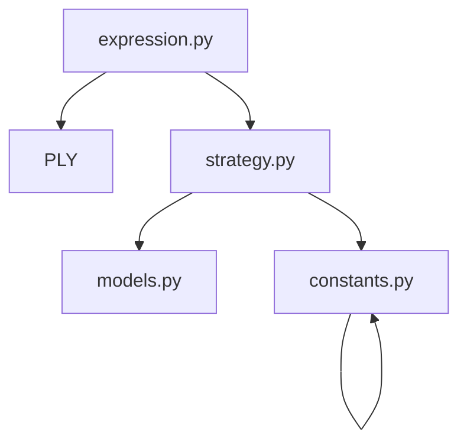
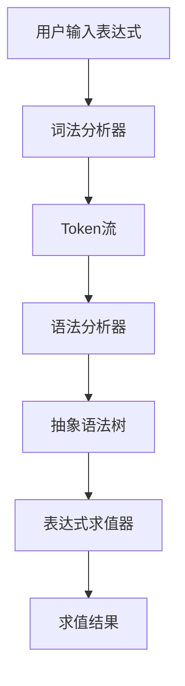
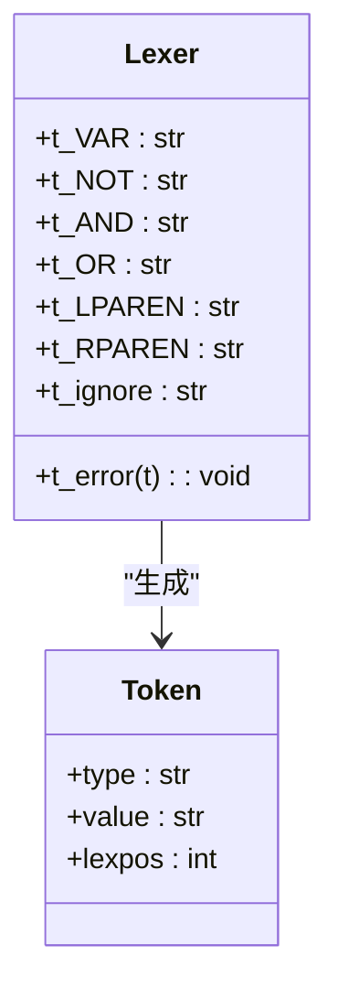
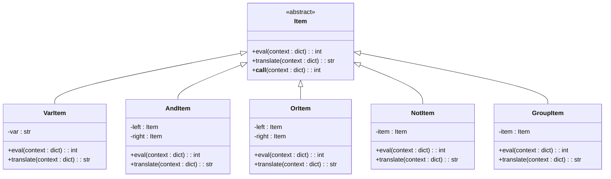
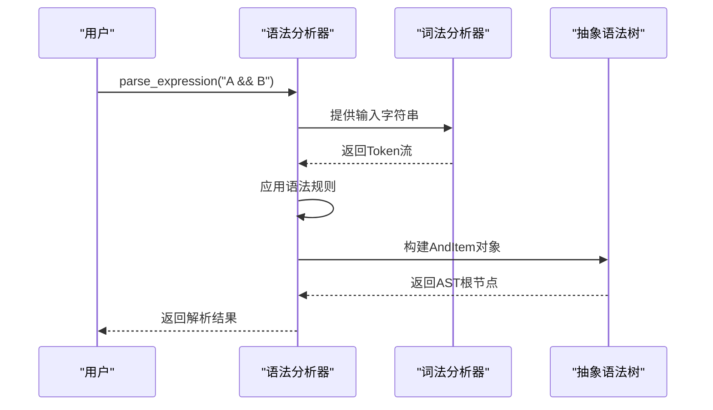
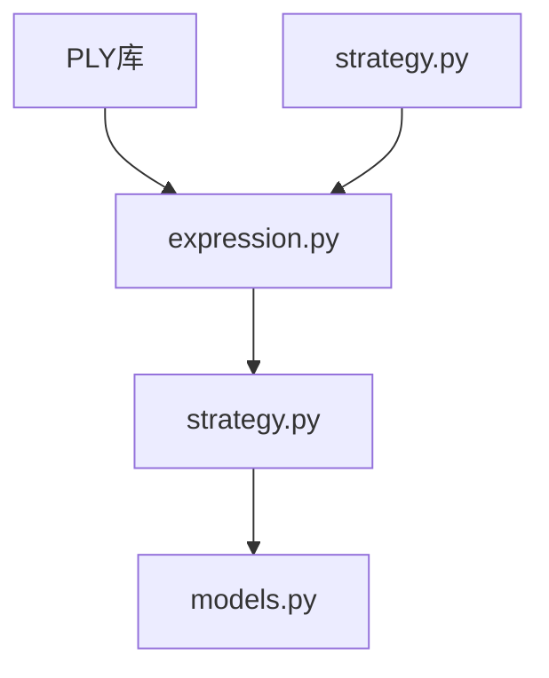

# 条件表达式

<cite>
**本文档中引用的文件**  
- [expression.py](file://bkmonitor/bkmonitor/strategy/expression.py)
- [strategy.py](file://bkmonitor/bkmonitor/strategy/strategy.py)
- [strategy.py](file://bkmonitor/constants/strategy.py)
</cite>

## 目录
1. [引言](#引言)
2. [项目结构](#项目结构)
3. [核心组件](#核心组件)
4. [架构概述](#架构概述)
5. [详细组件分析](#详细组件分析)
6. [依赖分析](#依赖分析)
7. [性能考虑](#性能考虑)
8. [故障排除指南](#故障排除指南)
9. [结论](#结论)

## 引言
条件表达式是监控系统中策略规则的核心组成部分，用于定义告警触发的逻辑条件。本文档详细解析了条件表达式的实现机制，包括语法结构、操作符支持、多条件组合逻辑、与监控指标的关联方式、解析与验证机制，并提供实际代码示例和常见问题解决方案。

## 项目结构
项目中的条件表达式功能主要分布在`bkmonitor`模块下的`strategy`子模块中。核心实现位于`bkmonitor/strategy/expression.py`，该文件使用PLY（Python Lex-Yacc）库构建了一个完整的表达式解析器。相关的策略配置和常量定义分别位于`strategy.py`和`constants/strategy.py`中。



**图示来源**
- [expression.py](file://bkmonitor/bkmonitor/strategy/expression.py)
- [strategy.py](file://bkmonitor/bkmonitor/strategy/strategy.py)
- [strategy.py](file://bkmonitor/constants/strategy.py)

## 核心组件
条件表达式系统的核心组件包括词法分析器（Lexer）、语法分析器（Parser）和表达式对象模型。`expression.py`文件定义了完整的表达式语法和语义，支持变量、逻辑与（&&）、逻辑或（||）、逻辑非（!）以及括号分组。

**组件来源**
- [expression.py](file://bkmonitor/bkmonitor/strategy/expression.py#L1-L241)

## 架构概述
条件表达式系统采用经典的编译器架构，分为词法分析、语法分析和语义执行三个阶段。用户输入的字符串表达式首先被词法分析器分解为Token流，然后由语法分析器根据预定义的语法规则构建抽象语法树（AST），最后通过遍历AST来执行表达式求值。



**图示来源**
- [expression.py](file://bkmonitor/bkmonitor/strategy/expression.py#L1-L241)

## 详细组件分析

### 表达式语法与词法分析
表达式语法支持标准的布尔逻辑运算，其格式示例如下：`A && (B || C) && !D`。词法分析器定义了六种Token类型：变量（VAR）、非（NOT）、与（AND）、或（OR）、左括号（LPAREN）和右括号（RPAREN）。

```python
tokens = (
    "VAR",  # 变量
    "NOT",  # 非
    "AND",  # 与
    "OR",  # 或
    "LPAREN",  # 左括号
    "RPAREN",  # 右括号
)

t_VAR = r"\w+"
t_NOT = r"!"
t_AND = r"&&"
t_OR = r"\|\|"
t_LPAREN = r"\("
t_RPAREN = r"\)"
```

#### 词法分析器类图


**图示来源**
- [expression.py](file://bkmonitor/bkmonitor/strategy/expression.py#L20-L50)

### 表达式对象模型
表达式被解析为一个由`Item`基类派生的对象树。每个节点代表一个操作或变量，支持求值（eval）和翻译（translate）操作。

#### 表达式对象类图


**图示来源**
- [expression.py](file://bkmonitor/bkmonitor/strategy/expression.py#L60-L160)

### 语法分析与解析流程
语法分析器使用Yacc定义了表达式的语法规则和优先级。`AND`和`OR`为左结合，`NOT`为右结合。

```python
precedence = (
    ("left", "AND", "OR"),
    ("right", "N_NOT"),
)

def p_expression_not(p):
    """expression : NOT expression %prec N_NOT"""
    p[0] = NotItem(p[2])

def p_expression_or(p):
    """expression : expression OR expression"""
    p[0] = OrItem(p[1], p[3])

def p_expression_and(p):
    """expression : expression AND expression"""
    p[0] = AndItem(p[1], p[3])

def p_expression_var(p):
    """expression : VAR"""
    p[0] = VarItem(p[1])

def p_expression_group(p):
    """expression : LPAREN expression RPAREN"""
    p[0] = GroupItem(p[2])
```

#### 表达式解析序列图


**图示来源**
- [expression.py](file://bkmonitor/bkmonitor/strategy/expression.py#L165-L239)

### 表达式求值与上下文关联
表达式通过`eval`方法在给定的上下文中求值。上下文是一个字典，包含了所有变量的值。求值过程遵循布尔逻辑的语义规则。

```python
def eval(self, context: dict = None) -> int:
    try:
        context = context or {}
        lower_context = {k.lower(): v for k, v in context.items()}
        return lower_context[self.var.lower()]
    except KeyError:
        raise ValueError("variable '%s' is not defined" % self.var)
```

## 依赖分析
条件表达式系统依赖于PLY库进行词法和语法分析。在项目内部，它被`strategy.py`中的`StrategyConfig`类调用，用于处理复杂的策略条件逻辑。常量定义文件`constants/strategy.py`提供了与表达式相关的配置常量。



**图示来源**
- [expression.py](file://bkmonitor/bkmonitor/strategy/expression.py)
- [strategy.py](file://bkmonitor/bkmonitor/strategy/strategy.py)
- [strategy.py](file://bkmonitor/constants/strategy.py)

## 性能考虑
表达式解析是一次性的开销，解析后的AST可以被多次求值。对于频繁求值的场景，建议缓存解析结果。避免在表达式中使用过于复杂的嵌套结构，以减少AST的深度和求值时间。

## 故障排除指南
### 常见配置错误
1. **非法字符错误**：输入表达式包含不支持的字符。
   - **解决方案**：检查表达式，确保只包含字母、数字、空格和操作符`!`、`&&`、`||`、`(`、`)`。

2. **变量未定义错误**：求值时上下文中缺少变量。
   - **解决方案**：确保上下文字典中包含表达式中所有引用的变量。

3. **语法错误**：括号不匹配或操作符使用不当。
   - **解决方案**：检查括号是否成对出现，逻辑操作符两侧是否有有效的表达式。

### 性能优化建议
1. **缓存解析结果**：对于相同的表达式字符串，重复调用`parse_expression`是低效的。应将解析结果（AST）缓存起来重复使用。
2. **简化表达式**：避免过深的嵌套，将复杂的条件拆分为多个简单的表达式。
3. **预编译**：在系统启动时预编译常用的表达式，避免在运行时进行解析。

## 结论
条件表达式系统通过PLY库实现了完整的布尔表达式解析功能，具有良好的扩展性和可维护性。它将用户友好的字符串表达式转换为可执行的对象树，实现了与监控指标的灵活关联。通过理解其内部机制，开发者可以更有效地使用和优化该功能。