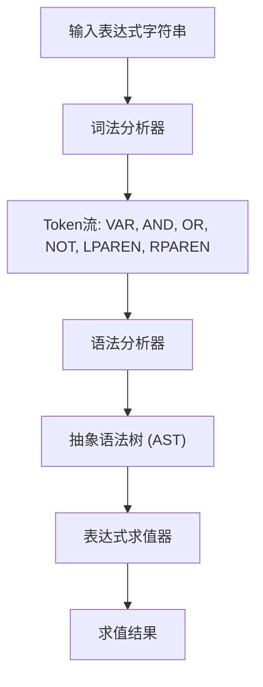
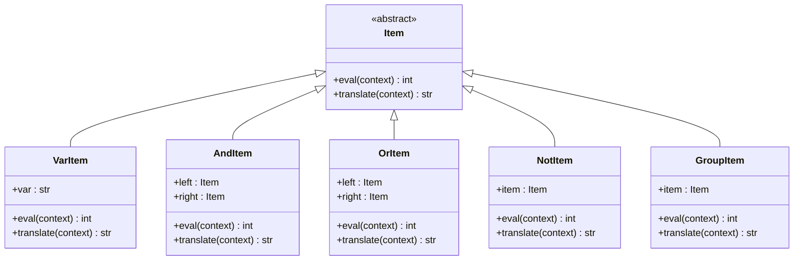
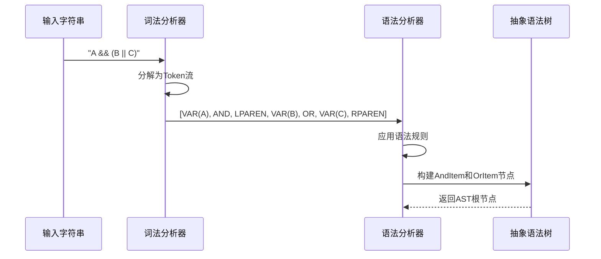

# 表达式语法

<cite>
**本文档中引用的文件**   
- [expression.py](file://bkmonitor/bkmonitor/strategy/expression.py#L1-L241)
- [parsetab.py](file://bkmonitor/bkmonitor/strategy/parsetab.py#L112-L187)
- [test_processor.py](file://bkmonitor/alarm_backends/tests/service/composite/test_processor.py#L83-L107)
- [test_base.py](file://bkmonitor/bkmonitor/strategy/tests/test_base.py#L198-L212)
</cite>

## 目录
1. [引言](#引言)
2. [表达式语法基础](#表达式语法基础)
3. [支持的数据类型与变量](#支持的数据类型与变量)
4. [操作符与优先级规则](#操作符与优先级规则)
5. [括号与表达式分组](#括号与表达式分组)
6. [表达式解析流程](#表达式解析流程)
7. [表达式求值与上下文匹配](#表达式求值与上下文匹配)
8. [常见语法错误与排查](#常见语法错误与排查)
9. [完整语法示例](#完整语法示例)
10. [结论](#结论)

## 引言

在监控系统中，策略条件表达式用于定义告警触发的逻辑规则。这些表达式允许用户通过组合多个监控项的状态来创建复杂的告警条件。本文档详细说明了表达式的语法规则、解析机制、求值过程以及常见问题的解决方法，帮助开发者正确构建和调试表达式。

**Section sources**
- [expression.py](file://bkmonitor/bkmonitor/strategy/expression.py#L1-L20)

## 表达式语法基础

策略条件表达式采用类布尔逻辑语法，支持变量、逻辑操作符和括号分组。表达式的基本结构由变量（代表监控项）和操作符（如与、或、非）组成。

例如，表达式 `A && (B || C) && !D` 表示：当监控项A为异常，且（B或C中至少一个为异常），并且D不为异常时，整体表达式为真，触发告警。

表达式解析器使用PLY（Python Lex-Yacc）工具构建，分为词法分析和语法分析两个阶段。词法分析器将输入字符串分解为Token流，语法分析器根据预定义的文法规则构建抽象语法树（AST）。



**Diagram sources**
- [expression.py](file://bkmonitor/bkmonitor/strategy/expression.py#L50-L100)

## 支持的数据类型与变量

表达式支持以下数据类型和变量：

- **变量 (VAR)**: 代表一个监控项，由字母、数字和下划线组成的标识符，如 `A`, `cpu_usage`, `mem_percent`。
- **布尔状态值**: 变量在求值时会被映射为整数状态值，系统定义了三种状态：
  - **异常 (ABNORMAL)**: 值为 20
  - **正常 (NORMAL)**: 值为 10
  - **无数据 (NO_DATA)**: 值为 0

变量在表达式中不区分大小写。在求值时，解析器会将上下文中的键转换为小写进行匹配。

```python
# 变量定义示例
t_VAR = r"\w+"
```

**Section sources**
- [expression.py](file://bkmonitor/bkmonitor/strategy/expression.py#L30-L35)

## 操作符与优先级规则

表达式支持以下逻辑操作符：

| 操作符 | 符号 | 说明 |
| :--- | :--- | :--- |
| 与 (AND) | `&&` | 两个操作数都为真时结果为真 |
| 或 (OR) | `\|\|` | 两个操作数中至少一个为真时结果为真 |
| 非 (NOT) | `!` | 单目操作符，取反操作数的逻辑值 |

操作符的优先级和结合性由 `precedence` 元组定义：

```python
precedence = (
    ("left", "AND", "OR"),  # left 表示左结合，AND 和 OR 优先级相同
    ("right", "N_NOT"),     # right 表示右结合，N_NOT 优先级最高
)
```

根据此规则：
1. `!` (NOT) 具有最高优先级，且为右结合。
2. `&&` (AND) 和 `\|\|` (OR) 具有相同优先级，且为左结合。

例如，表达式 `!A && B || C` 等价于 `((!A) && B) || C`。



**Diagram sources**
- [expression.py](file://bkmonitor/bkmonitor/strategy/expression.py#L100-L150)

## 括号与表达式分组

圆括号 `()` 用于改变操作符的默认优先级或对子表达式进行分组。括号内的表达式会优先被求值。

语法规则如下：
```python
def p_expression_group(p):
    """expression : LPAREN expression RPAREN"""
    p[0] = GroupItem(p[2])
```

例如，在表达式 `A && (B || C)` 中，`B || C` 会先被计算，其结果再与 `A` 进行 `&&` 运算。这确保了逻辑的正确性。

## 表达式解析流程

表达式的解析流程如下：

1. **词法分析 (Lexing)**: 输入字符串被分解为Token序列。
   - 例如，`A && B` 被分解为 `[VAR('A'), AND('&&'), VAR('B')]`。

2. **语法分析 (Parsing)**: 根据文法规则，将Token序列构建成抽象语法树（AST）。
   - 文法规则定义在 `parsetab.py` 文件中，例如：
     ```python
     _lr_productions = [
         ("S' -> expression", "S'", 1, None, None, None),
         ("expression -> NOT expression", "expression", 2, "p_expression_not", "expression.py", 171),
         ("expression -> expression OR expression", "expression", 3, "p_expression_or", "expression.py", 176),
         ...
     ]
     ```

3. **AST构建**: 每个语法规则对应一个处理函数（如 `p_expression_and`），这些函数负责创建相应的AST节点对象（如 `AndItem`）。



**Diagram sources**
- [expression.py](file://bkmonitor/bkmonitor/strategy/expression.py#L170-L200)
- [parsetab.py](file://bkmonitor/bkmonitor/strategy/parsetab.py#L112-L187)

## 表达式求值与上下文匹配

表达式求值通过调用AST根节点的 `eval` 方法完成。该方法递归地计算整个表达式的值。

求值过程需要一个上下文字典（`context`），它将变量名映射到其当前状态值（20, 10, 或 0）。

```python
def eval(self, context: dict = None) -> int:
    # 在VarItem中实现
    lower_context = {k.lower(): v for k, v in context.items()}
    return lower_context[self.var.lower()]
```

求值规则：
- **AndItem**: 返回左右子表达式求值结果的最小值（取最差状态）。
- **OrItem**: 返回左右子表达式求值结果的最大值（取最好状态）。
- **NotItem**: 将异常与正常状态互换，无数据状态保持不变。

例如，`expr.eval({"A": 20, "B": 10, "C": 20, "D": 10})` 会计算表达式在给定状态下的最终结果。

**Section sources**
- [expression.py](file://bkmonitor/bkmonitor/strategy/expression.py#L150-L170)

## 常见语法错误与排查

以下是常见的语法错误及其排查方法：

1. **非法字符**: 如果表达式包含未定义的字符（如中文标点、特殊符号），会抛出 `ValueError`。
   - **排查**: 检查表达式是否只包含字母、数字、下划线、`!`、`&`、`|`、`(`、`)` 和空格。

2. **语法错误**: 括号不匹配、操作符使用不当（如 `A && && B`）会导致解析失败。
   - **排查**: 检查错误信息中的位置（`p.lexpos`），定位并修正语法。

3. **未定义变量**: 在求值时引用了上下文中不存在的变量。
   - **排查**: 确保上下文字典包含表达式中所有使用的变量名。

4. **优先级误解**: 未使用括号导致逻辑与预期不符。
   - **排查**: 使用括号明确分组，或通过测试用例验证复杂表达式的行为。

```python
# 错误示例
try:
    parse_expression("A && && B")
except ValueError as e:
    print(e)  # Syntax error at '&&' at position 4
```

**Section sources**
- [expression.py](file://bkmonitor/bkmonitor/strategy/expression.py#L210-L230)

## 完整语法示例

以下是一些完整的表达式语法示例，取自测试代码：

```python
# 示例1: 简单与操作
expression = "A && B"
# 对应策略配置
detect_config = {
    "expression": "A && B",
    "connector": "and"
}

# 示例2: 复杂组合，包含或、与、非和括号
expression = "A && (B || C) && !D"
# 解析后AST结构
# AndItem(
#   AndItem(
#     VarItem(A),
#     GroupItem(OrItem(VarItem(B), VarItem(C)))
#   ),
#   NotItem(VarItem(D))
# )

# 示例3: 来自测试用例的多个表达式
test_expressions = [
    "A && B && C",  # 三个监控项都异常
    "A && B || C",  # (A和B都异常) 或 C异常
    "A || B && C",  # A异常 或 (B和C都异常)
    "A || B || C",  # A、B、C中任意一个异常
]
```

这些示例展示了表达式在实际策略配置中的应用。

**Section sources**
- [test_processor.py](file://bkmonitor/alarm_backends/tests/service/composite/test_processor.py#L83-L107)
- [test_base.py](file://bkmonitor/bkmonitor/strategy/tests/test_base.py#L198-L212)

## 结论

本文档详细阐述了监控系统中策略条件表达式的语法规则和实现机制。通过理解词法分析、语法分析、AST构建和求值过程，开发者可以更有效地构建和调试复杂的告警逻辑。正确使用变量、操作符和括号，并遵循优先级规则，是确保表达式按预期工作的重要前提。遇到问题时，应结合错误信息和测试用例进行排查。