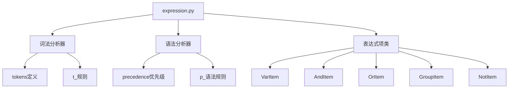
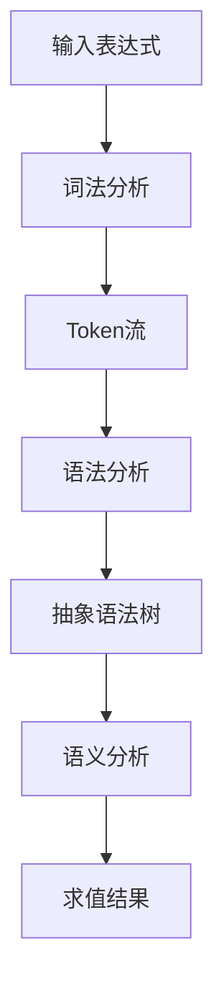
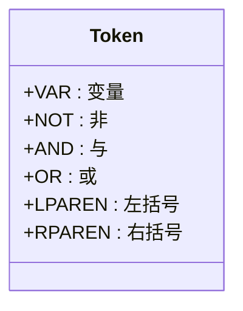
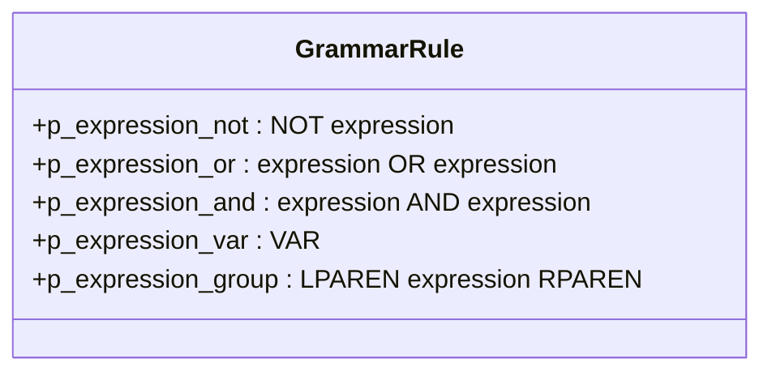
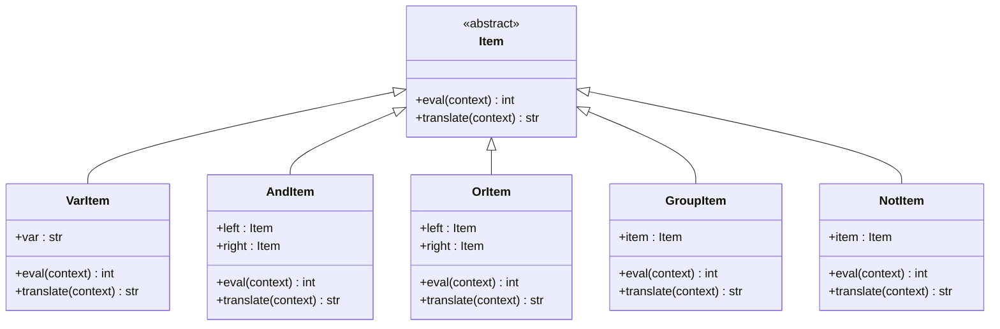
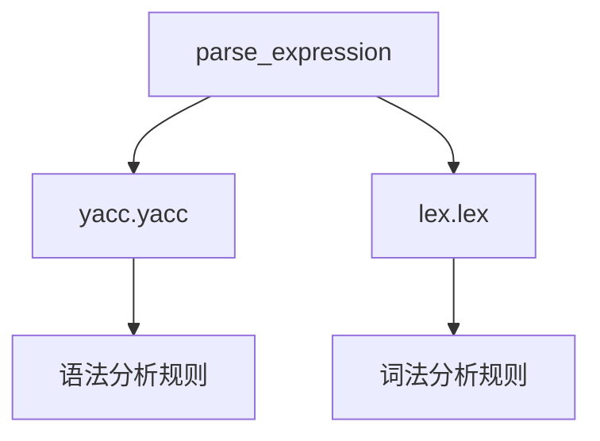

# 表达式验证

<cite>
**本文档中引用的文件**  
- [expression.py](file://bkmonitor/bkmonitor/strategy/expression.py)
</cite>

## 目录
1. [简介](#简介)
2. [项目结构](#项目结构)
3. [核心组件](#核心组件)
4. [架构概述](#架构概述)
5. [详细组件分析](#详细组件分析)
6. [依赖分析](#依赖分析)
7. [性能考虑](#性能考虑)
8. [故障排除指南](#故障排除指南)
9. [结论](#结论)

## 简介
本文档深入解析了蓝鲸监控平台中条件表达式的验证机制。系统通过词法分析和语法分析双重机制确保用户输入的表达式安全有效，防止注入攻击和无效配置。文档详细说明了语法验证、类型检查、边界值验证等环节，并提供了验证失败的错误码和对应的修复建议，帮助开发者快速定位问题。

## 项目结构
表达式验证功能主要集中在`bkmonitor/strategy/`目录下的`expression.py`文件中。该文件实现了完整的表达式解析器，使用PLY（Python Lex-Yacc）库进行词法和语法分析。系统通过定义严格的Token规则和语法规则，确保只有符合规范的表达式才能被解析和执行。

**图示来源**
- [expression.py](file://bkmonitor/bkmonitor/strategy/expression.py)

**本节来源**
- [expression.py](file://bkmonitor/bkmonitor/strategy/expression.py)

## 核心组件
表达式验证系统的核心组件包括词法分析器、语法分析器和表达式项类。词法分析器负责将输入字符串分解为Token流，语法分析器根据预定义的语法规则构建抽象语法树（AST），表达式项类则实现了各种操作符的求值逻辑。

**本节来源**
- [expression.py](file://bkmonitor/bkmonitor/strategy/expression.py#L1-L50)

## 架构概述
系统采用经典的编译器架构，分为词法分析、语法分析和语义分析三个阶段。首先，词法分析器将输入字符串转换为Token序列；然后，语法分析器根据BNF语法规则构建AST；最后，通过遍历AST完成表达式求值。这种分层架构确保了系统的可维护性和扩展性。

**图示来源**
- [expression.py](file://bkmonitor/bkmonitor/strategy/expression.py)

## 详细组件分析
### 词法分析器
词法分析器定义了六种Token类型：VAR（变量）、NOT（非）、AND（与）、OR（或）、LPAREN（左括号）和RPAREN（右括号）。每种Token都有对应的正则表达式匹配规则，如`t_VAR = r"\w+"`匹配字母数字组合的变量名。

#### Token定义

**图示来源**
- [expression.py](file://bkmonitor/bkmonitor/strategy/expression.py#L35-L45)

**本节来源**
- [expression.py](file://bkmonitor/bkmonitor/strategy/expression.py#L35-L55)

### 语法分析器
语法分析器定义了五条语法规则，分别处理NOT、OR、AND、变量和括号表达式。通过`precedence`元组定义了操作符优先级，其中AND和OR为左结合，NOT为右结合，确保了正确的求值顺序。

#### 语法规则

**图示来源**
- [expression.py](file://bkmonitor/bkmonitor/strategy/expression.py#L196-L216)

**本节来源**
- [expression.py](file://bkmonitor/bkmonitor/strategy/expression.py#L190-L225)

### 表达式项类
表达式项类实现了各种操作符的求值逻辑。`VarItem`处理变量求值，`AndItem`实现逻辑与（取最低状态），`OrItem`实现逻辑或（取最高状态），`GroupItem`处理括号分组，`NotItem`实现逻辑非（状态转换）。

#### 类关系图

**图示来源**
- [expression.py](file://bkmonitor/bkmonitor/strategy/expression.py#L80-L165)

**本节来源**
- [expression.py](file://bkmonitor/bkmonitor/strategy/expression.py#L79-L165)

## 依赖分析
表达式验证系统主要依赖PLY库进行词法和语法分析。系统通过`lex.lex()`和`yacc.yacc()`创建词法分析器和语法分析器实例。`parse_expression`函数作为外部接口，封装了底层分析器的调用细节。

**图示来源**
- [expression.py](file://bkmonitor/bkmonitor/strategy/expression.py#L238-L239)

**本节来源**
- [expression.py](file://bkmonitor/bkmonitor/strategy/expression.py#L238-L239)

## 性能考虑
系统通过预编译的词法和语法分析器实现高效解析。PLY库在首次调用时生成分析表，后续解析过程时间复杂度为O(n)，其中n为输入表达式的长度。对于复杂表达式，建议使用缓存机制避免重复解析。

## 故障排除指南
当表达式验证失败时，系统会抛出`ValueError`异常并提供具体的错误信息。以下是常见错误码和修复建议：

| 错误信息 | 错误原因 | 修复建议 |
|---------|--------|--------|
| "Illegal character '%s' at position %d" | 包含非法字符 | 检查表达式中的特殊字符，只允许字母、数字、空格和指定操作符 |
| "variable '%s' is not defined" | 变量未定义 | 确保上下文字典中包含所有引用的变量 |
| "Syntax error at '%s' at position %d" | 语法错误 | 检查操作符使用是否正确，括号是否匹配 |
| "Syntax error at EOF" | 表达式不完整 | 检查表达式是否完整，是否有缺失的括号或操作数 |

**本节来源**
- [expression.py](file://bkmonitor/bkmonitor/strategy/expression.py#L54)
- [expression.py](file://bkmonitor/bkmonitor/strategy/expression.py#L90)
- [expression.py](file://bkmonitor/bkmonitor/strategy/expression.py#L223)
- [expression.py](file://bkmonitor/bkmonitor/strategy/expression.py#L225)

## 结论
蓝鲸监控平台的表达式验证机制通过严格的词法和语法分析确保了表达式的安全性和有效性。系统采用分层架构，具有良好的可维护性和扩展性。通过提供详细的错误信息和修复建议，帮助开发者快速定位和解决问题。建议在实际使用中遵循最佳实践，如使用缓存机制提高性能，严格验证输入数据防止注入攻击。