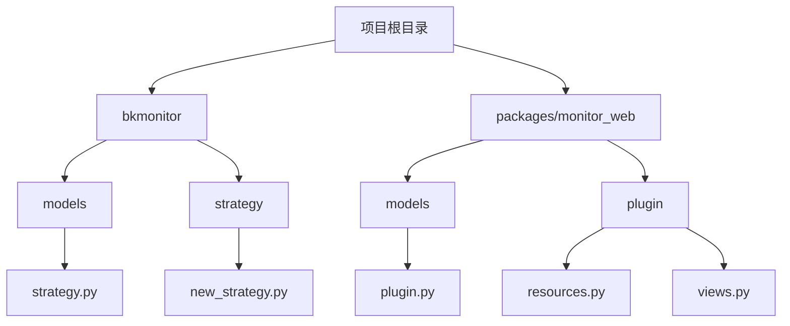
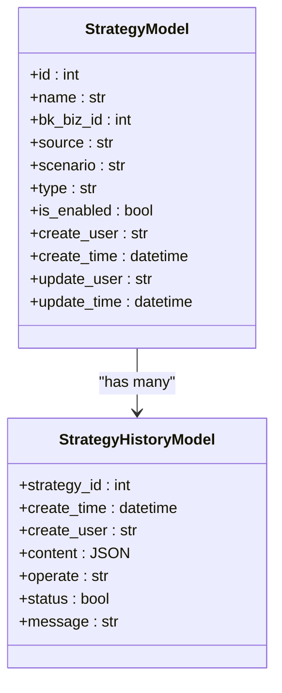
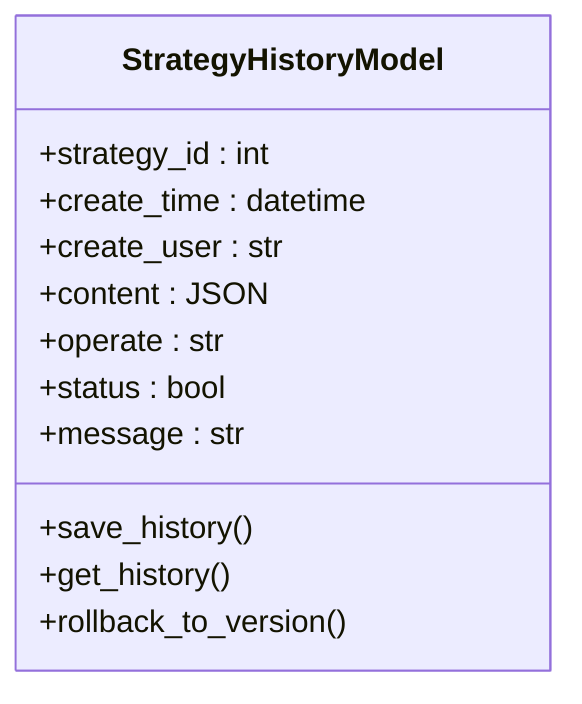
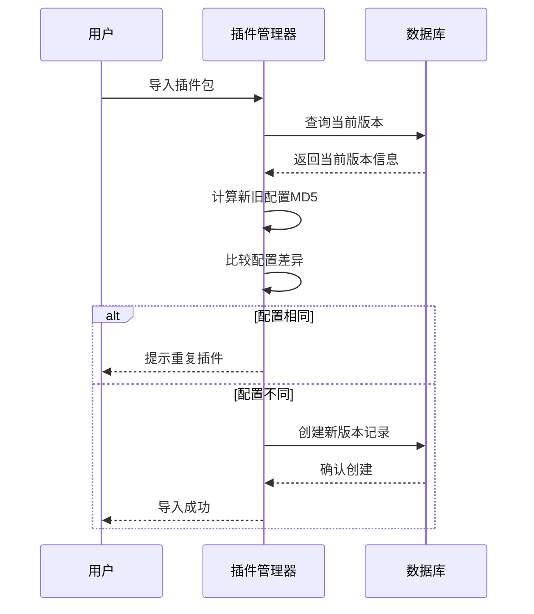
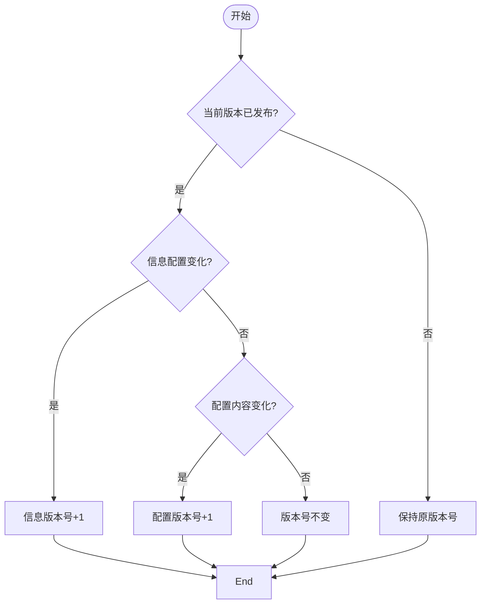
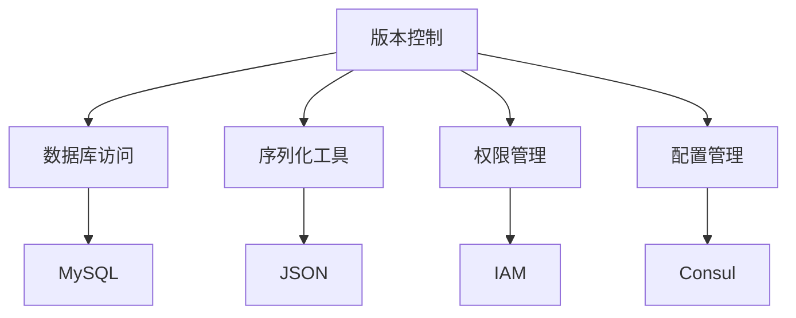

# 版本控制

<cite>
**本文档引用的文件**   
- [strategy.py](file://bkmonitor\bkmonitor\strategy\strategy.py)
- [new_strategy.py](file://bkmonitor\bkmonitor\strategy\new_strategy.py)
- [plugin.py](file://bkmonitor\packages\monitor_web\models\plugin.py)
- [resources.py](file://bkmonitor\packages\monitor_web\plugin\resources.py)
- [views.py](file://bkmonitor\packages\monitor_web\plugin\views.py)
- [strategy.py](file://bkmonitor\bkmonitor\models\strategy.py)
</cite>

## 目录
1. [引言](#引言)
2. [项目结构](#项目结构)
3. [核心组件](#核心组件)
4. [架构概述](#架构概述)
5. [详细组件分析](#详细组件分析)
6. [依赖分析](#依赖分析)
7. [性能考虑](#性能考虑)
8. [故障排除指南](#故障排除指南)
9. [结论](#结论)

## 引言
本文档深入解析了蓝鲸监控平台中策略配置的版本控制机制。文档涵盖了版本快照生成、差异比较、回滚操作的实现原理，详细说明了版本存储策略和数据库设计，并展示了版本历史查询API的使用方法。同时，文档还提供了版本冲突检测与解决机制的技术细节和最佳实践，为开发者和运维人员提供了全面的技术参考。

## 项目结构
蓝鲸监控平台的项目结构清晰地划分了不同的功能模块，其中与版本控制相关的代码主要分布在`bkmonitor`和`packages/monitor_web`目录下。`bkmonitor/models/strategy.py`文件定义了策略及其历史记录的数据库模型，而`bkmonitor/strategy/new_strategy.py`则实现了策略配置的高级处理逻辑。插件相关的版本控制功能则位于`packages/monitor_web/models/plugin.py`和`packages/monitor_web/plugin/resources.py`等文件中。

**图示来源**
- [strategy.py](file://bkmonitor\bkmonitor\models\strategy.py)
- [new_strategy.py](file://bkmonitor\bkmonitor\strategy\new_strategy.py)
- [plugin.py](file://bkmonitor\packages\monitor_web\models\plugin.py)
- [resources.py](file://bkmonitor\packages\monitor_web\plugin\resources.py)
- [views.py](file://bkmonitor\packages\monitor_web\plugin\views.py)

## 核心组件
策略版本控制的核心组件包括`StrategyModel`、`StrategyHistoryModel`以及相关的管理类。`StrategyModel`代表了当前有效的策略配置，而`StrategyHistoryModel`则记录了所有对策略的创建、更新和删除操作的历史。通过这两个模型的配合，系统能够追踪策略的每一次变更，并支持回滚到任意历史版本。

**组件来源**
- [strategy.py](file://bkmonitor\bkmonitor\models\strategy.py)

## 架构概述
蓝鲸监控平台的版本控制架构采用了基于数据库的历史记录模式。每当策略配置发生变更时，系统会将变更前的完整配置以JSON格式保存到`StrategyHistoryModel`中，并标记操作类型（创建、更新或删除）。这种设计使得版本历史查询变得简单高效，同时也为冲突检测和解决提供了基础数据。

**图示来源**
- [strategy.py](file://bkmonitor\bkmonitor\models\strategy.py)

## 详细组件分析

### 策略历史记录分析
策略历史记录功能通过`StrategyHistoryModel`实现，该模型存储了每次策略变更的完整快照。当用户更新策略时，系统会先将当前配置序列化为JSON并保存到历史表中，然后再应用新的配置。这种方式确保了即使在配置错误的情况下，也能轻松回滚到之前的稳定状态。

#### 对于对象导向的组件：

**图示来源**
- [strategy.py](file://bkmonitor\bkmonitor\models\strategy.py)

### 版本冲突检测分析
版本冲突检测机制主要在插件管理模块中实现。当用户尝试导入一个新版本的插件时，系统会比较新旧版本的配置哈希值。如果发现配置内容相同但版本号不同，系统会提示用户存在重复插件的冲突。此外，系统还会检查插件类型、远程采集支持等关键属性是否发生变化，以防止不兼容的配置覆盖。

#### 对于API/服务组件：

**图示来源**
- [resources.py](file://bkmonitor\packages\monitor_web\plugin\resources.py)

### 版本存储策略分析
版本存储策略采用了增量版本号的方式。每次发布新版本时，系统会根据配置内容的变化自动递增版本号。具体来说，如果信息配置（info）发生变化且当前版本已发布，则信息版本号加1；如果配置内容（config）发生变化且当前版本已发布，则配置版本号加1。这种机制确保了版本号的连续性和可追溯性。

#### 对于复杂逻辑组件：

**图示来源**
- [base.py](file://bkmonitor\packages\monitor_web\plugin\manager\base.py)

## 依赖分析
策略版本控制功能依赖于多个核心模块，包括数据库访问层、序列化工具和权限管理系统。`core.drf_resource`提供了统一的资源访问接口，`constants`模块定义了所有常量值，而`bkmonitor.utils`则包含了各种实用工具函数。这些模块共同构成了版本控制功能的基础支撑。

**图示来源**
- [new_strategy.py](file://bkmonitor\bkmonitor\strategy\new_strategy.py)
- [strategy.py](file://bkmonitor\bkmonitor\models\strategy.py)

## 性能考虑
在设计版本控制机制时，性能是一个重要的考量因素。为了避免在循环中调用`current_version`属性导致的n+1查询问题，系统使用了`@cached_property`装饰器来缓存结果。此外，历史记录的查询操作都建立了适当的数据库索引，以确保即使在大量历史数据的情况下也能保持良好的查询性能。

## 故障排除指南
当遇到版本控制相关的问题时，首先应检查数据库中的`alarm_strategy_history`表，确认历史记录是否正确生成。如果发现版本回滚失败，需要查看`StrategyHistoryModel`中的`status`和`message`字段，以获取具体的错误信息。对于插件版本冲突问题，可以通过检查`PluginVersionHistory`表中的`stage`字段来确定当前版本的状态。

**故障排除来源**
- [strategy.py](file://bkmonitor\bkmonitor\models\strategy.py)
- [plugin.py](file://bkmonitor\packages\monitor_web\models\plugin.py)

## 结论
蓝鲸监控平台的版本控制机制通过结合数据库历史记录和智能版本号管理，为策略配置提供了可靠的变更追踪和回滚能力。该机制不仅支持基本的版本快照和差异比较，还实现了复杂的冲突检测与解决策略。通过合理的架构设计和性能优化，系统能够在保证功能完整性的同时，提供高效稳定的版本管理服务。