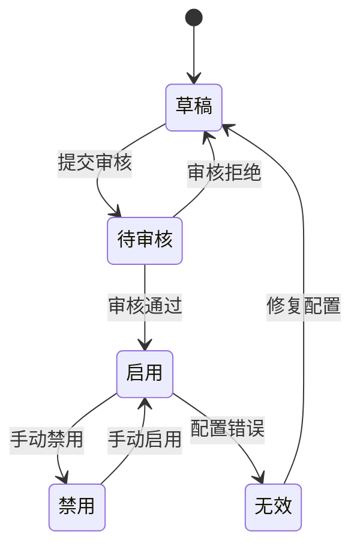
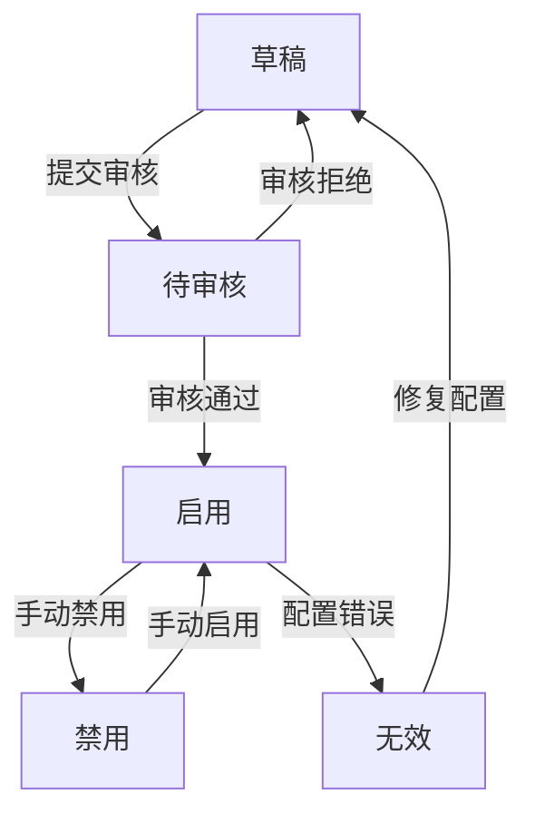
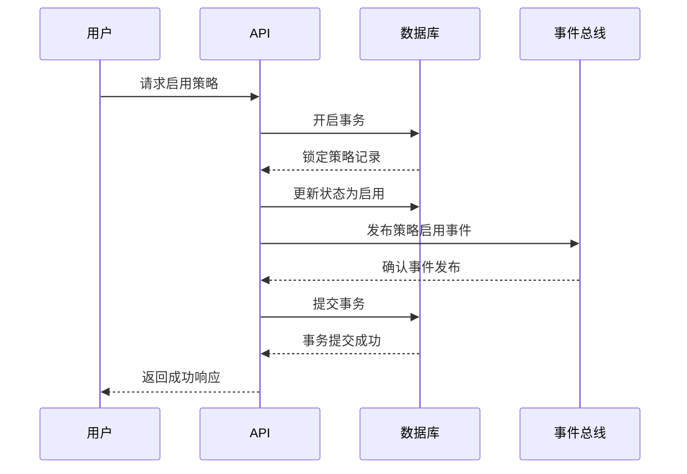

# 状态转换

<cite>
**本文档引用的文件**   
- [new_strategy.py](file://bkmonitor\bkmonitor\strategy\new_strategy.py#L503-L545)
- [action.py](file://bkmonitor\constants\action.py#L544-L591)
- [test_base.py](file://bkmonitor\bkmonitor\strategy\tests\test_base.py#L404-L430)
- [test_base.py](file://bkmonitor\bkmonitor\strategy\tests\test_base.py#L430-L456)
- [base.py](file://bkmonitor\packages\monitor_api\models\base.py#L487-L511)
</cite>

## 目录
1. [状态机设计概述](#状态机设计概述)
2. [监控策略状态定义](#监控策略状态定义)
3. [状态转换规则与触发条件](#状态转换规则与触发条件)
4. [权限校验机制](#权限校验机制)
5. [副作用处理与一致性保障](#副作用处理与一致性保障)
6. [API调用示例与异常处理](#api调用示例与异常处理)
7. [状态一致性保障机制](#状态一致性保障机制)

## 状态机设计概述

监控策略的状态机设计旨在管理策略从创建到执行的全生命周期，确保策略在不同状态间的转换符合业务逻辑和安全要求。状态机通过明确定义的状态和转换规则，支持策略的启用、禁用、草稿、待审核等操作，同时保障系统的一致性和可靠性。

**文档来源**
- [new_strategy.py](file://bkmonitor\bkmonitor\strategy\new_strategy.py#L503-L545)
- [action.py](file://bkmonitor\constants\action.py#L544-L591)

## 监控策略状态定义

监控策略的状态主要分为以下几类：

- **启用（Enabled）**：策略处于激活状态，系统会根据配置执行监控和告警。
- **禁用（Disabled）**：策略被手动或自动禁用，不再执行监控任务。
- **草稿（Draft）**：策略处于编辑阶段，尚未提交审核或启用。
- **待审核（Pending Review）**：策略已提交，等待管理员或相关角色审核。
- **无效（Invalid）**：策略因配置错误或其他原因无法正常工作。

这些状态通过 `is_enabled` 和 `is_invalid` 字段在策略模型中进行管理，确保状态的准确性和可追溯性。



**图示来源**
- [new_strategy.py](file://bkmonitor\bkmonitor\strategy\new_strategy.py#L2941-L2973)

**本节来源**
- [new_strategy.py](file://bkmonitor\bkmonitor\strategy\new_strategy.py#L2941-L2973)

## 状态转换规则与触发条件

状态转换遵循严格的规则，确保每个状态变更都经过适当的验证和处理：

- **草稿 → 待审核**：用户完成策略配置后，点击“提交审核”按钮触发。
- **待审核 → 启用**：管理员审核通过后，策略自动进入启用状态。
- **待审核 → 草稿**：审核未通过，返回修改。
- **启用 → 禁用**：用户或系统根据条件（如维护窗口）手动禁用。
- **禁用 → 启用**：用户手动重新启用策略。
- **启用 → 无效**：策略配置出现错误，系统自动标记为无效。
- **无效 → 草稿**：用户修复配置后，策略返回草稿状态重新提交。



**图示来源**
- [new_strategy.py](file://bkmonitor\bkmonitor\strategy\new_strategy.py#L503-L545)

**本节来源**
- [new_strategy.py](file://bkmonitor\bkmonitor\strategy\new_strategy.py#L503-L545)

## 权限校验机制

状态变更操作需经过严格的权限校验，确保只有授权用户可以执行特定操作：

- **提交审核**：仅策略创建者或具有编辑权限的用户可执行。
- **审核通过/拒绝**：仅管理员或审核角色可执行。
- **启用/禁用**：策略所有者或管理员可执行。
- **修复配置**：仅策略创建者或具有编辑权限的用户可执行。

权限校验通过 IAM（Identity and Access Management）系统实现，确保操作的安全性和合规性。

**本节来源**
- [action.py](file://bkmonitor\constants\action.py#L544-L591)

## 副作用处理与一致性保障

状态变更可能引发一系列副作用，如通知、日志记录、关联策略更新等。系统通过事务机制和事件驱动架构确保副作用的一致性：

- **事务性更新**：状态变更与相关数据更新在同一个数据库事务中完成，避免部分更新导致的数据不一致。
- **事件发布**：状态变更后，系统发布相应事件，触发通知、审计日志等后续操作。
- **幂等性设计**：确保重复的状态变更请求不会产生副作用。

**本节来源**
- [test_base.py](file://bkmonitor\bkmonitor\strategy\tests\test_base.py#L430-L456)

## API调用示例与异常处理

### 启用策略 API 示例

```python
def enable_strategy(strategy_id: int, user: str):
    try:
        strategy = Strategy.get_by_id(strategy_id)
        if not has_permission(user, "enable", strategy):
            raise PermissionError("用户无权启用该策略")
        
        strategy.enable()
        log_audit_event(user, "enabled", strategy_id)
        publish_event("strategy_enabled", strategy_id)
        
    except StrategyNotFoundError:
        raise APIError("策略不存在", code=404)
    except PermissionError as e:
        raise APIError(str(e), code=403)
    except Exception as e:
        rollback_transaction()
        raise APIError("操作失败", code=500)
```

### 异常处理策略

- **404 Not Found**：策略不存在，检查 ID 是否正确。
- **403 Forbidden**：用户无权限，提示联系管理员。
- **500 Internal Error**：系统错误，记录日志并重试。

**本节来源**
- [test_base.py](file://bkmonitor\bkmonitor\strategy\tests\test_base.py#L404-L430)

## 状态一致性保障机制

为确保状态一致性，系统采用以下机制：

- **数据库约束**：通过唯一索引、外键等约束防止非法状态。
- **缓存同步**：状态变更后及时更新缓存，避免脏读。
- **定期校验**：后台任务定期检查策略状态，修复异常状态。
- **日志审计**：所有状态变更记录详细日志，支持追溯和分析。



**图示来源**
- [base.py](file://bkmonitor\packages\monitor_api\models\base.py#L487-L511)

**本节来源**
- [base.py](file://bkmonitor\packages\monitor_api\models\base.py#L487-L511)