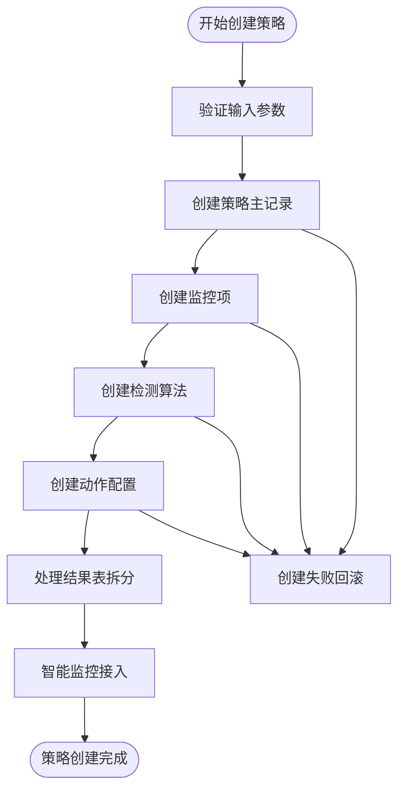
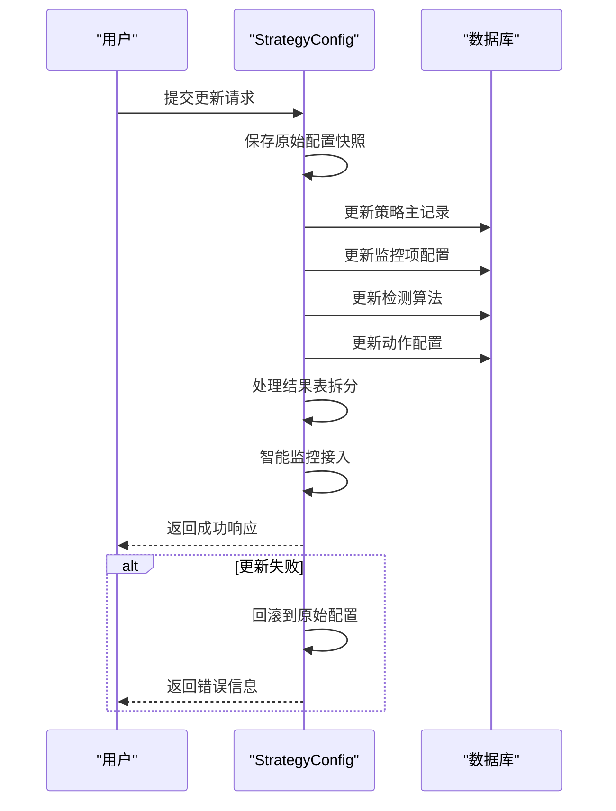
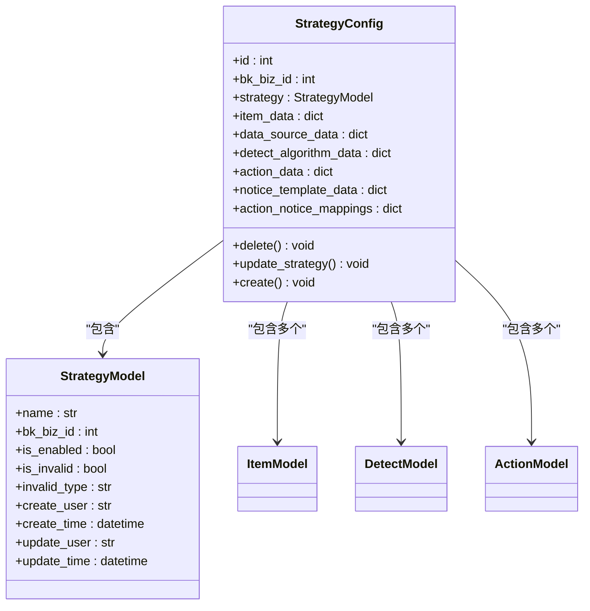
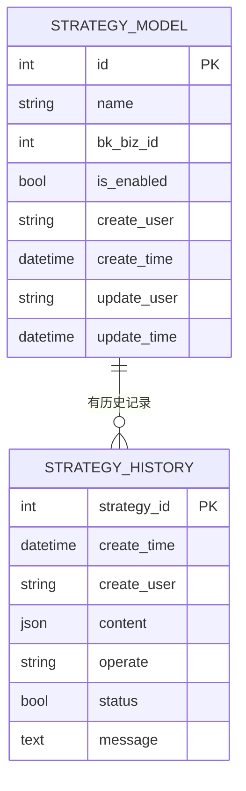
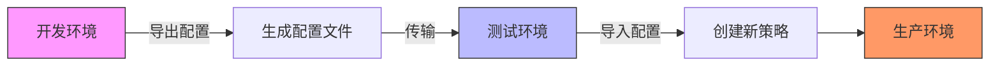
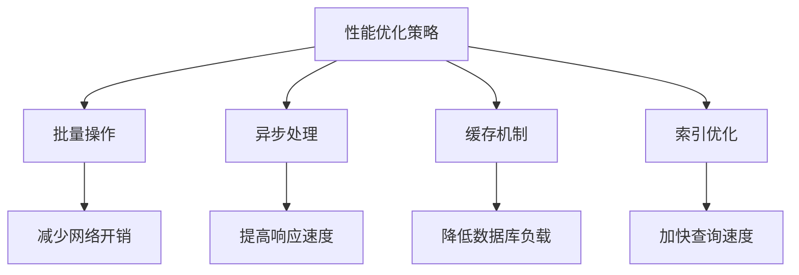

# 生命周期管理

<cite>
**本文档引用的文件**   
- [strategy.py](file://bkmonitor/bkmonitor/strategy/strategy.py)
- [models.py](file://bkmonitor/bkmonitor/models/strategy.py)
- [new_strategy.py](file://bkmonitor/bkmonitor/strategy/new_strategy.py)
- [serializers.py](file://bkmonitor/bkmonitor/strategy/serializers.py)
- [constants.py](file://constants/strategy.py)
</cite>

## 目录
1. [生命周期管理](#生命周期管理)
2. [策略创建流程](#策略创建流程)
3. [策略编辑与更新](#策略编辑与更新)
4. [启用/禁用与删除](#启用禁用与删除)
5. [版本控制与审计日志](#版本控制与审计日志)
6. [环境迁移与同步](#环境迁移与同步)
7. [批量操作API示例](#批量操作api示例)
8. [性能优化建议](#性能优化建议)

## 策略创建流程

策略创建流程通过`StrategyConfig.create`方法实现，该方法接收策略配置字典并创建完整的策略实例。创建过程遵循严格的事务性操作，确保数据一致性。



**图示来源**
- [strategy.py](file://bkmonitor/bkmonitor/strategy/strategy.py#L500-L550)

**本节来源**
- [strategy.py](file://bkmonitor/bkmonitor/strategy/strategy.py#L500-L550)

## 策略编辑与更新

策略编辑功能通过`StrategyConfig.update`方法实现，支持对策略的全面修改。系统采用快照对比机制，在更新前保存原始配置，若更新失败则自动回滚到原始状态。



**图示来源**
- [strategy.py](file://bkmonitor/bkmonitor/strategy/strategy.py#L550-L600)

**本节来源**
- [strategy.py](file://bkmonitor/bkmonitor/strategy/strategy.py#L550-L600)

## 启用/禁用与删除

策略的启用/禁用状态通过`is_enabled`字段控制，删除操作则通过`delete`方法实现。删除过程会级联删除所有关联的配置对象，确保数据完整性。



**图示来源**
- [strategy.py](file://bkmonitor/bkmonitor/strategy/strategy.py#L600-L650)
- [models.py](file://bkmonitor/bkmonitor/models/strategy.py#L800-L900)

**本节来源**
- [strategy.py](file://bkmonitor/bkmonitor/strategy/strategy.py#L600-L650)

## 版本控制与审计日志

系统通过`StrategyHistoryModel`实现完整的变更审计功能。每次策略变更都会记录操作类型、内容、操作者和时间戳，支持完整的版本追溯。



**图示来源**
- [models.py](file://bkmonitor/bkmonitor/models/strategy.py#L300-L400)

**本节来源**
- [models.py](file://bkmonitor/bkmonitor/models/strategy.py#L300-L400)

## 环境迁移与同步

策略在不同环境间的迁移通过配置导出/导入机制实现。系统支持将策略配置序列化为标准格式，便于在开发、测试和生产环境间同步。



**本节来源**
- [new_strategy.py](file://bkmonitor/bkmonitor/strategy/new_strategy.py#L1000-L1500)

## 批量操作API示例

系统提供RESTful API支持策略的批量操作。以下为批量创建策略的示例代码：

```python
import requests
import json

# 批量创建策略API
def batch_create_strategies(biz_id, strategies):
    """
    批量创建策略
    :param biz_id: 业务ID
    :param strategies: 策略配置列表
    :return: 创建结果
    """
    url = "http://api.monitor.example.com/strategies/batch"
    headers = {
        "Content-Type": "application/json",
        "Authorization": "Bearer your_token"
    }
    
    payload = {
        "bk_biz_id": biz_id,
        "strategies": strategies
    }
    
    response = requests.post(url, headers=headers, data=json.dumps(payload))
    return response.json()

# 使用示例
strategies_config = [
    {
        "name": "CPU使用率监控",
        "scenario": "host",
        "is_enabled": True,
        "item_list": [
            {
                "name": "CPU使用率",
                "metric_id": "bk_monitor.system.cpu_usage",
                "data_source_label": "bk_monitor",
                "data_type_label": "time_series",
                "algorithm_list": [
                    {
                        "algorithm_type": "Threshold",
                        "algorithm_config": {"threshold": 80},
                        "level": 1
                    }
                ]
            }
        ]
    }
]

result = batch_create_strategies(biz_id=123, strategies=strategies_config)
print(result)
```

**本节来源**
- [new_strategy.py](file://bkmonitor/bkmonitor/strategy/new_strategy.py#L2000-L2500)

## 性能优化建议

为确保策略管理操作的高性能，建议采取以下优化措施：

1. **批量操作**：尽量使用批量API而非单个操作，减少网络往返次数
2. **异步处理**：对于耗时操作（如智能监控接入），采用异步任务处理
3. **缓存机制**：合理使用缓存减少数据库查询
4. **索引优化**：确保关键字段有适当的数据库索引



**本节来源**
- [strategy.py](file://bkmonitor/bkmonitor/strategy/strategy.py)
- [new_strategy.py](file://bkmonitor/bkmonitor/strategy/new_strategy.py)