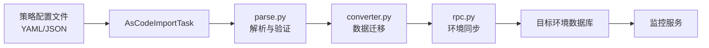
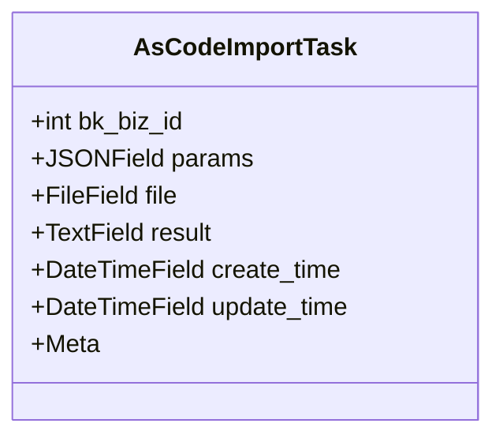
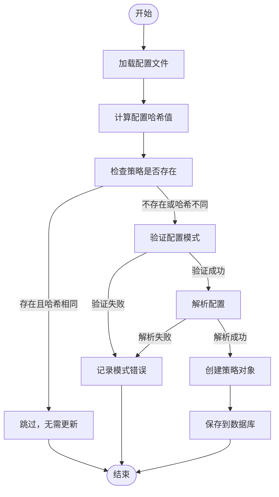
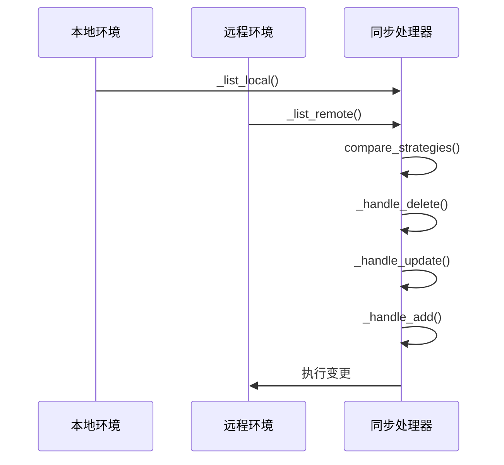
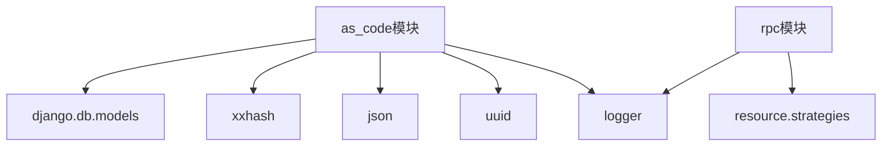

# 迁移与同步

<cite>
**本文档引用的文件**   
- [as_code.py](file://bkmonitor/bkmonitor/models/as_code.py#L27-L44)
- [parse.py](file://bkmonitor/bkmonitor/as_code/parse.py#L252-L292)
- [converter.py](file://bkmonitor/bkmonitor/action/converter.py#L122-L186)
- [rpc.py](file://bkmonitor/packages/apm_web/handlers/strategy_group/groups/rpc/rpc.py#L555-L592)
- [base.py](file://bkmonitor/packages/apm_web/handlers/strategy_group/base.py#L88-L125)
</cite>

## 目录
1. [引言](#引言)
2. [项目结构](#项目结构)
3. [核心组件](#核心组件)
4. [架构概述](#架构概述)
5. [详细组件分析](#详细组件分析)
6. [依赖分析](#依赖分析)
7. [性能考虑](#性能考虑)
8. [故障排除指南](#故障排除指南)
9. [结论](#结论)

## 引言
本文档全面介绍了蓝鲸监控平台中策略在不同环境间迁移和同步的技术实现。重点阐述了迁移任务的创建、执行、监控和错误恢复机制，详细说明了数据序列化格式、依赖处理和冲突解决策略，并提供了跨环境同步的配置示例和性能优化建议。

## 项目结构
项目采用模块化设计，主要功能模块分布在`bkmonitor`目录下。与策略迁移和同步相关的核心代码位于`bkmonitor/bkmonitor/as_code`和`bkmonitor/packages/apm_web/handlers/strategy_group`等目录。`as_code`模块负责策略的代码化导入和解析，而`strategy_group`处理器则管理策略在不同环境间的同步。

```mermaid
graph TD
A[根目录] --> B[ai_agent]
A --> C[bkmonitor]
A --> D[grafana_migrate]
A --> E[scripts]
A --> F[wiki]
C --> G[.devcontainer]
C --> H[.github]
C --> I[ai_whale]
C --> J[alarm_backends]
C --> K[api]
C --> L[apm]
C --> M[apm_ebpf]
C --> N[bin]
C --> O[bk_dataview]
C --> P[bkm_ipchooser]
C --> Q[bkm_space]
C --> R[bkmonitor]
C --> S[blueking]
C --> T[calendars]
C --> U[config]
C --> V[constants]
C --> W[core]
C --> X[django_templates\admin]
C --> Y[docs]
C --> Z[kernel_api]
R --> AA[action]
R --> AB[aiops]
R --> AC[as_code]
R --> AD[browser]
R --> AE[commons]
R --> AF[data_source]
R --> AG[dataflow]
R --> AH[define]
R --> AI[documents]
R --> AJ[event_plugin]
R --> AK[iam]
R --> AL[management]
R --> AM[middlewares]
R --> AN[models]
R --> AO[report]
R --> AP[share]
R --> AQ[space]
R --> AR[strategy]
R --> AS[templates]
R --> AT[trace]
R --> AU[utils]
R --> AV[views]
R --> AW[__init__.py]
R --> AX[admin.py]
R --> AY[apps.py]
R --> AZ[db_routers.py]
R --> BA[migrate.py]
R --> BB[profiling.py]
AC --> CA[json_schema]
AC --> CB[ply]
AC --> CC[tests]
AC --> CD[__init__.py]
AC --> CE[constants.py]
AC --> CF[parse.py]
AC --> CG[parse_yaml.py]
AC --> CH[schema.py]
AC --> CI[utils.py]
AA --> DA[serializers]
AA --> DB[__init__.py]
AA --> DC[alert_assign.py]
AA --> DD[converter.py]
AA --> DE[duty_manage.py]
AA --> DF[utils.py]
AN --> EA[fta]
AN --> EB[__init__.py]
AN --> EC[aiops.py]
AN --> ED[as_code.py]
AN --> EE[base.py]
AN --> EF[bcs_base.py]
AN --> EG[bcs_cluster.py]
AN --> EH[bcs_container.py]
AN --> EI[bcs_ingress.py]
AN --> EJ[bcs_label.py]
AN --> EK[bcs_monitor.py]
AN --> EL[bcs_node.py]
AN --> EM[bcs_pod.py]
AN --> EN[bcs_pod_monitor.py]
AN --> EO[bcs_service.py]
AN --> EP[bcs_service_monitor.py]
AN --> EQ[bcs_workload.py]
AN --> ER[config.py]
AN --> ES[external_iam.py]
AN --> ET[healthz.py]
AN --> EU[home.py]
AN --> EV[metric_list_cache.py]
AN --> EW[report.py]
AN --> EX[statistics.py]
AN --> EY[strategy.py]
AN --> EZ[token.py]
```

**Diagram sources**
- [as_code.py](file://bkmonitor/bkmonitor/models/as_code.py#L27-L44)
- [parse.py](file://bkmonitor/bkmonitor/as_code/parse.py#L252-L292)

**Section sources**
- [as_code.py](file://bkmonitor/bkmonitor/models/as_code.py#L27-L44)
- [parse.py](file://bkmonitor/bkmonitor/as_code/parse.py#L252-L292)

## 核心组件
策略迁移与同步的核心组件包括`AsCodeImportTask`模型、`parse.py`中的解析器和`converter.py`中的转换器。`AsCodeImportTask`用于管理导入任务的元数据，`parse.py`负责验证和解析策略配置，而`converter.py`则处理旧版策略到新版的迁移。

**Section sources**
- [as_code.py](file://bkmonitor/bkmonitor/models/as_code.py#L27-L44)
- [parse.py](file://bkmonitor/bkmonitor/as_code/parse.py#L252-L292)
- [converter.py](file://bkmonitor/bkmonitor/action/converter.py#L122-L186)

## 架构概述
系统采用分层架构，上层为策略配置的代码化表示（YAML/JSON），中层为解析和验证逻辑，底层为数据库模型和同步服务。迁移任务通过`AsCodeImportTask`创建，由`parse.py`解析配置，最终通过`rpc.py`中的处理器同步到目标环境。

**Diagram sources**
- [as_code.py](file://bkmonitor/bkmonitor/models/as_code.py#L27-L44)
- [parse.py](file://bkmonitor/bkmonitor/as_code/parse.py#L252-L292)
- [converter.py](file://bkmonitor/bkmonitor/action/converter.py#L122-L186)
- [rpc.py](file://bkmonitor/packages/apm_web/handlers/strategy_group/groups/rpc/rpc.py#L555-L592)

## 详细组件分析

### AsCodeImportTask 模型分析
该模型定义了策略代码导入任务的数据结构，是迁移流程的起点。

**Diagram sources**
- [as_code.py](file://bkmonitor/bkmonitor/models/as_code.py#L27-L44)

#### 策略解析流程分析
`parse.py`中的解析流程负责将策略配置从文件转换为可操作的对象。

**Diagram sources**
- [parse.py](file://bkmonitor/bkmonitor/as_code/parse.py#L252-L292)

#### 策略同步机制分析
`base.py`和`rpc.py`共同实现了策略在不同环境间的同步逻辑。

**Diagram sources**
- [base.py](file://bkmonitor/packages/apm_web/handlers/strategy_group/base.py#L88-L125)
- [rpc.py](file://bkmonitor/packages/apm_web/handlers/strategy_group/groups/rpc/rpc.py#L555-L592)

**Section sources**
- [base.py](file://bkmonitor/packages/apm_web/handlers/strategy_group/base.py#L88-L125)
- [rpc.py](file://bkmonitor/packages/apm_web/handlers/strategy_group/groups/rpc/rpc.py#L555-L592)

## 依赖分析
策略迁移与同步功能依赖于多个核心模块：
- `django.db.models`: 用于数据库操作
- `xxhash`: 用于计算配置哈希值
- `json`: 用于配置序列化
- `uuid`: 用于生成唯一文件名
- `logger`: 用于记录操作日志

**Diagram sources**
- [as_code.py](file://bkmonitor/bkmonitor/models/as_code.py#L27-L44)
- [parse.py](file://bkmonitor/bkmonitor/as_code/parse.py#L252-L292)
- [rpc.py](file://bkmonitor/packages/apm_web/handlers/strategy_group/groups/rpc/rpc.py#L555-L592)

**Section sources**
- [as_code.py](file://bkmonitor/bkmonitor/models/as_code.py#L27-L44)
- [parse.py](file://bkmonitor/bkmonitor/as_code/parse.py#L252-L292)
- [rpc.py](file://bkmonitor/packages/apm_web/handlers/strategy_group/groups/rpc/rpc.py#L555-L592)

## 性能考虑
- 使用`transaction.atomic`确保数据迁移的原子性
- 采用`bulk_create`批量创建对象以提高效率
- 利用哈希值比较避免不必要的重复操作
- 通过多线程并行处理提高同步速度

## 故障排除指南
- **迁移任务失败**: 检查`AsCodeImportTask.result`字段中的错误信息
- **配置解析错误**: 确认YAML/JSON格式正确，符合预定义的模式
- **同步超时**: 增加超时时间或分批处理大量策略
- **权限问题**: 确保执行用户具有目标环境的写入权限

**Section sources**
- [as_code.py](file://bkmonitor/bkmonitor/models/as_code.py#L27-L44)
- [parse.py](file://bkmonitor/bkmonitor/as_code/parse.py#L252-L292)
- [converter.py](file://bkmonitor/bkmonitor/action/converter.py#L122-L186)

## 结论
蓝鲸监控平台通过`as_code`模块和`strategy_group`处理器实现了强大的策略迁移与同步能力。该系统采用哈希校验避免重复操作，利用事务保证数据一致性，并通过清晰的错误处理机制确保流程的可靠性。建议在生产环境中使用前进行充分测试，并遵循分批迁移的原则以降低风险。