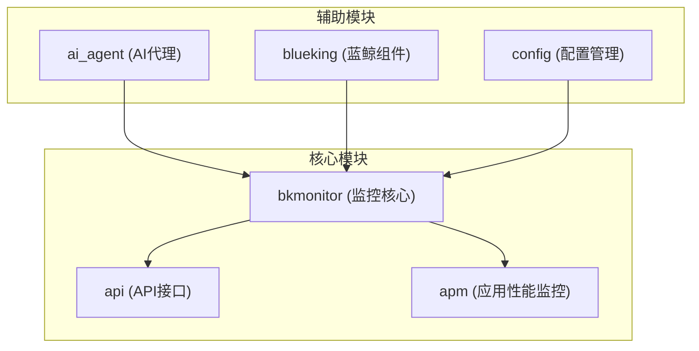
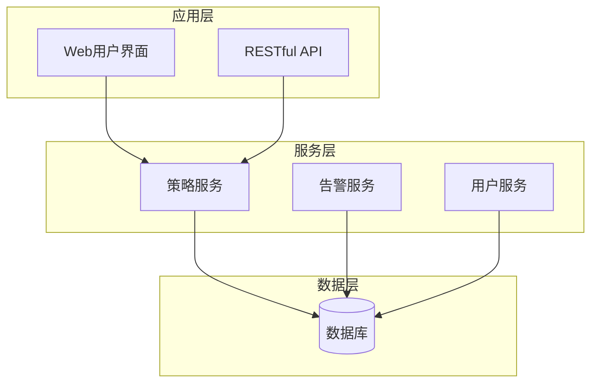
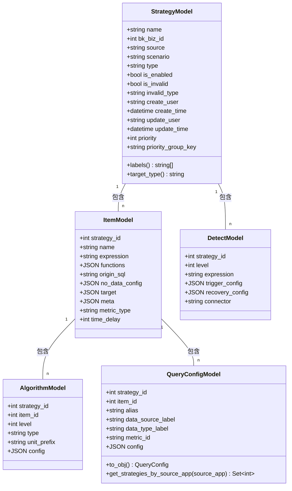
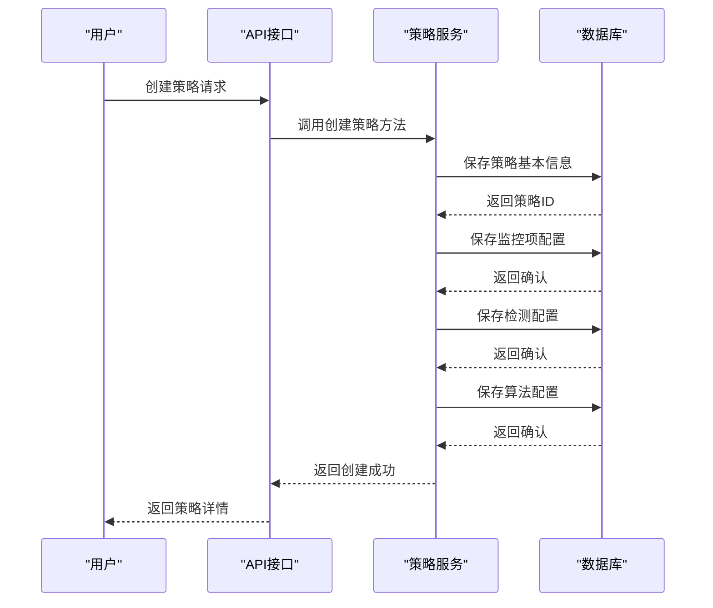
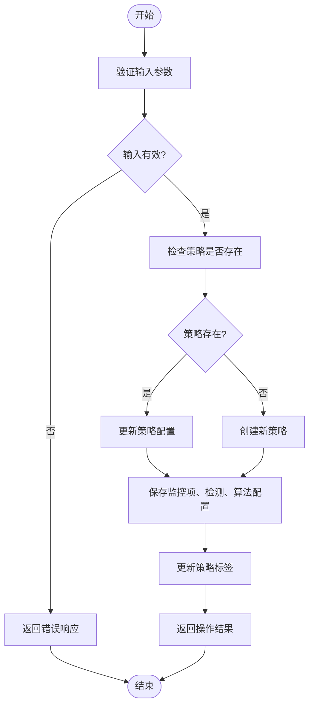
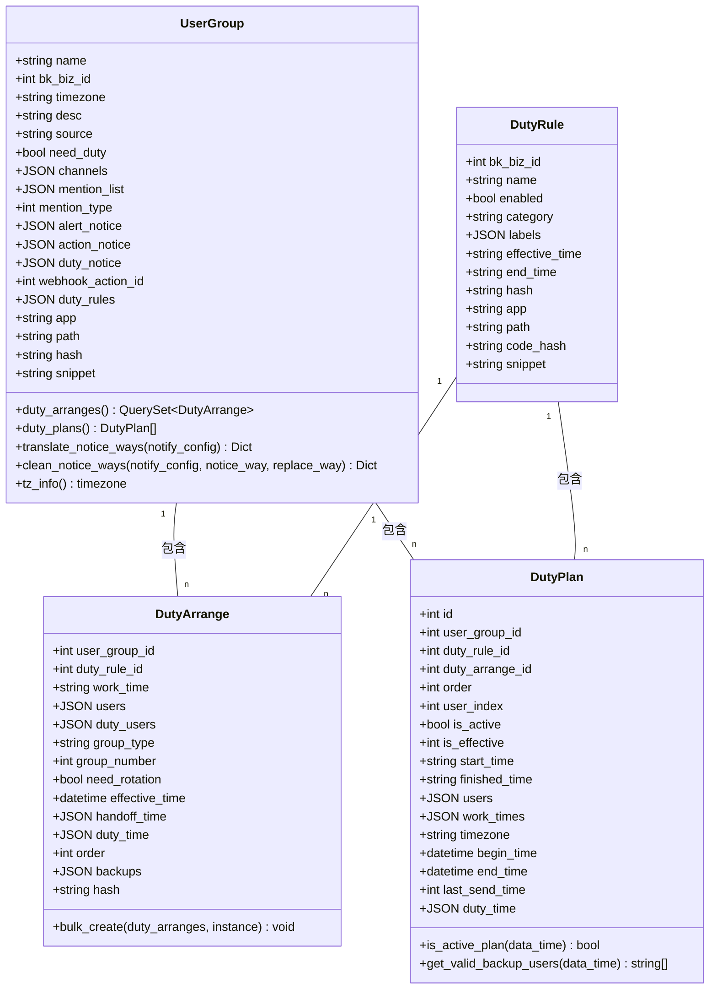
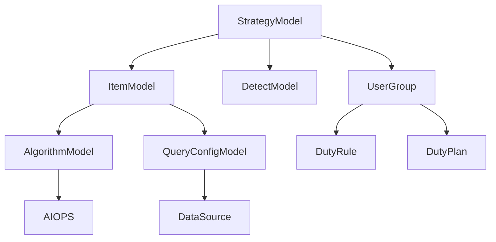

# 策略模型

<cite>
**本文档引用的文件**   
- [strategy.py](file://bkmonitor/bkmonitor/models/strategy.py#L0-L1029)
- [strategy.py](file://bkmonitor/bkmonitor/strategy/strategy.py#L0-L200)
- [constants.py](file://bkmonitor/constants/strategy.py#L0-L50)
</cite>

## 目录
1. [简介](#简介)
2. [项目结构](#项目结构)
3. [核心组件](#核心组件)
4. [架构概述](#架构概述)
5. [详细组件分析](#详细组件分析)
6. [依赖分析](#依赖分析)
7. [性能考虑](#性能考虑)
8. [故障排除指南](#故障排除指南)
9. [结论](#结论)

## 简介
本项目是一个监控平台，旨在提供全面的监控策略管理功能。它支持多种监控场景，包括主机、服务和自定义指标的监控。系统通过灵活的策略配置，实现对各类告警事件的检测、通知和处理。策略模型是整个系统的核心，定义了监控策略的数据结构、业务逻辑以及与其他实体的关系。通过本策略模型，用户可以创建、修改和管理监控策略，设置告警级别、触发条件和通知方式。

## 项目结构
项目采用模块化设计，主要分为以下几个部分：`ai_agent`、`bkmonitor`、`api`、`apm`等。其中，`bkmonitor`模块是核心监控功能的实现，包含了策略模型、告警处理、数据源管理等关键组件。`api`模块提供了对外的API接口，支持与其他系统的集成。`apm`模块专注于应用性能监控，提供了更细粒度的监控能力。整体结构清晰，各模块职责分明，便于维护和扩展。

**图示来源**
- [strategy.py](file://bkmonitor/bkmonitor/models/strategy.py#L0-L1029)

## 核心组件
策略模型的核心组件包括`StrategyModel`、`ItemModel`、`DetectModel`、`AlgorithmModel`和`QueryConfigModel`。这些模型共同构成了监控策略的完整数据结构。`StrategyModel`是策略的顶层实体，包含策略的基本信息和状态。`ItemModel`表示监控项，定义了具体的监控目标和计算公式。`DetectModel`负责检测配置，包括告警级别和触发条件。`AlgorithmModel`实现了具体的检测算法，如静态阈值、环比等。`QueryConfigModel`则定义了数据查询的配置，包括数据源和指标信息。

**组件来源**
- [strategy.py](file://bkmonitor/bkmonitor/models/strategy.py#L79-L422)

## 架构概述
系统采用分层架构，从下到上依次为数据层、服务层和应用层。数据层由Django ORM管理，存储策略、告警、用户组等核心数据。服务层实现了业务逻辑，包括策略的创建、修改、启用/禁用等操作。应用层提供了RESTful API和Web界面，供用户交互。各层之间通过清晰的接口进行通信，保证了系统的可维护性和可扩展性。策略模型位于服务层，是连接数据层和应用层的桥梁。

**图示来源**
- [strategy.py](file://bkmonitor/bkmonitor/models/strategy.py#L0-L1029)

## 详细组件分析
### 策略模型分析
#### 对象导向组件

**图示来源**
- [strategy.py](file://bkmonitor/bkmonitor/models/strategy.py#L79-L422)

#### API/服务组件

**图示来源**
- [strategy.py](file://bkmonitor/bkmonitor/models/strategy.py#L0-L1029)
- [strategy.py](file://bkmonitor/bkmonitor/strategy/strategy.py#L0-L200)

#### 复杂逻辑组件

**图示来源**
- [strategy.py](file://bkmonitor/bkmonitor/models/strategy.py#L0-L1029)

**组件来源**
- [strategy.py](file://bkmonitor/bkmonitor/models/strategy.py#L79-L422)
- [strategy.py](file://bkmonitor/bkmonitor/strategy/strategy.py#L0-L200)

### 告警处理组分析
#### 对象导向组件

**图示来源**
- [strategy.py](file://bkmonitor/bkmonitor/models/strategy.py#L464-L800)

## 依赖分析
策略模型与其他组件存在紧密的依赖关系。它依赖于`QueryConfigModel`来获取数据查询配置，依赖于`AlgorithmModel`来执行具体的检测算法。同时，策略模型与`UserGroup`模型关联，用于指定告警通知的接收人。在数据源方面，策略模型通过`data_source_label`和`data_type_label`字段与不同的数据源集成。这些依赖关系确保了策略能够灵活地适应不同的监控场景和数据源。

**图示来源**
- [strategy.py](file://bkmonitor/bkmonitor/models/strategy.py#L0-L1029)

**组件来源**
- [strategy.py](file://bkmonitor/bkmonitor/models/strategy.py#L79-L800)

## 性能考虑
在设计策略模型时，考虑了多个性能优化点。首先，通过数据库索引（如`db_index=True`）加速常用查询，特别是在`StrategyModel`的`is_enabled`、`bk_biz_id`和`scenario`字段上建立了复合索引。其次，使用`cached_property`装饰器缓存`UserGroup`的`duty_arranges`和`duty_plans`属性，减少重复的数据库查询。此外，`StrategyLabel`的`get_label_dict`方法也实现了简单的内存缓存，避免频繁访问数据库。这些优化措施有效提升了系统的响应速度和吞吐量。

## 故障排除指南
当遇到策略配置问题时，可以按照以下步骤进行排查：首先检查策略的`invalid_type`字段，它会明确指出策略失效的原因，如"指标和检测算法的单位类型不一致"或"监控目标全部失效"。其次，查看`StrategyHistoryModel`中的操作历史，了解策略的变更记录。对于告警通知问题，检查`UserGroup`的`channels`和`alert_notice`配置是否正确。如果涉及轮值规则，需要验证`DutyRule`和`DutyArrange`的配置是否匹配。最后，通过日志系统追踪具体的错误信息，定位问题根源。

**组件来源**
- [strategy.py](file://bkmonitor/bkmonitor/models/strategy.py#L333-L422)
- [strategy.py](file://bkmonitor/bkmonitor/models/strategy.py#L464-L579)

## 结论
策略模型是监控平台的核心，它通过精心设计的数据结构和业务逻辑，实现了灵活、可扩展的监控策略管理。模型不仅支持基本的静态阈值告警，还集成了智能异常检测等高级算法。通过与用户组、轮值规则等组件的集成，实现了完整的告警处理流程。未来可以进一步优化策略的执行效率，增加更多类型的检测算法，并提供更丰富的API接口，以满足不断增长的监控需求。