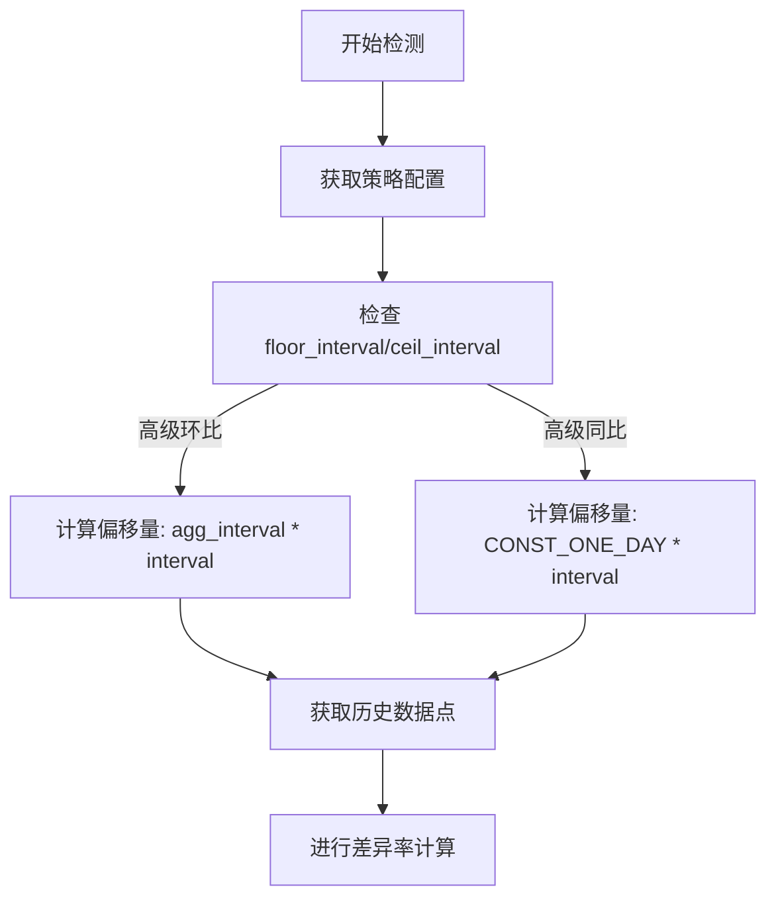
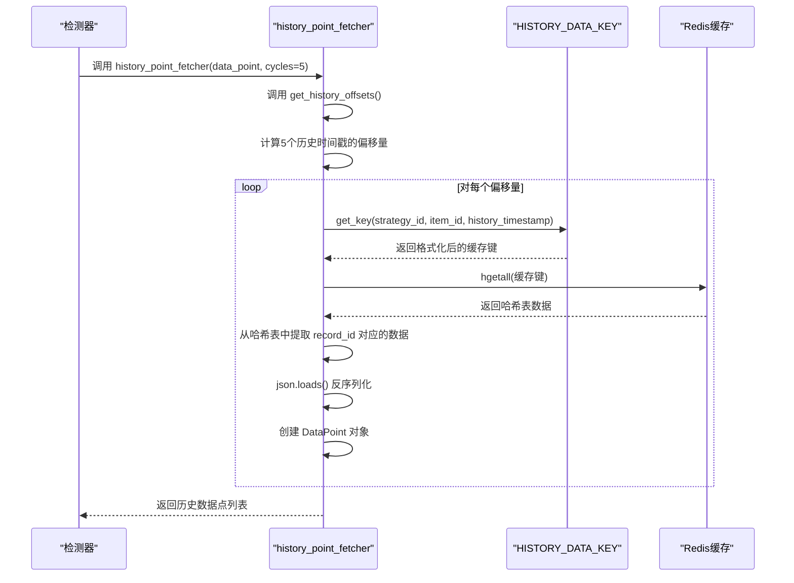

# 同比/环比触发

<cite>
**本文档引用文件**   
- [advanced_ring_ratio.py](file://bkmonitor\alarm_backends\service\detect\strategy\advanced_ring_ratio.py)
- [advanced_year_round.py](file://bkmonitor\alarm_backends\service\detect\strategy\advanced_year_round.py)
- [ring_ratio_amplitude.py](file://bkmonitor\alarm_backends\service\detect\strategy\ring_ratio_amplitude.py)
- [strategy.py](file://bkmonitor\alarm_backends\service\detect\strategy\__init__.py)
- [key.py](file://bkmonitor\alarm_backends\core\cache\key.py)
- [constants.py](file://bkmonitor\alarm_backends\constants.py)
- [README.md](file://bkmonitor\alarm_backends\service\detect\README.md)
- [serializers.py](file://bkmonitor\bkmonitor\strategy\serializers.py)
</cite>

## 目录
1. [引言](#引言)
2. [核心算法实现](#核心算法实现)
3. [历史数据对比周期与对齐算法](#历史数据对比周期与对齐算法)
4. [差异率计算方法](#差异率计算方法)
5. [特殊场景适用性分析](#特殊场景适用性分析)
6. [配置参数说明](#配置参数说明)
7. [时间偏移策略与检测精度](#时间偏移策略与检测精度)
8. [典型业务案例](#典型业务案例)

## 引言
本文档深入解析了监控系统中同比和环比触发规则的技术实现。文档基于对 `bk-monitor` 代码库的分析，详细阐述了高级环比（AdvancedRingRatio）和高级同比（AdvancedYearRound）等核心算法的原理、数据对齐机制、差异率计算方法以及在节假日流量、版本发布等特殊场景下的应用。同时，文档还提供了关键的配置参数说明和优化建议，旨在为用户提供全面的技术参考。

## 核心算法实现

### 高级环比算法 (AdvancedRingRatio)
高级环比算法是检测数据实时突增或突降的核心机制。该算法通过比较当前数据点与过去一段时间内多个历史数据点的均值或瞬时值来判断异常。

**Section sources**
- [advanced_ring_ratio.py](file://bkmonitor\alarm_backends\service\detect\strategy\advanced_ring_ratio.py#L28-L106)

### 高级同比算法 (AdvancedYearRound)
高级同比算法主要用于检测周期性变化中的异常。它通过比较当前数据点与过去多天同一时刻的历史数据点的均值来进行判断，特别适用于日周期性场景。

**Section sources**
- [advanced_year_round.py](file://bkmonitor\alarm_backends\service\detect\strategy\advanced_year_round.py#L29-L106)

### 环比振幅算法 (RingRatioAmplitude)
环比振幅算法是一种更灵活的环比检测方式，它不直接计算百分比变化，而是通过配置“波动率”和“振幅”来定义一个动态的阈值，适用于需要检测超过合理范围幅度变化的场景。

**Section sources**
- [ring_ratio_amplitude.py](file://bkmonitor\alarm_backends\service\detect\strategy\ring_ratio_amplitude.py#L25-L51)

## 历史数据对比周期与对齐算法

### 对比周期选择
算法通过配置参数 `floor_interval` 和 `ceil_interval` 来定义历史数据的对比周期。对于高级环比，该参数表示向前追溯的**时间点个数**；对于高级同比，则表示向前追溯的**天数**。



**Diagram sources**
- [advanced_ring_ratio.py](file://bkmonitor\alarm_backends\service\detect\strategy\advanced_ring_ratio.py#L78-L86)
- [advanced_year_round.py](file://bkmonitor\alarm_backends\service\detect\strategy\advanced_year_round.py#L90-L95)

### 数据对齐与获取机制
系统通过 `history_point_fetcher` 方法实现数据对齐。其核心逻辑如下：
1.  **计算偏移量**：根据 `get_history_offsets` 方法计算出需要查询的历史时间戳的偏移量。
2.  **生成缓存键**：使用 `HISTORY_DATA_KEY` 模板，结合 `strategy_id`、`item_id` 和 `history_timestamp` 生成唯一的Redis哈希键。
3.  **查询缓存**：从Redis中查询该键对应的哈希表，获取指定 `record_id` 的历史数据。
4.  **返回数据点**：将查询到的原始数据反序列化为 `DataPoint` 对象。



**Diagram sources**
- [strategy.py](file://bkmonitor\alarm_backends\service\detect\strategy\__init__.py#L366-L386)
- [key.py](file://bkmonitor\alarm_backends\core\cache\key.py#L297-L307)

## 差异率计算方法

### 百分比变化计算
高级环比和高级同比的核心计算公式为：
-   **上升检测**：`当前值 >= 历史均值 * (100 + ceil) * 0.01`
-   **下降检测**：`当前值 <= 历史均值 * (100 - floor) * 0.01`

其中，`ceil` 和 `floor` 是用户配置的上升和下降百分比阈值。

**Section sources**
- [advanced_ring_ratio.py](file://bkmonitor\alarm_backends\service\detect\strategy\advanced_ring_ratio.py#L50-L67)
- [advanced_year_round.py](file://bkmonitor\alarm_backends\service\detect\strategy\advanced_year_round.py#L50-L67)

### 历史均值计算
系统支持两种历史数据获取类型：
-   **均值 (avg)**：对获取到的 `n` 个历史数据点的值求算术平均。
-   **瞬时值 (last)**：直接取最近一个（即时间上最接近当前点）的历史数据点的值。

```python
# 以高级环比为例，计算 floor_history_value
if self.validated_config["fetch_type"] == "avg":
    env["floor_history_value"] = sum([p.value for p in floor_history_data_points]) / len(floor_history_data_points)
else:
    env["floor_history_value"] = floor_history_data_points[-1].value # 取最后一个点
```

**Section sources**
- [advanced_ring_ratio.py](file://bkmonitor\alarm_backends\service\detect\strategy\advanced_ring_ratio.py#L45-L55)

## 特殊场景适用性分析

### 节假日流量
在节假日，业务流量模式会发生显著变化。使用**高级同比**算法，通过设置 `floor_interval=7`，可以将当前流量与上周同一时刻进行比较。这能有效识别出与正常工作日模式的偏离，例如，节假日期间流量异常低于预期。

### 版本发布
版本发布可能导致接口成功率等指标的瞬时波动。**环比振幅**算法在此场景下非常适用。通过配置合理的 `ratio`（波动率）和 `shock`（振幅），可以过滤掉正常的、可预期的小幅波动，只在变化幅度超过阈值时触发告警，从而避免误报。

### 数据周期性
对于具有明显日周期性的指标（如CPU使用率），**高级同比**（按天对比）比**简单同比**（按周对比）更精确，因为它能捕捉到每天内部的模式变化。

## 配置参数说明

| 参数 | 类型 | 必填 | 说明 | 来源文件 |
| :--- | :--- | :--- | :--- | :--- |
| `floor` | float | 是 | 允许下降的百分比阈值（如 10 表示下降超过10%） | [serializers.py](file://bkmonitor\bkmonitor\strategy\serializers.py#L70) |
| `ceil` | float | 是 | 允许上升的百分比阈值（如 50 表示上升超过50%） | [serializers.py](file://bkmonitor\bkmonitor\strategy\serializers.py#L71) |
| `floor_interval` | int | 是 | 用于下降检测的历史周期数（环比为时间点数，同比为天数） | [serializers.py](file://bkmonitor\bkmonitor\strategy\serializers.py#L72) |
| `ceil_interval` | int | 是 | 用于上升检测的历史周期数（环比为时间点数，同比为天数） | [serializers.py](file://bkmonitor\bkmonitor\strategy\serializers.py#L73) |
| `fetch_type` | string | 否 | 历史数据获取类型，`avg`（均值）或 `last`（瞬时值） | [serializers.py](file://bkmonitor\bkmonitor\strategy\serializers.py#L74) |
| `ratio` | float | 是 | 波动率，用于环比振幅算法 | [serializers.py](file://bkmonitor\bkmonitor\strategy\serializers.py#L83) |
| `shock` | float | 是 | 振幅，用于环比振幅算法 | [serializers.py](file://bkmonitor\bkmonitor\strategy\serializers.py#L84) |
| `threshold` | float | 是 | 最小阈值，用于环比振幅算法，过滤低值数据 | [serializers.py](file://bkmonitor\bkmonitor\strategy\serializers.py#L85) |

## 时间偏移策略与检测精度

### 时间偏移单位
系统定义了统一的时间常量，确保计算的一致性。
-   `CONST_ONE_DAY = 24 * CONST_ONE_HOUR` (86400秒)
-   `CONST_ONE_HOUR = 60 * CONST_MINUTES` (3600秒)
-   `CONST_MINUTES = 60 * CONST_SECOND` (60秒)

**Section sources**
- [constants.py](file://bkmonitor\alarm_backends\constants.py#L21-L25)

### 对检测精度的影响与优化建议
-   **影响**：时间偏移策略直接决定了历史数据的选取。选择不当的 `interval` 会导致对比基准不准确，从而产生误报或漏报。例如，在非周期性数据上使用同比，或在数据波动剧烈的场景下使用过小的环比 `interval`。
-   **优化建议**：
    1.  **精准匹配周期**：根据业务数据的真实周期选择算法。周周期用“简单同比”，日周期用“高级同比”。
    2.  **合理设置间隔**：对于环比，`interval` 不宜过小（如1），以免受噪声影响；也不宜过大，以免失去实时性。
    3.  **利用瞬时值**：对于需要检测瞬时尖峰的场景，将 `fetch_type` 设置为 `last` 比 `avg` 更敏感。
    4.  **结合使用**：可以为同一指标配置多个策略，例如同时使用“高级环比”和“环比振幅”，以覆盖不同类型的异常。

## 典型业务案例

### 案例一：电商交易成功率监控
-   **场景**：监控每分钟的交易成功率，防止因系统故障导致成功率骤降。
-   **策略**：使用**高级环比**。
-   **配置**：`floor=5`, `floor_interval=5`, `fetch_type=avg`。
-   **解释**：如果当前成功率比过去5个时间点的平均成功率下降超过5%，则触发告警。这能有效捕捉到持续性的性能下降。

### 案例二：每日抢购活动流量监控
-   **场景**：每日固定时间有抢购活动，流量会规律性激增。需要监控流量是否超出合理范围。
-   **策略**：使用**环比振幅**。
-   **配置**：`ratio=1.5`, `shock=1000`, `threshold=5000`。
-   **解释**：当当前流量和前一时刻流量都大于5000，并且流量差值大于（前一时刻流量 * 1.5 + 1000）时，才触发告警。这可以容忍正常的活动流量，但能发现异常的、超出预期的流量洪峰。