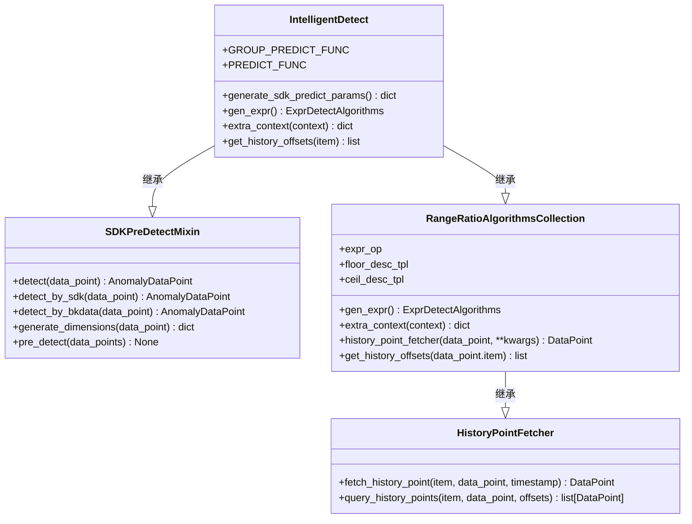
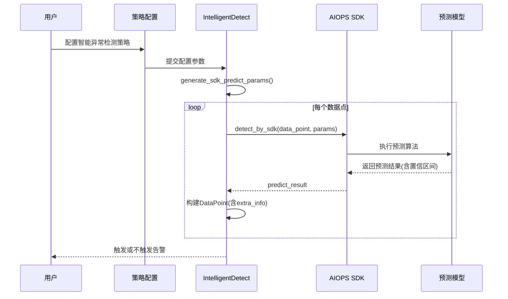
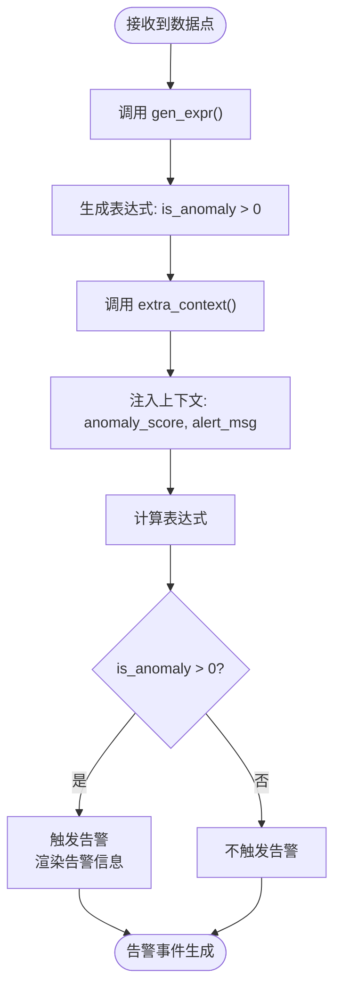
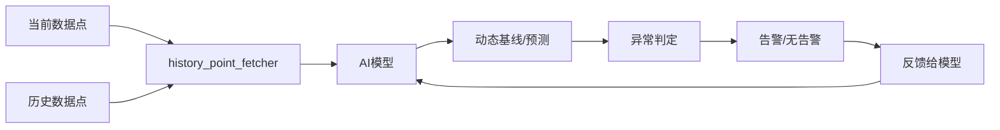

# 基线检测触发

<cite>
**本文档引用的文件**  
- [intelligent_detect.py](file://bkmonitor/alarm_backends/service/detect/strategy/intelligent_detect.py)
- [__init__.py](file://bkmonitor/alarm_backends/service/detect/strategy/__init__.py)
</cite>

## 目录
1. [引言](#引言)
2. [核心组件](#核心组件)
3. [动态基线生成算法](#动态基线生成算法)
4. [异常偏离判定机制](#异常偏离判定机制)
5. [自适应学习机制](#自适应学习机制)
6. [基线敏感度配置建议](#基线敏感度配置建议)
7. [异常检测准确率优化方案](#异常检测准确率优化方案)

## 引言
基线检测是监控系统中识别异常行为的核心机制。它通过建立指标的“正常”行为模式（即基线），并检测当前数据点与该基线的显著偏离来触发告警。本文档深入剖析了“智能异常检测”这一核心算法的工作原理，重点阐述其动态基线生成、标准差计算、异常偏离判定以及自适应学习等关键技术，旨在为用户提供优化配置和提升检测准确率的理论依据和实践指导。

## 核心组件
基线检测的核心逻辑由`IntelligentDetect`类实现，该类位于`bkmonitor/alarm_backends/service/detect/strategy/intelligent_detect.py`文件中。它继承了`SDKPreDetectMixin`和`RangeRatioAlgorithmsCollection`两个关键基类，分别负责与AIOPS SDK的集成和历史数据比较算法。

**图示来源**
- [intelligent_detect.py](file://bkmonitor/alarm_backends/service/detect/strategy/intelligent_detect.py#L36-L103)
- [__init__.py](file://bkmonitor/alarm_backends/service/detect/strategy/__init__.py#L397-L460)

**本节来源**
- [intelligent_detect.py](file://bkmonitor/alarm_backends/service/detect/strategy/intelligent_detect.py#L36-L103)
- [__init__.py](file://bkmonitor/alarm_backends/service/detect/strategy/__init__.py#L397-L460)

## 动态基线生成算法
动态基线生成是智能异常检测的核心。它不依赖于静态的阈值，而是通过调用AIOPS SDK的预测服务，基于历史数据自动计算出当前时刻的“预期值”范围。

1.  **算法配置**：用户在策略中配置`IntelligentDetect`算法，并提供必要的参数（如`args`中的模型参数、`service_name`等）。
2.  **参数准备**：`IntelligentDetect`类的`generate_sdk_predict_params`方法将用户配置的参数转换为SDK API调用所需的格式。
3.  **模型预测**：系统调用`api.aiops_sdk.kpi_predict`或`api.aiops_sdk.kpi_group_predict`接口，传入当前数据点、历史数据和配置参数。
4.  **基线生成**：AI模型分析历史时间序列，考虑周期性、趋势和噪声等因素，输出一个预测结果。这个结果不仅包含预测值，还包含一个置信区间或异常评分，共同构成了动态的基线。

**图示来源**
- [intelligent_detect.py](file://bkmonitor/alarm_backends/service/detect/strategy/intelligent_detect.py#L60-L75)

**本节来源**
- [intelligent_detect.py](file://bkmonitor/alarm_backends/service/detect/strategy/intelligent_detect.py#L60-L75)

## 异常偏离判定机制
异常偏离判定是基于动态基线生成的结果进行的。其核心逻辑非常简洁，主要依赖于AI模型返回的`is_anomaly`标志。

1.  **表达式生成**：`IntelligentDetect`类的`gen_expr`方法生成一个简单的表达式：`is_anomaly > 0`。这意味着只要AI模型判定当前数据点为异常，就满足告警条件。
2.  **上下文注入**：`extra_context`方法从数据点的`values`字段中提取AI模型返回的详细信息（如`extra_info`），并将其解析为可供告警描述模板使用的环境变量（如`anomaly_score`, `alert_msg`）。
3.  **告警生成**：当表达式计算为真时，系统会创建一个`AnomalyDataPoint`对象，并使用Django模板语言渲染告警信息，将异常分值、异常类型等信息包含在内。

**图示来源**
- [intelligent_detect.py](file://bkmonitor/alarm_backends/service/detect/strategy/intelligent_detect.py#L77-L90)
- [intelligent_detect.py](file://bkmonitor/alarm_backends/service/detect/strategy/intelligent_detect.py#L92-L103)

**本节来源**
- [intelligent_detect.py](file://bkmonitor/alarm_backends/service/detect/strategy/intelligent_detect.py#L77-L103)

## 自适应学习机制
自适应学习机制是动态基线能够适应业务周期性变化的关键。它主要体现在`RangeRatioAlgorithmsCollection`和`HistoryPointFetcher`基类中。

1.  **历史数据获取**：`history_point_fetcher`方法是获取历史数据的核心。它通过`get_history_offsets`方法确定需要查询的历史时间点偏移量。
2.  **偏移量计算**：对于`IntelligentDetect`，其`get_history_offsets`方法返回的是数据聚合间隔（`agg_interval`）。这意味着它主要依赖于最近一个周期内的数据来辅助模型进行预测和判定。
3.  **周期性适应**：虽然`IntelligentDetect`本身不直接进行同比/环比计算，但其继承的基类框架和依赖的历史数据获取机制，为处理周期性数据提供了基础。AI模型在训练和预测时，会自动学习和利用这些历史模式（如日周期、周周期）。
4.  **持续学习**：AI模型会持续接收新的数据点，并根据实际观测结果与预测结果的差异进行反馈和调整，从而实现基线的持续自适应。

**图示来源**
- [__init__.py](file://bkmonitor/alarm_backends/service/detect/strategy/__init__.py#L443-L460)
- [intelligent_detect.py](file://bkmonitor/alarm_backends/service/detect/strategy/intelligent_detect.py#L105-L107)

**本节来源**
- [__init__.py](file://bkmonitor/alarm_backends/service/detect/strategy/__init__.py#L443-L460)
- [intelligent_detect.py](file://bkmonitor/alarm_backends/service/detect/strategy/intelligent_detect.py#L105-L107)

## 基线敏感度配置建议
为了优化基线检测的敏感度，建议从以下方面进行配置：

1.  **AI模型参数**：在`args`配置中，调整影响模型敏感度的参数。例如，提高异常评分的阈值可以降低误报率，但可能增加漏报率。
2.  **聚合间隔**：合理设置`agg_interval`。过短的间隔会放大噪声，导致基线波动剧烈；过长的间隔则可能掩盖瞬时异常。应根据业务指标的特性和变化频率选择合适的间隔。
3.  **告警级别**：利用多级告警（`level`）机制。可以为同一指标配置多个`IntelligentDetect`算法实例，使用不同的敏感度参数，分别触发不同级别的告警。

## 异常检测准确率优化方案
提升异常检测准确率需要综合考虑数据、模型和配置：

1.  **数据质量**：确保监控数据的完整性和准确性。缺失或错误的数据会影响模型的训练和预测效果。
2.  **模型选择与调优**：根据业务场景选择合适的AI模型。对于具有强周期性的指标，应确保模型能有效捕捉周期特征。定期评估模型效果，并根据反馈进行调优。
3.  **上下文信息**：在`extra_data`中提供更丰富的上下文信息，帮助模型做出更准确的判断。
4.  **结合多种算法**：不要完全依赖单一的智能检测算法。可以将`IntelligentDetect`与`Threshold`（静态阈值）或`YearRoundAmplitude`（同比振幅）等算法结合使用，通过“与”或“或”逻辑构建更稳健的告警策略。