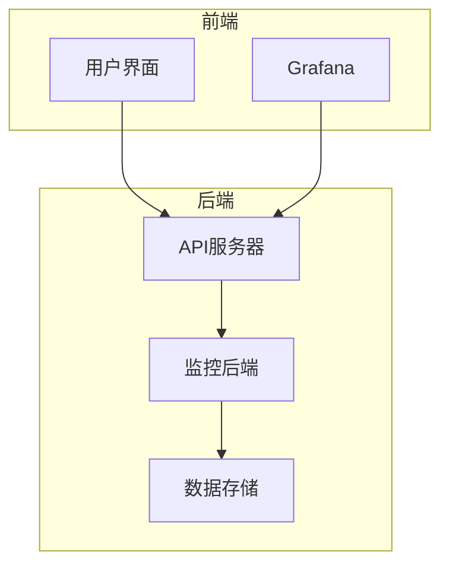
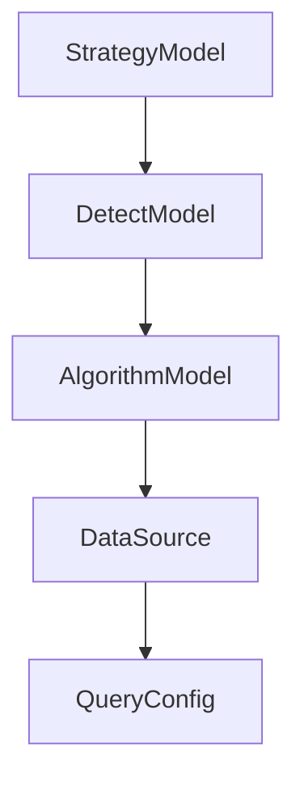

# 触发规则

<cite>
**本文档引用的文件**   
- [new_strategy.py](file://bkmonitor\bkmonitor\strategy\new_strategy.py)
- [strategy.py](file://bkmonitor\bkmonitor\models\strategy.py)
- [DetectModel.py](file://bkmonitor\bkmonitor\models\strategy.py)
- [threshold.py](file://bkmonitor\alarm_backends\service\detect\strategy\threshold.py)
- [README.md](file://bkmonitor\alarm_backends\service\trigger\README.md)
- [README.md](file://bkmonitor\alarm_backends\service\detect\README.md)
</cite>

## 目录
1. [引言](#引言)
2. [项目结构](#项目结构)
3. [核心组件](#核心组件)
4. [架构概述](#架构概述)
5. [详细组件分析](#详细组件分析)
6. [依赖分析](#依赖分析)
7. [性能考虑](#性能考虑)
8. [故障排除指南](#故障排除指南)
9. [结论](#结论)

## 引言
本文档深入描述了监控系统中策略触发规则的实现逻辑，包括连续N个周期、同比/环比比较、基线检测等触发模式。文档详细解释了触发条件如何与时间窗口、检测算法相结合，以及触发状态的持续时间和恢复机制。同时，提供了触发规则配置的最佳实践，包括阈值设置建议和误报防范措施，并通过实际案例说明不同业务场景下的触发规则配置方法。

## 项目结构
项目结构清晰地组织了各个功能模块，主要分为AI代理、监控后端、API接口、APM（应用性能管理）、数据视图等多个部分。每个部分都有其特定的功能和职责，共同构成了一个完整的监控系统。

```mermaid
graph TD
subgraph "AI代理"
AI_Agent[ai_agent]
end
subgraph "监控后端"
Alarm_Backends[alarm_backends]
end
subgraph "API接口"
API[api]
end
subgraph "APM"
APM[apm]
end
subgraph "数据视图"
BK_DataView[bk_dataview]
end
AI_Agent --> Alarm_Backends
API --> Alarm_Backends
APM --> Alarm_Backends
BK_DataView --> Alarm_Backends
```

**图示来源**
- [project_structure](file://project_structure)

## 核心组件
### 策略模型 (StrategyModel)
策略模型是整个监控系统的核心，负责定义和管理监控策略。它包含了策略的基本信息，如名称、业务ID、场景、类型等，以及是否启用、是否失效等状态信息。

**组件来源**
- [strategy.py](file://bkmonitor\bkmonitor\models\strategy.py#L333-L422)

### 检测模型 (DetectModel)
检测模型用于定义具体的检测规则，包括触发配置和恢复配置。每个检测模型可以关联多个算法，这些算法共同决定了何时触发告警。

**组件来源**
- [strategy.py](file://bkmonitor\bkmonitor\models\strategy.py#L333-L422)

## 架构概述
系统架构采用了分层设计，前端通过API接口与后端服务进行交互，后端服务则负责处理数据采集、分析和告警触发等任务。整个系统通过微服务架构实现了高可用性和可扩展性。



**图示来源**
- [alarm_backends](file://bkmonitor\alarm_backends)
- [api](file://bkmonitor\api)

## 详细组件分析
### 策略触发规则实现逻辑
#### 连续N个周期触发
连续N个周期触发模式要求在指定的时间窗口内，满足特定条件的次数达到预设值。例如，如果配置为“5个周期内有3次超过阈值”，则系统会在每个周期检查一次数据，当累计超过阈值的次数达到3次时，触发告警。

#### 同比/环比比较
同比和环比是比较常见的趋势分析方法。同比是指与去年同期的数据进行比较，而环比则是与上一个周期的数据进行比较。这两种方法可以帮助识别季节性变化或周期性波动。

- **同比区间**：当前值与过去N天内同一时刻的值进行比较，判断是否存在显著差异。
- **环比振幅**：当前值与前一时刻值的差值与历史差值进行比较，判断变化幅度是否超出正常范围。

#### 基线检测
基线检测是一种基于历史数据建立正常行为模型的方法。系统会根据历史数据计算出一个基线，然后将实时数据与基线进行比较，当偏差超过预设阈值时，触发告警。

**组件来源**
- [new_strategy.py](file://bkmonitor\bkmonitor\strategy\new_strategy.py#L2000-L3234)
- [README.md](file://bkmonitor\alarm_backends\service\detect\README.md#L266-L442)

### 触发条件与时间窗口结合
触发条件通常与时间窗口紧密结合，以确保告警的准确性和及时性。时间窗口可以是固定的（如每5分钟），也可以是动态的（如最近1小时）。系统会根据时间窗口内的数据进行分析，决定是否触发告警。

**组件来源**
- [new_strategy.py](file://bkmonitor\bkmonitor\strategy\new_strategy.py#L2000-L3234)
- [README.md](file://bkmonitor\alarm_backends\service\detect\README.md#L266-L442)

### 触发状态的持续时间和恢复机制
一旦触发告警，系统会记录告警的开始时间，并持续监控直到满足恢复条件。恢复条件可以是数据恢复正常，或者经过一定时间后自动恢复。恢复机制确保了告警不会无限期持续，同时也避免了频繁的告警切换。

**组件来源**
- [new_strategy.py](file://bkmonitor\bkmonitor\strategy\new_strategy.py#L2000-L3234)
- [README.md](file://bkmonitor\alarm_backends\service\trigger\README.md#L0-L14)

## 依赖分析
系统中的各个组件之间存在复杂的依赖关系。例如，策略模型依赖于检测模型和算法模型，而检测模型又依赖于数据源和查询配置。这些依赖关系确保了系统的完整性和一致性。



**图示来源**
- [new_strategy.py](file://bkmonitor\bkmonitor\strategy\new_strategy.py#L2000-L3234)
- [strategy.py](file://bkmonitor\bkmonitor\models\strategy.py#L333-L422)

## 性能考虑
为了保证系统的高性能，采用了多种优化措施。例如，使用缓存减少数据库查询次数，采用异步处理提高响应速度，以及通过分布式架构实现负载均衡。

## 故障排除指南
### 常见问题及解决方案
- **问题**：告警未按预期触发
  - **解决方案**：检查时间窗口和触发条件的配置是否正确，确认数据源和查询配置无误。
- **问题**：告警频繁触发
  - **解决方案**：调整阈值或时间窗口，增加恢复条件的严格度，避免误报。

**组件来源**
- [new_strategy.py](file://bkmonitor\bkmonitor\strategy\new_strategy.py#L2000-L3234)
- [README.md](file://bkmonitor\alarm_backends\service\trigger\README.md#L0-L14)

## 结论
本文档详细介绍了监控系统中策略触发规则的实现逻辑，涵盖了连续N个周期、同比/环比比较、基线检测等多种触发模式。通过合理的配置和优化，可以有效提升系统的监控能力和告警准确性。希望本文档能为用户提供有价值的参考和指导。