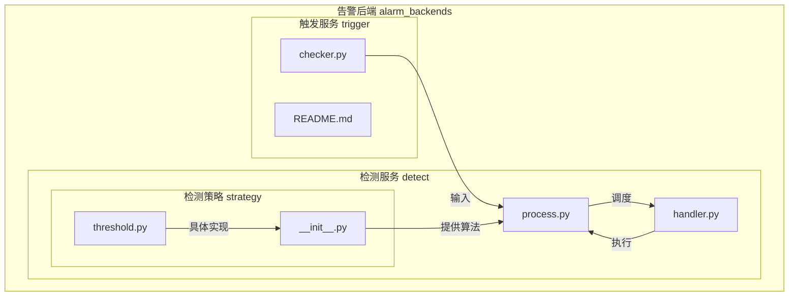
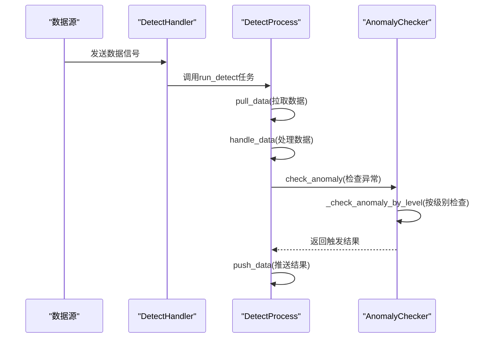
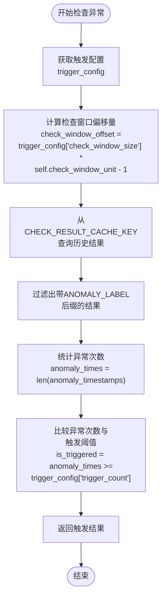

# 连续周期触发

<cite>
**本文档引用的文件**   
- [checker.py](file://bkmonitor/alarm_backends/service/trigger/checker.py)
- [README.md](file://bkmonitor/alarm_backends/service/trigger/README.md)
- [process.py](file://bkmonitor/alarm_backends/service/detect/process.py)
- [handler.py](file://bkmonitor/alarm_backends/service/detect/handler.py)
- [strategy/__init__.py](file://bkmonitor/alarm_backends/service/detect/strategy/__init__.py)
- [threshold.py](file://bkmonitor/alarm_backends/service/detect/strategy/threshold.py)
</cite>

## 目录
1. [引言](#引言)
2. [项目结构](#项目结构)
3. [核心组件](#核心组件)
4. [架构概述](#架构概述)
5. [详细组件分析](#详细组件分析)
6. [依赖分析](#依赖分析)
7. [性能考虑](#性能考虑)
8. [故障排除指南](#故障排除指南)
9. [结论](#结论)

## 引言
本文档详细说明了蓝鲸监控平台中连续N个周期触发规则的实现机制。该机制是告警系统的核心功能之一，用于检测指标在连续多个周期内持续异常的情况，从而避免因瞬时波动导致的误报。文档将深入分析其周期定义、状态累积逻辑、阈值判断流程以及在不同场景下的应用。

## 项目结构
蓝鲸监控平台的项目结构遵循模块化设计，主要功能分散在不同的子目录中。与连续周期触发规则最相关的代码位于`alarm_backends`模块下的`service/trigger`和`service/detect`目录中。



**图示来源**
- [checker.py](file://bkmonitor/alarm_backends/service/trigger/checker.py)
- [process.py](file://bkmonitor/alarm_backends/service/detect/process.py)
- [handler.py](file://bkmonitor/alarm_backends/service/detect/handler.py)
- [strategy/__init__.py](file://bkmonitor/alarm_backends/service/detect/strategy/__init__.py)

## 核心组件
连续周期触发规则的实现涉及多个核心组件，它们协同工作以完成从数据检测到告警触发的全过程。

**组件来源**
- [checker.py](file://bkmonitor/alarm_backends/service/trigger/checker.py#L1-L220)
- [process.py](file://bkmonitor/alarm_backends/service/detect/process.py#L1-L182)
- [handler.py](file://bkmonitor/alarm_backends/service/detect/handler.py#L1-L89)

## 架构概述
整个连续周期触发流程可以分为三个主要阶段：数据检测、异常处理和触发判断。



**图示来源**
- [handler.py](file://bkmonitor/alarm_backends/service/detect/handler.py#L1-L89)
- [process.py](file://bkmonitor/alarm_backends/service/detect/process.py#L1-L182)
- [checker.py](file://bkmonitor/alarm_backends/service/trigger/checker.py#L1-L220)

## 详细组件分析

### 触发检查器分析
`AnomalyChecker`类是实现连续周期触发规则的核心组件，负责根据配置的触发条件判断是否应该生成告警事件。

#### 类结构分析
```mermaid
classDiagram
class AnomalyChecker {
+strategy_id : str
+item_id : str
+point : dict
+trigger_configs : dict
+check_window_unit : int
+dimensions_md5 : str
+source_time : int
-DEFAULT_CHECK_WINDOW_UNIT : int = 60
+__init__(point, strategy, item_id)
+check() bool
+check_anomaly() tuple[int, list]
+_check_anomaly_by_level(level) tuple[bool, list]
+is_no_data_point(point) bool
}
AnomalyChecker --> "1" "n" Algorithms : 使用
AnomalyChecker --> "1" "1" Strategy : 获取配置
AnomalyChecker --> "1" "1" CHECK_RESULT_CACHE_KEY : 读取历史结果
```

**图示来源**
- [checker.py](file://bkmonitor/alarm_backends/service/trigger/checker.py#L1-L220)

#### 状态累积逻辑
连续周期触发的状态累积逻辑主要在`_check_anomaly_by_level`方法中实现。系统通过Redis有序集合（ZSET）来存储历史检测结果，每个结果以时间戳作为分数（score），并标记是否为异常点。



**图示来源**
- [checker.py](file://bkmonitor/alarm_backends/service/trigger/checker.py#L194-L218)

### 检测流程分析
`DetectProcess`类负责整个检测流程的编排，它从数据队列中拉取待检测数据，并调用相应的检测算法。

#### 处理流程分析
```mermaid
flowchart TD
Start([开始处理]) --> PullData["pull_data<br/>从DATA_LIST_KEY<br/>拉取数据"]
PullData --> HandleData["handle_data<br/>调用item.detect<br/>进行检测"]
HandleData --> DoubleCheck["double_check<br/>二次确认"]
DoubleCheck --> PushData["push_data<br/>推送异常数据"]
PushData --> End([处理完成])
PullData --> |数据格式| DataFormat["{
\"record_id\": \"{dimensions_md5}.{timestamp}\",
\"value\": 1.38,
\"values\": {\"timestamp\": 1569246480, \"load5\": 1.38},
\"dimensions\": {\"ip\": \"127.0.0.1\"},
\"time\": 1569246480
}"]
```

**图示来源**
- [process.py](file://bkmonitor/alarm_backends/service/detect/process.py#L1-L182)

## 依赖分析
连续周期触发功能依赖于多个模块和配置项，形成了一个复杂的依赖网络。

```mermaid
graph TD
AnomalyChecker --> Strategy : 获取策略配置
AnomalyChecker --> CHECK_RESULT_CACHE_KEY : 存储/读取检测结果
AnomalyChecker --> NO_DATA_TAG_DIMENSION : 识别无数据点
DetectProcess --> DATA_LIST_KEY : 拉取待检测数据
DetectProcess --> SERVICE_LOCK_DETECT : 获取服务锁
DetectHandler --> DATA_SIGNAL_KEY : 监听数据信号
Strategy --> threshold : 静态阈值算法
Strategy --> RangeRatioAlgorithmsCollection : 同比环比算法
Strategy --> SDKPreDetectMixin : 智能检测SDK
```

**图示来源**
- [checker.py](file://bkmonitor/alarm_backends/service/trigger/checker.py)
- [process.py](file://bkmonitor/alarm_backends/service/detect/process.py)
- [handler.py](file://bkmonitor/alarm_backends/service/detect/handler.py)
- [strategy/__init__.py](file://bkmonitor/alarm_backends/service/detect/strategy/__init__.py)

## 性能考虑
连续周期触发机制在设计时考虑了多项性能优化措施：

1. **缓存机制**：使用Redis缓存历史检测结果，避免重复计算
2. **批量处理**：`DetectCeleryHandler`支持批量处理多个策略ID，减少I/O开销
3. **内存缓存**：`use_aiops_sdk`方法使用本地内存缓存策略的SDK使用状态，减少数据库查询
4. **并发处理**：`pre_detect`方法使用线程池进行并发预测，提高处理效率

这些优化确保了系统在高负载情况下仍能稳定运行。

## 故障排除指南
在使用连续周期触发规则时，可能会遇到以下常见问题：

1. **告警未按预期触发**：
   - 检查`trigger_config`中的`count`和`check_window`配置是否合理
   - 确认`CHECK_RESULT_CACHE_KEY`中是否有足够的历史数据点
   - 验证数据点的时间戳是否正确对齐

2. **频繁误报**：
   - 增加`check_window_size`以延长观察周期
   - 提高`trigger_count`以要求更多异常周期
   - 检查数据源是否存在噪声或异常波动

3. **性能瓶颈**：
   - 监控`SQL_MAX_LIMIT`是否经常达到上限
   - 检查Redis内存使用情况
   - 评估`AIOPS_SDK_PREDICT_CONCURRENCY`设置是否合理

**组件来源**
- [checker.py](file://bkmonitor/alarm_backends/service/trigger/checker.py#L1-L220)
- [process.py](file://bkmonitor/alarm_backends/service/detect/process.py#L1-L182)
- [settings.py](file://bkmonitor/settings.py)

## 结论
蓝鲸监控平台的连续周期触发规则通过精心设计的架构和高效的实现，提供了一种可靠的方式来检测持续性异常。该机制结合了时间窗口滑动、状态累积和阈值判断等多种技术，能够有效区分瞬时波动和真正的持续性问题。通过合理的配置，可以在不同场景下（如CPU使用率、内存占用等）实现精准的告警，同时避免误报。系统的模块化设计和丰富的配置选项使其具有很高的灵活性和可扩展性。