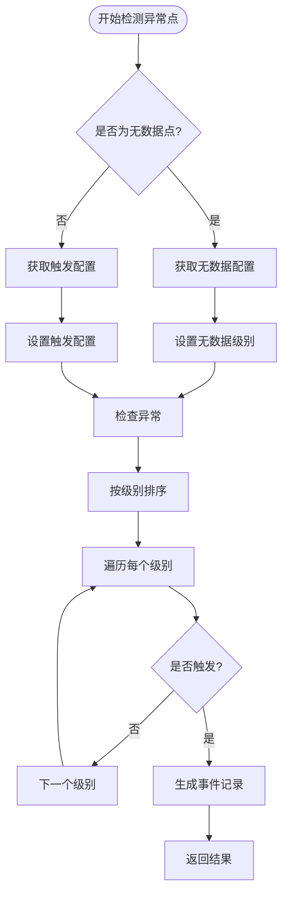
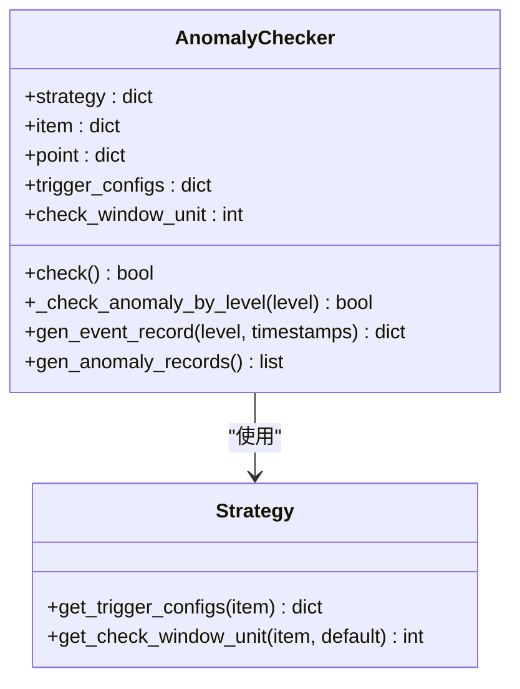
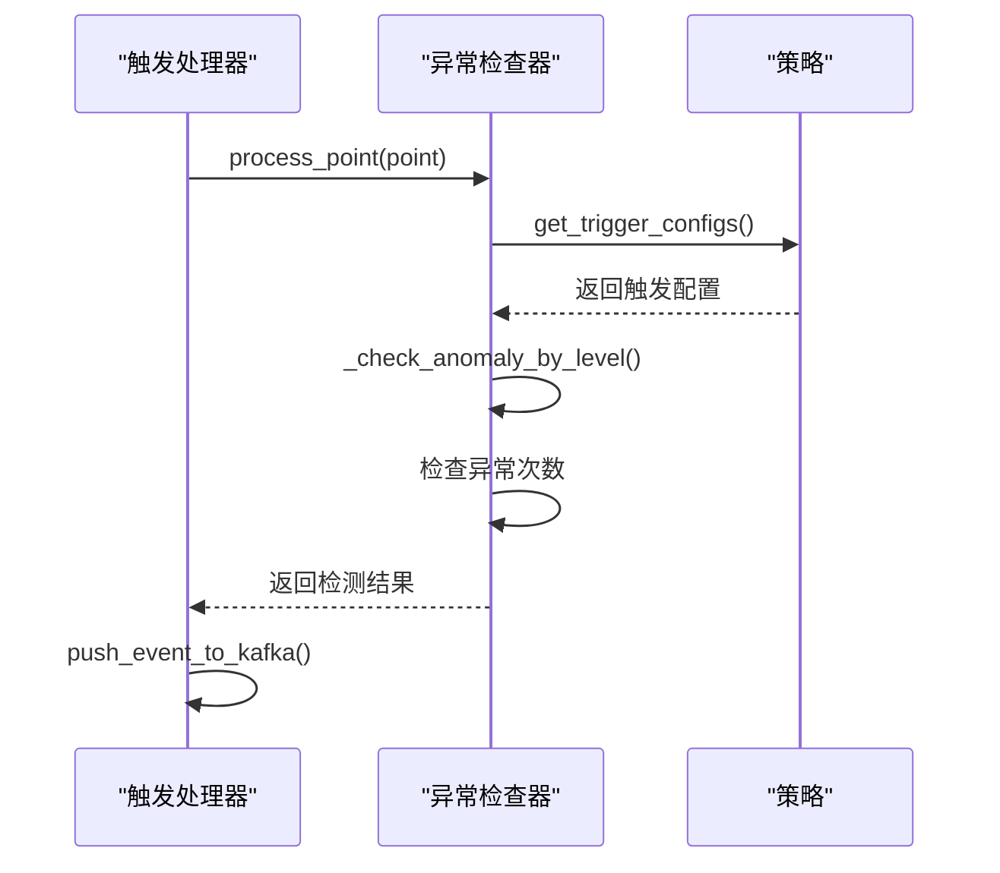
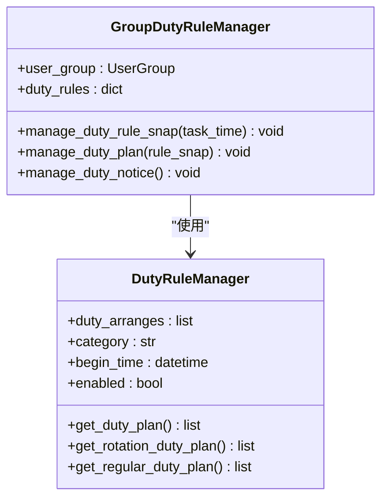
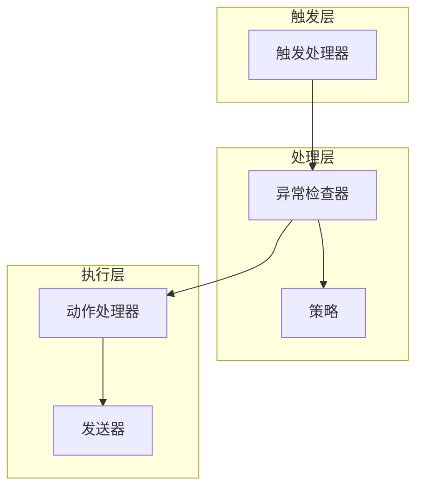
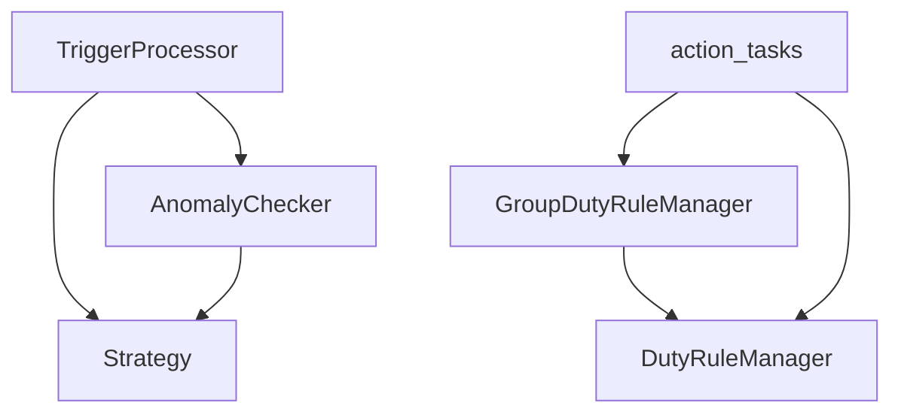

# 通知时机

<cite>
**本文档引用的文件**   
- [duty_manage.py](file://bkmonitor/bkmonitor/action/duty_manage.py)
- [action_tasks.py](file://bkmonitor/alarm_backends/service/fta_action/tasks/action_tasks.py)
- [processor.py](file://bkmonitor/alarm_backends/service/trigger/processor.py)
- [checker.py](file://bkmonitor/alarm_backends/service/trigger/checker.py)
</cite>

## 目录
1. [引言](#引言)
2. [通知触发机制](#通知触发机制)
3. [通知模式实现](#通知模式实现)
4. [值班表与维护窗口集成](#值班表与维护窗口集成)
5. [核心组件分析](#核心组件分析)
6. [架构概览](#架构概览)
7. [详细组件分析](#详细组件分析)
8. [依赖分析](#依赖分析)
9. [性能考虑](#性能考虑)
10. [故障排除指南](#故障排除指南)
11. [结论](#结论)

## 引言
本文档全面记录了监控平台的通知触发机制，重点阐述了基于告警状态变化、级别升级、收敛周期等不同触发条件的配置方法。文档详细说明了即时通知、周期提醒、恢复通知等不同模式的实现原理和配置参数，并深入解释了如何将通知时机与值班表、维护窗口相结合，实现智能化的通知调度策略。通过本指南，用户可以全面了解通知系统的内部工作原理，掌握配置和优化通知策略的最佳实践。

## 通知触发机制
通知触发机制是监控系统的核心功能之一，它决定了在何种条件下向相关人员发送告警信息。该机制主要基于告警状态的变化、告警级别的升级以及收敛周期的完成来触发通知。

### 告警状态变化检测
告警状态的变化是触发通知的最基本条件。系统通过 `AnomalyChecker` 类来检测异常点是否满足触发条件。当一个异常点被检测到时，系统会检查其是否满足预设的触发规则。

**图源**
- [checker.py](file://bkmonitor/alarm_backends/service/trigger/checker.py#L150-L219)

**节源**
- [checker.py](file://bkmonitor/alarm_backends/service/trigger/checker.py#L150-L219)

### 告警级别升级
告警级别升级是通知触发的另一个重要条件。系统会根据告警的严重程度进行分级，当告警从低级别升级到高级别时，会触发更紧急的通知。

**图源**
- [checker.py](file://bkmonitor/alarm_backends/service/trigger/checker.py#L150-L219)
- [processor.py](file://bkmonitor/alarm_backends/service/trigger/processor.py#L150-L170)

**节源**
- [checker.py](file://bkmonitor/alarm_backends/service/trigger/checker.py#L150-L219)

### 收敛周期处理
收敛周期是指在一定时间内，系统对同一类型的告警进行合并处理，避免重复通知。当收敛周期完成时，系统会触发一次汇总通知。

**图源**
- [processor.py](file://bkmonitor/alarm_backends/service/trigger/processor.py#L150-L170)
- [checker.py](file://bkmonitor/alarm_backends/service/trigger/checker.py#L150-L219)

**节源**
- [processor.py](file://bkmonitor/alarm_backends/service/trigger/processor.py#L150-L170)

## 通知模式实现
通知系统支持多种模式，包括即时通知、周期提醒和恢复通知，以满足不同的业务需求。

### 即时通知
即时通知在告警发生后立即发送，确保相关人员能够第一时间获知问题。

### 周期提醒
周期提醒在特定时间间隔内重复发送通知，直到问题得到解决或被确认。

### 恢复通知
恢复通知在告警恢复正常后发送，告知相关人员问题已解决。

## 值班表与维护窗口集成
为了实现智能化的通知调度，系统将通知时机与值班表和维护窗口相结合。

### 值班表管理
值班表管理模块负责维护值班人员的排班计划，并根据当前时间确定当前值班人员。

**图源**
- [duty_manage.py](file://bkmonitor/bkmonitor/action/duty_manage.py#L150-L600)

**节源**
- [duty_manage.py](file://bkmonitor/bkmonitor/action/duty_manage.py#L150-L600)

### 维护窗口
维护窗口是指系统计划内停机或维护的时间段，在此期间不会发送告警通知，以避免不必要的打扰。

## 核心组件分析
本节深入分析通知系统的核心组件，包括其设计模式、数据结构和关键算法。

### DutyRuleManager
`DutyRuleManager` 类负责管理轮值规则，根据配置生成排班计划。

**节源**
- [duty_manage.py](file://bkmonitor/bkmonitor/action/duty_manage.py#L150-L600)

### GroupDutyRuleManager
`GroupDutyRuleManager` 类负责管理告警组的轮值规则，包括创建快照、更新旧快照和删除过期快照。

**节源**
- [duty_manage.py](file://bkmonitor/bkmonitor/action/duty_manage.py#L600-L1063)

## 架构概览
通知系统的整体架构分为三个主要层次：触发层、处理层和执行层。

**图源**
- [processor.py](file://bkmonitor/alarm_backends/service/trigger/processor.py#L150-L170)
- [checker.py](file://bkmonitor/alarm_backends/service/trigger/checker.py#L150-L219)
- [action_tasks.py](file://bkmonitor/alarm_backends/service/fta_action/tasks/action_tasks.py#L150-L300)

## 详细组件分析
本节对通知系统的关键组件进行详细分析，包括其内部逻辑和交互方式。

### 触发处理器分析
触发处理器负责从队列中拉取异常点，并调用异常检查器进行检测。

**节源**
- [processor.py](file://bkmonitor/alarm_backends/service/trigger/processor.py#L150-L170)

### 异常检查器分析
异常检查器负责根据策略配置检查异常点是否满足触发条件。

**节源**
- [checker.py](file://bkmonitor/alarm_backends/service/trigger/checker.py#L150-L219)

## 依赖分析
通知系统依赖于多个外部组件和内部模块，确保系统的稳定性和可扩展性。

**图源**
- [processor.py](file://bkmonitor/alarm_backends/service/trigger/processor.py#L150-L170)
- [checker.py](file://bkmonitor/alarm_backends/service/trigger/checker.py#L150-L219)
- [duty_manage.py](file://bkmonitor/bkmonitor/action/duty_manage.py#L150-L1063)
- [action_tasks.py](file://bkmonitor/alarm_backends/service/fta_action/tasks/action_tasks.py#L150-L300)

**节源**
- [processor.py](file://bkmonitor/alarm_backends/service/trigger/processor.py#L150-L170)
- [checker.py](file://bkmonitor/alarm_backends/service/trigger/checker.py#L150-L219)
- [duty_manage.py](file://bkmonitor/bkmonitor/action/duty_manage.py#L150-L1063)
- [action_tasks.py](file://bkmonitor/alarm_backends/service/fta_action/tasks/action_tasks.py#L150-L300)

## 性能考虑
通知系统在设计时充分考虑了性能因素，确保在高并发场景下仍能稳定运行。

- **批量处理**：系统采用批量处理机制，减少数据库和网络开销。
- **缓存机制**：关键数据如策略配置和值班规则被缓存，提高访问速度。
- **异步执行**：通知发送等耗时操作采用异步执行，避免阻塞主线程。

## 故障排除指南
本节提供常见问题的解决方案和调试技巧。

### 常见问题
- **通知未发送**：检查值班表配置和维护窗口设置。
- **重复通知**：检查收敛周期配置是否正确。
- **延迟通知**：检查系统负载和网络状况。

### 调试技巧
- **日志分析**：查看 `trigger` 和 `fta_action` 模块的日志文件。
- **配置验证**：使用管理界面验证策略和值班规则配置。
- **性能监控**：监控系统关键指标，如处理延迟和队列长度。

## 结论
本文档全面介绍了监控平台的通知触发机制，涵盖了从告警状态变化到值班表集成的各个方面。通过理解这些机制，用户可以更好地配置和优化通知策略，确保在关键时刻能够及时响应。未来的工作将集中在进一步提升系统的智能化水平，例如引入机器学习算法来预测告警趋势和优化通知时机。