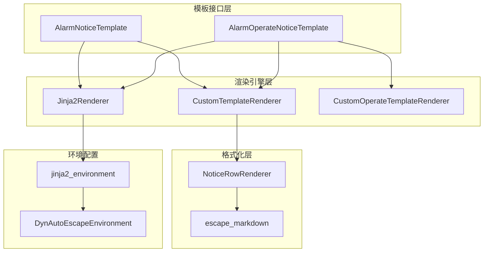
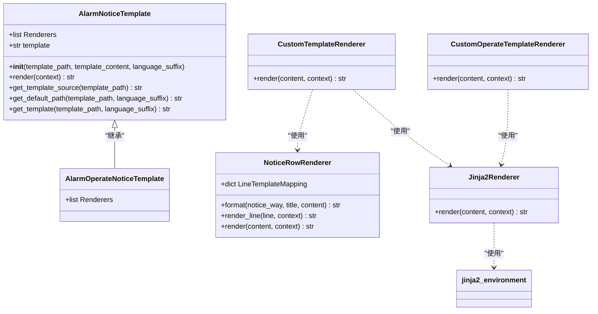
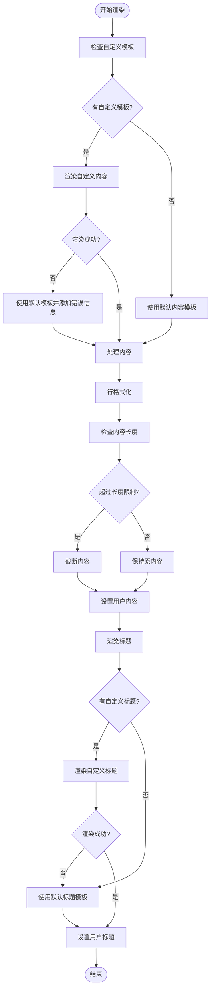
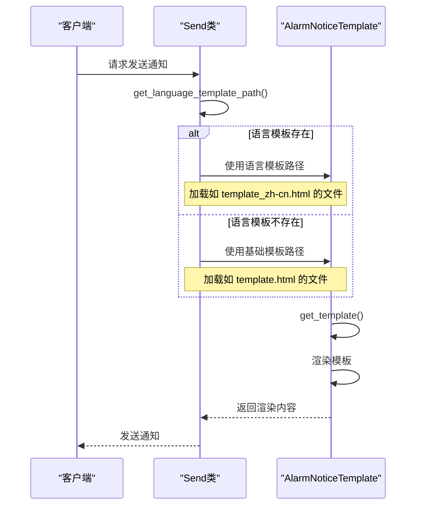
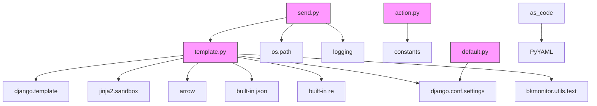

# 通知模板

<cite>
**本文档引用的文件**   
- [template.py](file://bkmonitor/bkmonitor/utils/template.py)
- [send.py](file://bkmonitor/bkmonitor/utils/send.py)
- [action.py](file://bkmonitor/constants/action.py)
- [default.py](file://bkmonitor/config/default.py)
- [base.yaml](file://bkmonitor/bkmonitor/as_code/tests/configs/notice/snippets/base.yaml)
- [ops.yaml](file://bkmonitor/bkmonitor/as_code/tests/data/notice/ops.yaml)
</cite>

## 目录
1. [引言](#引言)
2. [项目结构](#项目结构)
3. [核心组件](#核心组件)
4. [架构概述](#架构概述)
5. [详细组件分析](#详细组件分析)
6. [依赖分析](#依赖分析)
7. [性能考虑](#性能考虑)
8. [故障排除指南](#故障排除指南)
9. [结论](#结论)

## 引言
本文档详细记录了蓝鲸监控平台中通知模板的设计与实现。文档涵盖了模板变量体系、内容格式化规则、多语言支持机制和模板继承结构。说明了如何创建和管理自定义模板，提供了标准模板语法和示例。解释了模板如何根据告警类型、严重程度和通知渠道自动适配内容，记录了模板渲染流程和性能优化策略。

## 项目结构
通知模板系统主要分布在`bkmonitor/bkmonitor/utils/template.py`文件中，该文件实现了核心的模板渲染逻辑。系统通过Jinja2模板引擎提供强大的模板功能，并结合Django的模板系统进行多语言支持。模板配置可以通过YAML文件进行声明式管理，位于`as_code`模块中。

```mermaid
graph TD
subgraph "模板系统"
Template[template.py]
Send[send.py]
Action[action.py]
Config[default.py]
end
subgraph "配置管理"
AsCode[as_code]
YAML[yaml配置]
end
Template --> Send : "使用"
Template --> Action : "引用"
Template --> Config : "读取"
AsCode --> YAML : "包含"
YAML --> Template : "配置"
```

**图示来源**
- [template.py](file://bkmonitor/bkmonitor/utils/template.py)
- [send.py](file://bkmonitor/bkmonitor/utils/send.py)

**本节来源**
- [template.py](file://bkmonitor/bkmonitor/utils/template.py)
- [as_code](file://bkmonitor/bkmonitor/as_code)

## 核心组件
通知模板系统的核心组件包括`AlarmNoticeTemplate`、`Jinja2Renderer`、`NoticeRowRenderer`等类。这些组件共同构成了一个灵活、可扩展的模板渲染系统，支持自定义模板、多语言和多种通知方式。

**本节来源**
- [template.py](file://bkmonitor/bkmonitor/utils/template.py#L191-L278)

## 架构概述
通知模板系统采用分层架构设计，从上到下分为模板接口层、渲染引擎层和格式化层。系统支持多种渲染器链式调用，允许在不同阶段对模板内容进行处理。



**图示来源**
- [template.py](file://bkmonitor/bkmonitor/utils/template.py)

## 详细组件分析

### 模板渲染器分析
通知模板系统采用链式渲染器模式，多个渲染器按顺序处理模板内容。这种设计提供了高度的灵活性和可扩展性。

#### 模板类结构


**图示来源**
- [template.py](file://bkmonitor/bkmonitor/utils/template.py#L191-L286)

**本节来源**
- [template.py](file://bkmonitor/bkmonitor/utils/template.py#L191-L286)

### 模板渲染流程分析
模板渲染流程是一个多阶段处理过程，每个阶段由不同的渲染器负责。系统首先尝试使用用户自定义模板，如果渲染失败则回退到默认模板。

#### 渲染流程图


**图示来源**
- [template.py](file://bkmonitor/bkmonitor/utils/template.py#L103-L150)

**本节来源**
- [template.py](file://bkmonitor/bkmonitor/utils/template.py#L103-L150)

### 多语言支持机制
系统通过语言后缀机制实现多语言支持。当请求特定语言的模板时，系统会先尝试加载带语言后缀的模板文件，如果不存在则回退到基础模板。

#### 多语言处理流程


**图示来源**
- [send.py](file://bkmonitor/bkmonitor/utils/send.py#L116-L149)
- [template.py](file://bkmonitor/bkmonitor/utils/template.py#L246-L276)

**本节来源**
- [send.py](file://bkmonitor/bkmonitor/utils/send.py#L116-L149)

## 依赖分析
通知模板系统依赖于多个核心模块和外部库，形成了复杂的依赖关系网络。



**图示来源**
- [template.py](file://bkmonitor/bkmonitor/utils/template.py)
- [send.py](file://bkmonitor/bkmonitor/utils/send.py)
- [action.py](file://bkmonitor/constants/action.py)
- [default.py](file://bkmonitor/config/default.py)

**本节来源**
- [template.py](file://bkmonitor/bkmonitor/utils/template.py)
- [send.py](file://bkmonitor/bkmonitor/utils/send.py)

## 性能考虑
通知模板系统在设计时考虑了多项性能优化策略：

1. **异常处理优化**：系统在模板渲染失败时不会中断，而是自动回退到默认模板，确保通知不会因模板问题而丢失。
2. **内容长度控制**：系统实现了内容长度检查和自动截断功能，防止过长的通知内容影响性能。
3. **缓存机制**：虽然文档中未直接体现，但基于Django模板系统的特性，模板编译结果会被缓存，提高重复渲染的效率。
4. **安全沙箱**：使用Jinja2的SandboxedEnvironment确保模板执行的安全性，防止恶意代码执行。

## 故障排除指南
当通知模板出现问题时，可以按照以下步骤进行排查：

1. **检查模板路径**：确认模板文件路径是否正确，文件是否存在。
2. **验证模板语法**：检查Jinja2模板语法是否正确，避免语法错误导致渲染失败。
3. **查看日志信息**：系统会在`logger.error`中记录模板渲染失败的详细信息，包括错误类型和模板内容。
4. **确认上下文变量**：确保传递给模板的上下文包含所有必需的变量。
5. **测试默认模板**：如果自定义模板有问题，系统会自动使用默认模板，可以对比两者差异。

**本节来源**
- [template.py](file://bkmonitor/bkmonitor/utils/template.py#L103-L150)
- [send.py](file://bkmonitor/bkmonitor/utils/send.py#L116-L149)

## 结论
蓝鲸监控平台的通知模板系统是一个功能强大、设计精良的组件。系统通过链式渲染器模式提供了高度的灵活性，支持自定义模板、多语言和多种通知方式。模板继承结构清晰，异常处理机制完善，确保了系统的稳定性和可靠性。通过Jinja2和Django模板系统的结合，系统既提供了强大的模板功能，又保证了安全性和性能。该系统为监控告警通知提供了坚实的基础，能够满足各种复杂的业务需求。