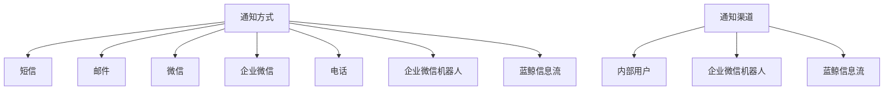
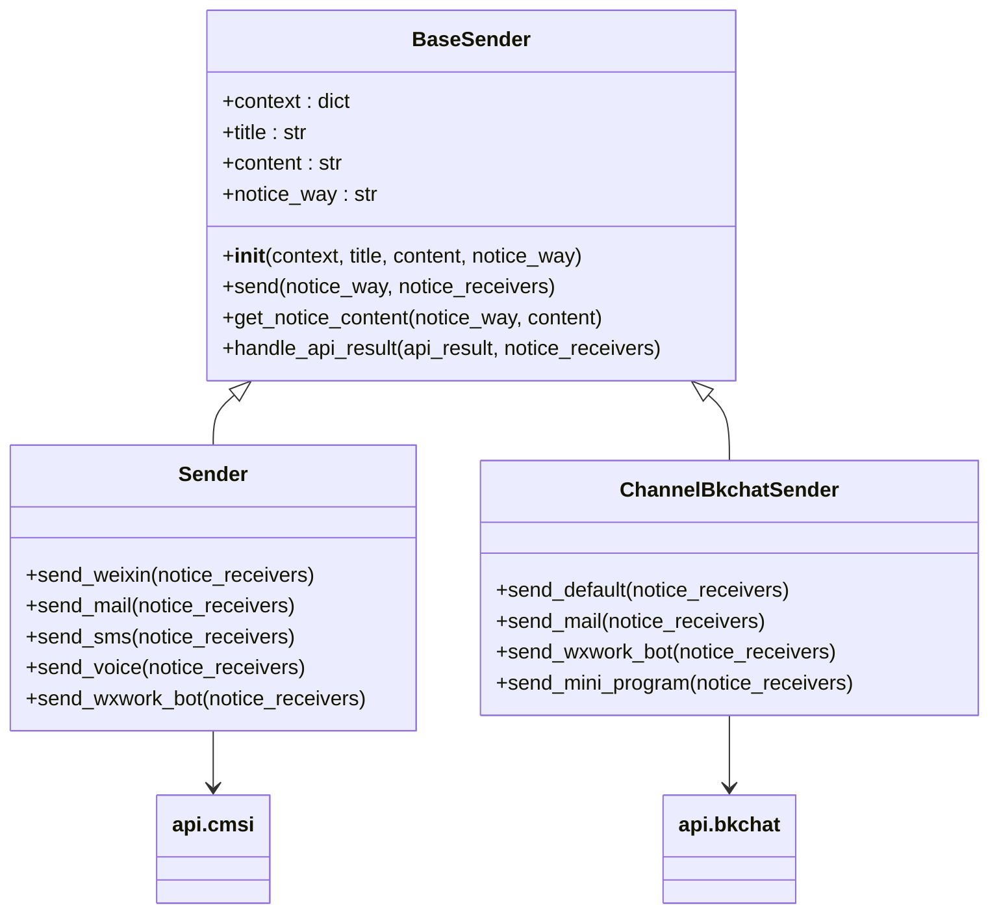
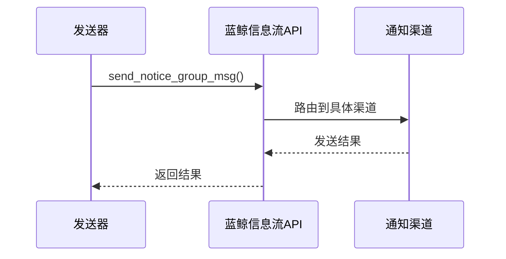
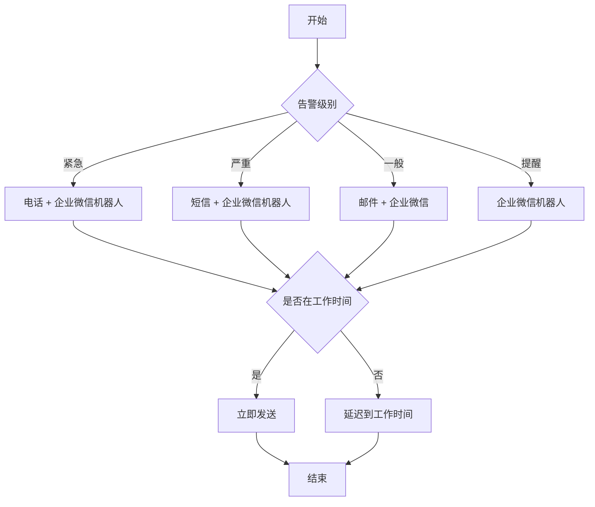

# 通知渠道

<cite>
**本文档中引用的文件**   
- [action.py](file://bkmonitor\constants\action.py)
- [send.py](file://bkmonitor\bkmonitor\utils\send.py)
- [default.py](file://bkmonitor\config\default.py)
</cite>

## 目录
1. [介绍](#介绍)
2. [通知方式与渠道概述](#通知方式与渠道概述)
3. [通知方式配置](#通知方式配置)
4. [通知渠道实现机制](#通知渠道实现机制)
5. [各通知渠道技术实现](#各通知渠道技术实现)
6. [配置参数说明](#配置参数说明)
7. [启用条件与权限要求](#启用条件与权限要求)
8. [实际配置示例](#实际配置示例)
9. [渠道选择策略](#渠道选择策略)

## 介绍
本文档详细记录了蓝鲸监控系统支持的各种通知渠道（如邮件、短信、微信、电话等）的配置方法和实现机制。文档说明了每种渠道的技术实现方式、依赖的服务组件、配置参数及其作用，并提供了各渠道的启用条件、权限要求和使用限制。同时，文档还解释了渠道选择策略如何与告警级别和业务场景相匹配，为系统管理员和开发人员提供全面的参考。

## 通知方式与渠道概述
蓝鲸监控系统提供了多种通知方式和渠道，以满足不同场景下的告警通知需求。通知方式指的是具体的通信手段，如短信、邮件等；而通知渠道则是指通知的发送路径或平台，如企业微信机器人、蓝鲸信息流等。



**图示来源**
- [action.py](file://bkmonitor\constants\action.py#L674-L714)

**本节来源**
- [action.py](file://bkmonitor\constants\action.py#L674-L714)

## 通知方式配置
系统通过 `constants/action.py` 文件中的 `NoticeWay` 类定义了所有支持的通知方式。每个通知方式都有一个对应的英文标识符和中文显示名称。

### 支持的通知方式
| 通知方式 | 标识符 | 中文名称 |
|---------|-------|--------|
| 短信 | sms | 短信 |
| 邮件 | mail | 邮件 |
| 微信 | weixin | 微信 |
| 企业微信 | qy_weixin | 企业微信 |
| 电话 | voice | 电话 |
| 企业微信机器人 | wxwork-bot | 企业微信机器人 |
| 蓝鲸信息流 | bkchat | 蓝鲸信息流 |

这些通知方式通过 `NOTICE_WAY_MAPPING` 字典进行映射，确保在用户界面中显示正确的中文名称。

**本节来源**
- [action.py](file://bkmonitor\constants\action.py#L674-L704)

## 通知渠道实现机制
通知渠道的实现主要依赖于 `bkmonitor/utils/send.py` 文件中的 `Sender` 类体系。该体系采用面向对象的设计模式，通过继承和多态来实现不同渠道的通知发送。



**图示来源**
- [send.py](file://bkmonitor\bkmonitor\utils\send.py#L234-L715)

**本节来源**
- [send.py](file://bkmonitor\bkmonitor\utils\send.py#L234-L715)

## 各通知渠道技术实现
### 邮件通知
邮件通知通过调用 `api.cmsi.send_mail` 接口实现。系统会根据配置的收件人列表、邮件标题和内容发送邮件。支持添加附件功能，可以在通知上下文中指定附件。

```python
def send_mail(self, notice_receivers, action_plugin=ActionPluginType.NOTICE):
    params = {
        "title": self.title,
        "content": self.content,
        "is_content_base64": True,
    }
    if self.context.get("is_external"):
        params["receiver"] = ",".join(notice_receivers)
    else:
        params["receiver__username"] = ",".join(notice_receivers)
    
    if self.context.get("attachments"):
        params["attachments"] = self.context.get("attachments")
        
    api_result = api.cmsi.send_mail(**params)
    return self.handle_api_result(api_result, notice_receivers)
```

**本节来源**
- [send.py](file://bkmonitor\bkmonitor\utils\send.py#L296-L329)

### 短信通知
短信通知通过调用 `api.cmsi.send_sms` 接口实现。系统会对短信内容进行Base64编码后发送，确保特殊字符的正确传输。

```python
def send_sms(self, notice_receivers, action_plugin=ActionPluginType.NOTICE):
    self.content = self.get_notice_content(NoticeWay.SMS, self.content)
    api_result = api.cmsi.send_sms(
        receiver__username=",".join(notice_receivers),
        content=self.content,
        is_content_base64=True,
    )
    return self.handle_api_result(api_result, notice_receivers)
```

**本节来源**
- [send.py](file://bkmonitor\bkmonitor\utils\send.py#L359-L396)

### 电话通知
电话通知通过调用 `api.cmsi.send_voice` 接口实现。系统会为每个接收人生成语音告警，支持自定义语音内容。

```python
def send_voice(self, notice_receivers, action_plugin=ActionPluginType.NOTICE):
    notice_receivers = ",".join(notice_receivers)
    try:
        msg_result = api.cmsi.send_voice(
            receiver__username=notice_receivers,
            auto_read_message=self.content,
        )
    except Exception as e:
        result = False
        message = str(e)
    return notice_result
```

**本节来源**
- [send.py](file://bkmonitor\bkmonitor\utils\send.py#L396-L425)

### 企业微信机器人通知
企业微信机器人通知通过HTTP POST请求直接发送到企业微信的Webhook URL。系统支持文本、Markdown格式的消息发送，并可选择性地发送图表图片。

```python
def send_wxwork_bot(self, notice_receivers, action_plugin=ActionPluginType.NOTICE):
    if not settings.WXWORK_BOT_WEBHOOK_URL:
        return finish_send_wxork_bot(_("未配置蓝鲸监控群机器人回调地址，请联系管理员"), False)
        
    response = self.send_wxwork_content(self.msg_type, self.content, notice_receivers, self.mentioned_users)
    
    if action_plugin == ActionPluginType.NOTICE and settings.WXWORK_BOT_SEND_IMAGE:
        image = alarm.chart_image if alarm else None
        if image:
            response = self.send_wxwork_image(image, notice_receivers)
    return finish_send_wxork_bot(message, result)
```

**本节来源**
- [send.py](file://bkmonitor\bkmonitor\utils\send.py#L500-L550)

### 蓝鲸信息流通知
蓝鲸信息流通知通过调用 `api.bkchat.send_notice_group_msg` 接口实现。该渠道支持多种消息类型，包括邮件、企业微信机器人、微信公众号等。



**图示来源**
- [send.py](file://bkmonitor\bkmonitor\utils\send.py#L600-L715)

**本节来源**
- [send.py](file://bkmonitor\bkmonitor\utils\send.py#L600-L715)

## 配置参数说明
系统通过配置文件控制通知渠道的行为。主要配置参数位于 `config/default.py` 文件中。

### 核心配置参数
| 参数名称 | 默认值 | 说明 |
|--------|------|------|
| ENABLED_NOTICE_WAYS | ["weixin", "mail", "sms", "voice"] | 启用的通知方式列表 |
| WXWORK_BOT_WEBHOOK_URL | "" | 企业微信群机器人Webhook地址 |
| WXWORK_BOT_NAME | "" | 企业微信群机器人名称 |
| WXWORK_BOT_SEND_IMAGE | True | 是否发送图表图片 |
| MD_SUPPORTED_NOTICE_WAYS | ["wxwork-bot"] | 支持Markdown格式的通知方式 |
| WECOM_ROBOT_BIZ_WHITE_LIST | [] | 企业微信机器人业务白名单 |

这些参数可以通过环境变量或角色特定配置进行覆盖。

**本节来源**
- [default.py](file://bkmonitor\config\default.py#L400-L600)

## 启用条件与权限要求
### 启用条件
1. **基础配置**：必须在 `default.py` 中正确配置相关参数
2. **服务依赖**：依赖CMSI（配置管理服务接口）和BKChat（蓝鲸信息流）服务正常运行
3. **网络连通**：确保服务器能够访问企业微信、邮件服务器等外部服务
4. **权限验证**：需要相应的API调用权限

### 权限要求
- **系统级别**：需要配置管理员权限来修改全局通知设置
- **业务级别**：业务负责人可以配置本业务的通知策略
- **API调用**：需要在IAM（身份权限管理）系统中授权相关API调用权限

### 使用限制
1. **频率限制**：系统对通知发送有频率限制，防止消息风暴
2. **内容长度**：不同渠道对消息长度有不同的限制
3. **接收人数量**：单次通知的接收人数量有限制
4. **时间窗口**：某些高优先级通知只能在特定时间段发送

**本节来源**
- [default.py](file://bkmonitor\config\default.py#L400-L600)
- [send.py](file://bkmonitor\bkmonitor\utils\send.py#L234-L715)

## 实际配置示例
### 企业微信机器人配置
```python
# config/default.py
WXWORK_BOT_WEBHOOK_URL = "https://qyapi.weixin.qq.com/cgi-bin/webhook/send?key=xxxxx"
WXWORK_BOT_NAME = "蓝鲸监控机器人"
WXWORK_BOT_SEND_IMAGE = True
ENABLED_NOTICE_WAYS = ["weixin", "mail", "sms", "voice", "wxwork-bot"]
```

### 通知策略配置
```json
{
  "notice_ways": [
    {
      "name": "wxwork-bot",
      "receivers": ["chatid1", "chatid2"]
    },
    {
      "name": "mail",
      "receivers": ["admin@example.com"]
    }
  ],
  "notify_interval": 300,
  "time_range": "00:00:00--23:59:59"
}
```

**本节来源**
- [default.py](file://bkmonitor\config\default.py#L400-L600)

## 渠道选择策略
系统根据告警级别和业务场景自动选择合适的通知渠道。选择策略主要基于以下几个因素：



**图示来源**
- [action.py](file://bkmonitor\constants\action.py#L674-L714)
- [send.py](file://bkmonitor\bkmonitor\utils\send.py#L234-L715)

**本节来源**
- [action.py](file://bkmonitor\constants\action.py#L674-L714)
- [send.py](file://bkmonitor\bkmonitor\utils\send.py#L234-L715)