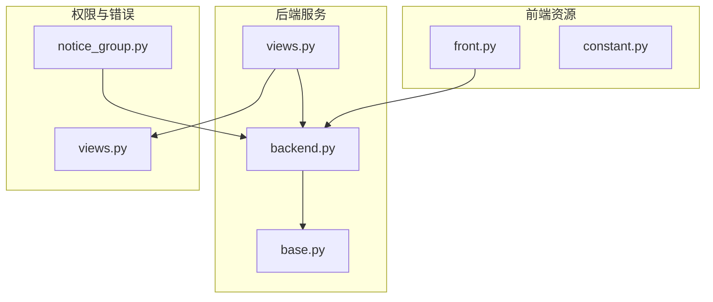
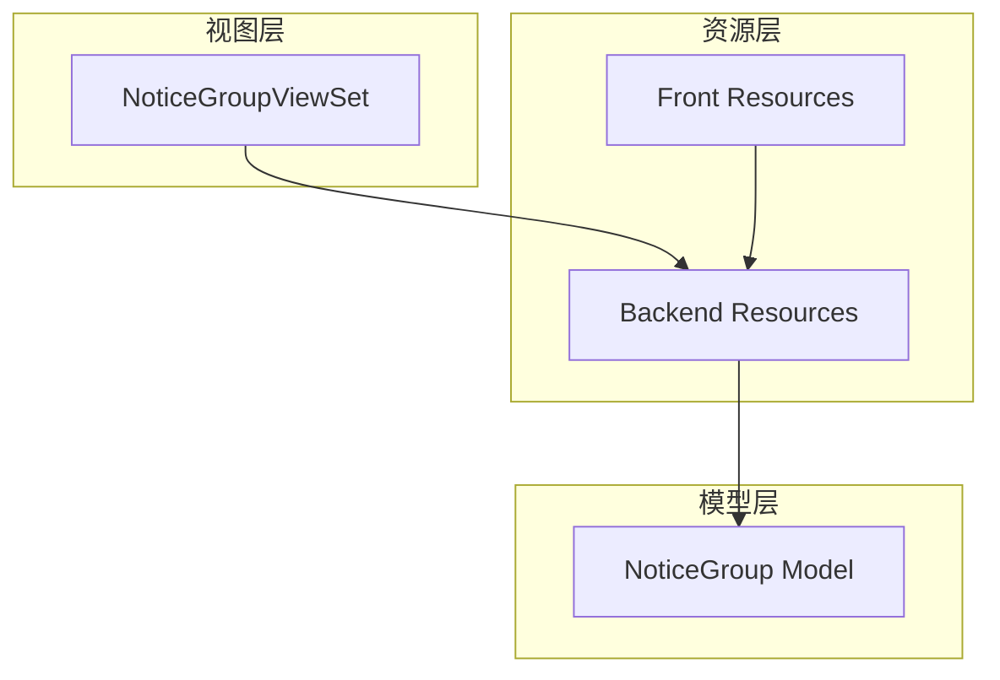
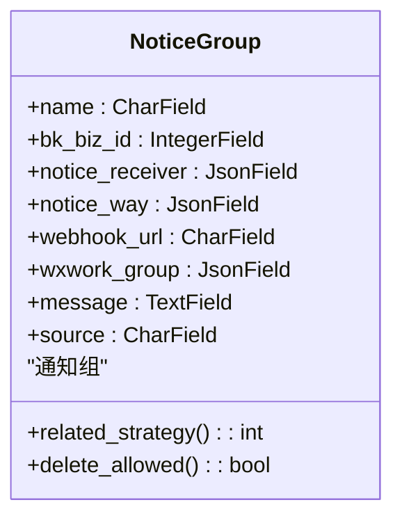
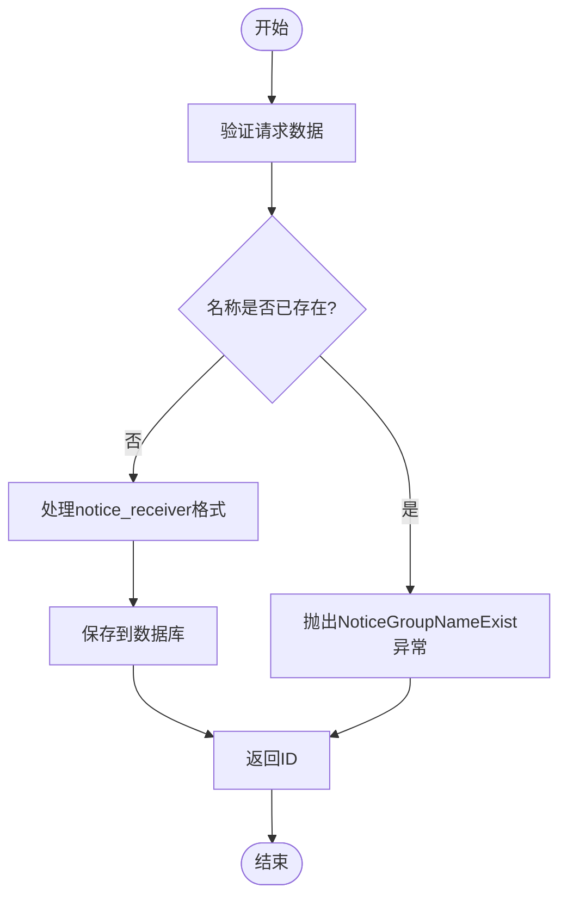
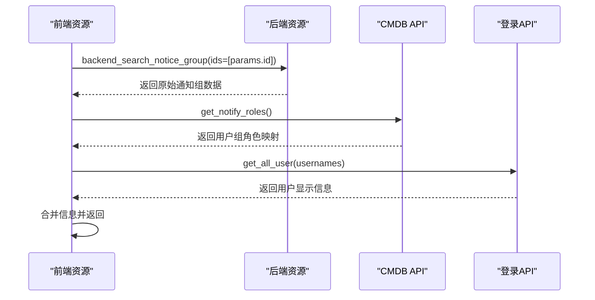
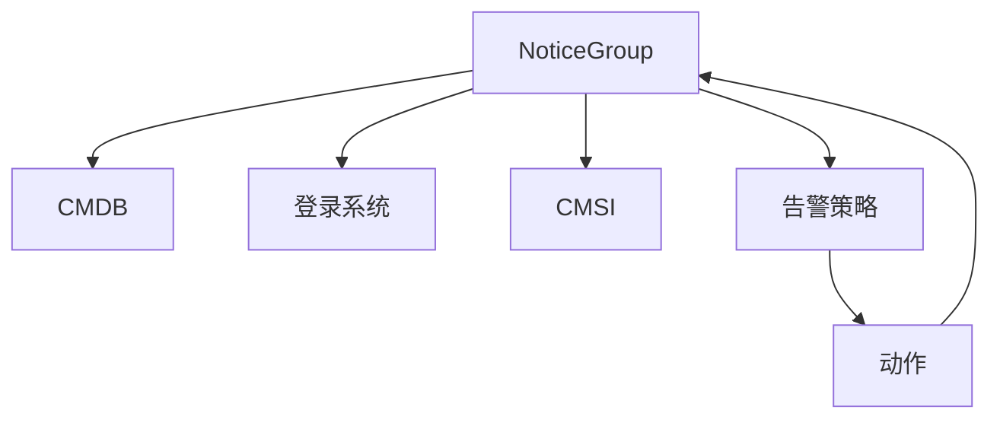

# 通知组

<cite>
**本文档中引用的文件**   
- [base.py](file://bkmonitor/bkmonitor/models/base.py#L385-L421)
- [backend.py](file://bkmonitor/packages/monitor_web/notice_group/resources/backend.py#L0-L129)
- [front.py](file://bkmonitor/packages/monitor_web/notice_group/resources/front.py#L0-L200)
- [constant.py](file://bkmonitor/packages/monitor_web/notice_group/constant.py#L0-L15)
- [views.py](file://bkmonitor/packages/monitor_web/notice_group/views.py#L0-L44)
- [notice_group.py](file://bkmonitor/core/errors/notice_group.py#L32-L45)
</cite>

## 目录
1. [简介](#简介)
2. [项目结构](#项目结构)
3. [核心组件](#核心组件)
4. [架构概述](#架构概述)
5. [详细组件分析](#详细组件分析)
6. [依赖分析](#依赖分析)
7. [性能考虑](#性能考虑)
8. [故障排除指南](#故障排除指南)
9. [结论](#结论)

## 简介
本文档全面记录了通知组的创建、管理与使用方法。通知组是监控系统中用于定义告警通知接收人和通知方式的核心功能模块，支持静态成员和动态规则两种模式，并可与CMDB拓扑集成实现灵活的成员管理。文档详细说明了通知组的数据结构、权限控制、可见性设置及跨业务共享机制，并提供实际使用案例。

## 项目结构
通知组相关功能主要分布在 `bkmonitor` 模块下的多个子目录中，采用前后端分离的架构设计。核心模型定义在 `models/base.py`，后端资源逻辑位于 `packages/monitor_web/notice_group/resources/backend.py`，前端展示逻辑在 `front.py`，权限控制通过 `views.py` 中的视图集实现。

**图示来源**
- [base.py](file://bkmonitor/bkmonitor/models/base.py#L385-L421)
- [backend.py](file://bkmonitor/packages/monitor_web/notice_group/resources/backend.py#L0-L129)
- [front.py](file://bkmonitor/packages/monitor_web/notice_group/resources/front.py#L0-L200)
- [views.py](file://bkmonitor/packages/monitor_web/notice_group/views.py#L0-L44)

**本节来源**
- [base.py](file://bkmonitor/bkmonitor/models/base.py#L385-L421)
- [backend.py](file://bkmonitor/packages/monitor_web/notice_group/resources/backend.py#L0-L129)
- [front.py](file://bkmonitor/packages/monitor_web/notice_group/resources/front.py#L0-L200)

## 核心组件
通知组的核心组件包括数据模型 `NoticeGroup`、后端资源类 `BackendSearchNoticeGroup` 和 `BackendSaveNoticeGroupResource`、前端资源类 `NoticeGroupDetailResource` 以及权限控制类 `BusinessActionPermission`。这些组件共同实现了通知组的增删改查、权限校验和跨系统集成。

**本节来源**
- [base.py](file://bkmonitor/bkmonitor/models/base.py#L385-L421)
- [backend.py](file://bkmonitor/packages/monitor_web/notice_group/resources/backend.py#L0-L129)
- [front.py](file://bkmonitor/packages/monitor_web/notice_group/resources/front.py#L0-L200)

## 架构概述
通知组系统采用分层架构，自上而下分为视图层、资源层、模型层。视图层处理HTTP请求并进行权限校验；资源层封装业务逻辑，协调前后端数据转换；模型层定义数据结构并与数据库交互。系统通过 `ResourceViewSet` 统一暴露API接口，确保前后端解耦。

**图示来源**
- [views.py](file://bkmonitor/packages/monitor_web/notice_group/views.py#L0-L44)
- [backend.py](file://bkmonitor/packages/monitor_web/notice_group/resources/backend.py#L0-L129)
- [base.py](file://bkmonitor/bkmonitor/models/base.py#L385-L421)

## 详细组件分析

### 通知组模型分析
`NoticeGroup` 模型定义了通知组的核心数据结构，包含名称、业务ID、通知对象、通知方式、Webhook地址、企业微信群和备注等字段。模型通过 `JsonField` 存储复杂结构，支持灵活的配置需求。

**图示来源**
- [base.py](file://bkmonitor/bkmonitor/models/base.py#L385-L421)

**本节来源**
- [base.py](file://bkmonitor/bkmonitor/models/base.py#L385-L421)

### 通知组创建与管理分析
后端资源类 `BackendSaveNoticeGroupResource` 负责通知组的创建和更新。在创建时进行重名检测，更新时验证对象存在性。通知对象以 `type#id` 的格式存储，如 `user#admin` 或 `group#bk_biz_tester`，便于解析和查询。

**图示来源**
- [backend.py](file://bkmonitor/packages/monitor_web/notice_group/resources/backend.py#L0-L129)

**本节来源**
- [backend.py](file://bkmonitor/packages/monitor_web/notice_group/resources/backend.py#L0-L129)

### 通知组查询与展示分析
前端资源类 `NoticeGroupDetailResource` 负责获取通知组详情。它调用后端资源获取原始数据后，补充用户和用户组的显示名称和头像信息，提升用户体验。查询时会根据业务ID过滤，支持跨业务可见性。

**图示来源**
- [front.py](file://bkmonitor/packages/monitor_web/notice_group/resources/front.py#L0-L200)

**本节来源**
- [front.py](file://bkmonitor/packages/monitor_web/notice_group/resources/front.py#L0-L200)

## 依赖分析
通知组系统依赖于CMDB获取用户组信息，依赖于登录系统获取用户详情，依赖于CMSI发送通知。通过 `ActionNoticeMapping` 表与告警策略建立多对多关系，确保通知组可被多个策略复用。

**图示来源**
- [base.py](file://bkmonitor/bkmonitor/models/base.py#L385-L421)
- [backend.py](file://bkmonitor/packages/monitor_web/notice_group/resources/backend.py#L0-L129)
- [front.py](file://bkmonitor/packages/monitor_web/notice_group/resources/front.py#L0-L200)

**本节来源**
- [base.py](file://bkmonitor/bkmonitor/models/base.py#L385-L421)
- [backend.py](file://bkmonitor/packages/monitor_web/notice_group/resources/backend.py#L0-L129)
- [front.py](file://bkmonitor/packages/monitor_web/notice_group/resources/front.py#L0-L200)

## 性能考虑
通知组查询采用批量获取用户信息的方式，减少API调用次数。通过数据库索引优化业务ID和来源系统的联合查询。建议在大规模用户场景下对用户信息进行缓存，避免频繁调用用户中心接口。

## 故障排除指南
常见问题包括通知组无法删除、创建时名称重复、企业微信通知失败等。无法删除通常是因为该通知组仍被告警策略引用，需先解除关联。名称重复错误可通过 `NoticeGroupNameExist` 异常捕获并提示用户。企业微信通知失败需检查Webhook地址配置和网络连通性。

**本节来源**
- [notice_group.py](file://bkmonitor/core/errors/notice_group.py#L32-L45)
- [backend.py](file://bkmonitor/packages/monitor_web/notice_group/resources/backend.py#L0-L129)

## 结论
通知组系统提供了灵活、可扩展的告警通知管理功能，支持静态成员和动态规则两种模式，与CMDB拓扑深度集成。通过完善的权限控制和跨业务共享机制，满足了复杂企业环境下的运维需求。未来可进一步优化动态规则的性能，增强与第三方系统的集成能力。