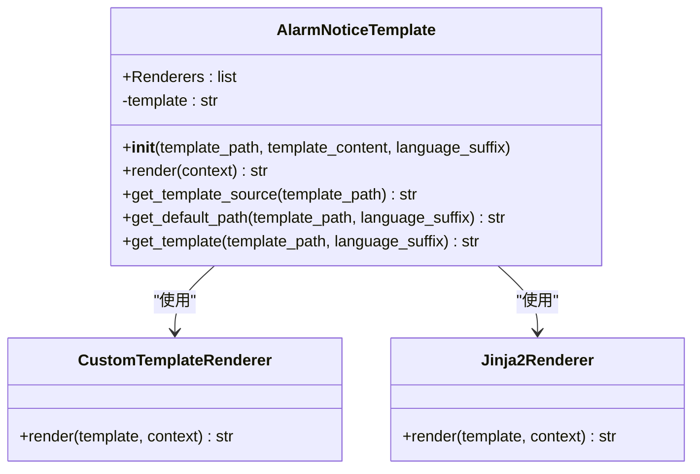
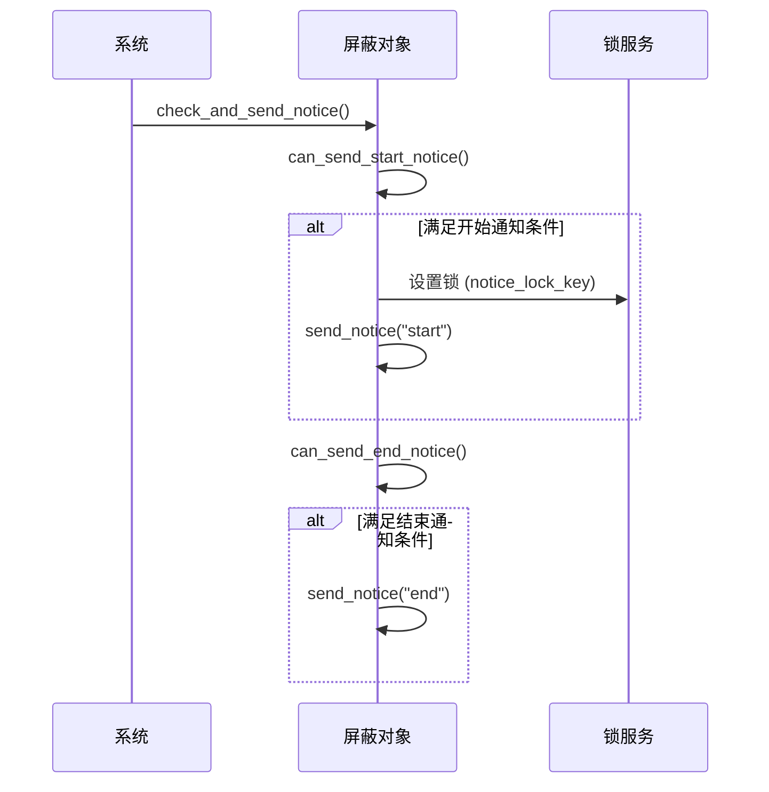
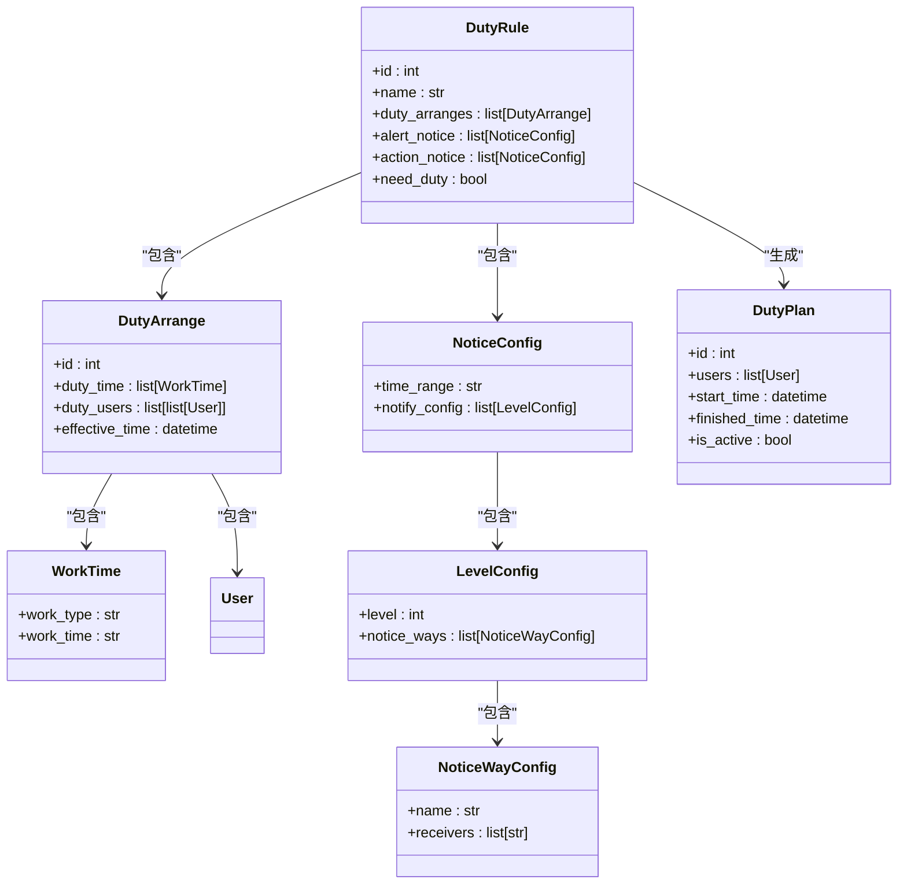

# 通知配置

<cite>
**本文档引用的文件**
- [template.py](file://bkmonitor/bkmonitor/utils/template.py#L191-L390)
- [action.py](file://bkmonitor/constants/action.py#L242-L276)
- [add_shield.md](file://bkmonitor/docs/api/apidocs/zh_hans/add_shield.md)
- [edit_shield.md](file://bkmonitor/docs/api/apidocs/zh_hans/edit_shield.md)
- [get_shield.md](file://bkmonitor/docs/api/apidocs/zh_hans/get_shield.md)
- [save_user_group.md](file://bkmonitor/docs/api/apidocs/zh_hans/save_user_group.md)
- [search_duty_rule_detail.md](file://bkmonitor/docs/api/apidocs/zh_hans/search_duty_rule_detail.md)
- [search_user_group_detail.md](file://bkmonitor/docs/api/apidocs/zh_hans/search_user_group_detail.md)
- [save_alarm_strategy_v3.md](file://bkmonitor/docs/api/apidocs/zh_hans/save_alarm_strategy_v3.md)
- [alarm_backends/service/converge/shield/shield_obj.py](file://bkmonitor/alarm_backends/service/converge/shield/shield_obj.py#L247-L319)
- [alarm_backends/service/fta_action/utils.py](file://bkmonitor/alarm_backends/service/fta_action/utils.py#L750-L857)
- [alarm_backends/service/converge/converge_func.py](file://bkmonitor/alarm_backends/service/converge/converge_func.py#L179-L247)
</cite>

## 目录
1. [通知方式与通知组](#通知方式与通知组)
2. [通知模板与变量](#通知模板与变量)
3. [通知时机与触发条件](#通知时机与触发条件)
4. [告警级别与收敛规则的结合](#告警级别与收敛规则的结合)
5. [分级通知与值班表集成](#分级通知与值班表集成)
6. [常见配置问题与解决方案](#常见配置问题与解决方案)

## 通知方式与通知组

通知组是通知策略的核心配置单元，用于定义接收通知的人员和方式。系统支持多种通知方式，包括邮件、短信、微信、语音等。通知组的配置通过API接口进行管理，主要包含通知接收人（`notice_receiver`）和通知方式（`notice_way`）两个关键字段。

通知组的配置逻辑主要在 `alarm_backends/service/fta_action/utils.py` 文件中实现。当一个告警事件触发时，系统会根据告警的严重级别和类型，从通知组中获取对应的接收人列表。如果未指定具体的接收人，则默认使用通知组中的所有成员。对于企业微信（`wxbot`）通知，系统还支持特殊的 `@用户` 映射关系，允许在通知中@特定的用户。

```mermaid
flowchart TD
A[告警事件触发] --> B{是否指定接收人?}
B --> |是| C[使用指定接收人列表]
B --> |否| D[使用通知组所有成员]
C --> E[处理企业微信@用户映射]
D --> E
E --> F[生成最终通知配置]
```

**图示来源**
- [alarm_backends/service/fta_action/utils.py](file://bkmonitor/alarm_backends/service/fta_action/utils.py#L750-L857)

**本节来源**
- [alarm_backends/service/fta_action/utils.py](file://bkmonitor/alarm_backends/service/fta_action/utils.py#L750-L857)
- [search_user_group_detail.md](file://bkmonitor/docs/api/apidocs/zh_hans/search_user_group_detail.md)

## 通知模板与变量

通知模板决定了通知内容的最终呈现形式。系统使用 `AlarmNoticeTemplate` 类来处理模板的渲染。该类支持多种模板渲染器，包括自定义渲染器和Jinja2渲染器。模板可以基于文件路径（`template_path`）或直接的内容（`template_content`）进行初始化。

模板的渲染过程是通过 `render` 方法完成的，它接受一个上下文（`context`）字典作为输入。系统会依次调用所有注册的渲染器对模板进行处理，最终返回渲染后的字符串。如果指定的模板文件不存在，系统会尝试加载默认模板（`default_` 开头的文件）。

通知模板中可用的变量非常丰富，主要分为以下几类：
- **CMDB变量**：以 `target.` 为前缀，用于引用业务、主机、进程等CMDB对象的字段，例如 `{{target.business.bk_biz_name}}` 表示业务名称。
- **告警内容变量**：以 `content.` 为前缀，包含告警级别、开始时间、持续时间、目标类型、数据来源、告警内容、当前值、业务、目标、维度、详情和相关链接等信息。
- **业务变量**：以 `business.` 为前缀，目前主要包含 `{{business.bk_biz_name}}`。
- **告警变量**：以 `alarm.` 为前缀，包含告警名称、显示类型和回调消息等。



**图示来源**
- [template.py](file://bkmonitor/bkmonitor/utils/template.py#L191-L390)

**本节来源**
- [template.py](file://bkmonitor/bkmonitor/utils/template.py#L191-L390)
- [action.py](file://bkmonitor/constants/action.py#L242-L276)

## 通知时机与触发条件

通知的触发时机由多种因素共同决定，包括告警信号（`signal`）、收敛规则和屏蔽配置。告警信号是通知触发的直接原因，常见的信号有 `abnormal`（异常）、`recovered`（恢复）、`closed`（关闭）和 `no_data`（无数据）。

在策略配置中，`notice` 部分的 `signal` 字段定义了哪些信号会触发通知。例如，一个配置了 `["abnormal", "no_data"]` 的通知策略，只会在告警产生或出现无数据情况时发送通知。

此外，系统还支持在屏蔽（`shield`）操作时发送通知。在 `add_shield.md`、`edit_shield.md` 和 `get_shield.md` 等文档中定义了 `notice_config` 配置项，其中 `notice_time` 字段指定了在屏蔽开始或结束前N分钟发送通知。`can_send_start_notice` 和 `can_send_end_notice` 方法在 `shield_obj.py` 中实现了具体的检查逻辑，通过比较当前时间和屏蔽时间来判断是否满足发送条件。



**图示来源**
- [alarm_backends/service/converge/shield/shield_obj.py](file://bkmonitor/alarm_backends/service/converge/shield/shield_obj.py#L247-L319)

**本节来源**
- [add_shield.md](file://bkmonitor/docs/api/apidocs/zh_hans/add_shield.md)
- [edit_shield.md](file://bkmonitor/docs/api/apidocs/zh_hans/edit_shield.md)
- [get_shield.md](file://bkmonitor/docs/api/apidocs/zh_hans/get_shield.md)
- [alarm_backends/service/converge/shield/shield_obj.py](file://bkmonitor/alarm_backends/service/converge/shield/shield_obj.py#L247-L319)

## 告警级别与收敛规则的结合

告警级别（`alert_level`）和收敛规则（`converge_config`）是控制通知频率和内容的关键机制。告警级别通常分为1、2、3级，分别代表严重、警告和提醒。

收敛规则允许对大量相似的告警进行聚合处理，避免通知风暴。在策略配置中，`converge_config` 定义了收敛的逻辑。`condition` 字段指定了收敛的维度，例如 `strategy_id`、`dimensions`、`alert_level` 和 `signal`。这意味着只有当这些维度的值都相同时，告警才会被收敛。

`converge_func` 字段定义了收敛后的处理方式。例如，`collect` 函数表示在收敛窗口结束时，将所有被收敛的告警汇总成一条通知发送。`skip_when_exceed` 函数则表示当告警数量超过阈值时，直接忽略后续的告警。这些规则在 `converge_func.py` 文件中有详细的实现。

```mermaid
flowchart TD
A[新告警到达] --> B{是否为新收敛事件?}
B --> |是| C[创建收敛实例]
B --> |否| D{告警数量是否超过阈值?}
D --> |是| E[执行收敛函数 (如 collect)]
D --> |否| F[继续处理告警]
E --> G[发送汇总通知]
```

**图示来源**
- [alarm_backends/service/converge/converge_func.py](file://bkmonitor/alarm_backends/service/converge/converge_func.py#L179-L247)

**本节来源**
- [search_alarm_strategy_without_biz.md](file://bkmonitor/support-files/apigw/docs/zh/search_alarm_strategy_without_biz.md)
- [alarm_backends/service/converge/converge_func.py](file://bkmonitor/alarm_backends/service/converge/converge_func.py#L179-L247)

## 分级通知与值班表集成

系统通过值班表（`duty_rule`）实现了分级通知和值班集成。在 `search_duty_rule_detail.md` 和 `search_user_group_detail.md` 的API响应中，可以看到 `alert_notice` 和 `action_notice` 配置。这些配置允许根据告警级别（`level`）或处理阶段（`phase`）指定不同的通知方式和接收人。

例如，一个配置可以定义：当告警级别为1（严重）时，通过微信和电话通知；当级别为2或3时，仅通过微信通知。这实现了基于严重程度的分级通知。

`duty_arranges` 字段定义了具体的排班计划，包括值班人员、工作时间和生效时间。`duty_plans` 则是根据排班计划生成的实际值班安排。当告警发生时，系统会查询当前时间对应的 `duty_plan`，并从 `duty_users` 中获取当前的值班人员作为通知接收人，从而实现了与值班表的无缝集成。



**图示来源**
- [search_duty_rule_detail.md](file://bkmonitor/docs/api/apidocs/zh_hans/search_duty_rule_detail.md)
- [search_user_group_detail.md](file://bkmonitor/docs/api/apidocs/zh_hans/search_user_group_detail.md)

**本节来源**
- [search_duty_rule_detail.md](file://bkmonitor/docs/api/apidocs/zh_hans/search_duty_rule_detail.md)
- [search_user_group_detail.md](file://bkmonitor/docs/api/apidocs/zh_hans/search_user_group_detail.md)
- [save_user_group.md](file://bkmonitor/docs/api/apidocs/zh_hans/save_user_group.md)

## 常见配置问题与解决方案

在配置通知策略时，可能会遇到一些常见问题：

1.  **通知未发送**：首先检查 `signal` 配置是否正确，确保当前告警的信号在通知策略的 `signal` 列表中。其次，检查收敛规则（`converge_config`）是否过于严格，导致告警被收敛而未触发通知。最后，确认通知组中的接收人信息是否正确。

2.  **模板变量不生效**：确保模板语法正确，使用双大括号 `{{ }}` 包裹变量名。检查变量名是否拼写错误，例如 `{{target.business.bk_biz_name}}` 而不是 `{{target.business.name}}`。如果使用了自定义模板，确保模板文件路径正确且文件存在。

3.  **屏蔽通知未触发**：检查 `notice_config` 中的 `notice_time` 是否设置合理。例如，如果设置为5分钟，但屏蔽周期很短（如1分钟），则可能无法触发开始通知。同时，确保 `notice_way` 和 `notice_receiver` 配置正确。

4.  **值班表集成失败**：确认通知组已启用值班功能（`need_duty` 为 `true`）。检查 `duty_arranges` 的 `effective_time` 是否已生效。如果使用了 `personal_notice` 配置，确保 `duty_rules` 字段指定了正确的轮值规则ID。

5.  **收敛功能异常**：在 `save_alarm_strategy_v3.md` 中提到，`noise_reduce_config` 是一个可选的降噪配置。如果开启了降噪但未配置 `count` 和 `dimensions` 字段，可能会导致收敛逻辑异常。确保所有必填字段都已正确填写。

**本节来源**
- [save_alarm_strategy_v3.md](file://bkmonitor/docs/api/apidocs/zh_hans/save_alarm_strategy_v3.md)
- [alarm_backends/management/story/kernel_story.py](file://bkmonitor/alarm_backends/management/story/kernel_story.py#L360-L395)
- [add_shield.md](file://bkmonitor/docs/api/apidocs/zh_hans/add_shield.md)
- [edit_shield.md](file://bkmonitor/docs/api/apidocs/zh_hans/edit_shield.md)
- [get_shield.md](file://bkmonitor/docs/api/apidocs/zh_hans/get_shield.md)