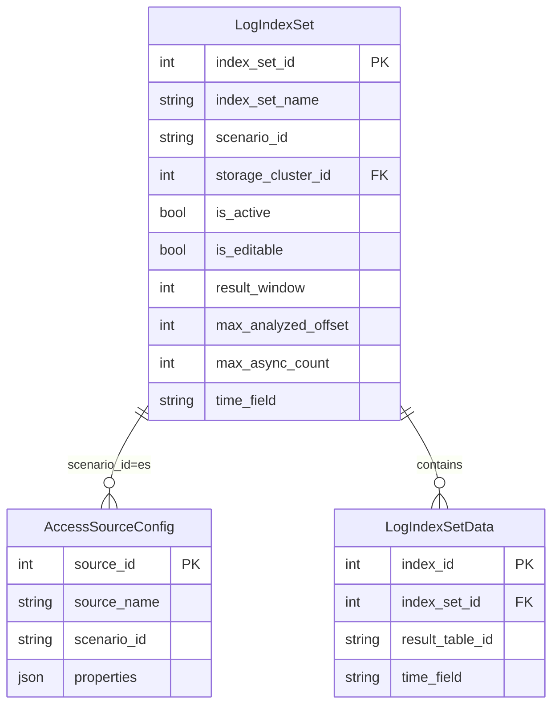
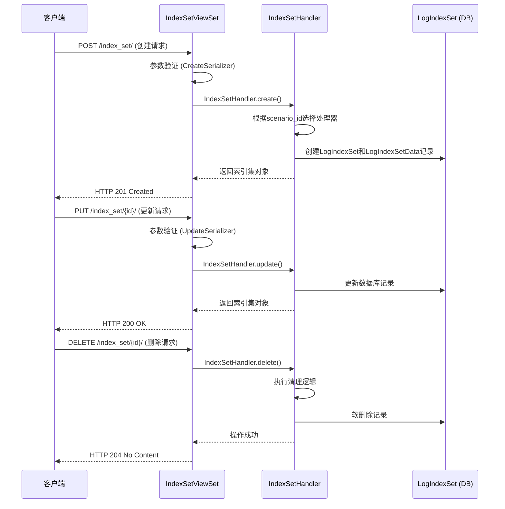

# 索引集配置模型

<cite>
**本文档引用的文件**   
- [models.py](file://bklog/apps/log_search/models.py)
- [index_set.py](file://bklog/apps/log_search/handlers/index_set.py)
- [index_set_views.py](file://bklog/apps/log_search/views/index_set_views.py)
- [constants.py](file://bklog/apps/log_search/constants.py)
- [search_handlers_esquery.py](file://bklog/apps/log_search/handlers/search/search_handlers_esquery.py)
</cite>

## 目录
1. [引言](#引言)
2. [核心配置字段详解](#核心配置字段详解)
3. [索引集与Elasticsearch集群映射关系](#索引集与elasticsearch集群映射关系)
4. [时间字段配置策略](#时间字段配置策略)
5. [索引集生命周期管理](#索引集生命周期管理)
6. [性能优化建议](#性能优化建议)
7. [结论](#结论)

## 引言
索引集（LogIndexSet）是日志平台的核心数据模型，用于聚合和管理来自不同数据源的Elasticsearch索引。它提供了一种逻辑上的分组机制，使得用户可以跨多个物理索引进行统一的搜索、分析和管理。本文档深入解析`LogIndexSet`实体的实现细节，涵盖其关键配置字段、与Elasticsearch集群的映射关系、时间字段配置策略以及完整的创建、更新和删除流程。

**Section sources**
- [models.py](file://bklog/apps/log_search/models.py#L336-L395)

## 核心配置字段详解

### is_active 字段
`is_active` 是一个布尔类型的字段，用于标识索引集的启用状态。当该字段为 `True` 时，表示该索引集处于可用状态，用户可以对其进行搜索和查询操作。当设置为 `False` 时，该索引集将被“暂停”，无法被正常检索。此功能允许管理员在不影响数据存储的情况下，临时禁用某个索引集。

该字段的默认值为 `True`，确保新创建的索引集默认是可用的。在代码实现中，提供了 `stop()` 和 `start()` 方法来分别将 `is_active` 设置为 `False` 和 `True`，从而实现索引集的暂停和启动。

**Section sources**
- [models.py](file://bklog/apps/log_search/models.py#L362)
- [index_set.py](file://bklog/apps/log_search/handlers/index_set.py#L555-L569)

### is_editable 字段
`is_editable` 是一个布尔类型的字段，用于控制索引集的可编辑性。当该字段为 `True` 时，表示该索引集的配置（如名称、包含的索引等）可以被修改。当设置为 `False` 时，该索引集将被锁定，防止意外的修改。

此字段在创建索引集时可以指定，默认值为 `True`。它为系统提供了灵活性，允许创建一些只读的、由系统自动生成的索引集，以防止用户误操作。

**Section sources**
- [models.py](file://bklog/apps/log_search/models.py#L379)
- [index_set.py](file://bklog/apps/log_search/handlers/index_set.py#L400)

### result_window 字段
`result_window` 是一个整数类型的字段，定义了单次导出操作可以导出的日志条数上限。该值直接映射到Elasticsearch的 `index.max_result_window` 配置，决定了 `from + size` 查询的最大范围。

默认值为 `10000`，这是一个在性能和功能之间取得平衡的合理值。如果用户需要导出更多数据，系统会使用 `scroll` 或 `search_after` 等分页机制来处理。此字段的设置对于控制查询性能和防止内存溢出至关重要。

**Section sources**
- [models.py](file://bklog/apps/log_search/models.py#L385)
- [constants.py](file://bklog/apps/log_search/constants.py#L102)

### max_analyzed_offset 字段
`max_analyzed_offset` 是一个整数类型的字段，用于限制日志长文本高亮的长度。在进行全文检索时，Elasticsearch会对匹配的文本进行高亮显示。对于非常长的日志条目，高亮处理可能会消耗大量计算资源。

该字段的值为0时，表示不进行长度限制。当设置为一个正整数时，系统将只对日志的前N个字符进行高亮分析，从而优化查询性能，避免因处理超长文本而导致的性能下降。

**Section sources**
- [models.py](file://bklog/apps/log_search/models.py#L387)
- [migrations/0080_logindexset_max_analyzed_offset.py](file://bklog/apps/log_search/migrations/0080_logindexset_max_analyzed_offset.py)

### max_async_count 字段
`max_async_count` 是一个整数类型的字段，用于限制日志异步下载的最大条数。当用户发起一个可能返回海量数据的下载请求时，系统会将其转为异步任务。

该字段定义了此类异步任务最多可以处理的日志条数。如果查询结果超过此限制，任务将失败。此配置是系统QoS（服务质量）策略的一部分，用于防止单个用户请求占用过多系统资源，影响其他用户的正常使用。其默认值为0，可能表示使用全局默认值或无限制，具体行为需结合业务规则。

**Section sources**
- [models.py](file://bklog/apps/log_search/models.py#L388)
- [constants.py](file://bklog/apps/log_search/constants.py#L136)

## 索引集与Elasticsearch集群映射关系

索引集通过 `scenario_id` 和 `storage_cluster_id` 两个字段来确定其数据所在的Elasticsearch集群。

- **`scenario_id`**: 定义了数据的接入场景，目前支持三种类型：
  - `log`: 通过平台自身的采集器接入。
  - `bkdata`: 来自数据平台（Data Platform）。
  - `es`: 第三方或用户自定义的Elasticsearch集群。
  
  不同的 `scenario_id` 决定了数据的来源和处理方式。

- **`storage_cluster_id`**: 这是一个整数ID，指向具体的Elasticsearch集群配置。对于 `scenario_id` 为 `es` 的情况，`storage_cluster_id` 直接关联到 `AccessSourceConfig` 模型中的一个数据源，该数据源包含了ES集群的 `host`、`port`、`username` 和加密的 `password` 等连接信息。

这种设计实现了逻辑与物理的解耦。一个索引集（逻辑概念）可以映射到一个特定的Elasticsearch集群（物理概念），而集群的详细连接信息则由独立的数据源配置管理，提高了配置的复用性和安全性。

**Diagram sources**
- [models.py](file://bklog/apps/log_search/models.py#L336-L395)
- [models.py](file://bklog/apps/log_search/models.py#L276-L334)

## 时间字段配置策略

时间字段是日志数据的关键元数据，用于时间范围查询和数据的生命周期管理。

### time_field 字段
`time_field` 字段定义了索引集中用于表示日志时间的字段名称。常见的默认值是 `dtEventTimeStamp`，它通常存储时间戳（毫秒）。该字段是进行时间范围检索的基础。

### time_field_type 和 time_field_unit 字段
这两个字段共同定义了时间字段的数据类型和单位。
- **`time_field_type`**: 表示时间字段的类型，如 `date`（日期类型）或 `long`（长整型，即时间戳）。
- **`time_field_unit`**: 表示时间戳的单位，如 `second`、`millisecond` 或 `microsecond`。

这种配置策略提供了极大的灵活性，使得索引集能够兼容不同格式的时间数据。例如，一个来自第三方ES的索引可能使用 `long` 类型的 `timestamp` 字段，单位为 `second`，而平台自身的日志则使用 `date` 类型的 `dtEventTimeStamp` 字段。通过在索引集层面统一配置，系统可以正确地解析和处理这些不同格式的时间数据。

**Section sources**
- [models.py](file://bklog/apps/log_search/models.py#L373-L376)
- [index_set_views.py](file://bklog/apps/log_search/views/index_set_views.py#L359-L380)

## 索引集生命周期管理

### 创建流程
1.  **参数验证**: 通过 `CreateSerializer` 验证请求参数，确保 `index_set_name`、`scenario_id` 等必填项存在。
2.  **业务规则校验**: 根据 `scenario_id` 进行校验。例如，当 `scenario_id` 为 `es` 时，必须提供 `storage_cluster_id`。
3.  **调用处理器**: 调用 `IndexSetHandler.create()` 方法。
4.  **创建索引集**: 处理器根据不同的 `scenario_id` 实例化相应的处理类（如 `BkDataIndexSetHandler` 或 `EsIndexSetHandler`），并执行具体的创建逻辑。
5.  **数据持久化**: 将索引集的基本信息（`LogIndexSet`）和其包含的索引列表（`LogIndexSetData`）写入数据库。
6.  **记录操作**: 记录用户操作日志。

### 更新流程
更新流程与创建流程类似，但核心是调用 `IndexSetHandler.update()` 方法。它会获取现有的索引集对象，根据新的参数进行更新，并处理索引列表的变更（如新增或删除索引）。更新操作同样会进行业务规则校验，例如检查索引是否跨集群。

### 删除流程
删除操作通过 `IndexSetHandler.delete()` 方法执行。它首先会调用底层处理器的 `delete_index_set()` 方法，执行与创建相反的清理逻辑（如删除路由等），然后将数据库中的 `LogIndexSet` 记录标记为已删除（软删除）。

所有这些操作都通过Django REST framework的视图（`IndexSetViewSet`）暴露为标准的HTTP API，并受到权限系统的保护。

**Diagram sources**
- [index_set_views.py](file://bklog/apps/log_search/views/index_set_views.py#L546-L798)
- [index_set.py](file://bklog/apps/log_search/handlers/index_set.py#L381-L554)

## 性能优化建议

### 查询窗口大小设置
`result_window` 字段的设置直接影响查询性能。建议遵循以下原则：
- **合理设置**: 将 `result_window` 设置为一个能满足绝大多数用户需求但不过大的值（如10000）。过大的值会增加Elasticsearch堆内存的压力。
- **使用分页**: 对于需要获取大量数据的场景，应引导用户使用 `scroll` 或 `search_after` API，而不是增大 `result_window`。

### 异步查询限制
`max_async_count` 字段是防止资源滥用的关键。
- **设置上限**: 为 `max_async_count` 设置一个合理的上限（如200万条），可以有效防止单个异步任务耗尽系统资源。
- **监控与告警**: 监控接近此限制的异步任务，并设置告警，以便及时发现潜在的滥用行为。

### 长文本高亮优化
对于包含大量文本数据的日志，`max_analyzed_offset` 可以显著提升性能。
- **启用限制**: 建议为包含长文本（如堆栈信息、JSON日志）的索引集设置 `max_analyzed_offset`（如10000），以避免对整条超长日志进行高亮分析。

## 结论
`LogIndexSet` 模型是日志平台实现灵活、高效日志管理的核心。通过对 `is_active`、`is_editable`、`result_window`、`max_analyzed_offset` 和 `max_async_count` 等字段的精细配置，系统能够在功能、性能和安全性之间取得最佳平衡。理解其与Elasticsearch集群的映射关系以及时间字段的配置策略，对于正确使用和管理日志平台至关重要。遵循本文档提供的性能优化建议，可以确保系统在高负载下依然保持稳定和高效。