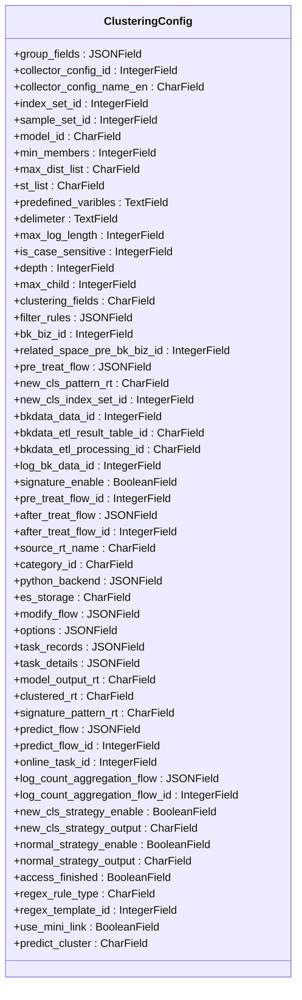
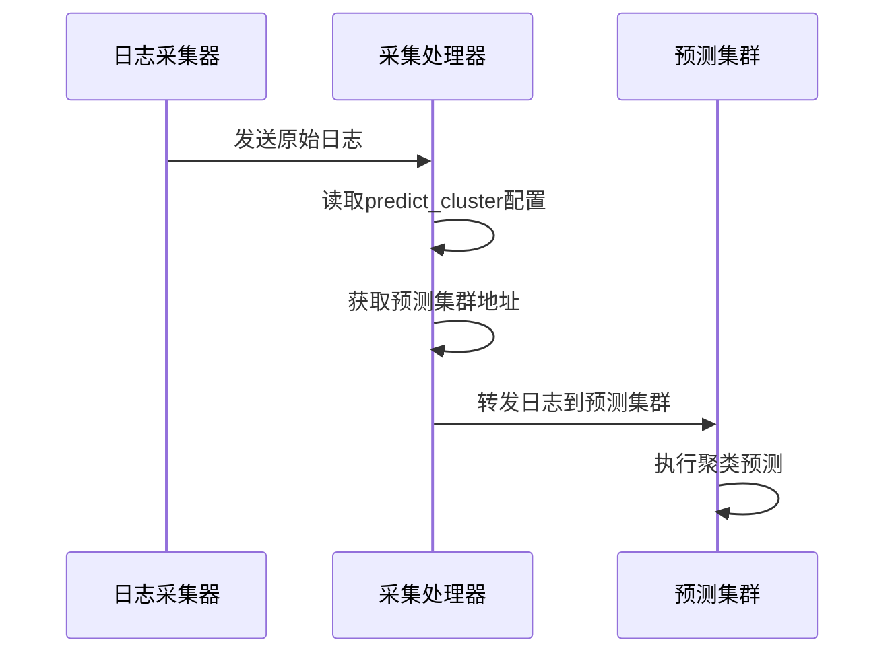
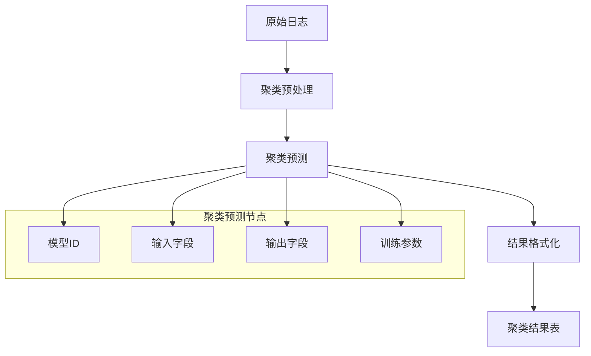
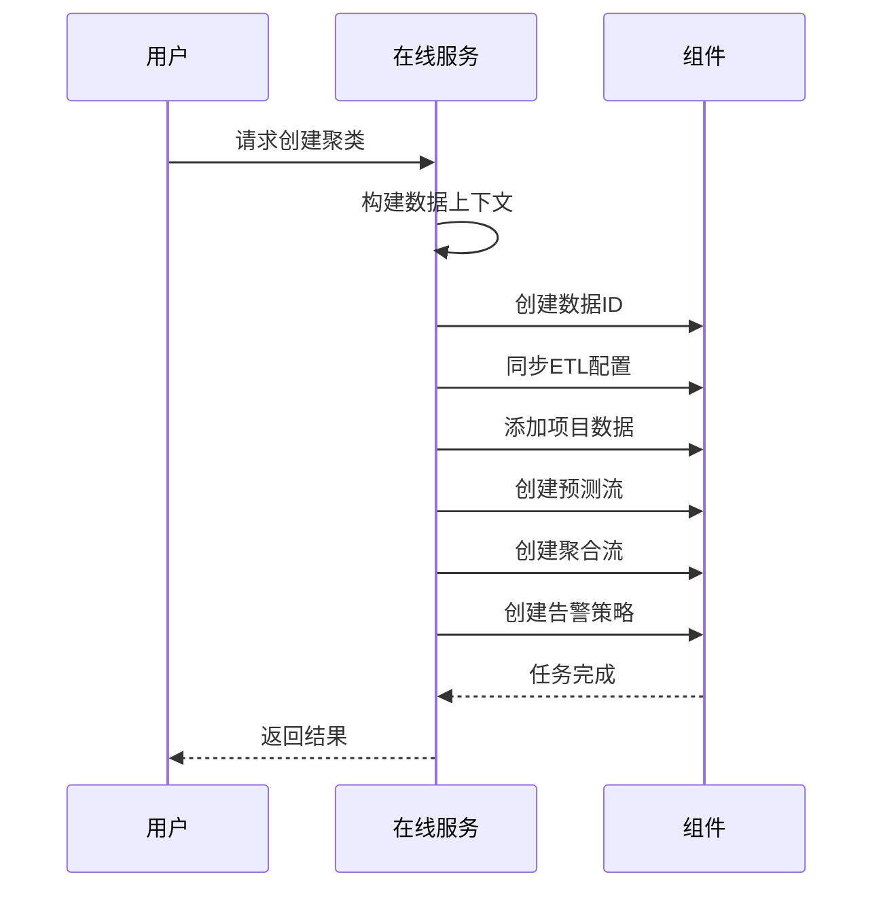
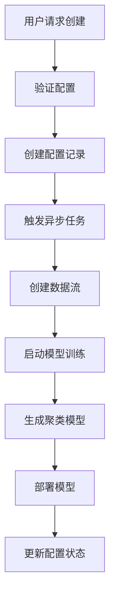
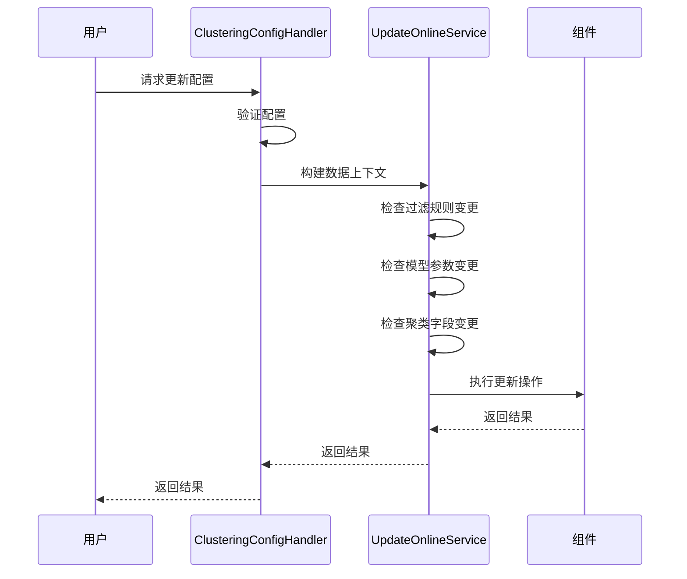

# 聚类配置模型

<cite>
**本文档引用文件**   
- [models.py](file://bklog/apps/log_clustering/models.py)
- [clustering_config.py](file://bklog/apps/log_clustering/handlers/clustering_config.py)
- [dataflow_handler.py](file://bklog/apps/log_clustering/handlers/dataflow/dataflow_handler.py)
- [constants.py](file://bklog/apps/log_clustering/constants.py)
- [serializers.py](file://bklog/apps/log_clustering/serializers.py)
- [aiops_service_online.py](file://bklog/apps/log_clustering/handlers/pipline_service/aiops_service_online.py)
- [predict_flow.json](file://bklog/templates/flow/predict_flow.json)
- [dataflow_handler.py](file://bklog/apps/log_clustering/handlers/dataflow/dataflow_handler.py)
</cite>

## 目录
1. [引言](#引言)
2. [聚类配置模型结构](#聚类配置模型结构)
3. [关键字段技术实现](#关键字段技术实现)
4. [AIOPS模型集成](#aiops模型集成)
5. [日志模式识别中的作用](#日志模式识别中的作用)
6. [生命周期管理](#生命周期管理)
7. [配置最佳实践](#配置最佳实践)
8. [总结](#总结)

## 引言

聚类配置模型是蓝鲸日志平台中实现日志智能分析的核心组件，通过机器学习算法对海量日志进行自动聚类，识别日志模式并发现异常。该模型基于计算平台的AIOPS能力，实现了从日志采集、特征提取、模型训练到结果应用的完整闭环。本文档详细阐述聚类配置模型的结构设计、关键字段的技术实现、与AIOPS系统的集成方式、在日志模式识别中的具体作用、完整的生命周期管理流程以及配置的最佳实践建议。

## 聚类配置模型结构

聚类配置模型（ClusteringConfig）是日志聚类功能的核心数据结构，定义了聚类分析的各项参数和配置。该模型继承自SoftDeleteModel，支持软删除操作，确保配置的历史可追溯性。

**图表来源**
- [models.py](file://bklog/apps/log_clustering/models.py#L106-L172)

**本节来源**
- [models.py](file://bklog/apps/log_clustering/models.py#L106-L172)

## 关键字段技术实现

### python_backend 字段

`python_backend` 字段是一个JSONField，用于存储模型训练的后端配置信息。该字段在数据库迁移文件`0014_alter_clusteringconfig_python_backend.py`中被定义，允许为空和空白值，其主要用途是存储与模型训练相关的动态配置参数。

该字段的设计允许系统在不同环境下灵活调整模型训练的后端参数，而无需修改数据库结构。当需要更新模型训练配置时，系统可以直接更新此JSON字段的值，从而实现配置的动态变更。

**本节来源**
- [models.py](file://bklog/apps/log_clustering/models.py#L139)
- [0014_alter_clusteringconfig_python_backend.py](file://bklog/apps/log_clustering/migrations/0014_alter_clusteringconfig_python_backend.py)

### clustered_rt 字段

`clustered_rt` 字段是一个CharField，用于存储聚类结果表的ID。该字段在数据库迁移文件`0024_clusteringconfig_clustered_rt.py`中被添加，用于标识经过聚类处理后的日志数据所存储的结果表。

该字段在日志聚类流程中扮演着关键角色。当系统执行聚类分析时，原始日志数据经过特征提取和聚类算法处理后，会将聚类结果（包括聚类ID、模式等信息）写入由`clustered_rt`字段指定的结果表中。后续的日志查询、模式分析和告警检测都将基于此结果表进行。

**本节来源**
- [models.py](file://bklog/apps/log_clustering/models.py#L156)
- [0024_clusteringconfig_clustered_rt.py](file://bklog/apps/log_clustering/migrations/0024_clusteringconfig_clustered_rt.py)

### predict_cluster 字段

`predict_cluster` 字段是一个CharField，用于存储预测集群的名称。该字段在数据库迁移文件`0039_clusteringconfig_predict_cluster_and_more.py`中被添加，其主要作用是标识用于执行日志聚类预测任务的计算集群。

在日志采集场景中，该字段的值会被传递给数据采集处理器（collector_scenario），用于配置日志采集的后端处理参数。具体来说，在`base.py`文件的第256行，系统会根据`predict_cluster`的值从功能配置中获取相应的预测集群地址，从而确保日志数据被正确路由到指定的预测集群进行处理。

**图表来源**
- [base.py](file://bklog/apps/log_databus/handlers/collector_scenario/base.py#L253-L257)

**本节来源**
- [models.py](file://bklog/apps/log_clustering/models.py#L183)
- [0039_clusteringconfig_predict_cluster_and_more.py](file://bklog/apps/log_clustering/migrations/0039_clusteringconfig_predict_cluster_and_more.py)
- [base.py](file://bklog/apps/log_databus/handlers/collector_scenario/base.py#L253-L257)

## AIOPS模型集成

聚类配置模型与AIOPS系统的集成主要通过数据流（DataFlow）和在线任务（OnlineTask）机制实现。系统通过创建和管理一系列数据流来完成从数据接入、预处理、模型预测到结果应用的完整流程。

### 数据流创建与管理

系统通过`DataFlowHandler`类来管理数据流的创建和更新。在创建预测数据流时，系统会根据聚类配置生成相应的数据流配置，包括参与聚类的数据源、聚类预测节点和结果格式化节点。

**图表来源**
- [dataflow_handler.py](file://bklog/apps/log_clustering/handlers/dataflow/dataflow_handler.py#L1411-L1430)

在`dataflow_handler.py`文件中，`create_predict_flow`方法负责创建预测数据流。该方法会根据聚类配置中的参数，构建包含`clustering_stream_source`、`clustering_predict`和`format_signature`三个主要节点的数据流。其中，`clustering_predict`节点包含了模型ID、输入输出字段和训练参数等关键信息。

### 在线任务服务

系统通过`AiopsLogOnlineService`和`AiopsBkdataOnlineService`两个服务类来管理在线训练任务。这两个服务类都继承自`BasePipeLineService`，使用相同的构建模式来创建和执行任务流程。

**图表来源**
- [aiops_service_online.py](file://bklog/apps/log_clustering/handlers/pipline_service/aiops_service_online.py#L49-L93)

**本节来源**
- [aiops_service_online.py](file://bklog/apps/log_clustering/handlers/pipline_service/aiops_service_online.py#L49-L93)
- [dataflow_handler.py](file://bklog/apps/log_clustering/handlers/dataflow/dataflow_handler.py#L1411-L1430)

## 日志模式识别中的作用

聚类配置模型在日志模式识别中发挥着核心作用，通过配置不同的参数来控制日志聚类的精度和效果。系统通过分析日志内容的相似性，将相似的日志归为同一类别，并为每个类别生成一个代表性的模式（Pattern）。

### 模式生成与匹配

系统使用预先定义的正则表达式（predefined_varibles）和分词符（delimeter）来对日志内容进行特征提取。在`predict_flow.json`模板文件中，可以看到模型训练参数的详细配置，包括`min_members`（最小日志数量）、`max_dist_list`（敏感度）和`st_list`（相似度阈值）等。

当系统接收到新的日志时，会根据当前的聚类模型对其进行分类。如果新日志与现有类别的相似度超过阈值，则将其归入相应类别；否则，创建一个新的类别。每个类别的模式会随着新日志的加入而动态更新，以保持模式的准确性和代表性。

### 模式应用

聚类结果被存储在`clustered_rt`指定的结果表中，其中包含原始日志、聚类ID（signature）和模式（pattern）等信息。这些信息可以用于：

1. **异常检测**：通过监控新类别的出现频率，及时发现系统异常。
2. **趋势分析**：分析各类别日志的数量变化趋势，了解系统运行状况。
3. **根因分析**：通过查看特定类别的日志模式，快速定位问题根源。

**本节来源**
- [models.py](file://bklog/apps/log_clustering/models.py#L156)
- [predict_flow.json](file://bklog/templates/flow/predict_flow.json)
- [dataflow_handler.py](file://bklog/apps/log_clustering/handlers/dataflow/dataflow_handler.py#L787-L804)

## 生命周期管理

聚类配置的生命周期管理涵盖了从创建、训练、部署到监控的完整流程。系统通过一系列自动化流程来确保聚类配置的高效管理和稳定运行。

### 创建与训练流程

聚类配置的创建流程由`ClusteringConfigHandler`类的`create`方法管理。该方法首先验证配置的合法性，然后创建或更新聚类配置记录，最后触发异步任务`access_clustering`来执行实际的配置接入。

**图表来源**
- [clustering_config.py](file://bklog/apps/log_clustering/handlers/clustering_config.py#L98-L204)

### 更新与部署流程

当需要更新聚类配置时，系统通过`update`方法来处理。该方法会比较新旧配置的差异，仅对发生变化的参数进行更新，从而减少不必要的系统开销。

**图表来源**
- [clustering_config.py](file://bklog/apps/log_clustering/handlers/clustering_config.py#L206-L239)

### 监控与维护

系统通过`task_records`和`task_details`两个字段来记录聚类配置的操作历史和任务详情。`task_records`记录了每次操作的基本信息（操作类型、任务ID、时间），而`task_details`则详细记录了每个任务的执行步骤、状态和消息。

此外，系统还提供了`get_access_status`方法来检查聚类配置的接入状态，包括数据流创建、运行状态和数据写入情况，确保聚类功能的正常运行。

**本节来源**
- [clustering_config.py](file://bklog/apps/log_clustering/handlers/clustering_config.py#L98-L239)
- [models.py](file://bklog/apps/log_clustering/models.py#L143-L154)

## 配置最佳实践

### 特征提取参数设置

1. **分词符（delimeter）**：选择合适的分词符对于日志特征提取至关重要。建议根据日志格式的特点选择分词符，如空格、制表符或特定符号。
2. **预先定义的正则表达式（predefined_varibles）**：合理配置正则表达式可以有效提取日志中的关键信息。建议将常见的日志模式（如IP地址、时间戳、错误码等）定义为正则表达式。
3. **最大日志长度（max_log_length）**：设置合理的最大日志长度可以避免过长的日志影响聚类效果。建议根据实际日志长度分布来设置此参数。

### 模型更新策略

1. **增量更新**：当仅需更新部分参数时，使用`update`方法进行增量更新，避免重新创建整个数据流。
2. **版本控制**：通过`task_records`字段记录每次更新的历史，便于问题排查和版本回滚。
3. **灰度发布**：在大规模应用前，建议先在小范围内进行测试，验证新配置的效果。

### 性能优化建议

1. **合理设置最小日志数量（min_members）**：过小的值可能导致过多的细分类别，增加系统开销；过大的值可能错过重要的异常模式。
2. **优化敏感度（max_dist_list）**：根据业务需求调整敏感度参数，平衡异常检测的灵敏度和误报率。
3. **定期清理**：定期清理不再使用的聚类配置和结果表，释放系统资源。

**本节来源**
- [constants.py](file://bklog/apps/log_clustering/constants.py)
- [dataflow_handler.py](file://bklog/apps/log_clustering/handlers/dataflow/dataflow_handler.py)
- [clustering_config.py](file://bklog/apps/log_clustering/handlers/clustering_config.py)

## 总结

聚类配置模型是蓝鲸日志平台实现智能日志分析的核心组件，通过灵活的配置参数和强大的AIOPS集成能力，实现了高效的日志模式识别和异常检测。本文档详细介绍了聚类配置模型的结构设计、关键字段的技术实现、与AIOPS系统的集成方式、在日志模式识别中的具体作用、完整的生命周期管理流程以及配置的最佳实践建议。通过合理配置和管理聚类配置模型，可以显著提升日志分析的效率和准确性，为系统运维提供有力支持。