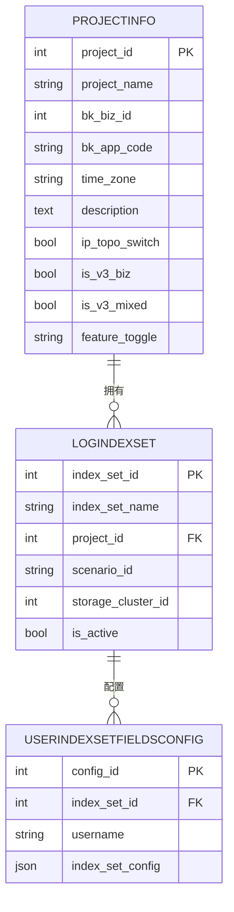
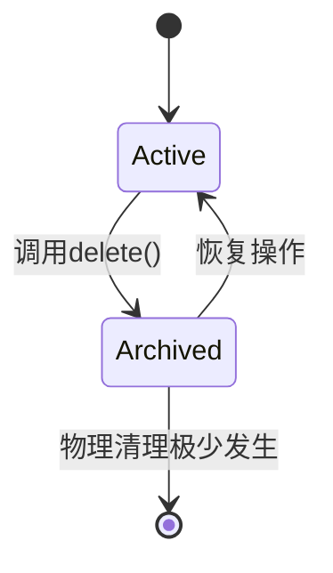

# 项目信息模型

<cite>
**本文档引用的文件**  
- [models.py](file://bklog/apps/log_search/models.py#L214-L274)
- [0016_projectinfo_ip_topo_switch.py](file://bklog/apps/log_search/migrations/0016_projectinfo_ip_topo_switch.py)
- [0021_projectinfo_is_v3_biz.py](file://bklog/apps/log_search/migrations/0021_projectinfo_is_v3_biz.py)
- [0026_projectinfo_is_v3_mixed.py](file://bklog/apps/log_search/migrations/0026_projectinfo_is_v3_mixed.py)
- [0028_projectinfo_feature_toggle.py](file://bklog/apps/log_search/migrations/0028_projectinfo_feature_toggle.py)
- [0029_auto_20200812_1600.py](file://bklog/apps/log_search/migrations/0029_auto_20200812_1600.py)
- [0030_auto_20200817_1456.py](file://bklog/apps/log_search/migrations/0030_auto_20200817_1456.py)
- [handlers.py](file://bklog/apps/log_search/handlers/index_set.py#L2271-L2372)
- [models.py](file://bklog/apps/log_databus/models.py#L547-L574)
- [restore_views.py](file://bklog/apps/log_databus/views/restore_views.py#L46-L74)
</cite>

## 目录
1. [简介](#简介)
2. [项目信息实体字段定义](#项目信息实体字段定义)
3. [关键字段业务含义与使用场景](#关键字段业务含义与使用场景)
4. [与其他模型的关系](#与其他模型的关系)
5. [数据库表结构示例](#数据库表结构示例)
6. [常见查询模式](#常见查询模式)
7. [项目信息生命周期管理](#项目信息生命周期管理)
8. [结论](#结论)

## 简介

项目信息模型（ProjectInfo）是日志管理系统中的核心数据实体之一，用于描述和管理各个业务项目的元数据信息。该模型不仅存储了项目的基本属性，还包含了与CMDB集成、功能开关、拓扑选择等关键配置信息。作为系统中多个功能模块（如索引集管理、数据采集、权限控制）的基础，项目信息模型在日志数据的组织、访问和管理中扮演着至关重要的角色。

**Section sources**
- [models.py](file://bklog/apps/log_search/models.py#L214-L274)

## 项目信息实体字段定义

项目信息模型（ProjectInfo）定义了项目的核心属性，其字段包括：

- **project_id**：项目ID，整数类型，主键，自增。
- **project_name**：项目名称，字符串类型，最大长度64。
- **bk_biz_id**：业务ID，整数类型，可为空，用于关联CMDB中的业务。
- **bk_app_code**：接入的来源APP，字符串类型，最大长度64，标识创建该项目的应用。
- **time_zone**：时区，字符串类型，最大长度64，定义项目数据的时区。
- **description**：描述，文本类型，可为空，用于记录项目说明。
- **ip_topo_switch**：是否可以使用IP快选，布尔类型，默认值为True。
- **is_v3_biz**：是否为CMDB V3业务，布尔类型，默认值为True。
- **is_v3_mixed**：是否混合使用CMDB V3业务，布尔类型，默认值为False。
- **feature_toggle**：功能白名单，字符串类型，最大长度255，可为空，用于控制项目级别的功能开关。

**Section sources**
- [models.py](file://bklog/apps/log_search/models.py#L214-L244)

## 关键字段业务含义与使用场景

### ip_topo_switch 字段

`ip_topo_switch` 字段用于控制项目是否启用IP快选功能。当该字段为True时，用户可以在日志查询等操作中使用IP快选工具，通过输入IP地址快速定位和选择主机。此功能在需要基于IP进行日志检索的场景中非常有用，能够显著提升操作效率。该字段的默认值为True，表示大多数项目默认支持此功能。

### is_v3_biz 字段

`is_v3_biz` 字段标识该项目是否关联到CMDB V3版本的业务。CMDB V3是蓝鲸配置管理数据库的较新版本，提供了更强大的配置管理和拓扑功能。当此字段为True时，系统会使用CMDB V3的API和数据结构来处理与该项目相关的业务拓扑和主机信息。这对于需要利用最新CMDB功能的项目至关重要。

### is_v3_mixed 字段

`is_v3_mixed` 字段用于处理混合模式的业务场景。当一个项目需要同时兼容CMDB V2和V3的特性时，此字段会被设置为True。这允许系统在处理该项目时，能够灵活地调用不同版本的CMDB接口，确保向后兼容性。该字段的默认值为False，表示大多数项目不处于混合模式。

### feature_toggle 字段

`feature_toggle` 字段是一个功能白名单，用于控制项目级别的功能开关。该字段存储一个以逗号分隔的功能标识符列表，系统在运行时会检查此列表来决定是否启用特定功能。例如，可以用于灰度发布新功能或为特定项目开启实验性特性。该字段的值可以通过`get_feature_toggle`方法解析为列表，便于程序处理。

**Section sources**
- [models.py](file://bklog/apps/log_search/models.py#L221-L252)
- [0016_projectinfo_ip_topo_switch.py](file://bklog/apps/log_search/migrations/0016_projectinfo_ip_topo_switch.py)
- [0021_projectinfo_is_v3_biz.py](file://bklog/apps/log_search/migrations/0021_projectinfo_is_v3_biz.py)
- [0026_projectinfo_is_v3_mixed.py](file://bklog/apps/log_search/migrations/0026_projectinfo_is_v3_mixed.py)
- [0028_projectinfo_feature_toggle.py](file://bklog/apps/log_search/migrations/0028_projectinfo_feature_toggle.py)
- [0029_auto_20200812_1600.py](file://bklog/apps/log_search/migrations/0029_auto_20200812_1600.py)
- [0030_auto_20200817_1456.py](file://bklog/apps/log_search/migrations/0030_auto_20200817_1456.py)

## 与其他模型的关系

项目信息模型与日志管理系统中的多个核心模型存在紧密关联，其中最重要的是与`IndexSetConfig`（索引集配置）模型的关系。

### 与索引集配置模型的关系

项目信息模型通过`project_id`字段与`LogIndexSet`模型建立关联。每个索引集（LogIndexSet）都归属于一个特定的项目，这种关系确保了日志数据的组织和访问权限能够按照项目进行隔离和管理。`LogIndexSet`模型中的`project_id`字段作为外键，指向`ProjectInfo`的主键，形成了“一个项目拥有多个索引集”的一对多关系。

此外，`UserIndexSetFieldsConfig`模型作为用户自定义配置，也通过`index_set_id`间接与项目信息关联。这使得用户可以在特定项目下的索引集中自定义字段显示和排序规则，实现了灵活的个性化配置。



**Diagram sources**
- [models.py](file://bklog/apps/log_search/models.py#L214-L244)
- [models.py](file://bklog/apps/log_search/models.py#L345-L380)
- [models.py](file://bklog/apps/log_search/models.py#L1450-L1468)

**Section sources**
- [models.py](file://bklog/apps/log_search/models.py#L214-L244)
- [models.py](file://bklog/apps/log_search/models.py#L345-L380)
- [models.py](file://bklog/apps/log_search/models.py#L1450-L1468)

## 数据库表结构示例

以下是项目信息模型对应的数据库表结构示例：

```sql
CREATE TABLE `projectinfo` (
  `project_id` int(11) NOT NULL AUTO_INCREMENT,
  `project_name` varchar(64) NOT NULL,
  `bk_biz_id` int(11) DEFAULT NULL,
  `bk_app_code` varchar(64) NOT NULL,
  `time_zone` varchar(64) NOT NULL,
  `description` longtext,
  `ip_topo_switch` tinyint(1) NOT NULL DEFAULT '1',
  `is_v3_biz` tinyint(1) NOT NULL DEFAULT '1',
  `is_v3_mixed` tinyint(1) NOT NULL DEFAULT '0',
  `feature_toggle` varchar(255) DEFAULT NULL,
  `created_at` datetime(6) NOT NULL,
  `created_by` varchar(32) NOT NULL,
  `updated_at` datetime(6) DEFAULT NULL,
  `updated_by` varchar(32) DEFAULT NULL,
  `is_deleted` tinyint(1) NOT NULL DEFAULT '0',
  `deleted_at` datetime(6) DEFAULT NULL,
  `deleted_by` varchar(32) DEFAULT NULL,
  PRIMARY KEY (`project_id`),
  KEY `idx_bk_biz_id` (`bk_biz_id`),
  KEY `idx_is_deleted` (`is_deleted`)
) ENGINE=InnoDB DEFAULT CHARSET=utf8mb4;
```

**Section sources**
- [models.py](file://bklog/apps/log_search/models.py#L214-L244)

## 常见查询模式

在日志管理系统中，针对项目信息模型的常见查询模式包括：

1.  **根据业务ID获取项目信息**：
    ```python
    ProjectInfo.objects.get(bk_biz_id=biz_id)
    ```
    此查询用于通过CMDB业务ID快速定位对应的项目，是系统集成CMDB时的常用操作。

2.  **获取所有CMDB项目映射**：
    ```python
    ProjectInfo.get_cmdb_projects()
    ```
    该方法返回一个字典，将`bk_biz_id`映射到`project_id`，用于批量处理业务与项目的关系。

3.  **获取项目下的所有索引集**：
    ```python
    LogIndexSet.objects.filter(project_id=project_id)
    ```
    这是典型的关联查询，用于展示一个项目下所有的日志索引集。

4.  **检查功能开关**：
    ```python
    project.get_feature_toggle()
    ```
    通过此方法解析`feature_toggle`字段，判断特定功能是否在当前项目中启用。

**Section sources**
- [models.py](file://bklog/apps/log_search/models.py#L227-L242)
- [models.py](file://bklog/apps/log_search/models.py#L345-L380)

## 项目信息生命周期管理

项目信息的生命周期管理遵循软删除原则，通过`is_deleted`、`deleted_at`和`deleted_by`等字段记录删除状态和操作信息。

### 创建
项目信息通常在业务接入日志系统时自动创建。创建时需要提供项目名称、业务ID、来源APP等必要信息，系统会为其分配唯一的`project_id`并设置默认的时区和配置。

### 更新
项目信息可以随时更新，例如修改项目名称、描述或调整功能开关。更新操作会自动记录`updated_at`和`updated_by`字段。

### 归档
项目信息的归档通过软删除实现。调用`delete()`方法时，系统不会从数据库中物理删除记录，而是将其`is_deleted`字段置为True，并记录删除时间和操作者。这保证了历史数据的可追溯性，同时允许在必要时恢复项目。

归档操作与日志数据的归档策略紧密相关。例如，`ArchiveConfig`模型可以关联到`LogIndexSet`，进而关联到`ProjectInfo`，实现对整个项目日志数据的归档管理。



**Diagram sources**
- [models.py](file://bklog/apps/models.py#L273-L297)
- [models.py](file://bklog/apps/log_databus/models.py#L547-L574)
- [restore_views.py](file://bklog/apps/log_databus/views/restore_views.py#L46-L74)

**Section sources**
- [models.py](file://bklog/apps/models.py#L273-L297)
- [models.py](file://bklog/apps/log_databus/models.py#L547-L574)
- [restore_views.py](file://bklog/apps/log_databus/views/restore_views.py#L46-L74)

## 结论

项目信息模型是日志管理系统的核心基础，它不仅定义了项目的元数据，还通过关键字段如`ip_topo_switch`、`is_v3_biz`、`is_v3_mixed`和`feature_toggle`实现了对业务特性和功能的精细化控制。该模型与索引集配置等核心模型紧密关联，构成了日志数据组织和管理的骨架。通过完善的生命周期管理机制，系统能够安全地处理项目的创建、更新和归档，确保了数据的完整性和系统的稳定性。深入理解项目信息模型对于有效使用和维护日志管理系统至关重要。