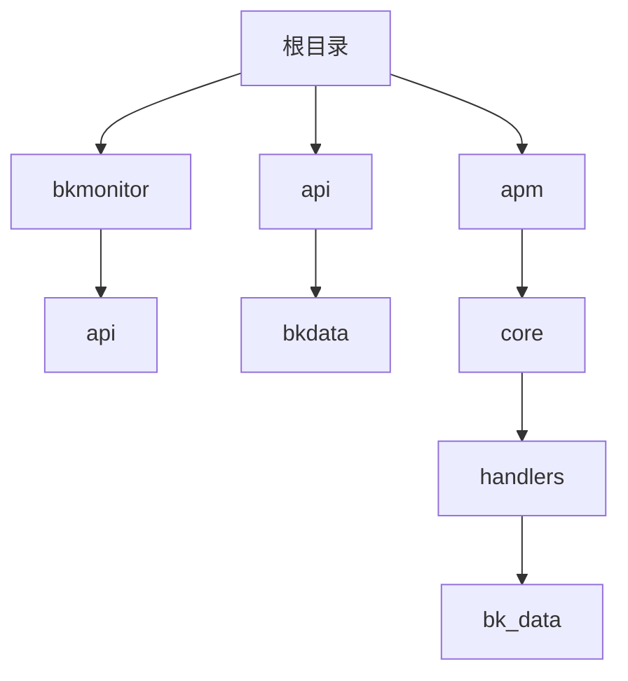
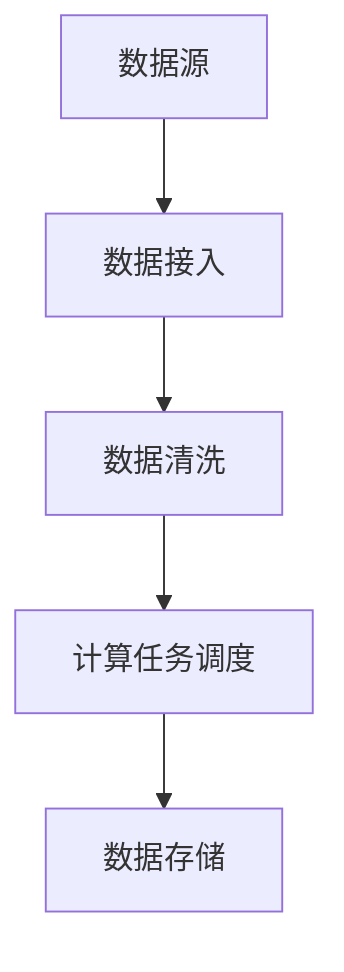
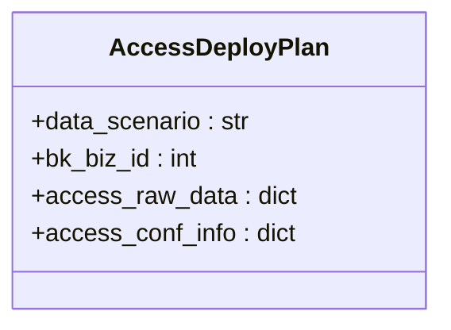
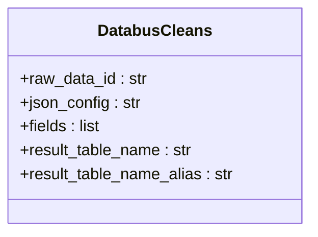
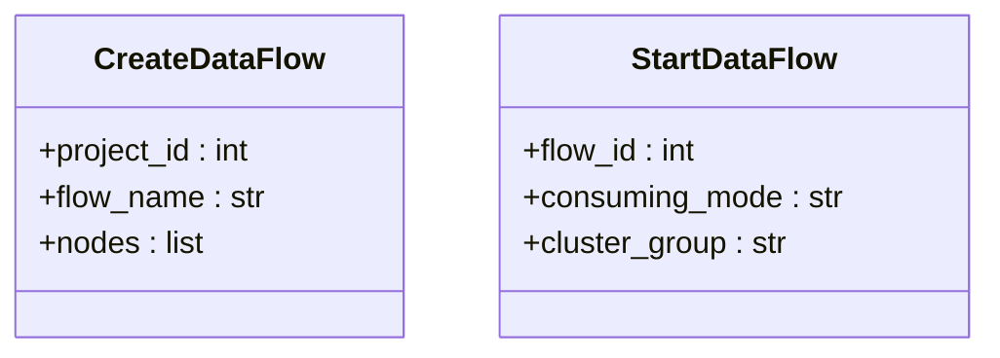
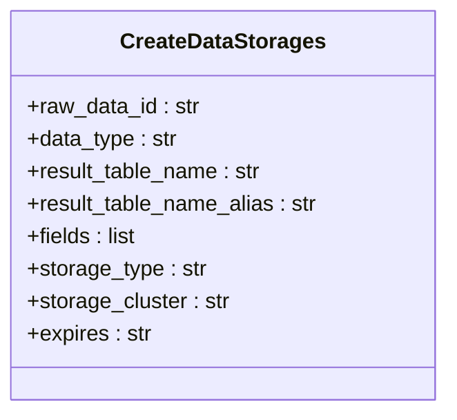
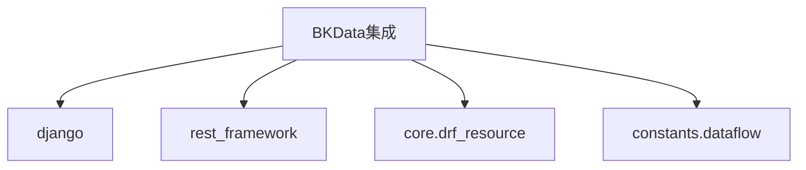

# BKData集成

<cite>
**本文档引用的文件**   
- [default.py](file://bkmonitor/api/bkdata/default.py)
- [flow.py](file://bkmonitor/apm/core/handlers/bk_data/flow.py)
- [tail_sampling.py](file://bkmonitor/apm/core/handlers/bk_data/tail_sampling.py)
- [constants.py](file://bkmonitor/apm/core/handlers/bk_data/constants.py)
</cite>

## 目录
1. [简介](#简介)
2. [项目结构](#项目结构)
3. [核心组件](#核心组件)
4. [架构概述](#架构概述)
5. [详细组件分析](#详细组件分析)
6. [依赖分析](#依赖分析)
7. [性能考虑](#性能考虑)
8. [故障排除指南](#故障排除指南)
9. [结论](#结论)

## 简介
BKData集成文档详细说明了`api/bkdata/`模块如何接入蓝鲸数据平台，实现监控数据的接入、处理和分发。文档解释了`default.py`中配置的数据源注册、数据清洗和计算任务调度机制，描述了BKData在实时流处理、指标聚合和数据存储中的角色。此外，文档提供了数据接入配置示例，包括数据格式定义、字段映射和清洗规则，并说明了数据质量监控、延迟告警和故障恢复策略。最后，文档总结了BKData集成中常见的数据丢失、格式错误和性能瓶颈的排查方法。

## 项目结构
本项目结构清晰，主要分为以下几个部分：
- `bkmonitor/`：包含监控相关的应用和模块。
- `api/bkdata/`：包含与BKData集成相关的API定义。
- `apm/core/handlers/bk_data/`：包含APM与BKData集成的核心处理逻辑。

**图表来源**
- [default.py](file://bkmonitor/api/bkdata/default.py)
- [flow.py](file://bkmonitor/apm/core/handlers/bk_data/flow.py)

## 核心组件
`api/bkdata/`模块是BKData集成的核心，负责与蓝鲸数据平台进行交互。该模块通过定义一系列API资源，实现了数据源的注册、数据清洗、计算任务调度等功能。`default.py`文件中定义了多个API资源类，如`ListResultTableResource`、`QueryDataResource`等，这些类继承自`BkDataAPIGWResource`，并实现了具体的API调用逻辑。

**章节来源**
- [default.py](file://bkmonitor/api/bkdata/default.py)

## 架构概述
BKData集成的架构主要包括以下几个部分：
- **数据接入**：通过`AccessDeployPlan`类实现数据源的注册。
- **数据清洗**：通过`DatabusCleans`类实现数据清洗配置。
- **计算任务调度**：通过`CreateDataFlow`、`StartDataFlow`等类实现计算任务的创建和启动。
- **数据存储**：通过`CreateDataStorages`类实现数据入库。

**图表来源**
- [default.py](file://bkmonitor/api/bkdata/default.py)
- [flow.py](file://bkmonitor/apm/core/handlers/bk_data/flow.py)

## 详细组件分析
### 数据接入分析
数据接入是BKData集成的第一步，通过`AccessDeployPlan`类实现。该类定义了数据源的接入配置，包括数据源名称、数据编码、数据敏感度等信息。接入配置通过`access_raw_data`和`access_conf_info`两个字段进行定义。

**图表来源**
- [default.py](file://bkmonitor/api/bkdata/default.py)

### 数据清洗分析
数据清洗是BKData集成的关键步骤，通过`DatabusCleans`类实现。该类定义了数据清洗的配置，包括清洗规则、输出字段列表等信息。清洗配置通过`json_config`和`fields`两个字段进行定义。

**图表来源**
- [default.py](file://bkmonitor/api/bkdata/default.py)

### 计算任务调度分析
计算任务调度是BKData集成的核心功能，通过`CreateDataFlow`和`StartDataFlow`类实现。`CreateDataFlow`类用于创建计算任务，`StartDataFlow`类用于启动计算任务。这两个类通过`nodes`字段定义计算任务的节点信息。

**图表来源**
- [default.py](file://bkmonitor/api/bkdata/default.py)

### 数据存储分析
数据存储是BKData集成的最后一步，通过`CreateDataStorages`类实现。该类定义了数据存储的配置，包括存储类型、存储集群、过期时间等信息。存储配置通过`storage_type`、`storage_cluster`和`expires`三个字段进行定义。

**图表来源**
- [default.py](file://bkmonitor/api/bkdata/default.py)

## 依赖分析
BKData集成依赖于多个外部组件和库，主要包括：
- `django`：用于Web应用开发。
- `rest_framework`：用于构建RESTful API。
- `core.drf_resource`：用于API资源管理。
- `constants.dataflow`：用于定义数据流常量。

**图表来源**
- [default.py](file://bkmonitor/api/bkdata/default.py)

## 性能考虑
在BKData集成中，性能是一个重要的考虑因素。为了提高性能，可以采取以下措施：
- **数据分片**：将大数据集分片处理，减少单次处理的数据量。
- **并行处理**：利用多线程或多进程并行处理数据，提高处理速度。
- **缓存机制**：使用缓存机制减少重复计算，提高响应速度。

## 故障排除指南
在BKData集成过程中，可能会遇到各种问题，以下是一些常见的故障排除方法：
- **数据丢失**：检查数据源配置是否正确，确保数据源能够正常发送数据。
- **格式错误**：检查数据清洗配置，确保清洗规则能够正确处理数据格式。
- **性能瓶颈**：监控系统性能，识别瓶颈所在，优化相关配置。

**章节来源**
- [default.py](file://bkmonitor/api/bkdata/default.py)
- [flow.py](file://bkmonitor/apm/core/handlers/bk_data/flow.py)
- [tail_sampling.py](file://bkmonitor/apm/core/handlers/bk_data/tail_sampling.py)

## 结论
BKData集成通过`api/bkdata/`模块实现了与蓝鲸数据平台的无缝对接，提供了完整的数据接入、处理和分发解决方案。通过详细的配置和灵活的调度机制，BKData集成能够满足各种监控需求，确保数据的高效处理和存储。未来，可以进一步优化性能，提高系统的稳定性和可靠性。