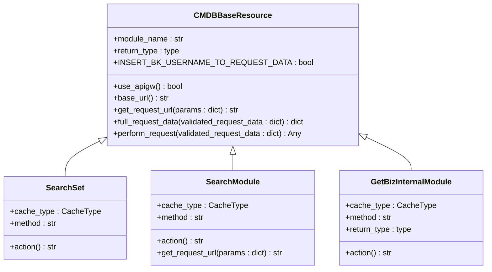
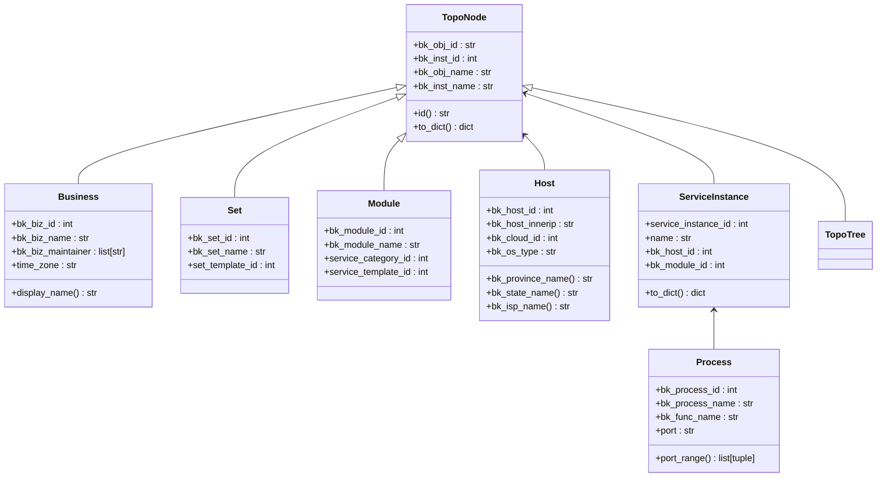
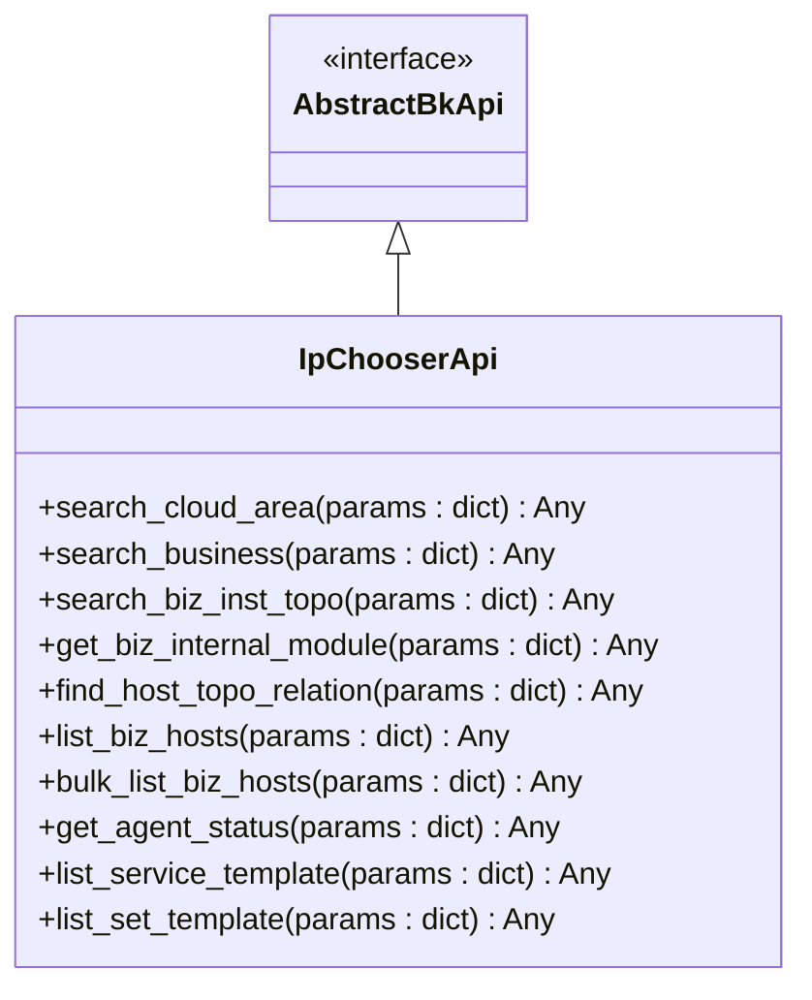
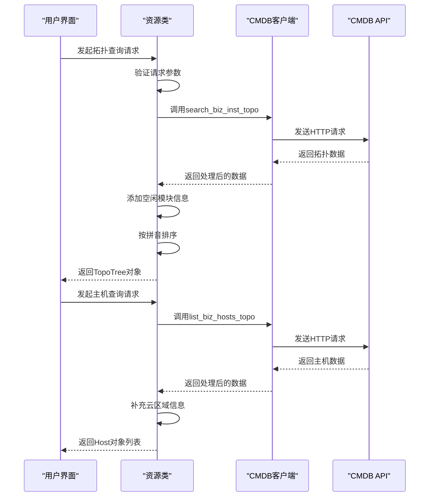
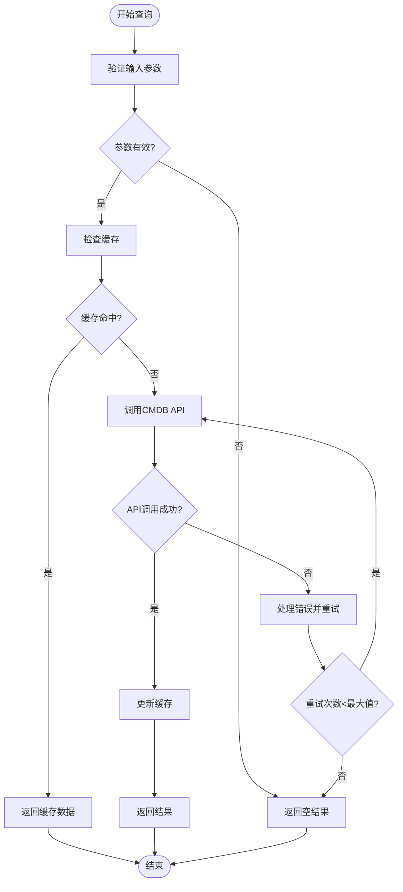

# CMDB集成

<cite>
**本文档引用的文件**   
- [client.py](file://bkmonitor/api/cmdb/client.py)
- [define.py](file://bkmonitor/api/cmdb/define.py)
- [ipchooser.py](file://bkmonitor/api/cmdb/ipchooser.py)
- [default.py](file://bkmonitor/api/cmdb/default.py)
- [mock.py](file://bkmonitor/api/cmdb/mock.py)
- [cmdb.py](file://bkmonitor/constants/cmdb.py)
</cite>

## 目录
1. [简介](#简介)
2. [CMDB客户端封装](#cmdb客户端封装)
3. [数据模型定义](#数据模型定义)
4. [主机选择器应用](#主机选择器应用)
5. [拓扑与属性获取机制](#拓扑与属性获取机制)
6. [API调用示例](#api调用示例)
7. [缓存与重试策略](#缓存与重试策略)
8. [性能优化建议](#性能优化建议)
9. [常见问题排查](#常见问题排查)
10. [总结](#总结)

## 简介
本文档详细说明了蓝鲸监控平台中CMDB集成的实现机制。系统通过`api/cmdb/`模块与蓝鲸配置管理数据库进行交互，提供了完整的主机拓扑、业务层级和属性信息获取能力。文档重点解析了`client.py`中的API封装、`define.py`中的数据模型结构、`ipchooser.py`在主机选择器中的应用，以及相关的缓存策略、错误处理和性能优化方案。

## CMDB客户端封装

`client.py`文件通过继承`APIResource`基类，为CMDB API提供了统一的封装。该模块定义了多个资源类，每个类对应一个CMDB API接口，实现了对集群、模块、业务拓扑、服务实例等资源的查询功能。

核心基类`CMDBBaseResource`提供了以下关键特性：
- **多租户支持**：通过`use_apigw()`方法判断是否使用API网关模式
- **URL构建**：根据配置动态生成API基础URL
- **参数处理**：自动注入`bk_supplier_account`供应商账号
- **异常处理**：捕获`NoRelatedResourceError`等特定异常并返回空数据



**Diagram sources**
- [client.py](file://bkmonitor/api/cmdb/client.py#L38-L325)

**Section sources**
- [client.py](file://bkmonitor/api/cmdb/client.py#L1-L457)

## 数据模型定义

`define.py`文件定义了CMDB集成所需的核心数据模型，采用面向对象的方式封装了从拓扑节点到主机、服务实例等各类资源的数据结构。

主要数据模型包括：
- `TopoNode`: 拓扑节点基类，包含对象ID、实例ID、对象名称和实例名称
- `Business`: 业务模型，继承自`TopoNode`，包含业务ID、名称、维护人员等信息
- `Set`: 集群模型，表示CMDB中的集群层级
- `Module`: 模块模型，表示CMDB中的模块层级
- `Host`: 主机模型，包含IP、云区域、操作系统等详细信息
- `ServiceInstance`: 服务实例模型，关联主机与服务模板
- `Process`: 进程模型，描述主机上运行的进程信息



**Diagram sources**
- [define.py](file://bkmonitor/api/cmdb/define.py#L65-L768)

**Section sources**
- [define.py](file://bkmonitor/api/cmdb/define.py#L1-L811)

## 主机选择器应用

`ipchooser.py`模块实现了主机选择器的核心功能，通过封装CMDB API提供了一组高级接口，用于在用户界面中选择和查询主机。

该模块的主要特点包括：
- **API适配**：继承`AbstractBkApi`，提供与蓝鲸标准API兼容的接口
- **批量操作**：使用`batch_request`工具实现批量查询，提高性能
- **功能完整**：覆盖了从云区域、业务、拓扑到主机查询的完整链路



**Diagram sources**
- [ipchooser.py](file://bkmonitor/api/cmdb/ipchooser.py#L17-L135)

**Section sources**
- [ipchooser.py](file://bkmonitor/api/cmdb/ipchooser.py#L1-L135)

## 拓扑与属性获取机制

CMDB集成通过`default.py`文件提供了高级的拓扑与属性获取机制，将底层API调用封装为更易用的资源类。

### 拓扑树获取
`GetTopoTreeResource`类负责获取完整的业务拓扑树，其工作流程如下：
1. 调用`search_biz_inst_topo`获取原始拓扑数据
2. 添加空闲集群/模块信息
3. 按拼音排序，确保拓扑显示的一致性
4. 返回`TopoTree`对象，支持拓扑链转换和节点遍历

### 主机查询
提供了多种主机查询方式：
- `GetHostByTopoNode`: 根据拓扑节点查询主机
- `GetHostByIP`: 根据IP地址查询主机
- `GetHostById`: 根据主机ID查询主机
- `GetHostWithoutBiz`: 跨业务查询主机

### 服务实例获取
`GetServiceInstanceByTopoNode`类根据拓扑节点获取关联的服务实例，支持按模块、集群等不同层级进行过滤。



**Diagram sources**
- [default.py](file://bkmonitor/api/cmdb/default.py#L401-L411)
- [default.py](file://bkmonitor/api/cmdb/default.py#L249-L279)

**Section sources**
- [default.py](file://bkmonitor/api/cmdb/default.py#L1-L1136)

## API调用示例

### 认证方式
CMDB API通过`x-bkapi-authorization`请求头中的`bk_username`进行认证，系统自动处理认证信息，无需在请求参数中重复添加。

### 请求参数与响应处理
```python
# 查询业务拓扑
from api.cmdb import client

params = {
    "bk_biz_id": 2,
    "bk_supplier_account": "0"
}

try:
    topo_data = client.search_biz_inst_topo(params)
    for node in topo_data[0]["child"]:
        print(f"集群: {node['bk_inst_name']}")
        for module in node["child"]:
            print(f"  模块: {module['bk_inst_name']}")
except Exception as e:
    print(f"查询失败: {e}")
```

### 使用高级资源类
```python
# 使用资源类获取业务信息
from api.cmdb.default import GetBusiness

biz_params = {
    "bk_biz_ids": [2, 3, 4]
}

businesses = GetBusiness().request(biz_params)
for biz in businesses:
    print(f"业务: {biz.bk_biz_name}, 维护人: {biz.bk_biz_maintainer}")
```

**Section sources**
- [client.py](file://bkmonitor/api/cmdb/client.py#L434-L456)
- [default.py](file://bkmonitor/api/cmdb/default.py#L413-L479)

## 缓存与重试策略

### 缓存策略
系统采用多级缓存策略提高性能：
- `CacheType.CC_CACHE_ALWAYS`: 始终缓存，适用于不经常变化的数据
- `CacheType.CC_BACKEND`: 后端缓存，适用于较大数据集
- `CacheType.DEVOPS`: DevOps专用缓存

```python
@using_cache(CacheType.CC_CACHE_ALWAYS, is_cache_func=lambda res: res)
def get_service_instance_by_biz(bk_biz_id):
    """
    获取业务下所有服务实例
    """
    return batch_request(client.list_service_instance_detail, {"bk_biz_id": bk_biz_id})
```

### 错误重试机制
- **批量请求重试**：使用`batch_request`工具，自动处理分页和重试
- **并发执行**：对于多个动态分组查询，使用线程池并发执行，提高效率
- **异常捕获**：捕获`BKAPIError`等异常，记录日志并返回空结果



**Diagram sources**
- [default.py](file://bkmonitor/api/cmdb/default.py#L49-L67)
- [default.py](file://bkmonitor/api/cmdb/default.py#L682-L691)

**Section sources**
- [default.py](file://bkmonitor/api/cmdb/default.py#L49-L67)
- [default.py](file://bkmonitor/api/cmdb/default.py#L682-L691)

## 性能优化建议

1. **使用批量查询**：优先使用`bulk_*`方法进行批量操作，减少API调用次数
2. **合理选择字段**：在查询时指定需要的字段，避免获取不必要的数据
3. **利用缓存**：对于不经常变化的数据，使用缓存减少数据库压力
4. **并发处理**：对于独立的查询任务，使用线程池并发执行
5. **分页处理**：对于大数据集，使用分页查询避免内存溢出

```python
# 性能优化示例
from api.cmdb import ipchooser
from bkmonitor.utils.thread_backend import ThreadPool

def get_hosts_from_multiple_templates(template_ids):
    """
    从多个服务模板获取主机，使用并发提高性能
    """
    pool = ThreadPool(5)
    tasks = []
    
    for template_id in template_ids:
        task = pool.apply_async(
            ipchooser.find_host_by_service_template,
            kwds={
                "bk_biz_id": 2,
                "service_template_id": template_id,
                "fields": ["bk_host_innerip", "bk_cloud_id"]
            }
        )
        tasks.append(task)
    
    pool.close()
    pool.join()
    
    all_hosts = []
    for task in tasks:
        hosts = task.get()
        all_hosts.extend(hosts)
    
    return all_hosts
```

**Section sources**
- [ipchooser.py](file://bkmonitor/api/cmdb/ipchooser.py#L59-L64)
- [default.py](file://bkmonitor/api/cmdb/default.py#L1022-L1049)

## 常见问题排查

### 权限不足
**现象**：API调用返回403错误或空数据
**排查方法**：
1. 检查用户是否有访问目标业务的权限
2. 确认`bk_username`是否正确传递
3. 检查`bk_supplier_account`配置是否正确

### 数据同步延迟
**现象**：CMDB中已更新数据，但查询结果未同步
**排查方法**：
1. 检查CMDB数据同步服务是否正常运行
2. 查看缓存过期时间，必要时手动清除缓存
3. 确认API调用是否使用了缓存，尝试绕过缓存直接查询

### 主机查询不到
**现象**：根据IP或主机ID无法查询到主机
**排查方法**：
1. 确认主机是否已录入CMDB
2. 检查IP地址格式是否正确（支持IPv4和IPv6）
3. 验证云区域ID是否匹配
4. 检查主机是否在指定业务下

### 拓扑显示异常
**现象**：拓扑树显示不完整或顺序混乱
**排查方法**：
1. 检查`search_biz_inst_topo`接口返回数据是否完整
2. 确认空闲模块信息是否正确获取
3. 验证拼音排序功能是否正常工作

**Section sources**
- [client.py](file://bkmonitor/api/cmdb/client.py#L76-L84)
- [default.py](file://bkmonitor/api/cmdb/default.py#L127-L176)

## 总结
CMDB集成模块通过`client.py`、`define.py`、`ipchooser.py`和`default.py`四个核心文件，构建了一个完整、高效、易用的CMDB交互系统。该系统不仅提供了基础的API封装，还通过数据模型定义、高级查询接口和缓存策略，大大简化了CMDB数据的获取和处理。通过合理的性能优化和错误处理机制，确保了系统的稳定性和响应速度，为监控平台的其他功能模块提供了可靠的CMDB数据支持。